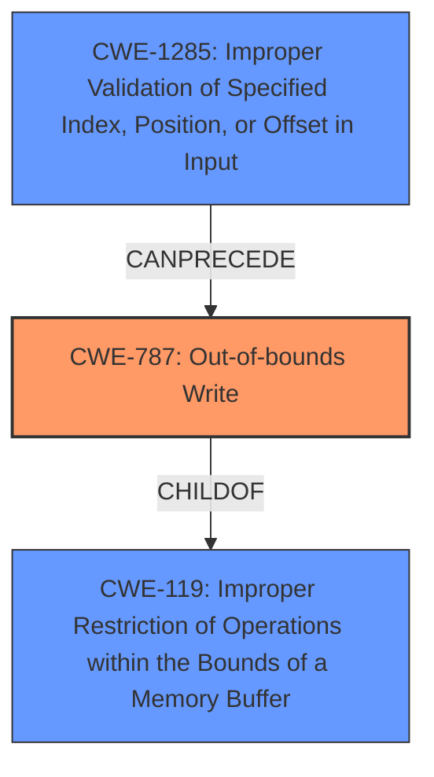

# Analysis Report for CVE-2020-0041

# Vulnerability Analysis Report: CVE-2020-0041

## Description


## Analysis (with Relationship Data)

# Summary
| CWE ID | CWE Name | Confidence | CWE Abstraction Level | CWE Vulnerability Mapping Label | CWE-Vulnerability Mapping Notes |
|---|---|---|---|---|---|
| CWE-787 | Out-of-bounds Write | 1.0 | Base | Primary | Allowed |
| CWE-1285 | Improper Validation of Specified Index, Position, or Offset in Input | 0.7 | Base | Secondary | Allowed |

## Evidence and Confidence

*   **Confidence Score:** 0.9
*   **Evidence Strength:** HIGH

## Relationship Analysis
The primary relationship influencing the CWE selection is the parent-child relationship between CWE-119 (Improper Restriction of Operations within the Bounds of a Memory Buffer) and CWE-787 (Out-of-bounds Write), where CWE-787 is a specific type of CWE-119. The vulnerability involves writing data outside the intended buffer bounds due to an **incorrect bounds check**, which aligns with the characteristics of CWE-787. Additionally, CWE-1285 is considered due to the **incorrect bounds check** leading to improper validation of index/offset.



## Vulnerability Chain
The vulnerability chain starts with the **incorrect bounds check** leading to an **out-of-bounds write**, which can then lead to local escalation of privilege.
  - **Root Cause:** **Incorrect bounds check**
  - **Weakness:** **Out-of-bounds Write**
  - **Impact:** Local escalation of privilege

## Summary of Analysis
The initial analysis strongly points to CWE-787 as the primary weakness due to the explicit mention of "**out of bounds write**" in the vulnerability description and the **incorrect bounds check** as the root cause. The CVE Reference Links Content Summary confirms that the root cause is an incorrect calculation, leading to missed out-of-bounds pointer offsets during validation.

CWE-787 is at the Base level of abstraction, which is the preferred level.

I also considered CWE-1285, given that the **incorrect bounds check** can be seen as improper validation of the offset. While CWE-20 is a general class for input validation issues and was not selected, CWE-1285 is a more specific variant that focuses on the validation of indices, positions, or offsets.

The final decision to select CWE-787 as the primary CWE is based on the direct evidence of the **out-of-bounds write** and **incorrect bounds check**, making it a precise and accurate representation of the vulnerability. I am including CWE-1285 as a secondary weakness since the bounds check is a form of validating the offset.

Relevant CWE Information:

# Enhanced Context (25 CWEs)
The following CWEs were identified as potentially relevant to this vulnerability:

## CWE-1289: Improper Validation of Unsafe Equivalence in Input
**Abstraction Level**: Base
**Similarity Score**: 0.78
**Source**: dense

**Description**:
The product receives an input value that is used as a resource identifier or other type of reference, but it does not validate or incorrectly validates that the input is equivalent to a potentially-unsafe value.

**Mapping Guidance**:
- Usage: Allowed
- Rationale: This CWE entry is at the Base level of abstraction, which is a preferred level of abstraction for mapping to the root causes of vulnerabilities.

## CWE-404: Improper Resource Shutdown or Release
**Abstraction Level**: Class
**Similarity Score**: 0.76
**Source**: dense

**Description**:
The product does not release or incorrectly releases a resource before it is made available for re-use.

**Mapping Guidance**:
- Usage: Allowed-with-Review
- Rationale: This CWE entry is a Class and might have Base-level children that would be more appropriate

## CWE-807: Reliance on Untrusted Inputs in a Security Decision
**Abstraction Level**: Base
**Similarity Score**: 0.76
**Source**: dense

**Description**:
The product uses a protection mechanism that relies on the existence or values of an input, but the input can be modified by an untrusted actor in a way that bypasses the protection mechanism.

**Mapping Guidance**:
- Usage: Allowed
- Rationale: This CWE entry is at the Base level of abstraction, which is a preferred level of abstraction for mapping to the root causes of vulnerabilities.

## CWE-653: Improper Isolation or Compartmentalization
**Abstraction Level**: Class
**Similarity Score**: 0.75
**Source**: dense

**Description**:
The product does not properly compartmentalize or isolate functionality, processes, or resources that require different privilege levels, rights, or permissions.

**Mapping Guidance**:
- Usage: Allowed
- Rationale: This CWE entry is at the Base level of abstraction, which is a preferred level of abstraction for mapping to the root causes of vulnerabilities.

## CWE-667: Improper Locking
**Abstraction Level**: Class
**Similarity Score**: 0.75
**Source**: dense

**Description**:
The product does not properly acquire or release a lock on a resource, leading to unexpected resource state changes and behaviors.

**Mapping Guidance**:
- Usage: Allowed-with-Review
- Rationale: This CWE entry is a Class and might have Base-level children that would be more appropriate

## CWE-274: Improper Handling of Insufficient Privileges
**Abstraction Level**: Base
**Similarity Score**: 0.75
**Source**: dense

**Description**:
The product does not handle or incorrectly handles when it has insufficient privileges to perform an operation, leading to resultant weaknesses.

**Mapping Guidance**:
- Usage: Discouraged
- Rationale: This CWE entry could be deprecated in a future version of CWE.

## CWE-183: Permissive List of Allowed Inputs
**Abstraction Level**: Base
**Similarity Score**: 0.75
**Source**: dense

**Description**:
The product implements a protection mechanism that relies on a list of inputs (or properties of inputs) that are explicitly allowed by policy because the inputs are assumed to be safe, but the list is too permissive - that is, it allows an input that is unsafe, leading to resultant weaknesses.

**Mapping Guidance**:
- Usage: Allowed
- Rationale: This CWE entry is at the Base level of abstraction, which is a preferred level of abstraction for mapping to the root causes of vulnerabilities.

## CWE-280: Improper Handling of Insufficient Permissions or Privileges 
**Abstraction Level**: Base
**Similarity Score**: 0.75
**Source**: dense

**Description**:
The product does not handle or incorrectly handles when it has insufficient privileges to access resources or functionality as specified by their permissions. This may cause it to follow unexpected code paths that may leave the product in an invalid state.

**Mapping Guidance**:
- Usage: Allowed
- Rationale: This CWE entry is at the Base level of abstraction, which is a preferred level of abstraction for mapping to the root causes of vulnerabilities.

## CWE-226: Sensitive Information in Resource Not Removed Before Reuse
**Abstraction Level**: Base
**Similarity Score**: 0.75
**Source**: dense

**Description**:
The product releases a resource such as memory or a file so that it can be made available for reuse, but it does not clear or "zeroize" the information contained in the resource before the product performs a critical state transition or makes the resource available for reuse by other entities.

**Mapping Guidance**:
- Usage: Allowed
- Rationale: This CWE entry is at the Base level of abstraction, which is a preferred level of abstraction for mapping to the root causes of vulnerabilities.

## CWE-1220: Insufficient Granularity of Access Control
**Abstraction Level**: Base
**Similarity Score**: 0.75
**Source**: dense

**Description**:
The product implements access controls via a policy or other feature with the intention to disable or restrict accesses (reads and/or writes) to assets in a system from untrusted agents. However, implemented access controls lack required granularity, which renders the control policy too broad because it allows accesses from unauthorized agents to the security-sensitive assets.

**Mapping Guidance**:
- Usage: Allowed
- Rationale: This CWE entry is at the Base level of abstraction, which is a preferred level of abstraction for mapping to the root causes of vulnerabilities.

## CWE-667: Improper Locking
**Abstraction Level**: Class
**Similarity Score**: 6930.14
**Source**: sparse

**Description**:
The product does not properly acquire or release a lock on a resource, leading to unexpected resource state changes and behaviors.

**Mapping


## CWE Relationship Analysis

Current CWEs represent these abstraction levels: .


### Vulnerability Chain Analysis

**Chain starting from CWE-667:**
- 667 (Improper Locking) - ROOT


**Chain starting from CWE-787:**
- 787 (Out-of-bounds Write) - ROOT


### CWE Relationship Diagram

```mermaid
graph TD
    classDef primary fill:#f96,stroke:#333,stroke-width:2px
    classDef secondary fill:#69f,stroke:#333
    classDef tertiary fill:#9e9,stroke:#333
```


*Report generated on 2025-04-02 10:07:20*
