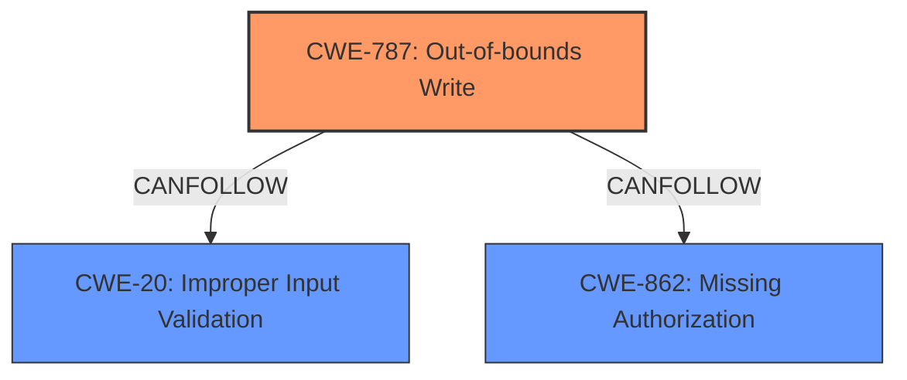

# Enhanced Analysis for CVE-2020-0069

# Summary
| CWE ID    | CWE Name                                                                        | Confidence | CWE Abstraction Level | CWE Vulnerability Mapping Label | CWE-Vulnerability Mapping Notes |
| :---------- | :------------------------------------------------------------------------------ | :--------- | :---------------------- | :------------------------------ | :------------------------------ |
| CWE-787     | Out-of-bounds Write                                                             | 1.0        | Base                    | Primary                         | Allowed                       |
| CWE-20      | Improper Input Validation                                                      | 0.9        | Class                   | Secondary                       | Allowed                       |
| CWE-862     | Missing Authorization                                                           | 0.8        | Base                    | Secondary                       | Allowed                       |

## Evidence and Confidence

*   **Confidence Score:** 0.9
*   **Evidence Strength:** HIGH

## Relationship Analysis
The primary weakness is an **out-of-bounds write** (CWE-787), which stems from **insufficient input sanitization** (CWE-20) and **missing SELinux restrictions** (CWE-862). CWE-787 is a child of CWE-119 (Improper Restriction of Operations within the Bounds of a Memory Buffer), which is a parent that represents the general class of buffer-related errors. CWE-20 represents the root cause of **insufficient input sanitization** and can precede CWE-787. CWE-862 represents the **missing SELinux restrictions** which could have prevented the **out-of-bounds write** and can also precede CWE-787.



## Vulnerability Chain
The vulnerability chain starts with **insufficient input sanitization** (CWE-20) and **missing SELinux restrictions** (CWE-862) leading to an **out-of-bounds write** (CWE-787), resulting in local escalation of privilege.

## Summary of Analysis
The primary weakness is CWE-787 (**Out-of-bounds Write**) because the vulnerability description explicitly states that there is a possible **out-of-bounds write**. This condition is caused by **insufficient input sanitization** (CWE-20) and **missing SELinux restrictions** (CWE-862). The retriever results also listed CWE-20 as a relevant CWE for the root cause **insufficient input sanitization**. The **missing SELinux restrictions** maps to CWE-862 (**Missing Authorization**) because SELinux is a security enhancement that provides mandatory access control. CWE-787 is the base level that accurately represents the weakness.

Relevant CWE Information:

# Enhanced Context (25 CWEs)
The following CWEs were identified as potentially relevant to this vulnerability:

## CWE-667: Improper Locking
**Abstraction Level**: Class
**Similarity Score**: 0.77
**Source**: dense

**Description**:
The product does not properly acquire or release a lock on a resource, leading to unexpected resource state changes and behaviors.

**Mapping Guidance**:
- Usage: Allowed-with-Review
- Rationale: This CWE entry is a Class and might have Base-level children that would be more appropriate


## CWE-754: Improper Check for Unusual or Exceptional Conditions
**Abstraction Level**: Class
**Similarity Score**: 0.76
**Source**: dense

**Description**:
The product does not check or incorrectly checks for unusual or exceptional conditions that are not expected to occur frequently during day to day operation of the product.

**Mapping Guidance**:
- Usage: Allowed-with-Review
- Rationale: This CWE entry is a Class and might have Base-level children that would be more appropriate


## CWE-1285: Improper Validation of Specified Index, Position, or Offset in Input
**Abstraction Level**: Base
**Similarity Score**: 0.76
**Source**: dense

**Description**:
The product receives input that is expected to specify an index, position, or offset into an indexable resource such as a buffer or file, but it does not validate or incorrectly validates that the specified index/position/offset has the required properties.

**Mapping Guidance**:
- Usage: Allowed
- Rationale: This CWE entry is at the Base level of abstraction, which is a preferred level of abstraction for mapping to the root causes of vulnerabilities.


## CWE-131: Incorrect Calculation of Buffer Size
**Abstraction Level**: Base
**Similarity Score**: 0.75
**Source**: dense

**Description**:
The product does not correctly calculate the size to be used when allocating a buffer, which could lead to a buffer overflow.

**Mapping Guidance**:
- Usage: Allowed
- Rationale: This CWE entry is at the Base level of abstraction, which is a preferred level of abstraction for mapping to the root causes of vulnerabilities.


## CWE-703: Improper Check or Handling of Exceptional Conditions
**Abstraction Level**: Pillar
**Similarity Score**: 0.75
**Source**: dense

**Description**:
The product does not properly anticipate or handle exceptional conditions that rarely occur during normal operation of the product.

**Mapping Guidance**:
- Usage: Discouraged
- Rationale: This CWE entry is extremely high-level, a Pillar.


## CWE-252: Unchecked Return Value
**Abstraction Level**: Base
**Similarity Score**: 0.75
**Source**: dense

**Description**:
The product does not check the return value from a method or function, which can prevent it from detecting unexpected states and conditions.

**Mapping Guidance**:
- Usage: Allowed
- Rationale: This CWE entry is at the Base level of abstraction, which is a preferred level of abstraction for mapping to the root causes of vulnerabilities.


## CWE-909: Missing Initialization of Resource
**Abstraction Level**: Class
**Similarity Score**: 0.74
**Source**: dense

**Description**:
The product does not initialize a critical resource.

**Mapping Guidance**:
- Usage: Allowed-with-Review
- Rationale: This CWE entry is a Class and might have Base-level children that would be more appropriate


## CWE-665: Improper Initialization
**Abstraction Level**: Class
**Similarity Score**: 0.74
**Source**: dense

**Description**:
The product does not initialize or incorrectly initializes a resource, which might leave the resource in an unexpected state when it is accessed or used.

**Mapping Guidance**:
- Usage: Discouraged
- Rationale: This CWE entry is a level-1 Class (i.e., a child of a Pillar). It might have lower-level children that would be more appropriate


## CWE-459: Incomplete Cleanup
**Abstraction Level**: Base
**Similarity Score**: 0.74
**Source**: dense

**Description**:
The product does not properly "clean up" and remove temporary or supporting resources after they have been used.

**Mapping Guidance**:
- Usage: Allowed
- Rationale: This CWE entry is at the Base level of abstraction, which is a preferred level of abstraction for mapping to the root causes of vulnerabilities.


## CWE-755: Improper Handling of Exceptional Conditions
**Abstraction Level**: Class
**Similarity Score**: 0.74
**Source**: dense

**Description**:
The product does not handle or incorrectly handles an exceptional condition.

**Mapping Guidance**:
- Usage: Discouraged
- Rationale: This CWE entry is a level-1 Class (i.e., a child of a Pillar). It might have lower-level children that would be more appropriate


## CWE-667: Improper Locking
**Abstraction Level**: Class
**Similarity Score**: 2249.04
**Source**: sparse

**Description**:
The product does not properly acquire or release a lock on a resource, leading to unexpected resource state changes and behaviors.

**Mapping Guidance**:
- Usage: Allowed-with-Review
- Rationale: This CWE entry is a Class and might have Base-level children that would be more appropriate


## CWE-362: Concurrent Execution using Shared Resource with Improper Synchronization ('Race Condition')
**Abstraction Level**: Class
**Similarity Score**: 2229.11
**Source**: sparse

**Description**:
The product contains a concurrent code sequence that requires temporary, exclusive access to a shared resource, but a timing window exists in which the shared resource can be modified by another code sequence operating concurrently.

**Mapping Guidance**:
- Usage: Allowed-with-Review
- Rationale: This CWE entry is a Class and might have Base-level children that would be more appropriate


## CWE-662: Improper Synchronization
**Abstraction Level**: Class
**Similarity Score**: 2107.68
**Source**: sparse

**Description**:
The product


## CWE Relationship Analysis

Current CWEs represent these abstraction levels: .


### Vulnerability Chain Analysis

**Chain starting from CWE-667:**
- 667 (Improper Locking) - ROOT


**Chain starting from CWE-787:**
- 787 (Out-of-bounds Write) - ROOT


### CWE Relationship Diagram

```mermaid
graph TD
    classDef primary fill:#f96,stroke:#333,stroke-width:2px
    classDef secondary fill:#69f,stroke:#333
    classDef tertiary fill:#9e9,stroke:#333
```