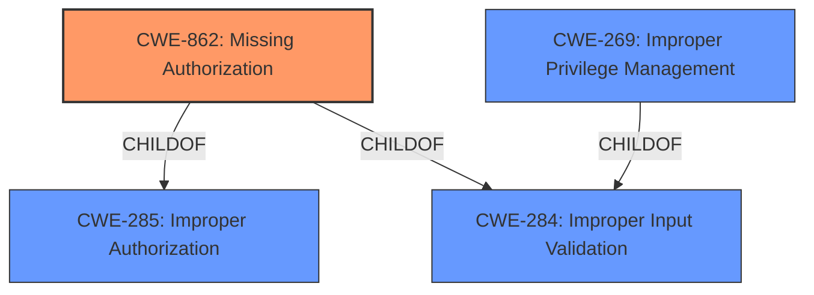

# Raw Analyzer Response for CVE-2020-0137

# Summary
| CWE ID | CWE Name | Confidence | CWE Abstraction Level | CWE Vulnerability Mapping Label | CWE-Vulnerability Mapping Notes |
|---|---|---|---|---|---|
| CWE-862 | Missing Authorization | 1.0 | Class | Allowed-with-Review | Primary CWE. The product does not perform an authorization check when an actor attempts to access a resource or perform an action. |
| CWE-269 | Improper Privilege Management | 0.5 | Class | Discouraged | Secondary Candidate. The product does not properly assign, modify, track, or check privileges for an actor, creating an unintended sphere of control for that actor. |

## Evidence and Confidence

*   **Confidence Score:** 0.8
*   **Evidence Strength:** HIGH

## Relationship Analysis
The primary CWE is CWE-862, which is a Class-level weakness. It is related to CWE-285 (Improper Authorization) and CWE-284 (Improper Input Validation). CWE-269 (Improper Privilege Management) is also a Class-level weakness and a child of CWE-284. Since CWE-862 is more specific to the **missing authorization check**, it is the better fit than its parent CWE-285.

## Vulnerability Chain
The vulnerability chain starts with the **missing permission check** (CWE-862), which leads to a bypass of networking permissions and a potential escalation of privilege.

## Summary of Analysis
The primary weakness is the **missing permission check** in the `setIPv6AddrGenMode` function (CWE-862). The CVE description clearly states this **missing permission check** as the root cause, which allows unauthorized access to the function. While CWE-269 (Improper Privilege Management) is a related concern, it is too general, and CWE-862 directly addresses the **missing authorization**. The selection of CWE-862 is at the appropriate level of specificity, as it precisely describes the root cause of the vulnerability.

The selection is based on the provided evidence:
- "In setIPv6AddrGenMode of NetworkManagementService.java, there is a possible bypass of networking permissions due to a **missing permission check**."
- "The vulnerability stems from a **missing permission check** in the `NetworkManagementService#setIPv6AddrGenMode` function."
- "The core issue is the absence of a permission check within the `NetworkManagementService#setIPv6AddrGenMode` function."

CWE-285 (Improper Authorization) was considered but not selected because CWE-862 (Missing Authorization) is a more specific child of CWE-285 and thus a better fit. Other CWEs like CWE-667 (Improper Locking), CWE-665 (Improper Initialization), CWE-269 (Improper Privilege Management), CWE-732 (Incorrect Permission Assignment for Critical Resource), CWE-927 (Use of Implicit Intent for Sensitive Communication), and CWE-514 (Covert Channel) were considered but did not directly address the root cause **missing permission check**.