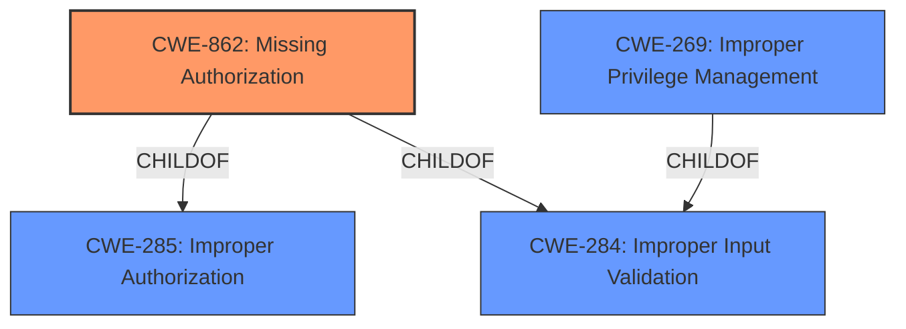

# Analysis for CVE-2020-0137

# Summary
| CWE ID | CWE Name | Confidence | CWE Abstraction Level | CWE Vulnerability Mapping Label | CWE-Vulnerability Mapping Notes |
|---|---|---|---|---|---|
| CWE-862 | Missing Authorization | 1.0 | Class | Allowed-with-Review | Primary CWE. The product does not perform an authorization check when an actor attempts to access a resource or perform an action. |
| CWE-269 | Improper Privilege Management | 0.5 | Class | Discouraged | Secondary Candidate. The product does not properly assign, modify, track, or check privileges for an actor, creating an unintended sphere of control for that actor. |

## Evidence and Confidence

*   **Confidence Score:** 0.8
*   **Evidence Strength:** HIGH

## Relationship Analysis
The primary CWE is CWE-862, which is a Class-level weakness. It is related to CWE-285 (Improper Authorization) and CWE-284 (Improper Input Validation). CWE-269 (Improper Privilege Management) is also a Class-level weakness and a child of CWE-284. Since CWE-862 is more specific to the **missing authorization check**, it is the better fit than its parent CWE-285.

## Vulnerability Chain
The vulnerability chain starts with the **missing permission check** (CWE-862), which leads to a bypass of networking permissions and a potential escalation of privilege.

## Summary of Analysis
The primary weakness is the **missing permission check** in the `setIPv6AddrGenMode` function (CWE-862). The CVE description clearly states this **missing permission check** as the root cause, which allows unauthorized access to the function. While CWE-269 (Improper Privilege Management) is a related concern, it is too general, and CWE-862 directly addresses the **missing authorization**. The selection of CWE-862 is at the appropriate level of specificity, as it precisely describes the root cause of the vulnerability.

The selection is based on the provided evidence:
- "In setIPv6AddrGenMode of NetworkManagementService.java, there is a possible bypass of networking permissions due to a **missing permission check**."
- "The vulnerability stems from a **missing permission check** in the `NetworkManagementService#setIPv6AddrGenMode` function."
- "The core issue is the absence of a permission check within the `NetworkManagementService#setIPv6AddrGenMode` function."

CWE-285 (Improper Authorization) was considered but not selected because CWE-862 (Missing Authorization) is a more specific child of CWE-285 and thus a better fit. Other CWEs like CWE-667 (Improper Locking), CWE-665 (Improper Initialization), CWE-269 (Improper Privilege Management), CWE-732 (Incorrect Permission Assignment for Critical Resource), CWE-927 (Use of Implicit Intent for Sensitive Communication), and CWE-514 (Covert Channel) were considered but did not directly address the root cause **missing permission check**.

# Enhanced Query for CVE-2020-0137

## Vulnerability Description
In setIPv6AddrGenMode of NetworkManagementService.java, there is a possible bypass of networking permissions due to a **missing permission check**. This could lead to local escalation of privilege with no additional execution privileges needed. User interaction is not needed for exploitation.Product AndroidVersions Android-10Android ID A-141920289

### Vulnerability Description Key Phrases
- **rootcause:** **missing permission check**
- **impact:** bypass of networking permissions
- **product:** Android
- **version:** Android-10
- **component:** setIPv6AddrGenMode of NetworkManagementService.java

## CVE Reference Links Content Summary
Based on the provided information, here's an analysis of CVE-2020-0137:

**CVE-2020-0137**

*   **Root Cause:** The vulnerability stems from a missing permission check in the `NetworkManagementService#setIPv6AddrGenMode` function. This oversight allows any application to potentially call this function through an IPC (Inter-Process Communication) mechanism.

*   **Weaknesses/Vulnerabilities:**
    *   **Missing Permission Check:** The core issue is the absence of a permission check within the `NetworkManagementService#setIPv6AddrGenMode` function. This means that any application, regardless of its privileges, could invoke this function.
    *   **IPC Vulnerability:** The vulnerability is exploitable through the exposed IPC mechanism, which allows different processes to communicate with each other.

*   **Impact of Exploitation:**
    *   **Elevation of Privilege (EoP):** Although the function was meant to set the IPv6 address generation mode, a bug in the IPC implementation limited the exploitable setting to 'stable privacy', preventing a more impactful change to 'EUI-64'. Because of this, the impact of exploitation remains limited.
    *   **Information Disclosure:** The vulnerability is classified as a moderate EoP, but the actual impact is limited due to a bug, which constrains the ability to set the mode to EUI-64.

*   **Attack Vectors:**
    *   **IPC Calls:** An attacker could exploit this vulnerability by crafting a malicious application that makes an IPC call to the vulnerable `NetworkManagementService#setIPv6AddrGenMode` function.
    *   **Local Attack:** The attack would need to originate from an application installed on the device.

*   **Required Attacker Capabilities/Position:**
    *   **Malicious App Installation:** The attacker must have a malicious application installed on the Android device.
    *   **No Root Access:** The attacker does not need root or elevated privileges initially; they can leverage the missing permission check from a regular application.

**Additional Notes:**
* The provided commit message states that the function was unused, with the network stack directly using the `netd` IPC call.
* The original security bulletin classifies this vulnerability as an elevation of privilege (EoP), and moderate in severity.

The content from `android.googlesource.com_6dc6f4a6_20250119_135940.html` pertains to a fix for integer overflow checks in `libhwbinder` and is related to CVE-2020-0136, not CVE-2020-0137.

## Retriever Results

### Top Combined Results

| Rank | CWE ID | Name | Abstraction | Usage  | Retrievers | Individual Scores |
|------|--------|------|-------------|-------|------------|-------------------|
| 1 | 862 | Missing Authorization | Class | Allowed-with-Review | sparse | 0.449 |
| 2 | 1021 | Improper Restriction of Rendered UI Layers or Frames | Base | Allowed | sparse | 0.405 |
| 3 | 223 | Omission of Security-relevant Information | Base | Allowed | sparse | 0.373 |
| 4 | 667 | Improper Locking | Class | Allowed-with-Review | sparse | 0.349 |
| 5 | 665 | Improper Initialization | Class | Discouraged | sparse | 0.348 |
| 6 | 269 | Improper Privilege Management | Class | Discouraged | dense | 0.557 |
| 7 | 250 | Execution with Unnecessary Privileges | Base | Allowed | graph | 0.002 |
| 8 | 732 | Incorrect Permission Assignment for Critical Resource | Class | Allowed-with-Review | sparse | 0.348 |
| 9 | 927 | Use of Implicit Intent for Sensitive Communication | Variant | Allowed | sparse | 0.346 |
| 10 | 514 | Covert Channel | Class | Allowed-with-Review | sparse | 0.346 |

# Complete CWE Specifications

## CWE-862: Missing Authorization
**Abstraction:** Class
**Status:** Incomplete

### Description
The product does not perform an authorization check when an actor attempts to access a resource or perform an action.

### Extended Description
Not provided

### Alternative Terms
AuthZ: "AuthZ" is typically used as an abbreviation of "authorization" within the web application security community. It is distinct from "AuthN" (or, sometimes, "AuthC") which is an abbreviation of "authentication." The use of "Auth" as an abbreviation is discouraged, since it could be used for either authentication or authorization.

### Relationships
ChildOf -> CWE-285
ChildOf -> CWE-284

### Mapping Guidance
**Usage:** Allowed-with-Review
**Rationale:** This CWE entry is a Class and might have Base-level children that would be more appropriate
**Comments:** Examine children of this entry to see if there is a better fit
**Reasons:**
- Abstraction

### Additional Notes
**[Terminology]** Assuming a user with a given identity, authorization is the process of determining whether that user can access a given resource, based on the user's privileges and any permissions or other access-control specifications that apply to the resource.

### Observed Examples
- **CVE-2022-24730:** Go-based continuous deployment product does not check that a user has certain privileges to update or create an app, allowing adversaries to read sensitive repository information
- **CVE-2009-3168:** Web application does not restrict access to admin scripts, allowing authenticated users to reset administrative passwords.
- **CVE-2009-3597:** Web application stores database file under the web root with insufficient access control (CWE-219), allowing direct request.

## CWE-1021: Improper Restriction of Rendered UI Layers or Frames
**Abstraction:** Base
**Status:** Incomplete

### Description
The web application does not restrict or incorrectly restricts frame objects or UI layers that belong to another application or domain, which can lead to user confusion about which interface the user is interacting with.

### Extended Description
A web application is expected to place restrictions on whether it is allowed to be rendered within frames, iframes, objects, embed or applet elements. Without the restrictions, users can be tricked into interacting with the application when they were not intending to.

### Alternative Terms
Clickjacking
UI Redress Attack
Tapjacking: "Tapjacking" is similar to clickjacking, except it is used for mobile applications in which the user "taps" the application instead of performing a mouse click.

### Relationships
ChildOf -> CWE-441
ChildOf -> CWE-610
ChildOf -> CWE-451

### Mapping Guidance
**Usage:** Allowed
**Rationale:** This CWE entry is at the Base level of abstraction, which is a preferred level of abstraction for mapping to the root causes of vulnerabilities.
**Comments:** Carefully read both the name and description to ensure that this mapping is an appropriate fit. Do not try to 'force' a mapping to a lower-level Base/Variant simply to comply with this preferred level of abstraction.
**Reasons:**
- Acceptable-Use

### Observed Examples
- **CVE-2017-7440:** E-mail preview feature in a desktop application allows clickjacking attacks via a crafted e-mail message
- **CVE-2017-5697:** Hardware/firmware product has insufficient clickjacking protection in its web user interface
- **CVE-2017-4015:** Clickjacking in data-loss prevention product via HTTP response header.

## CWE-223: Omission of Security-relevant Information
**Abstraction:** Base
**Status:** Draft

### Description
The product does not record or display information that would be important for identifying the source or nature of an attack, or determining if an action is safe.

### Extended Description
Not provided

### Alternative Terms
None

### Relationships
ChildOf -> CWE-221

### Mapping Guidance
**Usage:** Allowed
**Rationale:** This CWE entry is at the Base level of abstraction, which is a preferred level of abstraction for mapping to the root causes of vulnerabilities.
**Comments:** Carefully read both the name and description to ensure that this mapping is an appropriate fit. Do not try to 'force' a mapping to a lower-level Base/Variant simply to comply with this preferred level of abstraction.
**Reasons:**
- Acceptable-Use

### Observed Examples
- **CVE-1999-1029:** Login attempts are not recorded if the user disconnects before the maximum number of tries.
- **CVE-2002-1839:** Sender's IP address not recorded in outgoing e-mail.
- **CVE-2000-0542:** Failed authentication attempts are not recorded if later attempt succeeds.

## CWE-667: Improper Locking
**Abstraction:** Class
**Status:** Draft

### Description
The product does not properly acquire or release a lock on a resource, leading to unexpected resource state changes and behaviors.

### Extended Description

Locking is a type of synchronization behavior that ensures that multiple independently-operating processes or threads do not interfere with each other when accessing the same resource. All processes/threads are expected to follow the same steps for locking. If these steps are not followed precisely - or if no locking is done at all - then another process/thread could modify the shared resource in a way that is not visible or predictable to the original process. This can lead to data or memory corruption, denial of service, etc.

### Alternative Terms
None

### Relationships
ChildOf -> CWE-662
ChildOf -> CWE-662
ChildOf -> CWE-662
ChildOf -> CWE-662

### Mapping Guidance
**Usage:** Allowed-with-Review
**Rationale:** This CWE entry is a Class and might have Base-level children that would be more appropriate
**Comments:** Examine children of this entry to see if there is a better fit
**Reasons:**
- Abstraction

### Additional Notes
**[Maintenance]** Deeper research is necessary for synchronization and related mechanisms, including locks, mutexes, semaphores, and other mechanisms. Multiple entries are dependent on this research, which includes relationships to concurrency, race conditions, reentrant functions, etc. CWE-662 and its children - including CWE-667, CWE-820, CWE-821, and others - may need to be modified significantly, along with their relationships.

### Observed Examples
- **CVE-2021-1782:** Chain: improper locking (CWE-667) leads to race condition (CWE-362), as exploited in the wild per CISA KEV.
- **CVE-2009-0935:** Attacker provides invalid address to a memory-reading function, causing a mutex to be unlocked twice
- **CVE-2010-4210:** function in OS kernel unlocks a mutex that was not previously locked, causing a panic or overwrite of arbitrary memory.

## CWE-665: Improper Initialization
**Abstraction:** Class
**Status:** Draft

### Description
The product does not initialize or incorrectly initializes a resource, which might leave the resource in an unexpected state when it is accessed or used.

### Extended Description
This can have security implications when the associated resource is expected to have certain properties or values, such as a variable that determines whether a user has been authenticated or not.

### Alternative Terms
None

### Relationships
ChildOf -> CWE-664

### Mapping Guidance
**Usage:** Discouraged
**Rationale:** This CWE entry is a level-1 Class (i.e., a child of a Pillar). It might have lower-level children that would be more appropriate
**Comments:** Examine children of this entry to see if there is a better fit
**Reasons:**
- Abstraction

### Observed Examples
- **CVE-2001-1471:** chain: an invalid value prevents a library file from being included, skipping initialization of key variables, leading to resultant eval injection.
- **CVE-2008-3637:** Improper error checking in protection mechanism produces an uninitialized variable, allowing security bypass and code execution.
- **CVE-2008-4197:** Use of uninitialized memory may allow code execution.

## CWE-269: Improper Privilege Management
**Abstraction:** Class
**Status:** Draft

### Description
The product does not properly assign, modify, track, or check privileges for an actor, creating an unintended sphere of control for that actor.

### Extended Description
Not provided

### Alternative Terms
None

### Relationships
ChildOf -> CWE-284

### Mapping Guidance
**Usage:** Discouraged
**Rationale:** CWE-269 is commonly misused. It can be conflated with "privilege escalation," which is a technical impact that is listed in many low-information vulnerability reports [REF-1287]. It is not useful for trend analysis.
**Comments:** If an error or mistake allows privilege escalation, then use the CWE ID for that mistake. Avoid using CWE-269 when only phrases such as "privilege escalation" or "gain privileges" are available, as these indicate technical impact of the vulnerability - not the root cause weakness. If the root cause seems to be directly related to privileges, then examine the children of CWE-269 for additional hints, such as Execution with Unnecessary Privileges (CWE-250) or Incorrect Privilege Assignment (CWE-266).
**Reasons:**
- Frequent Misuse

### Additional Notes
**[Maintenance]** The relationships between privileges, permissions, and actors (e.g. users and groups) need further refinement within the Research view. One complication is that these concepts apply to two different pillars, related to control of resources (CWE-664) and protection mechanism failures (CWE-693).

### Observed Examples
- **CVE-2001-1555:** Terminal privileges are not reset when a user logs out.
- **CVE-2001-1514:** Does not properly pass security context to child processes in certain cases, allows privilege escalation.
- **CVE-2001-0128:** Does not properly compute roles.

## CWE-250: Execution with Unnecessary Privileges
**Abstraction:** Base
**Status:** Draft

### Description
The product performs an operation at a privilege level that is higher than the minimum level required, which creates new weaknesses or amplifies the consequences of other weaknesses.

### Extended Description

New weaknesses can be exposed because running with extra privileges, such as root or Administrator, can disable the normal security checks being performed by the operating system or surrounding environment. Other pre-existing weaknesses can turn into security vulnerabilities if they occur while operating at raised privileges.

Privilege management functions can behave in some less-than-obvious ways, and they have different quirks on different platforms. These inconsistencies are particularly pronounced if you are transitioning from one non-root user to another. Signal handlers and spawned processes run at the privilege of the owning process, so if a process is running as root when a signal fires or a sub-process is executed, the signal handler or sub-process will operate with root privileges.

### Alternative Terms
None

### Relationships
ChildOf -> CWE-269
ChildOf -> CWE-657

### Mapping Guidance
**Usage:** Allowed
**Rationale:** This CWE entry is at the Base level of abstraction, which is a preferred level of abstraction for mapping to the root causes of vulnerabilities.
**Comments:** Carefully read both the name and description to ensure that this mapping is an appropriate fit. Do not try to 'force' a mapping to a lower-level Base/Variant simply to comply with this preferred level of abstraction.
**Reasons:**
- Acceptable-Use

### Additional Notes
**[Relationship]** There is a close association with CWE-653 (Insufficient Separation of Privileges). CWE-653 is about providing separate components for each privilege; CWE-250 is about ensuring that each component has the least amount of privileges possible.

**[Maintenance]** CWE-271, CWE-272, and CWE-250 are all closely related and possibly overlapping. CWE-271 is probably better suited as a category. Both CWE-272 and CWE-250 are in active use by the community. The "least privilege" phrase has multiple interpretations.

**[Maintenance]** The Taxonomy_Mappings to ISA/IEC 62443 were added in CWE 4.10, but they are still under review and might change in future CWE versions. These draft mappings were performed by members of the "Mapping CWE to 62443" subgroup of the CWE-CAPEC ICS/OT Special Interest Group (SIG), and their work is incomplete as of CWE 4.10. The mappings are included to facilitate discussion and review by the broader ICS/OT community, and they are likely to change in future CWE versions.

### Observed Examples
- **CVE-2007-4217:** FTP client program on a certain OS runs with setuid privileges and has a buffer overflow. Most clients do not need extra privileges, so an overflow is not a vulnerability for those clients.
- **CVE-2008-1877:** Program runs with privileges and calls another program with the same privileges, which allows read of arbitrary files.
- **CVE-2007-5159:** OS incorrectly installs a program with setuid privileges, allowing users to gain privileges.

## CWE-732: Incorrect Permission Assignment for Critical Resource
**Abstraction:** Class
**Status:** Draft

### Description
The product specifies permissions for a security-critical resource in a way that allows that resource to be read or modified by unintended actors.

### Extended Description
When a resource is given a permission setting that provides access to a wider range of actors than required, it could lead to the exposure of sensitive information, or the modification of that resource by unintended parties. This is especially dangerous when the resource is related to program configuration, execution, or sensitive user data. For example, consider a misconfigured storage account for the cloud that can be read or written by a public or anonymous user.

### Alternative Terms
None

### Relationships
ChildOf -> CWE-285
ChildOf -> CWE-668

### Mapping Guidance
**Usage:** Allowed-with-Review
**Rationale:** While the name itself indicates an assignment of permissions for resources, this is often misused for vulnerabilities in which "permissions" are not checked, which is an "authorization" weakness (CWE-285 or descendants) within CWE's model [REF-1287].
**Comments:** Closely analyze the specific mistake that is allowing the resource to be exposed, and perform a CWE mapping for that mistake.
**Reasons:**
- Frequent Misuse

### Additional Notes
**[Maintenance]** The relationships between privileges, permissions, and actors (e.g. users and groups) need further refinement within the Research view. One complication is that these concepts apply to two different pillars, related to control of resources (CWE-664) and protection mechanism failures (CWE-693).

### Observed Examples
- **CVE-2022-29527:** Go application for cloud management creates a world-writable sudoers file that allows local attackers to inject sudo rules and escalate privileges to root by winning a race condition.
- **CVE-2009-3482:** Anti-virus product sets insecure "Everyone: Full Control" permissions for files under the "Program Files" folder, allowing attackers to replace executables with Trojan horses.
- **CVE-2009-3897:** Product creates directories with 0777 permissions at installation, allowing users to gain privileges and access a socket used for authentication.

## CWE-927: Use of Implicit Intent for Sensitive Communication
**Abstraction:** Variant
**Status:** Incomplete

### Description
The Android application uses an implicit intent for transmitting sensitive data to other applications.

### Extended Description

Since an implicit intent does not specify a particular application to receive the data, any application can process the intent by using an Intent Filter for that intent. This can allow untrusted applications to obtain sensitive data. There are two variations on the standard broadcast intent, ordered and sticky.

Ordered broadcast intents are delivered to a series of registered receivers in order of priority as declared by the Receivers. A malicious receiver can give itself a high priority and cause a denial of service by stopping the broadcast from propagating further down the chain. There is also the possibility of malicious data modification, as a receiver may also alter the data within the Intent before passing it on to the next receiver. The downstream components have no way of asserting that the data has not been altered earlier in the chain.

Sticky broadcast intents remain accessible after the initial broadcast. An old sticky intent will be broadcast again to any new receivers that register for it in the future, greatly increasing the chances of information exposure over time. Also, sticky broadcasts cannot be protected by permissions that may apply to other kinds of intents.

In addition, any broadcast intent may include a URI that references data that the receiving component does not normally have the privileges to access. The sender of the intent can include special privileges that grant the receiver read or write access to the specific URI included in the intent. A malicious receiver that intercepts this intent will also gain those privileges and be able to read or write the resource at the specified URI.

### Alternative Terms
None

### Relationships
ChildOf -> CWE-285
ChildOf -> CWE-668

### Mapping Guidance
**Usage:** Allowed
**Rationale:** This CWE entry is at the Variant level of abstraction, which is a preferred level of abstraction for mapping to the root causes of vulnerabilities.
**Comments:** Carefully read both the name and description to ensure that this mapping is an appropriate fit. Do not try to 'force' a mapping to a lower-level Base/Variant simply to comply with this preferred level of abstraction.
**Reasons:**
- Acceptable-Use

### Observed Examples
- **CVE-2022-4903:** An Android application does not use FLAG_IMMUTABLE when creating a PendingIntent.

## CWE-514: Covert Channel
**Abstraction:** Class
**Status:** Incomplete

### Description
A covert channel is a path that can be used to transfer information in a way not intended by the system's designers.

### Extended Description
Typically the system has not given authorization for the transmission and has no knowledge of its occurrence.

### Alternative Terms
None

### Relationships
ChildOf -> CWE-1229

### Mapping Guidance
**Usage:** Allowed-with-Review
**Rationale:** This CWE entry is a Class and might have Base-level children that would be more appropriate
**Comments:** Examine children of this entry to see if there is a better fit
**Reasons:**
- Abstraction

### Additional Notes
**[Theoretical]** A covert channel can be thought of as an emergent resource, meaning that it was not an originally intended resource, however it exists due the application's behaviors.

**[Maintenance]** As of CWE 4.9, members of the CWE Hardware SIG are working to improve CWE's coverage of transient execution weaknesses, which include issues related to Spectre, Meltdown, and other attacks that create or exploit covert channels. As a result of that work, this entry might change in CWE 4.10.

