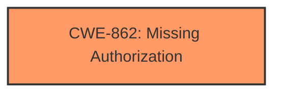

# Analysis for CVE-2020-0202

# Summary
| CWE ID | CWE Name | Confidence | CWE Abstraction Level | CWE Vulnerability Mapping Label | CWE-Vulnerability Mapping Notes |
|---|---|---|---|---|---|
| CWE-862 | Missing Authorization | 1.0 | Class | Allowed-with-Review | Primary CWE |

## Evidence and Confidence

*   **Confidence Score:** 1.0
*   **Evidence Strength:** HIGH

## Relationship Analysis
The primary CWE identified is CWE-862 (Missing Authorization), which is a Class-level CWE. While it is recommended to examine its children for a more specific match, in this case, the description directly aligns with the concept of a **missing permission check**, which falls squarely under the umbrella of authorization. The vulnerability description explicitly states the **root cause** as a "**missing permission check**". This directly indicates an authorization failure.

## Vulnerability Chain
The vulnerability chain is straightforward:
1.  **Root Cause:** **Missing permission check** in `onHandleIntent` of `TraceService.java`.
2.  **Impact:** Bypass of developer settings requirements for capturing system traces, leading to local escalation of privilege.

## Summary of Analysis
The analysis is primarily based on the vulnerability description, which explicitly mentions a "**missing permission check**". This phrase is a direct indicator of an authorization issue, leading to the selection of CWE-862. The CVE Reference Links Content Summary supports this, mentioning "Inadequate access control" as a weakness. The retriever results also list CWE-862 as the top candidate.

The selection of CWE-862 as the primary CWE is well-supported by the evidence, relationship analysis, and mapping guidance. The vulnerability description explicitly states a "**missing permission check**", which directly corresponds to the definition of CWE-862. There is no need to map to a child CWE since the class level is a perfect match.

Relevant CWE Information:

# Enhanced Context (25 CWEs)
The following CWEs were identified as potentially relevant to this vulnerability:

## CWE-941: Incorrectly Specified Destination in a Communication Channel
**Abstraction Level**: Base
**Similarity Score**: 0.80
**Source**: dense

**Description**:
The product creates a communication channel to initiate an outgoing request to an actor, but it does not correctly specify the intended destination for that actor.

**Mapping Guidance**:
- Usage: Allowed
- Rationale: This CWE entry is at the Base level of abstraction, which is a preferred level of abstraction for mapping to the root causes of vulnerabilities.

## CWE-754: Improper Check for Unusual or Exceptional Conditions
**Abstraction Level**: Class
**Similarity Score**: 0.76
**Source**: dense

**Description**:
The product does not check or incorrectly checks for unusual or exceptional conditions that are not expected to occur frequently during day to day operation of the product.

**Mapping Guidance**:
- Usage: Allowed-with-Review
- Rationale: This CWE entry is a Class and might have Base-level children that would be more appropriate

## CWE-668: Exposure of Resource to Wrong Sphere
**Abstraction Level**: Class
**Similarity Score**: 0.76
**Source**: dense

**Description**:
The product exposes a resource to the wrong control sphere, providing unintended actors with inappropriate access to the resource.

**Mapping Guidance**:
- Usage: Discouraged
- Rationale: CWE-668 is high-level and is often misused as a catch-all when lower-level CWE IDs might be applicable. It is sometimes used for low-information vulnerability reports [REF-1287]. It is a level-1 Class (i.e., a child of a Pillar). It is not useful for trend analysis.

## CWE-41: Improper Resolution of Path Equivalence
**Abstraction Level**: Base
**Similarity Score**: 0.76
**Source**: dense

**Description**:
The product is vulnerable to file system contents disclosure through path equivalence. Path equivalence involves the use of special characters in file and directory names. The associated manipulations are intended to generate multiple names for the same object.

**Mapping Guidance**:
- Usage: Allowed
- Rationale: This CWE entry is at the Base level of abstraction, which is a preferred level of abstraction for mapping to the root causes of vulnerabilities.

## CWE-451: User Interface (UI) Misrepresentation of Critical Information
**Abstraction Level**: Class
**Similarity Score**: 0.76
**Source**: dense

**Description**:
The user interface (UI) does not properly represent critical information to the user, allowing the information - or its source - to be obscured or spoofed. This is often a component in phishing attacks.

**Mapping Guidance**:
- Usage: Allowed-with-Review
- Rationale: This CWE entry is a Class and might have Base-level children that would be more appropriate

## CWE-405: Asymmetric Resource Consumption (Amplification)
**Abstraction Level**: Class
**Similarity Score**: 0.75
**Source**: dense

**Description**:
The product does not properly control situations in which an adversary can cause the product to consume or produce excessive resources without requiring the adversary to invest equivalent work or otherwise prove authorization, i.e., the adversary's influence is "asymmetric."

**Mapping Guidance**:
- Usage: Allowed-with-Review
- Rationale: This CWE entry is a Class and might have Base-level children that would be more appropriate

## CWE-667: Improper Locking
**Abstraction Level**: Class
**Similarity Score**: 0.75
**Source**: dense

**Description**:
The product does not properly acquire or release a lock on a resource, leading to unexpected resource state changes and behaviors.

**Mapping Guidance**:
- Usage: Allowed-with-Review
- Rationale: This CWE entry is a Class and might have Base-level children that would be more appropriate

## CWE-203: Observable Discrepancy
**Abstraction Level**: Base
**Similarity Score**: 0.75
**Source**: dense

**Description**:
The product behaves differently or sends different responses under different circumstances in a way that is observable to an unauthorized actor, which exposes security-relevant information about the state of the product, such as whether a particular operation was successful or not.

**Mapping Guidance**:
- Usage: Allowed
- Rationale: This CWE entry is at the Base level of abstraction, which is a preferred level of abstraction for mapping to the root causes of vulnerabilities.

## CWE-404: Improper Resource Shutdown or Release
**Abstraction Level**: Class
**Similarity Score**: 0.75
**Source**: dense

**Description**:
The product does not release or incorrectly releases a resource before it is made available for re-use.

**Mapping Guidance**:
- Usage: Allowed-with-Review
- Rationale: This CWE entry is a Class and might have Base-level children that would be more appropriate

## CWE-23: Relative Path Traversal
**Abstraction Level**: Base
**Similarity Score**: 0.75
**Source**: dense

**Description**:
The product uses external input to construct a pathname that should be within a restricted directory, but it does not properly neutralize sequences such as ".." that can resolve to a location that is outside of that directory.

**Mapping Guidance**:
- Usage: Allowed
- Rationale: This CWE entry is at the Base level of abstraction, which is a preferred level of abstraction for mapping to the root causes of vulnerabilities.

## CWE-941: Incorrectly Specified Destination in a Communication Channel
**Abstraction Level**: Base
**Similarity Score**: 6350.39
**Source**: sparse

**Description**:
The product creates a communication channel to initiate an outgoing request to an actor, but it does not correctly specify the intended destination for that actor.

**Mapping Guidance**:
- Usage: Allowed
- Rationale: This CWE entry is at the Base level of abstraction, which is a preferred level of abstraction for mapping to the root causes of vulnerabilities.

## CWE-22: Improper Limitation of a Pathname to a Restricted Directory ('Path Traversal')
**Abstraction Level**: Base
**Similarity Score**: 6088.05
**Source**: sparse

**Description**:
The product uses external input to construct a pathname that is intended to identify a file or directory that is located underneath a restricted parent directory, but the product does not properly neutralize special elements within the pathname that can cause the pathname to resolve to a location that is outside of the restricted directory.

**Mapping Guidance**:
- Usage: Allowed
- Rationale: This CWE entry is at the Base level of abstraction, which is a preferred level of abstraction for mapping to the root causes of vulnerabilities.

## CWE-863: Incorrect Authorization
**Abstraction Level**: Class
**Similarity Score**: 5954.14
**Source**: sparse

**Description**:
The product performs an authorization check when an actor attempts to access a resource or perform an action, but it does not correctly perform the check.

**Mapping Guidance**:
- Usage: Allowed-with-Review
- Rationale: This CWE entry is a Class and might have Base-level children that would be more appropriate

## CWE-770: Allocation of Resources Without Limits