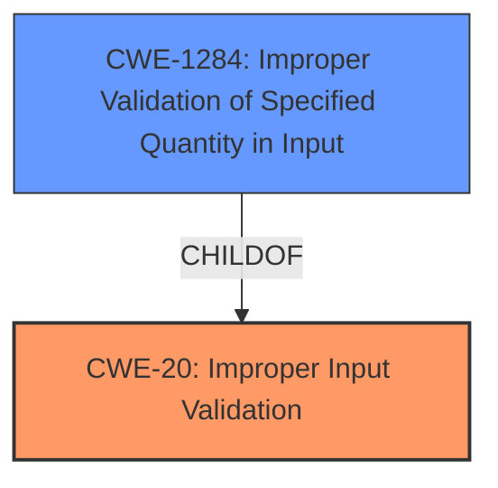

# Analysis for CVE-2020-0206

# Summary

| CWE ID | CWE Name | Confidence | CWE Abstraction Level | CWE Vulnerability Mapping Label | CWE-Vulnerability Mapping Notes |
|---|---|---|---|---|---|
| CWE-20 | Improper Input Validation | 0.75 | Class | Discouraged | Consider lower-level children or more specific properties. |
| CWE-1284 | Improper Validation of Specified Quantity in Input | 0.65 | Base | Allowed | Secondary candidate because the description doesn't explicitly mention a quantity.|

## Evidence and Confidence

*   **Confidence Score:** 0.70
*   **Evidence Strength:** MEDIUM

## Relationship Analysis
The primary CWE is CWE-20, which is a class-level CWE and has many potential child CWEs that could be more specific. CWE-1284 is a base-level CWE and a child of CWE-20, making it a more specific candidate. The weakness involves **improper input validation** which can precede many other vulnerabilities.

## Vulnerability Chain
The chain of events is as follows:
1.  **Root Cause:** **Improper input validation** (CWE-20) in the settings app.
2.  **Impact:** App crash leading to local denial of service.

## Summary of Analysis
The vulnerability description explicitly states that the root cause is **improper input validation** in the settings app, leading to a denial of service.

The primary CWE selected is CWE-20 (Improper Input Validation). The "Vulnerability Description Key Phrases" section includes "**rootcause:** **improper input validation**". The CVE Reference Links Content Summary also states, "The vulnerability is caused by a lack of proper validation of packet fields...**Improper input validation**". The retriever results also list CWE-20.

Although CWE-20 is a class-level CWE and the mapping guidance discourages its use when more specific CWEs are available, the current description doesn't provide enough information to pinpoint a more specific cause. It's possible that CWE-1284 (Improper Validation of Specified Quantity in Input) could be applicable if the input validation issue relates to a quantity, but this isn't explicitly stated.

Therefore, the selection of CWE-20 is primarily based on the explicit mention of **improper input validation** as the root cause in both the vulnerability description and the CVE summary. While a more specific CWE might exist, the available information doesn't support a more precise mapping.

Relevant CWE Information:
# Enhanced Context (25 CWEs)
The following CWEs were identified as potentially relevant to this vulnerability:

## CWE-754: Improper Check for Unusual or Exceptional Conditions
**Abstraction Level**: Class
**Similarity Score**: 0.76
**Source**: dense

**Description**:
The product does not check or incorrectly checks for unusual or exceptional conditions that are not expected to occur frequently during day to day operation of the product.

**Mapping Guidance**:
- Usage: Allowed-with-Review
- Rationale: This CWE entry is a Class and might have Base-level children that would be more appropriate

## CWE-1289: Improper Validation of Unsafe Equivalence in Input
**Abstraction Level**: Base
**Similarity Score**: 0.76
**Source**: dense

**Description**:
The product receives an input value that is used as a resource identifier or other type of reference, but it does not validate or incorrectly validates that the input is equivalent to a potentially-unsafe value.

**Mapping Guidance**:
- Usage: Allowed
- Rationale: This CWE entry is at the Base level of abstraction, which is a preferred level of abstraction for mapping to the root causes of vulnerabilities.

## CWE-667: Improper Locking
**Abstraction Level**: Class
**Similarity Score**: 0.75
**Source**: dense

**Description**:
The product does not properly acquire or release a lock on a resource, leading to unexpected resource state changes and behaviors.

**Mapping Guidance**:
- Usage: Allowed-with-Review
- Rationale: This CWE entry is a Class and might have Base-level children that would be more appropriate

## CWE-703: Improper Check or Handling of Exceptional Conditions
**Abstraction Level**: Pillar
**Similarity Score**: 0.75
**Source**: dense

**Description**:
The product does not properly anticipate or handle exceptional conditions that rarely occur during normal operation of the product.

**Mapping Guidance**:
- Usage: Discouraged
- Rationale: This CWE entry is extremely high-level, a Pillar.

## CWE-404: Improper Resource Shutdown or Release
**Abstraction Level**: Class
**Similarity Score**: 0.75
**Source**: dense

**Description**:
The product does not release or incorrectly releases a resource before it is made available for re-use.

**Mapping Guidance**:
- Usage: Allowed-with-Review
- Rationale: This CWE entry is a Class and might have Base-level children that would be more appropriate

## CWE-653: Improper Isolation or Compartmentalization
**Abstraction Level**: Class
**Similarity Score**: 0.74
**Source**: dense

**Description**:
The product does not properly compartmentalize or isolate functionality, processes, or resources that require different privilege levels, rights, or permissions.

**Mapping Guidance**:
- Usage: Allowed
- Rationale: This CWE entry is at the Base level of abstraction, which is a preferred level of abstraction for mapping to the root causes of vulnerabilities.

## CWE-668: Exposure of Resource to Wrong Sphere
**Abstraction Level**: Class
**Similarity Score**: 0.74
**Source**: dense

**Description**:
The product exposes a resource to the wrong control sphere, providing unintended actors with inappropriate access to the resource.

**Mapping Guidance**:
- Usage: Discouraged
- Rationale: CWE-668 is high-level and is often misused as a catch-all when lower-level CWE IDs might be applicable. It is sometimes used for low-information vulnerability reports [REF-1287]. It is a level-1 Class (i.e., a child of a Pillar). It is not useful for trend analysis.

## CWE-807: Reliance on Untrusted Inputs in a Security Decision
**Abstraction Level**: Base
**Similarity Score**: 0.73
**Source**: dense

**Description**:
The product uses a protection mechanism that relies on the existence or values of an input, but the input can be modified by an untrusted actor in a way that bypasses the protection mechanism.

**Mapping Guidance**:
- Usage: Allowed
- Rationale: This CWE entry is at the Base level of abstraction, which is a preferred level of abstraction for mapping to the root causes of vulnerabilities.

## CWE-345: Insufficient Verification of Data Authenticity
**Abstraction Level**: Class
**Similarity Score**: 0.73
**Source**: dense

**Description**:
The product does not sufficiently verify the origin or authenticity of data, in a way that causes it to accept invalid data.

**Mapping Guidance**:
- Usage: Discouraged
- Rationale: This CWE entry is a level-1 Class (i.e., a child of a Pillar). It might have lower-level children that would be more appropriate

## CWE-665: Improper Initialization
**Abstraction Level**: Class
**Similarity Score**: 0.73
**Source**: dense

**Description**:
The product does not initialize or incorrectly initializes a resource, which might leave the resource in an unexpected state when it is accessed or used.

**Mapping Guidance**:
- Usage: Discouraged
- Rationale: This CWE entry is a level-1 Class (i.e., a child of a Pillar). It might have lower-level children that would be more appropriate

## CWE-1284: Improper Validation of Specified Quantity in Input
**Abstraction Level**: Base
**Similarity Score**: 5969.29
**Source**: sparse

**Description**:
The product receives input that is expected to specify a quantity (such as size or length), but it does not validate or incorrectly validates that the quantity has the required properties.

**Mapping Guidance**:
- Usage: Allowed
- Rationale: This CWE entry is at the Base level of abstraction, which is a preferred level of abstraction for mapping to the root causes of vulnerabilities.

## CWE-22: Improper Limitation of a Pathname to a Restricted Directory ('Path Traversal')
**Abstraction Level**: Base
**Similarity Score**: 5908.34
**Source**: sparse

**Description**:
The product uses external input to construct a pathname that is intended to identify a file or directory that is located underneath a restricted parent directory, but the product does not properly neutralize special elements within the pathname that can cause the pathname to resolve to a location that is outside of the restricted directory.

**Mapping Guidance**:
- Usage: Allowed