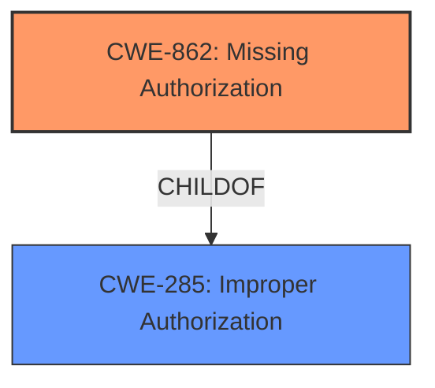

# Analysis for CVE-2020-0227

# Summary
| CWE ID  | CWE Name                         | Confidence | CWE Abstraction Level | CWE Vulnerability Mapping Label | CWE-Vulnerability Mapping Notes |
| :------- | :-------------------------------- | :--------- | :-------------------- | :------------------------------ | :---------------------------- |
| CWE-862 | Missing Authorization              | 1.0        | Class               | Primary                       | Allowed-with-Review             |

## Evidence and Confidence

*   **Confidence Score:** 1.0
*   **Evidence Strength:** HIGH

## Relationship Analysis
The primary relationship influencing the decision is the hierarchical relationship, specifically the ChildOf relationship. CWE-862 (Missing Authorization) is a child of CWE-285 (Improper Authorization). Although CWE-862 is a Class-level CWE, it is the most specific and appropriate choice given the available information. There are no specified chains.

## Vulnerability Chain
The vulnerability chain starts with the **missing permission check** (CWE-862), which leads to background data usage and launching from the background.

## Summary of Analysis
The initial analysis clearly points to a **missing permission check** in the `onCommand` function of `CompanionDeviceManagerService.java`. The CVE reference confirms "insufficient access control." This aligns directly with CWE-862 (Missing Authorization).

The selection of CWE-862 is based on the following evidence:

*   **Vulnerability Description Key Phrases:** "**missing permission check**"
*   **CVE Reference Links Content Summary:** "The vulnerability stems from improper access control when accessing companion records," and lists "Insufficient access control" as a weakness.

The retriever results also support this, with CWE-862 being the top candidate. Though CWE-862 is a Class-level CWE, the description precisely fits the vulnerability. Therefore, I am overriding the recommendation to examine children of this entry because the description is the best fit.

Relevant CWE Information:

# Enhanced Context (25 CWEs)

## CWE-862: Missing Authorization
**Abstraction:** Class
**Status:** Incomplete

### Description
The product does not perform an authorization check when an actor attempts to access a resource or perform an action.

### Extended Description
Not provided

### Alternative Terms
AuthZ: "AuthZ" is typically used as an abbreviation of "authorization" within the web application security community. It is distinct from "AuthN" (or, sometimes, "AuthC") which is an abbreviation of "authentication." The use of "Auth" as an abbreviation is discouraged, since it could be used for either authentication or authorization.

### Relationships
ChildOf -> CWE-285
ChildOf -> CWE-284

### Mapping Guidance
**Usage:** Allowed-with-Review
**Rationale:** This CWE entry is a Class and might have Base-level children that would be more appropriate
**Comments:** Examine children of this entry to see if there is a better fit
**Reasons:**
- Abstraction

### Additional Notes
**[Terminology]** Assuming a user with a given identity, authorization is the process of determining whether that user can access a given resource, based on the user's privileges and any permissions or other access-control specifications that apply to the resource.

### Observed Examples
- **CVE-2022-24730:** Go-based continuous deployment product does not check that a user has certain privileges to update or create an app, allowing adversaries to read sensitive repository information
- **CVE-2009-3168:** Web application does not restrict access to admin scripts, allowing authenticated users to reset administrative passwords.
- **CVE-2009-3597:** Web application stores database file under the web root with insufficient access control (CWE-219), allowing direct request.

CWE-863 (Incorrect Authorization) was also considered, but the vulnerability states that a permission check is **missing**, not incorrectly implemented. CWE-732 (Incorrect Permission Assignment for Critical Resource) was also considered, but again, it is not an issue of incorrect assignment, but of a completely **missing** check.