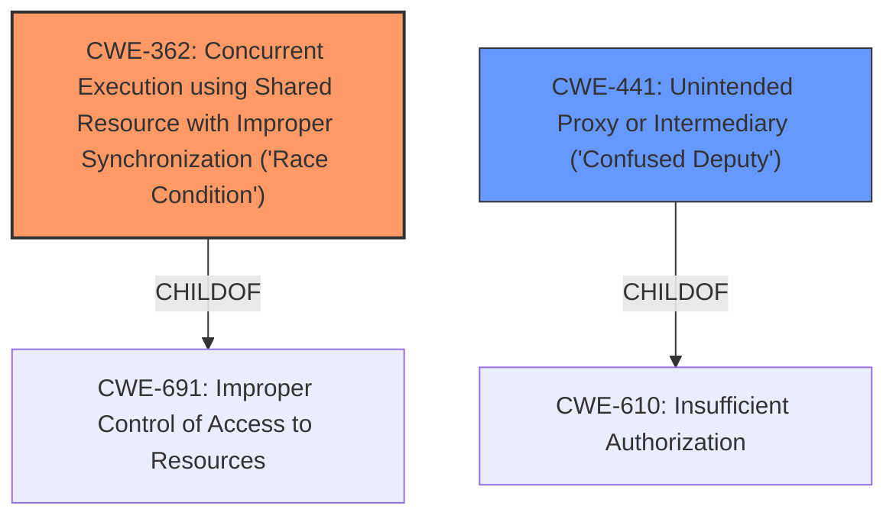

# Analysis Report for CVE-2020-0238

# Vulnerability Analysis Report: CVE-2020-0238

## Description


## Analysis (with Relationship Data)

# Summary
| CWE ID | CWE Name | Confidence | CWE Abstraction Level | CWE Vulnerability Mapping Label | CWE-Vulnerability Mapping Notes |
|---|---|---|---|---|---|
| CWE-362 | Concurrent Execution using Shared Resource with Improper Synchronization ('Race Condition') | 0.9 | Class | Allowed-with-Review | Primary CWE |
| CWE-441 | Unintended Proxy or Intermediary ('Confused Deputy') | 0.8 | Class | Allowed-with-Review | Secondary CWE |

## Evidence and Confidence

*   **Confidence Score:** 0.85
*   **Evidence Strength:** HIGH

## Relationship Analysis
The primary relationship influencing my decision is the combination of CWE-362 and CWE-441, reflecting a **race condition** leading to a **confused deputy** scenario. CWE-362 is a child of CWE-691 (Improper Control of Access to Resources), reflecting the broader context of resource access control issues. CWE-441 is a child of CWE-610 (Insufficient Authorization), indicating a failure to properly authorize actions. These parent-child relationships help frame the specific weaknesses within broader security principles. The retriever results also highlighted these two CWEs as the best matches. Both CWE-362 and CWE-441 are class level CWEs.



## Vulnerability Chain
The vulnerability chain starts with a **race condition** (CWE-362) that allows an attacker to exploit a **confused deputy** scenario (CWE-441), leading to local escalation of privilege.
  - **Root Cause:** CWE-362 Concurrent Execution using Shared Resource with Improper Synchronization ('Race Condition')
  - **Weakness:** CWE-441 Unintended Proxy or Intermediary ('Confused Deputy')
  - **Impact:** Local escalation of privilege and launching privileged activities.

## Summary of Analysis
Initially, the vulnerability description clearly indicated a **race condition** and a **confused deputy** attack. The retriever results strongly supported these findings, with CWE-362 and CWE-441 being the top matches. The "Vulnerability Description Key Phrases" also directly stated that the root cause was a **race condition** and the weakness was a **confused deputy**. The CVE reference summary then provided detail that the improper check on exported activities allowed activity launching by a third-party application, bypassing intended restrictions.

I selected CWE-362 as the primary CWE because the **race condition** is the underlying cause that enables the **confused deputy** attack. CWE-441 is a secondary CWE because it describes the specific mechanism of the attack: the application acts as an unintended proxy due to the **race condition**. Both CWEs are at the class level, which is appropriate given the information available.

CWEs considered but not used:

*   CWE-667 (Improper Locking): While locking issues can contribute to **race conditions**, the description specifically highlights the **race condition** itself, making CWE-362 a better fit.
*   CWE-862 (Missing Authorization) and CWE-863 (Incorrect Authorization): While authorization is related to the **confused deputy** aspect, CWE-441 more directly captures the proxy behavior.
*   CWE-367 (Time-of-check Time-of-use (TOCTOU) Race Condition): This is a more specific type of **race condition**, but the description doesn't provide enough information to determine if it's a TOCTOU issue.
*   CWE-416 (Use After Free) and CWE-476 (NULL Pointer Dereference): These are potential consequences of a **race condition**, but the description doesn't explicitly mention them.


## CWE Relationship Analysis

Current CWEs represent these abstraction levels: .


### Vulnerability Chain Analysis

**Chain starting from CWE-691:**
- 691 (Insufficient Control Flow Management) - ROOT


**Chain starting from CWE-667:**
- 667 (Improper Locking) - ROOT


### CWE Relationship Diagram

```mermaid
graph TD
    classDef primary fill:#f96,stroke:#333,stroke-width:2px
    classDef secondary fill:#69f,stroke:#333
    classDef tertiary fill:#9e9,stroke:#333
```


*Report generated on 2025-04-02 02:13:44*
