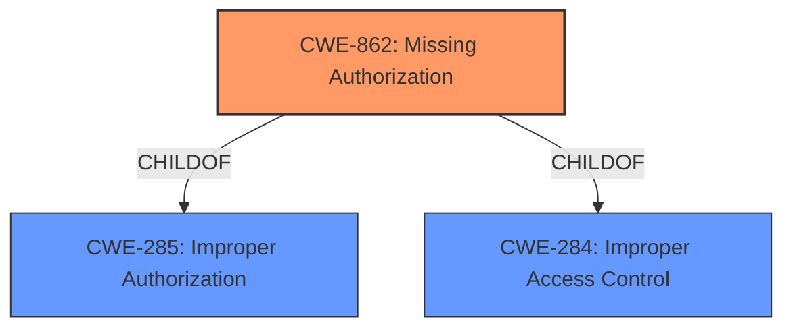

# Analysis for CVE-2020-0298

# Summary
| CWE ID | CWE Name | Confidence | CWE Abstraction Level | CWE Vulnerability Mapping Label | CWE-Vulnerability Mapping Notes |
|---|---|---|---|---|---|
| CWE-862 | Missing Authorization | 1.0 | Class | Allowed-with-Review | Primary CWE |
| CWE-285 | Improper Authorization | 0.75 | Class | Allowed-with-Review | Secondary Candidate |

## Evidence and Confidence

*   **Confidence Score:** 1.0
*   **Evidence Strength:** HIGH

## Relationship Analysis
The primary CWE identified is CWE-862 (Missing Authorization), which is a Class-level CWE. This vulnerability is due to a **missing permission check**, which directly aligns with the definition of missing authorization. CWE-862 is a child of both CWE-285 (Improper Authorization) and CWE-284 (Improper Access Control). While CWE-285 could be considered, CWE-862 is more specific and accurately captures the **missing permission check**.

## Vulnerability Chain
The vulnerability chain starts with the **missing permission check** (CWE-862), leading to control over the Bluetooth enabled state, effectively resulting in a local escalation of privilege.

## Summary of Analysis
The analysis is based on the provided vulnerability description, which explicitly states a **missing permission check** in the Bluetooth component of Android. The CVE Reference Links Content Summary also supports this by indicating an elevation of privilege vulnerability.

The "Retriever Results" list CWE-862 (Missing Authorization) as the top candidate based on sparse retriever results. Given the clear statement of a **missing permission check** and its direct relevance to authorization, CWE-862 is the most appropriate choice.

CWE-862 is preferred over its parents, CWE-285 and CWE-284, due to its greater specificity. While CWE-862 is a Class-level CWE, the evidence strongly supports its selection, aligning with the MITRE mapping guidance for considering children of Class-level CWEs when they provide a better fit.

Relevant CWE Information:

# Enhanced Context (25 CWEs)
The following CWEs were identified as potentially relevant to this vulnerability:

## CWE-754: Improper Check for Unusual or Exceptional Conditions
**Abstraction Level**: Class
**Similarity Score**: 0.78
**Source**: dense

**Description**:
The product does not check or incorrectly checks for unusual or exceptional conditions that are not expected to occur frequently during day to day operation of the product.

**Mapping Guidance**:
- Usage: Allowed-with-Review
- Rationale: This CWE entry is a Class and might have Base-level children that would be more appropriate

## CWE-667: Improper Locking
**Abstraction Level**: Class
**Similarity Score**: 0.78
**Source**: dense

**Description**:
The product does not properly acquire or release a lock on a resource, leading to unexpected resource state changes and behaviors.

**Mapping Guidance**:
- Usage: Allowed-with-Review
- Rationale: This CWE entry is a Class and might have Base-level children that would be more appropriate

## CWE-362: Concurrent Execution using Shared Resource with Improper Synchronization ('Race Condition')
**Abstraction Level**: Class
**Similarity Score**: 0.77
**Source**: dense

**Description**:
The product contains a concurrent code sequence that requires temporary, exclusive access to a shared resource, but a timing window exists in which the shared resource can be modified by another code sequence operating concurrently.

**Mapping Guidance**:
- Usage: Allowed-with-Review
- Rationale: This CWE entry is a Class and might have Base-level children that would be more appropriate

## CWE-404: Improper Resource Shutdown or Release
**Abstraction Level**: Class
**Similarity Score**: 0.76
**Source**: dense

**Description**:
The product does not release or incorrectly releases a resource before it is made available for re-use.

**Mapping Guidance**:
- Usage: Allowed-with-Review
- Rationale: This CWE entry is a Class and might have Base-level children that would be more appropriate

## CWE-703: Improper Check or Handling of Exceptional Conditions
**Abstraction Level**: Pillar
**Similarity Score**: 0.76
**Source**: dense

**Description**:
The product does not properly anticipate or handle exceptional conditions that rarely occur during normal operation of the product.

**Mapping Guidance**:
- Usage: Discouraged
- Rationale: This CWE entry is extremely high-level, a Pillar.

## CWE-248: Uncaught Exception
**Abstraction Level**: Base
**Similarity Score**: 0.76
**Source**: dense

**Description**:
An exception is thrown from a function, but it is not caught.

**Mapping Guidance**:
- Usage: Allowed
- Rationale: This CWE entry is at the Base level of abstraction, which is a preferred level of abstraction for mapping to the root causes of vulnerabilities.

## CWE-755: Improper Handling of Exceptional Conditions
**Abstraction Level**: Class
**Similarity Score**: 0.75
**Source**: dense

**Description**:
The product does not handle or incorrectly handles an exceptional condition.

**Mapping Guidance**:
- Usage: Discouraged
- Rationale: This CWE entry is a level-1 Class (i.e., a child of a Pillar). It might have lower-level children that would be more appropriate

## CWE-226: Sensitive Information in Resource Not Removed Before Reuse
**Abstraction Level**: Base
**Similarity Score**: 0.75
**Source**: dense

**Description**:
The product releases a resource such as memory or a file so that it can be made available for reuse, but it does not clear or "zeroize" the information contained in the resource before the product performs a critical state transition or makes the resource available for reuse by other entities.

**Mapping Guidance**:
- Usage: Allowed
- Rationale: This CWE entry is at the Base level of abstraction, which is a preferred level of abstraction for mapping to the root causes of vulnerabilities.

## CWE-203: Observable Discrepancy
**Abstraction Level**: Base
**Similarity Score**: 0.75
**Source**: dense

**Description**:
The product behaves differently or sends different responses under different circumstances in a way that is observable to an unauthorized actor, which exposes security-relevant information about the state of the product, such as whether a particular operation was successful or not.

**Mapping Guidance**:
- Usage: Allowed
- Rationale: This CWE entry is at the Base level of abstraction, which is a preferred level of abstraction for mapping to the root causes of vulnerabilities.

## CWE-909: Missing Initialization of Resource
**Abstraction Level**: Class
**Similarity Score**: 0.75
**Source**: dense

**Description**:
The product does not initialize a critical resource.

**Mapping Guidance**:
- Usage: Allowed-with-Review
- Rationale: This CWE entry is a Class and might have Base-level children that would be more appropriate

## CWE-667: Improper Locking
**Abstraction Level**: Class
**Similarity Score**: 4766.99
**Source**: sparse

**Description**:
The product does not properly acquire or release a lock on a resource, leading to unexpected resource state changes and behaviors.

**Mapping Guidance**:
- Usage: Allowed-with-Review
- Rationale: This CWE entry is a Class and might have Base-level children that would be more appropriate

## CWE-927: Use of Implicit Intent for Sensitive Communication
**Abstraction Level**: Variant
**Similarity Score**: 4765.49
**Source**: sparse

**Description**:
The Android application uses an implicit intent for transmitting sensitive data to other applications.

**Mapping Guidance**:
- Usage: Allowed
- Rationale: This CWE entry is at the Variant level of abstraction, which is a preferred level of abstraction for mapping to the root causes of vulnerabilities.

## CWE-362: Concurrent Execution using Shared Resource with Improper Synchronization ('Race Condition')
**Abstraction Level**: Class
**Similarity Score**: 4680.62
**Source**: sparse

**Description**:
The product contains a concurrent code sequence that requires temporary, exclusive access to a shared resource, but a timing window exists in which the shared resource can be modified by another code sequence operating concurrently.

**Mapping Guidance**:
- Usage: Allowed-with-Review
- Rationale: This CWE entry is a Class and might have Base-level children that would be more appropriate

## CWE-367: Time-of-check Time-of-use (TOCTOU) Race Condition
**Abstraction Level