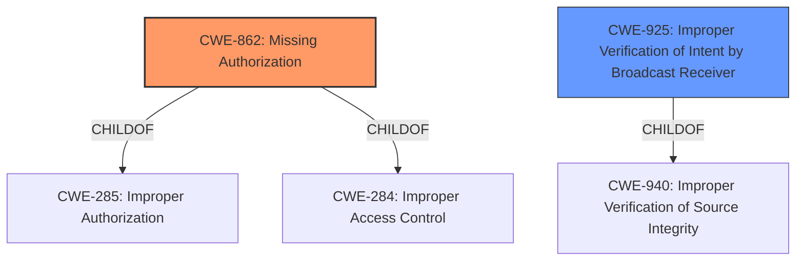

# Analysis Report for CVE-2020-0299

# Vulnerability Analysis Report: CVE-2020-0299

## Description


## Analysis (with Relationship Data)

# Summary
| CWE ID | CWE Name | Confidence | CWE Abstraction Level | CWE Vulnerability Mapping Label | CWE-Vulnerability Mapping Notes |
|---|---|---|---|---|---|
| CWE-862 | Missing Authorization | 1.0 | Class | Primary | Allowed-with-Review |
| CWE-925 | Improper Verification of Intent by Broadcast Receiver | 0.7 | Variant | Secondary | Allowed |

## Evidence and Confidence

*   **Confidence Score:** 0.9
*   **Evidence Strength:** HIGH

## Relationship Analysis
The primary CWE selected is CWE-862 **Missing Authorization**. The Retriever Results suggested it along with CWE-925 **Improper Verification of Intent by Broadcast Receiver**. CWE-862 is a Class-level CWE, while CWE-925 is a Variant-level CWE.



## Vulnerability Chain
The vulnerability chain starts with a **missing permission check** (CWE-862) which leads to spoofing of bluetooth device metadata. The impact is a local escalation of privilege.

## Summary of Analysis
The initial assessment points to **CWE-862: Missing Authorization**, as the root cause is explicitly stated as a "**missing permission check**" in the vulnerability description key phrases. The CVE Reference Links Content Summary also mentions "Elevation of privilege" and the need for an attacker to interact with the vulnerable system component, which aligns with a missing authorization scenario.

The Retriever Results also include CWE-925, **Improper Verification of Intent by Broadcast Receiver**. This is relevant because the vulnerability involves Bluetooth, which uses intents for communication. However, the primary issue is the missing permission check, making CWE-862 the more direct cause.

The final decision is to prioritize **CWE-862: Missing Authorization** as the primary CWE, based on the explicit statement of the "**missing permission check**" in the vulnerability description. CWE-925 is considered as a secondary, contributing factor, as the **missing permission check** could result in the Intent by Broadcast Receiver not being properly verified.

Relevant CWE Information:

# Enhanced Context (25 CWEs)
The following CWEs were identified as potentially relevant to this vulnerability:

## CWE-667: Improper Locking
**Abstraction Level**: Class
**Similarity Score**: 0.80
**Source**: dense

**Description**:
The product does not properly acquire or release a lock on a resource, leading to unexpected resource state changes and behaviors.

**Mapping Guidance**:
- Usage: Allowed-with-Review
- Rationale: This CWE entry is a Class and might have Base-level children that would be more appropriate

## CWE-754: Improper Check for Unusual or Exceptional Conditions
**Abstraction Level**: Class
**Similarity Score**: 0.79
**Source**: dense

**Description**:
The product does not check or incorrectly checks for unusual or exceptional conditions that are not expected to occur frequently during day to day operation of the product.

**Mapping Guidance**:
- Usage: Allowed-with-Review
- Rationale: This CWE entry is a Class and might have Base-level children that would be more appropriate

## CWE-404: Improper Resource Shutdown or Release
**Abstraction Level**: Class
**Similarity Score**: 0.78
**Source**: dense

**Description**:
The product does not release or incorrectly releases a resource before it is made available for re-use.

**Mapping Guidance**:
- Usage: Allowed-with-Review
- Rationale: This CWE entry is a Class and might have Base-level children that would be more appropriate

## CWE-909: Missing Initialization of Resource
**Abstraction Level**: Class
**Similarity Score**: 0.78
**Source**: dense

**Description**:
The product does not initialize a critical resource.

**Mapping Guidance**:
- Usage: Allowed-with-Review
- Rationale: This CWE entry is a Class and might have Base-level children that would be more appropriate

## CWE-226: Sensitive Information in Resource Not Removed Before Reuse
**Abstraction Level**: Base
**Similarity Score**: 0.78
**Source**: dense

**Description**:
The product releases a resource such as memory or a file so that it can be made available for reuse, but it does not clear or "zeroize" the information contained in the resource before the product performs a critical state transition or makes the resource available for reuse by other entities.

**Mapping Guidance**:
- Usage: Allowed
- Rationale: This CWE entry is at the Base level of abstraction, which is a preferred level of abstraction for mapping to the root causes of vulnerabilities.

## CWE-362: Concurrent Execution using Shared Resource with Improper Synchronization ('Race Condition')
**Abstraction Level**: Class
**Similarity Score**: 0.78
**Source**: dense

**Description**:
The product contains a concurrent code sequence that requires temporary, exclusive access to a shared resource, but a timing window exists in which the shared resource can be modified by another code sequence operating concurrently.

**Mapping Guidance**:
- Usage: Allowed-with-Review
- Rationale: This CWE entry is a Class and might have Base-level children that would be more appropriate

## CWE-665: Improper Initialization
**Abstraction Level**: Class
**Similarity Score**: 0.77
**Source**: dense

**Description**:
The product does not initialize or incorrectly initializes a resource, which might leave the resource in an unexpected state when it is accessed or used.

**Mapping Guidance**:
- Usage: Discouraged
- Rationale: This CWE entry is a level-1 Class (i.e., a child of a Pillar). It might have lower-level children that would be more appropriate

## CWE-908: Use of Uninitialized Resource
**Abstraction Level**: Base
**Similarity Score**: 0.77
**Source**: dense

**Description**:
The product uses or accesses a resource that has not been initialized.

**Mapping Guidance**:
- Usage: Allowed
- Rationale: This CWE entry is at the Base level of abstraction, which is a preferred level of abstraction for mapping to the root causes of vulnerabilities.

## CWE-824: Access of Uninitialized Pointer
**Abstraction Level**: Base
**Similarity Score**: 0.77
**Source**: dense

**Description**:
The product accesses or uses a pointer that has not been initialized.

**Mapping Guidance**:
- Usage: Allowed
- Rationale: This CWE entry is at the Base level of abstraction, which is a preferred level of abstraction for mapping to the root causes of vulnerabilities.

## CWE-203: Observable Discrepancy
**Abstraction Level**: Base
**Similarity Score**: 0.76
**Source**: dense

**Description**:
The product behaves differently or sends different responses under different circumstances in a way that is observable to an unauthorized actor, which exposes security-relevant information about the state of the product, such as whether a particular operation was successful or not.

**Mapping Guidance**:
- Usage: Allowed
- Rationale: This CWE entry is at the Base level of abstraction, which is a preferred level of abstraction for mapping to the root causes of vulnerabilities.

## CWE-667: Improper Locking
**Abstraction Level**: Class
**Similarity Score**: 4738.94
**Source**: sparse

**Description**:
The product does not properly acquire or release a lock on a resource, leading to unexpected resource state changes and behaviors.

**Mapping Guidance**:
- Usage: Allowed-with-Review
- Rationale: This CWE entry is a Class and might have Base-level children that would be more appropriate

## CWE-927: Use of Implicit Intent for Sensitive Communication
**Abstraction Level**: Variant
**Similarity Score**: 4721.43
**Source**: sparse

**Description**:
The Android application uses an implicit intent for transmitting sensitive data to other applications.

**Mapping Guidance**:
- Usage: Allowed
- Rationale: This CWE entry is at the Variant level of abstraction, which is a preferred level of abstraction for mapping to the root causes of vulnerabilities.

## CWE-362: Concurrent Execution using Shared Resource with Improper Synchronization ('Race Condition')
**Abstraction Level**: Class
**Similarity Score**: 4645.63
**Source**: sparse

**Description**:
The product contains a concurrent code sequence that requires temporary, exclusive access to a shared resource, but a timing window exists in which the shared


## CWE Relationship Analysis

Current CWEs represent these abstraction levels: .


### Vulnerability Chain Analysis

**Chain starting from CWE-667:**
- 667 (Improper Locking) - ROOT


**Chain starting from CWE-754:**
- 754 (Improper Check for Unusual or Exceptional Conditions) - ROOT


### CWE Relationship Diagram

```mermaid
graph TD
    classDef primary fill:#f96,stroke:#333,stroke-width:2px
    classDef secondary fill:#69f,stroke:#333
    classDef tertiary fill:#9e9,stroke:#333
```


*Report generated on 2025-04-02 13:49:37*
