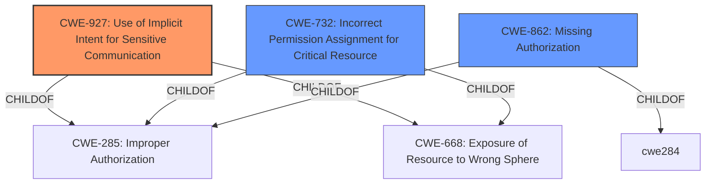

# Enhanced Analysis for CVE-2020-0417

# Summary
| CWE ID | CWE Name | Confidence | CWE Abstraction Level | CWE Vulnerability Mapping Label | CWE-Vulnerability Mapping Notes |
|---|---|---|---|---|---|
| CWE-927 | Use of Implicit Intent for Sensitive Communication | 0.8 | Variant | Allowed | Primary CWE |
| CWE-732 | Incorrect Permission Assignment for Critical Resource | 0.6 | Class | Allowed-with-Review | Secondary Candidate |
| CWE-862 | Missing Authorization | 0.5 | Class | Allowed-with-Review | Secondary Candidate |

## Evidence and Confidence

*   **Confidence Score:** 0.8
*   **Evidence Strength:** HIGH

## Relationship Analysis
The primary CWE selected is CWE-927, which is a Variant of CWE-285 (Improper Authorization) and CWE-668 (Exposure of Resource to Wrong Sphere). This indicates that the vulnerability involves a specific type of authorization issue related to Android intents. CWE-732 and CWE-862 are broader Class-level CWEs that could potentially apply, but CWE-927 provides a more specific classification. The relationships guide the selection towards a more specific variant when available.



## Vulnerability Chain
The vulnerability chain starts with the **empty mutable PendingIntent**, which leads to a permissions bypass and ultimately results in local escalation of privilege.

## Summary of Analysis
The initial assessment identified an **empty mutable PendingIntent** as the **root cause**, leading to a local escalation of privilege. The CVE Reference Links Content Summary confirms that the vulnerability allows bypassing user interaction requirements to gain additional permissions.

CWE-927 (Use of Implicit Intent for Sensitive Communication) is the best fit because the vulnerability involves an intent being used in a way that allows unintended access. The description of CWE-927 states: "The Android application uses an implicit intent for transmitting sensitive data to other applications... Since an implicit intent does not specify a particular application to receive the data, any application can process the intent by using an Intent Filter for that intent. This can allow untrusted applications to obtain sensitive data." This matches the scenario where the **empty mutable PendingIntent** can be intercepted and exploited.

CWE-732 (Incorrect Permission Assignment for Critical Resource) and CWE-862 (Missing Authorization) were considered as secondary candidates. While the vulnerability does involve a permissions bypass, CWE-927 is more specific to the use of intents in Android and the associated risks.

The final decision is based on the evidence from the vulnerability description and the CVE summary, combined with the specific details of CWE-927. This leads to a high confidence in the selection of CWE-927 as the primary CWE. CWE-927 is at the Variant level of abstraction, which is the preferred level for accurate representation.

Relevant CWE Information:

# Enhanced Context (25 CWEs)

## CWE-754: Improper Check for Unusual or Exceptional Conditions
**Abstraction Level**: Class
**Similarity Score**: 0.78
**Source**: dense

**Description**:
The product does not check or incorrectly checks for unusual or exceptional conditions that are not expected to occur frequently during day to day operation of the product.

**Mapping Guidance**:
- Usage: Allowed-with-Review
- Rationale: This CWE entry is a Class and might have Base-level children that would be more appropriate

## CWE-667: Improper Locking
**Abstraction Level**: Class
**Similarity Score**: 0.77
**Source**: dense

**Description**:
The product does not properly acquire or release a lock on a resource, leading to unexpected resource state changes and behaviors.

**Mapping Guidance**:
- Usage: Allowed-with-Review
- Rationale: This CWE entry is a Class and might have Base-level children that would be more appropriate

## CWE-248: Uncaught Exception
**Abstraction Level**: Base
**Similarity Score**: 0.75
**Source**: dense

**Description**:
An exception is thrown from a function, but it is not caught.

**Mapping Guidance**:
- Usage: Allowed
- Rationale: This CWE entry is at the Base level of abstraction, which is a preferred level of abstraction for mapping to the root causes of vulnerabilities.

## CWE-703: Improper Check or Handling of Exceptional Conditions
**Abstraction Level**: Pillar
**Similarity Score**: 0.75
**Source**: dense

**Description**:
The product does not properly anticipate or handle exceptional conditions that rarely occur during normal operation of the product.

**Mapping Guidance**:
- Usage: Discouraged
- Rationale: This CWE entry is extremely high-level, a Pillar.

## CWE-404: Improper Resource Shutdown or Release
**Abstraction Level**: Class
**Similarity Score**: 0.75
**Source**: dense

**Description**:
The product does not release or incorrectly releases a resource before it is made available for re-use.

**Mapping Guidance**:
- Usage: Allowed-with-Review
- Rationale: This CWE entry is a Class and might have Base-level children that would be more appropriate

## CWE-203: Observable Discrepancy
**Abstraction Level**: Base
**Similarity Score**: 0.75
**Source**: dense

**Description**:
The product behaves differently or sends different responses under different circumstances in a way that is observable to an unauthorized actor, which exposes security-relevant information about the state of the product, such as whether a particular operation was successful or not.

**Mapping Guidance**:
- Usage: Allowed
- Rationale: This CWE entry is at the Base level of abstraction, which is a preferred level of abstraction for mapping to the root causes of vulnerabilities.

## CWE-668: Exposure of Resource to Wrong Sphere
**Abstraction Level**: Class
**Similarity Score**: 0.75
**Source**: dense

**Description**:
The product exposes a resource to the wrong control sphere, providing unintended actors with inappropriate access to the resource.

**Mapping Guidance**:
- Usage: Discouraged
- Rationale: CWE-668 is high-level and is often misused as a catch-all when lower-level CWE IDs might be applicable. It is sometimes used for low-information vulnerability reports [REF-1287]. It is a level-1 Class (i.e., a child of a Pillar). It is not useful for trend analysis.

## CWE-755: Improper Handling of Exceptional Conditions
**Abstraction Level**: Class
**Similarity Score**: 0.75
**Source**: dense

**Description**:
The product does not handle or incorrectly handles an exceptional condition.

**Mapping Guidance**:
- Usage: Discouraged
- Rationale: This CWE entry is a level-1 Class (i.e., a child of a Pillar). It might have lower-level children that would be more appropriate

## CWE-345: Insufficient Verification of Data Authenticity
**Abstraction Level**: Class
**Similarity Score**: 0.74
**Source**: dense

**Description**:
The product does not sufficiently verify the origin or authenticity of data, in a way that causes it to accept invalid data.

**Mapping Guidance**:
- Usage: Discouraged
- Rationale: This CWE entry is a level-1 Class (i.e., a child of a Pillar). It might have lower-level children that would be more appropriate

## CWE-451: User Interface (UI) Misrepresentation of Critical Information
**Abstraction Level**: Class
**Similarity Score**: 0.74
**Source**: dense

**Description**:
The user interface (UI) does not properly represent critical information to the user, allowing the information - or its source - to be obscured or spoofed. This is often a component in phishing attacks.

**Mapping Guidance**:
- Usage: Allowed-with-Review
- Rationale: This CWE entry is a Class and might have Base-level children that would be more appropriate

## CWE-927: Use of Implicit Intent for Sensitive Communication
**Abstraction Level**: Variant
**Similarity Score**: 4587.81
**Source**: sparse

**Description**:
The Android


## CWE Relationship Analysis

Current CWEs represent these abstraction levels: .


### Vulnerability Chain Analysis

**Chain starting from CWE-732:**
- 732 (Incorrect Permission Assignment for Critical Resource) - ROOT


**Chain starting from CWE-754:**
- 754 (Improper Check for Unusual or Exceptional Conditions) - ROOT


### CWE Relationship Diagram

```mermaid
graph TD
    classDef primary fill:#f96,stroke:#333,stroke-width:2px
    classDef secondary fill:#69f,stroke:#333
    classDef tertiary fill:#9e9,stroke:#333
```