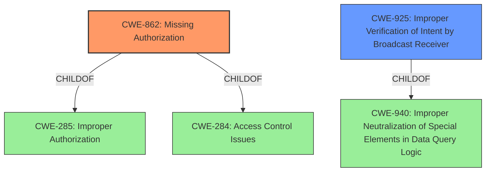

# Raw Analyzer Response for CVE-2020-0437

# Summary
| CWE ID | CWE Name | Confidence | CWE Abstraction Level | CWE Vulnerability Mapping Label | CWE-Vulnerability Mapping Notes |
|---|---|---|---|---|---|
| CWE-862 | Missing Authorization | 1.0 | Class | Primary | Allowed-with-Review |
| CWE-925 | Improper Verification of Intent by Broadcast Receiver | 0.7 | Variant | Secondary | Allowed |

## Evidence and Confidence

*   **Confidence Score:** 0.85
*   **Evidence Strength:** HIGH

## Relationship Analysis
The primary CWE, CWE-862 [Missing Authorization], is a class-level CWE. The retriever results suggest using it with review, indicating that a more specific child CWE might be available. CWE-862 is a child of CWE-285 [Improper Authorization] and CWE-284 [Access Control Issues]. The analysis also considered CWE-925 [Improper Verification of Intent by Broadcast Receiver], a variant of CWE-940 [Improper Neutralization of Special Elements in Data Query Logic], as a secondary CWE due to its relevance to Android broadcast receivers.

## Vulnerability Chain
The vulnerability chain starts with the **missing permission check** (CWE-862) in the intent handlers of CellBroadcastReceivers. This **missing authorization** allows any application to send a crafted intent, bypassing intended security measures. The lack of proper intent verification by the broadcast receiver (potentially CWE-925) further facilitates the attack. The ultimate impact is a denial of service (DoS) of emergency alerts.

## Summary of Analysis
The analysis is based on the provided vulnerability description and the CVE reference content summary. The vulnerability description clearly states a **missing permission check** as the root cause. The CVE reference confirms this, highlighting that the CellBroadcastReceiver was exported in the manifest, and any app could send a MARK_AS_READ intent due to "incorrect permission/access control."

The primary CWE is CWE-862 [Missing Authorization], which aligns with the **missing permission check**. Although CWE-862 is a Class, it is the most appropriate high-level categorization for the **lack of authorization**. The CVE summary explicitly mentions "incorrect permission/access control", further supporting this classification.

CWE-925 [Improper Verification of Intent by Broadcast Receiver] was considered as a secondary CWE. This is because the vulnerability involves a broadcast receiver that does not properly verify the intent's origin. The CVE summary indicates that any application can send a crafted intent, suggesting a failure in verifying the intent's source.

The selected CWEs are at the optimal level of specificity because CWE-862 directly addresses the **missing authorization**, while CWE-925 covers the improper intent verification aspect. Both contribute to the overall understanding of the vulnerability.

Relevant CWE Information:
# Enhanced Context (25 CWEs)
The following CWEs were identified as potentially relevant to this vulnerability:

## CWE-941: Incorrectly Specified Destination in a Communication Channel
**Abstraction Level**: Base
**Similarity Score**: 0.77
**Source**: dense

**Description**:
The product creates a communication channel to initiate an outgoing request to an actor, but it does not correctly specify the intended destination for that actor.

**Mapping Guidance**:
- Usage: Allowed
- Rationale: This CWE entry is at the Base level of abstraction, which is a preferred level of abstraction for mapping to the root causes of vulnerabilities.

## CWE-223: Omission of Security-relevant Information
**Abstraction Level**: Base
**Similarity Score**: 0.76
**Source**: dense

**Description**:
The product does not record or display information that would be important for identifying the source or nature of an attack, or determining if an action is safe.

**Mapping Guidance**:
- Usage: Allowed
- Rationale: This CWE entry is at the Base level of abstraction, which is a preferred level of abstraction for mapping to the root causes of vulnerabilities.

## CWE-203: Observable Discrepancy
**Abstraction Level**: Base
**Similarity Score**: 0.76
**Source**: dense

**Description**:
The product behaves differently or sends different responses under different circumstances in a way that is observable to an unauthorized actor, which exposes security-relevant information about the state of the product, such as whether a particular operation was successful or not.

**Mapping Guidance**:
- Usage: Allowed
- Rationale: This CWE entry is at the Base level of abstraction, which is a preferred level of abstraction for mapping to the root causes of vulnerabilities.

## CWE-754: Improper Check for Unusual or Exceptional Conditions
**Abstraction Level**: Class
**Similarity Score**: 0.75
**Source**: dense

**Description**:
The product does not check or incorrectly checks for unusual or exceptional conditions that are not expected to occur frequently during day to day operation of the product.

**Mapping Guidance**:
- Usage: Allowed-with-Review
- Rationale: This CWE entry is a Class and might have Base-level children that would be more appropriate

## CWE-667: Improper Locking
**Abstraction Level**: Class
**Similarity Score**: 0.75
**Source**: dense

**Description**:
The product does not properly acquire or release a lock on a resource, leading to unexpected resource state changes and behaviors.

**Mapping Guidance**:
- Usage: Allowed-with-Review
- Rationale: This CWE entry is a Class and might have Base-level children that would be more appropriate

## CWE-668: Exposure of Resource to Wrong Sphere
**Abstraction Level**: Class
**Similarity Score**: 0.75
**Source**: dense

**Description**:
The product exposes a resource to the wrong control sphere, providing unintended actors with inappropriate access to the resource.

**Mapping Guidance**:
- Usage: Discouraged
- Rationale: CWE-668 is high-level and is often misused as a catch-all when lower-level CWE IDs might be applicable. It is sometimes used for low-information vulnerability reports [REF-1287]. It is a level-1 Class (i.e., a child of a Pillar). It is not useful for trend analysis.

## CWE-226: Sensitive Information in Resource Not Removed Before Reuse
**Abstraction Level**: Base
**Similarity Score**: 0.74
**Source**: dense

**Description**:
The product releases a resource such as memory or a file so that it can be made available for reuse, but it does not clear or "zeroize" the information contained in the resource before the product performs a critical state transition or makes the resource available for reuse by other entities.

**Mapping Guidance**:
- Usage: Allowed
- Rationale: This CWE entry is at the Base level of abstraction, which is a preferred level of abstraction for mapping to the root causes of vulnerabilities.

## CWE-362: Concurrent Execution using Shared Resource with Improper Synchronization ('Race Condition')
**Abstraction Level**: Class
**Similarity Score**: 0.74
**Source**: dense

**Description**:
The product contains a concurrent code sequence that requires temporary, exclusive access to a shared resource, but a timing window exists in which the shared resource can be modified by another code sequence operating concurrently.

**Mapping Guidance**:
- Usage: Allowed-with-Review
- Rationale: This CWE entry is a Class and might have Base-level children that would be more appropriate

## CWE-451: User Interface (UI) Misrepresentation of Critical Information
**Abstraction Level**: Class
**Similarity Score**: 0.74
**Source**: dense

**Description**:
The user interface (UI) does not properly represent critical information to the user, allowing the information - or its source - to be obscured or spoofed. This is often a component in phishing attacks.

**Mapping Guidance**:
- Usage: Allowed-with-Review
- Rationale: This CWE entry is a Class and might have Base-level children that would be more appropriate

## CWE-345: Insufficient Verification of Data Authenticity
**Abstraction Level**: Class
**Similarity Score**: 0.74
**Source**: dense

**Description**:
The product does not sufficiently verify the origin or authenticity of data, in a way that causes it to accept invalid data.

**Mapping Guidance**:
- Usage: Discouraged