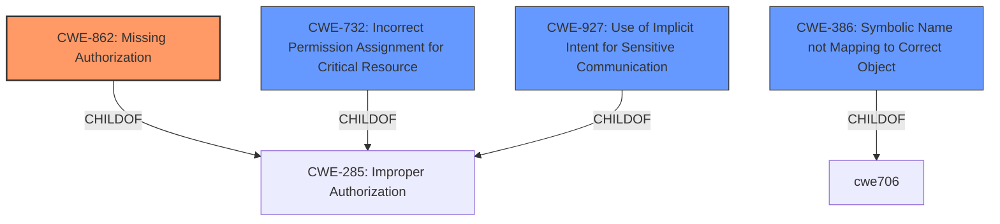

# Enhanced Analysis for CVE-2020-0439

# Summary
| CWE ID  | CWE Name                                                        | Confidence | CWE Abstraction Level | CWE Vulnerability Mapping Label | CWE-Vulnerability Mapping Notes |
| :-------- | :-------------------------------------------------------------- | :--------- | :-------------------- | :------------------------------ | :------------------------------ |
| CWE-862   | Missing Authorization                                           | 0.9        | Class                 | Primary CWE                     | Allowed-with-Review           |
| CWE-732   | Incorrect Permission Assignment for Critical Resource           | 0.7        | Class                 | Secondary Candidate             | Allowed-with-Review           |
| CWE-927   | Use of Implicit Intent for Sensitive Communication             | 0.6        | Variant               | Secondary Candidate             | Allowed                          |
| CWE-386   | Symbolic Name not Mapping to Correct Object                    | 0.5        | Base                  | Secondary Candidate             | Allowed                          |

## Evidence and Confidence

*   **Confidence Score:** 0.9
*   **Evidence Strength:** HIGH

## Relationship Analysis
The primary relationship is between CWE-862 (**Missing Authorization**) and its parents. While CWE-732 (**Incorrect Permission Assignment for Critical Resource**) is related, the description focuses more on the absence of a check rather than an incorrect assignment. CWE-927 (**Use of Implicit Intent for Sensitive Communication**) and CWE-386 (**Symbolic Name not Mapping to Correct Object**) are less directly relevant. The abstraction level was considered, favoring the Class level for CWE-862 due to the nature of the **incorrect permission check**.



## Vulnerability Chain
The vulnerability chain is relatively simple:
1.  **Root Cause:** **Incorrect permission check** (CWE-862)
2.  **Impact:** Instant apps gain access to permissions not allowed for them.

## Summary of Analysis
The primary CWE is CWE-862 (**Missing Authorization**). This is based on the vulnerability description stating an "**incorrect permission check**" which allows instant apps to access permissions they should not have. The key phrase "**incorrect permission check**" strongly suggests that an authorization mechanism is either missing or not properly implemented.

The evidence is strong, coming directly from the "Vulnerability Description Key Phrases" which explicitly states "**rootcause: incorrect permission check**". This aligns well with CWE-862's description: "The product does not perform an authorization check when an actor attempts to access a resource or perform an action."

CWE-732 (**Incorrect Permission Assignment for Critical Resource**) was considered, but the root cause is more about the **check** itself being incorrect or missing, not necessarily the assignment of permissions. While the end result is that permissions are effectively bypassed, the direct cause is the failed or missing authorization.

CWE-927 (**Use of Implicit Intent for Sensitive Communication**) was considered because Android is the product. However, the provided vulnerability description and summary does not mention anything about implicit intents.

CWE-386 (**Symbolic Name not Mapping to Correct Object**) was considered, but the description is not related to symbolic names or object mapping.

The choice of CWE-862 is at the Class level, because there isn't enough information to identify a more specific Base or Variant CWE related to missing authorization in Android permission checks.
Relevant CWE Information:

# Enhanced Context (25 CWEs)
The following CWEs were identified as potentially relevant to this vulnerability:

## CWE-404: Improper Resource Shutdown or Release
**Abstraction Level**: Class
**Similarity Score**: 0.79
**Source**: dense

**Description**:
The product does not release or incorrectly releases a resource before it is made available for re-use.

**Mapping Guidance**:
- Usage: Allowed-with-Review
- Rationale: This CWE entry is a Class and might have Base-level children that would be more appropriate

*Reason Not Used:* Not related to permission checks.

## CWE-667: Improper Locking
**Abstraction Level**: Class
**Similarity Score**: 0.78
**Source**: dense

**Description**:
The product does not properly acquire or release a lock on a resource, leading to unexpected resource state changes and behaviors.

**Mapping Guidance**:
- Usage: Allowed-with-Review
- Rationale: This CWE entry is a Class and might have Base-level children that would be more appropriate

*Reason Not Used:* Not related to permission checks.

## CWE-226: Sensitive Information in Resource Not Removed Before Reuse
**Abstraction Level**: Base
**Similarity Score**: 0.78
**Source**: dense

**Description**:
The product releases a resource such as memory or a file so that it can be made available for reuse, but it does not clear or "zeroize" the information contained in the resource before the product performs a critical state transition or makes the resource available for reuse by other entities.

**Mapping Guidance**:
- Usage: Allowed
- Rationale: This CWE entry is at the Base level of abstraction, which is a preferred level of abstraction for mapping to the root causes of vulnerabilities.

*Reason Not Used:* Not related to permission checks.

## CWE-909: Missing Initialization of Resource
**Abstraction Level**: Class
**Similarity Score**: 0.77
**Source**: dense

**Description**:
The product does not initialize a critical resource.

**Mapping Guidance**:
- Usage: Allowed-with-Review
- Rationale: This CWE entry is a Class and might have Base-level children that would be more appropriate

*Reason Not Used:* Not related to permission checks.

## CWE-362: Concurrent Execution using Shared Resource with Improper Synchronization ('Race Condition')
**Abstraction Level**: Class
**Similarity Score**: 0.77
**Source**: dense

**Description**:
The product contains a concurrent code sequence that requires temporary, exclusive access to a shared resource, but a timing window exists in which the shared resource can be modified by another code sequence operating concurrently.

**Mapping Guidance**:
- Usage: Allowed-with-Review
- Rationale: This CWE entry is a Class and might have Base-level children that would be more appropriate

*Reason Not Used:* Not related to permission checks.

## CWE-405: Asymmetric Resource Consumption (Amplification)
**Abstraction Level**: Class
**Similarity Score**: 0.77
**Source**: dense

**Description**:
The product does not properly control situations in which an adversary can cause the product to consume or produce excessive resources without requiring the adversary to invest equivalent work or otherwise prove authorization, i.e., the adversary's influence is "asymmetric."

**Mapping Guidance**:
- Usage: Allowed-with-Review
- Rationale: This CWE entry is a Class and might have Base-level children that would be more appropriate

*Reason Not Used:* Not related to permission checks.

## CWE-789: Memory Allocation with Excessive Size Value
**Abstraction Level**: Variant
**Similarity Score**: 0.77
**Source**: dense

**Description**:
The product allocates memory based on an untrusted, large size value, but it does not ensure that the size is within expected limits, allowing arbitrary amounts of memory to be allocated.

**Mapping Guidance**:
- Usage: Allowed
- Rationale: This CWE entry is at the Variant level of abstraction, which is a preferred level of abstraction for mapping to the root causes of vulnerabilities.

*Reason Not Used:* Not related to permission checks.

## CWE-754: Improper Check for Unusual or Exceptional Conditions
**Abstraction Level**: Class
**Similarity Score**: 0.77
**Source**: dense

**Description**:
The product does not check or incorrectly checks for unusual or exceptional conditions that are not expected to occur frequently during day to day operation of the product.

**Mapping Guidance**:
- Usage: Allowed-with-Review
- Rationale: This CWE entry is a Class and might have Base-level children that would be more appropriate

*Reason Not Used:* While it mentions a check, it's too generic and doesn't specifically address authorization.

## CWE-908: Use of Uninitialized Resource
**Abstraction Level**: Base
**Similarity Score**: 0.76
**Source**: dense

**Description**:
The product uses or accesses a resource that has not been


## CWE Relationship Analysis

Current CWEs represent these abstraction levels: .


### Vulnerability Chain Analysis

**Chain starting from CWE-732:**
- 732 (Incorrect Permission Assignment for Critical Resource) - ROOT


**Chain starting from CWE-667:**
- 667 (Improper Locking) - ROOT


### CWE Relationship Diagram

```mermaid
graph TD
    classDef primary fill:#f96,stroke:#333,stroke-width:2px
    classDef secondary fill:#69f,stroke:#333
    classDef tertiary fill:#9e9,stroke:#333
```