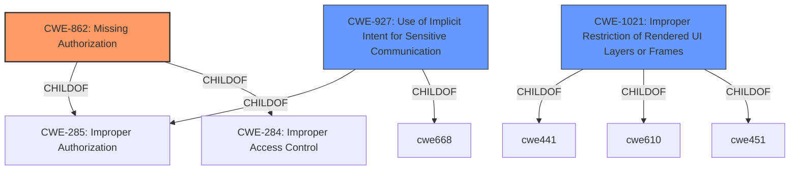

# Analysis for CVE-2020-0440

# Summary
| CWE ID  | CWE Name                                                                                                | Confidence | CWE Abstraction Level | CWE Vulnerability Mapping Label | CWE-Vulnerability Mapping Notes |
| ------- | ------------------------------------------------------------------------------------------------------- | ---------- | ----------------------- | ------------------------------- | ------------------------------- |
| CWE-862 | Missing Authorization                                                                                     | 1          | Class                   | Allowed-with-Review             | Primary CWE                     |
| CWE-1021| Improper Restriction of Rendered UI Layers or Frames                                                  | 0.6        | Base                    | Allowed                         | Secondary Candidate             |
| CWE-927 | Use of Implicit Intent for Sensitive Communication                                                        | 0.5        | Variant                 | Allowed                         | Secondary Candidate             |

## Evidence and Confidence

*   **Confidence Score:** 0.8
*   **Evidence Strength:** HIGH

## Relationship Analysis
The primary relationship influencing the CWE selection is the hierarchical structure, particularly the "ChildOf" relationship. CWE-862 (Missing Authorization) is a class-level CWE with potential base-level children for more specific cases. While the description points to a **missing permission check**, it does not specify further details. Therefore, the class-level CWE-862 is deemed most appropriate.

## Vulnerability Chain
The vulnerability chain consists of a **missing permission check** which leads to the creation of a trusted virtual display, resulting in a local escalation of privilege.

Root Cause: **Missing permission check** (CWE-862)
Impact: Creation of a trusted virtual display, leading to local privilege escalation

## Summary of Analysis
The initial analysis identified a **missing permission check** as the root cause, pointing towards authorization-related CWEs.

The final assessment is primarily based on the provided evidence, specifically the "Vulnerability Description Key Phrases" section and the "CVE Reference Links Content Summary" which explicitly mentions a **missing permission check**.

> Vulnerability Description Key Phrases
> -   **rootcause:** **missing permission check**

> CVE Reference Links Content Summary
> *   **Root Cause of Vulnerability:** The vulnerability stems from a missing permission check when creating a trusted display. Specifically, the system incorrectly allowed a virtual display to be created as "trusted" without the necessary checks.

CWE-862 aligns with this description, as it directly addresses the absence of authorization checks. The relationships of CWE-862 as a child of CWE-285 (Improper Authorization) and CWE-284 (Improper Access Control) further solidify its relevance.

While CWE-1021 (Improper Restriction of Rendered UI Layers or Frames) and CWE-927 (Use of Implicit Intent for Sensitive Communication) were considered, they did not directly address the root cause of the vulnerability, which is the **missing permission check**.

CWE-862 is selected because it is the most appropriate class-level representation of the **missing authorization** issue.

Relevant CWE Information:

# Enhanced Context (25 CWEs)
The following CWEs were identified as potentially relevant to this vulnerability:

## CWE-404: Improper Resource Shutdown or Release
**Abstraction Level**: Class
**Similarity Score**: 0.79

## CWE-667: Improper Locking
**Abstraction Level**: Class
**Similarity Score**: 0.78

## CWE-362: Concurrent Execution using Shared Resource with Improper Synchronization ('Race Condition')
**Abstraction Level**: Class
**Similarity Score**: 0.78

## CWE-405: Asymmetric Resource Consumption (Amplification)
**Abstraction Level**: Class
**Similarity Score**: 0.77

## CWE-226: Sensitive Information in Resource Not Removed Before Reuse
**Abstraction Level**: Base
**Similarity Score**: 0.77

## CWE-789: Memory Allocation with Excessive Size Value
**Abstraction Level**: Variant
**Similarity Score**: 0.77

## CWE-754: Improper Check for Unusual or Exceptional Conditions
**Abstraction Level**: Class
**Similarity Score**: 0.77

## CWE-909: Missing Initialization of Resource
**Abstraction Level**: Class
**Similarity Score**: 0.76

## CWE-908: Use of Uninitialized Resource
**Abstraction Level**: Base
**Similarity Score**: 0.76

## CWE-366: Race Condition within a Thread
**Abstraction Level**: Base
**Similarity Score**: 0.75

## CWE-941: Incorrectly Specified Destination in a Communication Channel
**Abstraction Level**: Base
**Similarity Score**: 6414.07

## CWE-927: Use of Implicit Intent for Sensitive Communication
**Abstraction Level**: Variant
**Similarity Score**: 6127.22

## CWE-667: Improper Locking
**Abstraction Level**: Class
**Similarity Score**: 6055.61

## CWE-362: Concurrent Execution using Shared Resource with Improper Synchronization ('Race Condition')
**Abstraction Level**: Class
**Similarity Score**: 6035.76

## CWE-367: Time-of-check Time-of-use (TOCTOU) Race Condition
**Abstraction Level**: Base
**Similarity Score**: 6024.13

## CWE-476: NULL Pointer Dereference
**Abstraction Level**: base
**Similarity Score**: 4.33

## CWE-1284: Improper Validation of Specified Quantity in Input
**Abstraction Level**: base
**Similarity Score**: 4.33

## CWE-1325: Improperly Controlled Sequential Memory Allocation
**Abstraction Level**: base
**Similarity Score**: 3.57

## CWE-770: Allocation of Resources Without Limits or Throttling
**Abstraction Level**: base
**Similarity Score**: 3.49

## CWE-190: Integer Overflow or Wraparound
**Abstraction Level**: base
**Similarity Score**: 3.42

## CWE-416: Use After Free
**Abstraction Level**: variant
**Similarity Score**: 3.24

## CWE-941: Incorrectly Specified Destination in a Communication Channel
**Abstraction Level**: Base
**Similarity Score**: 2.89

## CWE-609: Double-Checked Locking
**Abstraction Level**: base
**Similarity Score**: 2.87

## CWE-364: Signal Handler Race Condition
**Abstraction Level**: base
**Similarity Score**: 2.87

## CWE-1265: Unintended Reentrant Invocation of Non-reentrant Code Via Nested Calls
**Abstraction Level**: base
**Similarity Score**: 2.87

### Other CWEs Considered and Rejected:
- CWE-404, CWE-667, CWE-362, CWE-405, CWE-226, CWE-789, CWE-754, CWE-909, CWE-908, CWE-366, CWE-941, CWE-367, CWE-476, CWE-1284, CWE-1325, CWE-770, CWE-190, CWE-416, CWE-609, CWE-364, CWE-1265: These CWEs were considered but ultimately rejected as they did not directly address the root cause of the vulnerability, which is the **missing permission check**. They cover different types of weaknesses such as resource management issues, race conditions, memory errors, and communication channel problems.

# Enhanced Query for CVE-2020-0440

## Vulnerability Description
In createVirtualDisplay of DisplayManagerService.java, there is a possible way to create a trusted virtual display due to a **missing permission check**. This could lead to local escalation of privilege with no additional execution privileges needed. User interaction is not needed for exploitation.Product AndroidVersions Android-11Android ID A-162627132

### Vulnerability Description Key Phrases
- **rootcause:** **missing permission check**
- **impact:** create trusted virtual display
- **product:** Android
- **version:** 11
- **component:** createVirtualDisplay of DisplayManagerService.java

## CVE Reference Links Content Summary
Based on the provided information, here's an analysis of CVE-2020-0440:

**CVE-2020-0440**

*   **Root Cause of Vulnerability:** The vulnerability stems from a missing permission check when creating a trusted display. Specifically, the system incorrectly allowed a virtual display to be created as "trusted" without the necessary checks.

*   **Weaknesses/Vulnerabilities Present:**
    *   **Missing Permission Check:** The core issue is the lack of proper validation or permission enforcement when creating a trusted virtual display.
    *   **Incorrect Flag Handling:** The system incorrectly handled the `FLAG_TRUSTED` flag for virtual displays, allowing them to be created as trusted without authorization.

*  **Impact of Exploitation:**
    *   **Elevation of Privilege:** A malicious application could exploit this by creating a trusted virtual display. This could potentially allow the attacker to gain control of the display focus without user interaction. Specifically, a malicious app could launch an activity on the virtual display, gaining focus without any user interaction.
    *   **Bypass User Interaction:** This vulnerability would bypass normal user interaction requirements for gaining focus on the display, allowing unauthorized access and control.

*   **Attack Vectors:**
    *   **Local Malicious Application:** A locally installed malicious application can exploit this vulnerability by creating a virtual display and setting it as trusted.

*   **Required Attacker Capabilities/Position:**
    *   The attacker needs to have a malicious application installed on the device.
    *   The malicious application requires the ability to create virtual displays.

**Technical Details:**

*   The fix involves checking the `FLAG_TRUSTED` flag when creating virtual displays and ensuring that only authorized processes can create trusted displays.

*   The commit log from `android.googlesource.com_88e5bd91_20250119_133650.html` indicates that the vulnerability was found in the `VrDisplayTest`, where system-created displays were being incorrectly registered as "trusted displays".

*   The fix ensures that the created virtual display is a "trusted display" by including the `FLAG_TRUSTED` flag.

*   The commit log from `android.googlesource.com_6f51f972_20250119_133650.html` also references the requirement of a permission to create a trusted display and includes test cases to verify the fix.

**Additional Notes**
*   The commit logs from `android.googlesource.com_69253b3b_20250119_133649.html` appear unrelated to CVE-2020-0440 as it addresses the immutability of `PendingIntent` in `WallpaperMS` binding and does not involve virtual displays or trusted display creation.
*   The Android Security Bulletin from `source.android.com_ac61c3aa_20250119_115017.html` references CVE-2020-0440 as an Elevation of Privilege (EoP) vulnerability in the Framework component, with a High severity rating. This confirms the nature and severity of the vulnerability.

**Summary**
The vulnerability allowed a malicious app to gain focus without user interaction through creating and leveraging a trusted virtual display and it is mitigated by properly handling the  `FLAG_TRUSTED` flag and enforcing necessary permission checks.

## Retriever Results

### Top Combined Results

| Rank | CWE ID | Name | Abstraction | Usage  | Retrievers | Individual Scores |
|------|--------|------|-------------|-------|------------|-------------------|
| 1 | 862 | Missing Authorization | Class | Allowed-with-Review | sparse | 0.471 |
| 2 | 1021 | Improper Restriction of Rendered UI Layers or Frames | Base | Allowed | sparse | 0.421 |
| 3 | 223 | Omission of Security-relevant Information | Base | Allowed | sparse | 0.384 |
| 4 | 927 | Use of Implicit Intent for Sensitive Communication | Variant | Allowed | sparse | 0.372 |
| 5 | 667 | Improper Locking | Class | Allowed-with-Review | sparse | 0.369 |
| 6 | 925 | Improper Verification of Intent by Broadcast Receiver | Variant | Allowed | dense | 0.484 |
| 7 | 941 | Incorrectly Specified Destination in a Communication Channel | Base | Allowed | graph | 0.002 |
| 8 | 908 | Use of Uninitialized Resource | Base | Allowed | sparse | 0.367 |
| 9 | 362 | Concurrent Execution using Shared Resource with Improper Synchronization ('Race Condition') | Class | Allowed-with-Review | sparse | 0.360 |
| 10 | 770 | Allocation of Resources Without Limits or Throttling | Base | Allowed | sparse | 0.360 |

# Complete CWE Specifications

## CWE-862: Missing Authorization
**Abstraction:** Class
**Status:** Incomplete

### Description
The product does not perform an authorization check when an actor attempts to access a resource or perform an action.

### Extended Description
Not provided

### Alternative Terms
AuthZ: "AuthZ" is typically used as an abbreviation of "authorization" within the web application security community. It is distinct from "AuthN" (or, sometimes, "AuthC") which is an abbreviation of "authentication." The use of "Auth" as an abbreviation is discouraged, since it could be used for either authentication or authorization.

### Relationships
ChildOf -> CWE-285
ChildOf -> CWE-284

### Mapping Guidance
**Usage:** Allowed-with-Review
**Rationale:** This CWE entry is a Class and might have Base-level children that would be more appropriate
**Comments:** Examine children of this entry to see if there is a better fit
**Reasons:**
- Abstraction

### Additional Notes
**[Terminology]** Assuming a user with a given identity, authorization is the process of determining whether that user can access a given resource, based on the user's privileges and any permissions or other access-control specifications that apply to the resource.

### Observed Examples
- **CVE-2022-24730:** Go-based continuous deployment product does not check that a user has certain privileges to update or create an app, allowing adversaries to read sensitive repository information
- **CVE-2009-3168:** Web application does not restrict access to admin scripts, allowing authenticated users to reset administrative passwords.
- **CVE-2009-3597:** Web application stores database file under the web root with insufficient access control (CWE-219), allowing direct request.

## CWE-1021: Improper Restriction of Rendered UI Layers or Frames
**Abstraction:** Base
**Status:** Incomplete

### Description
The web application does not restrict or incorrectly restricts frame objects or UI layers that belong to another application or domain, which can lead to user confusion about which interface the user is interacting with.

### Extended Description
A web application is expected to place restrictions on whether it is allowed to be rendered within frames, iframes, objects, embed or applet elements. Without the restrictions, users can be tricked into interacting with the application when they were not intending to.

### Alternative Terms
Clickjacking
UI Redress Attack
Tapjacking: "Tapjacking" is similar to clickjacking, except it is used for mobile applications in which the user "taps" the application instead of performing a mouse click.

### Relationships
ChildOf -> CWE-441
ChildOf -> CWE-610
ChildOf -> CWE-451

### Mapping Guidance
**Usage:** Allowed
**Rationale:** This CWE entry is at the Base level of abstraction, which is a preferred level of abstraction for mapping to the root causes of vulnerabilities.
**Comments:** Carefully read both the name and description to ensure that this mapping is an appropriate fit. Do not try to 'force' a mapping to a lower-level Base/Variant simply to comply with this preferred level of abstraction.
**Reasons:**
- Acceptable-Use

### Observed Examples
- **CVE-2017-7440:** E-mail preview feature in a desktop application allows clickjacking attacks via a crafted e-mail message
- **CVE-2017-5697:** Hardware/firmware product has insufficient clickjacking protection in its web user interface
- **CVE-2017-4015:** Clickjacking in data-loss prevention product via HTTP response header.

## CWE-223: Omission of Security-relevant Information
**Abstraction:** Base
**Status:** Draft

### Description
The product does not record or display information that would be important for identifying the source or nature of an attack, or determining if an action is safe.

### Extended Description
Not provided

### Alternative Terms
None

### Relationships
ChildOf -> CWE-221

### Mapping Guidance
**Usage:** Allowed
**Rationale:** This CWE entry is at the Base level of abstraction, which is a preferred level of abstraction for mapping to the root causes of vulnerabilities.
**Comments:** Carefully read both the name and description to ensure that this mapping is an appropriate fit. Do not try to 'force' a mapping to a lower-level Base/Variant simply to comply with this preferred level of abstraction.
**Reasons:**
- Acceptable-Use

### Observed Examples
- **CVE-1999-1029:** Login attempts are not recorded if the user disconnects before the maximum number of tries.
- **CVE-2002-1839:** Sender's IP address not recorded in outgoing e-mail.
- **CVE-2000-0542:** Failed authentication attempts are not recorded if later attempt succeeds.

## CWE-927: Use of Implicit Intent for Sensitive Communication
**Abstraction:** Variant
**Status:** Incomplete

### Description
The Android application uses an implicit intent for transmitting sensitive data to other applications.

### Extended Description

Since an implicit intent does not specify a particular application to receive the data, any application can process the intent by using an Intent Filter for that intent. This can allow untrusted applications to obtain sensitive data. There are two variations on the standard broadcast intent, ordered and sticky.

Ordered broadcast intents are delivered to a series of registered receivers in order of priority as declared by the Receivers. A malicious receiver can give itself a high priority and cause a denial of service by stopping the broadcast from propagating further down the chain. There is also the possibility of malicious data modification, as a receiver may also alter the data within the Intent before passing it on to the next receiver. The downstream components have no way of asserting that the data has not been altered earlier in the chain.

Sticky broadcast intents remain accessible after the initial broadcast. An old sticky intent will be broadcast again to any new receivers that register for it in the future, greatly increasing the chances of information exposure over time. Also, sticky broadcasts cannot be protected by permissions that may apply to other kinds of intents.

In addition, any broadcast intent may include a URI that references data that the receiving component does not normally have the privileges to access. The sender of the intent can include special privileges that grant the receiver read or write access to the specific URI included in the intent. A malicious receiver that intercepts this intent will also gain those privileges and be able to read or write the resource at the specified URI.

### Alternative Terms
None

### Relationships
ChildOf -> CWE-285
ChildOf -> CWE-668

### Mapping Guidance
**Usage:** Allowed
**Rationale:** This CWE entry is at the Variant level of abstraction, which is a preferred level of abstraction for mapping to the root causes of vulnerabilities.
**Comments:** Carefully read both the name and description to ensure that this mapping is an appropriate fit. Do not try to 'force' a mapping to a lower-level Base/Variant simply to comply with this preferred level of abstraction.
**Reasons:**
- Acceptable-Use

### Observed Examples
- **CVE-2022-4903:** An Android application does not use FLAG_IMMUTABLE when creating a PendingIntent.

## CWE-667: Improper Locking
**Abstraction:** Class
**Status:** Draft

### Description
The product does not properly acquire or release a lock on a resource, leading to unexpected resource state changes and behaviors.

### Extended Description

Locking is a type of synchronization behavior that ensures that multiple independently-operating processes or threads do not interfere with each other when accessing the same resource. All processes/threads are expected to follow the same steps for locking. If these steps are not followed precisely - or if no locking is done at all - then another process/thread could modify the shared resource in a way that is not visible or predictable to the original process. This can lead to data or memory corruption, denial of service, etc.

### Alternative Terms
None

### Relationships
ChildOf -> CWE-662
ChildOf -> CWE-662
ChildOf -> CWE-662
ChildOf -> CWE-662

### Mapping Guidance
**Usage:** Allowed-with-Review
**Rationale:** This CWE entry is a Class and might have Base-level children that would be more appropriate
**Comments:** Examine children of this entry to see if there is a better fit
**Reasons:**
- Abstraction

### Additional Notes
**[Maintenance]** Deeper research is necessary for synchronization and related mechanisms, including locks, mutexes, semaphores, and other mechanisms. Multiple entries are dependent on this research, which includes relationships to concurrency, race conditions, reentrant functions, etc. CWE-662 and its children - including CWE-667, CWE-820, CWE-821, and others - may need to be modified significantly, along with their relationships.

### Observed Examples
- **CVE-2021-1782:** Chain: improper locking (CWE-667) leads to race condition (CWE-362), as exploited in the wild per CISA KEV.
- **CVE-2009-0935:** Attacker provides invalid address to a memory-reading function, causing a mutex to be unlocked twice
- **CVE-2010-4210:** function in OS kernel unlocks a mutex that was not previously locked, causing a panic or overwrite of arbitrary memory.

## CWE-925: Improper Verification of Intent by Broadcast Receiver
**Abstraction:** Variant
**Status:** Incomplete

### Description
The Android application uses a Broadcast Receiver that receives an Intent but does not properly verify that the Intent came from an authorized source.

### Extended Description
Certain types of Intents, identified by action string, can only be broadcast by the operating system itself, not by third-party applications. However, when an application registers to receive these implicit system intents, it is also registered to receive any explicit intents. While a malicious application cannot send an implicit system intent, it can send an explicit intent to the target application, which may assume that any received intent is a valid implicit system intent and not an explicit intent from another application. This may lead to unintended behavior.

### Alternative Terms
Intent Spoofing

### Relationships
ChildOf -> CWE-940

### Mapping Guidance
**Usage:** Allowed
**Rationale:** This CWE entry is at the Variant level of abstraction, which is a preferred level of abstraction for mapping to the root causes of vulnerabilities.
**Comments:** Carefully read both the name and description to ensure that this mapping is an appropriate fit. Do not try to 'force' a mapping to a lower-level Base/Variant simply to comply with this preferred level of abstraction.
**Reasons:**
- Acceptable-Use

### Additional Notes
**[Maintenance]** This entry will be made more comprehensive in later CWE versions.

## CWE-941: Incorrectly Specified Destination in a Communication Channel
**Abstraction:** Base
**Status:** Incomplete

### Description
The product creates a communication channel to initiate an outgoing request to an actor, but it does not correctly specify the intended destination for that actor.

### Extended Description

Attackers at the destination may be able to spoof trusted servers to steal data or cause a denial of service.

There are at least two distinct weaknesses that can cause the product to communicate with an unintended destination:

  - If the product allows an attacker to control which destination is specified, then the attacker can cause it to connect to an untrusted or malicious destination. For example, because UDP is a connectionless protocol, UDP packets can be spoofed by specifying a false source address in the packet; when the server receives the packet and sends a reply, it will specify a destination by using the source of the incoming packet - i.e., the false source. The server can then be tricked into sending traffic to the wrong host, which is effective for hiding the real source of an attack and for conducting a distributed denial of service (DDoS). As another example, server-side request forgery (SSRF) and XML External Entity (XXE) can be used to trick a server into making outgoing requests to hosts that cannot be directly accessed by the attacker due to firewall restrictions.

  - If the product incorrectly specifies the destination, then an attacker who can control this destination might be able to spoof trusted servers. While the most common occurrence is likely due to misconfiguration by an administrator, this can be resultant from other weaknesses. For example, the product might incorrectly parse an e-mail or IP address and send sensitive data to an unintended destination. As another example, an Android application may use a "sticky broadcast" to communicate with a receiver for a particular application, but since sticky broadcasts can be processed by *any* receiver, this can allow a malicious application to access restricted data that was only intended for a different application.

### Alternative Terms
None

### Relationships
ChildOf -> CWE-923
CanPrecede -> CWE-406

### Mapping Guidance
**Usage:** Allowed
**Rationale:** This CWE entry is at the Base level of abstraction, which is a preferred level of abstraction for mapping to the root causes of vulnerabilities.
**Comments:** Carefully read both the name and description to ensure that this mapping is an appropriate fit. Do not try to 'force' a mapping to a lower-level Base/Variant simply to comply with this preferred level of abstraction.
**Reasons:**
- Acceptable-Use

### Observed Examples
- **CVE-2013-5211:** composite: NTP feature generates large responses (high amplification factor) with spoofed UDP source addresses.
- **CVE-1999-0513:** Classic "Smurf" attack, using spoofed ICMP packets to broadcast addresses.
- **CVE-1999-1379:** DNS query with spoofed source address causes more traffic to be returned to spoofed address than was sent by the attacker.

## CWE-908: Use of Uninitialized Resource
**Abstraction:** Base
**Status:** Incomplete

### Description
The product uses or accesses a resource that has not been initialized.

### Extended Description
When a resource has not been properly initialized, the product may behave unexpectedly. This may lead to a crash or invalid memory access, but the consequences vary depending on the type of resource and how it is used within the product.

### Alternative Terms
None

### Relationships
ChildOf -> CWE-665
ChildOf -> CWE-665

### Mapping Guidance
**Usage:** Allowed
**Rationale:** This CWE entry is at the Base level of abstraction, which is a preferred level of abstraction for mapping to the root causes of vulnerabilities.
**Comments:** Carefully read both the name and description to ensure that this mapping is an appropriate fit. Do not try to 'force' a mapping to a lower-level Base/Variant simply to comply with this preferred level of abstraction.
**Reasons:**
- Acceptable-Use

### Observed Examples
- **CVE-2019-9805:** Chain: Creation of the packet client occurs before initialization is complete (CWE-696) resulting in a read from uninitialized memory (CWE-908), causing memory corruption.
- **CVE-2008-4197:** Use of uninitialized memory may allow code execution.
- **CVE-2008-2934:** Free of an uninitialized pointer leads to crash and possible code execution.

## CWE-362: Concurrent Execution using Shared Resource with Improper Synchronization ('Race Condition')
**Abstraction:** Class
**Status:** Draft

### Description
The product contains a concurrent code sequence that requires temporary, exclusive access to a shared resource, but a timing window exists in which the shared resource can be modified by another code sequence operating concurrently.

### Extended Description

A race condition occurs within concurrent environments, and it is effectively a property of a code sequence. Depending on the context, a code sequence may be in the form of a function call, a small number of instructions, a series of program invocations, etc.

A race condition violates these properties, which are closely related:

  - Exclusivity - the code sequence is given exclusive access to the shared resource, i.e., no other code sequence can modify properties of the shared resource before the original sequence has completed execution.

  - Atomicity - the code sequence is behaviorally atomic, i.e., no other thread or process can concurrently execute the same sequence of instructions (or a subset) against the same resource.

A race condition exists when an "interfering code sequence" can still access the shared resource, violating exclusivity.

The interfering code sequence could be "trusted" or "untrusted." A trusted interfering code sequence occurs within the product; it cannot be modified by the attacker, and it can only be invoked indirectly. An untrusted interfering code sequence can be authored directly by the attacker, and typically it is external to the vulnerable product.

### Alternative Terms
Race Condition

### Relationships
ChildOf -> CWE-691
CanPrecede -> CWE-416
CanPrecede -> CWE-476

### Mapping Guidance
**Usage:** Allowed-with-Review
**Rationale:** This CWE entry is a Class and might have Base-level children that would be more appropriate
**Comments:** Examine children of this entry to see if there is a better fit
**Reasons:**
- Abstraction

### Additional Notes
**[Maintenance]** The relationship between race conditions and synchronization problems (CWE-662) needs to be further developed. They are not necessarily two perspectives of the same core concept, since synchronization is only one technique for avoiding race conditions, and synchronization can be used for other purposes besides race condition prevention.

**[Research Gap]** Race conditions in web applications are under-studied and probably under-reported. However, in 2008 there has been growing interest in this area.

**[Research Gap]** Much of the focus of race condition research has been in Time-of-check Time-of-use (TOCTOU) variants (CWE-367), but many race conditions are related to synchronization problems that do not necessarily require a time-of-check.

**[Research Gap]** From a classification/taxonomy perspective, the relationships between concurrency and program state need closer investigation and may be useful in organizing related issues.

### Observed Examples
- **CVE-2022-29527:** Go application for cloud management creates a world-writable sudoers file that allows local attackers to inject sudo rules and escalate privileges to root by winning a race condition.
- **CVE-2021-1782:** Chain: improper locking (CWE-667) leads to race condition (CWE-362), as exploited in the wild per CISA KEV.
- **CVE-2021-0920:** Chain: mobile platform race condition (CWE-362) leading to use-after-free (CWE-416), as exploited in the wild per CISA KEV.

## CWE-770: Allocation of Resources Without Limits or Throttling
**Abstraction:** Base
**Status:** Incomplete

### Description
The product allocates a reusable resource or group of resources on behalf of an actor without imposing any restrictions on the size or number of resources that can be allocated, in violation of the intended security policy for that actor.

### Extended Description

Code frequently has to work with limited resources, so programmers must be careful to ensure that resources are not consumed too quickly, or too easily. Without use of quotas, resource limits, or other protection mechanisms, it can be easy for an attacker to consume many resources by rapidly making many requests, or causing larger resources to be used than is needed. When too many resources are allocated, or if a single resource is too large, then it can prevent the code from working correctly, possibly leading to a denial of service.

### Alternative Terms
None

### Relationships
ChildOf -> CWE-400
ChildOf -> CWE-665
ChildOf -> CWE-400

### Mapping Guidance
**Usage:** Allowed
**Rationale:** This CWE entry is at the Base level of abstraction, which is a preferred level of abstraction for mapping to the root causes of vulnerabilities.
**Comments:** Carefully read both the name and description to ensure that this mapping is an appropriate fit. Do not try to 'force' a mapping to a lower-level Base/Variant simply to comply with this preferred level of abstraction.
**Reasons:**
- Acceptable-Use

### Additional Notes
**[Relationship]** This entry is different from uncontrolled resource consumption (CWE-400) in that there are other weaknesses that are related to inability to control resource consumption, such as holding on to a resource too long after use, or not correctly keeping track of active resources so that they can be managed and released when they are finished (CWE-771).

**[Theoretical]** Vulnerability theory is largely about how behaviors and resources interact. "Resource exhaustion" can be regarded as either a consequence or an attack, depending on the perspective. This entry is an attempt to reflect one of the underlying weaknesses that enable these attacks (or consequences) to take place.

### Observed Examples
- **CVE-2022-21668:** Chain: Python library does not limit the resources used to process images that specify a very large number of bands (CWE-1284), leading to excessive memory consumption (CWE-789) or an integer overflow (CWE-190).
- **CVE-2009-4017:** Language interpreter does not restrict the number of temporary files being created when handling a MIME request with a large number of parts..
- **CVE-2009-2726:** Driver does not use a maximum width when invoking sscanf style functions, causing stack consumption.

