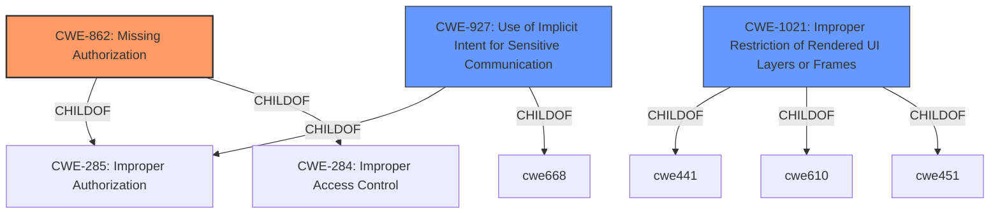

# Analysis Report for CVE-2020-0440

# Vulnerability Analysis Report: CVE-2020-0440

## Description


## Analysis (with Relationship Data)

# Summary
| CWE ID  | CWE Name                                                                                                | Confidence | CWE Abstraction Level | CWE Vulnerability Mapping Label | CWE-Vulnerability Mapping Notes |
| ------- | ------------------------------------------------------------------------------------------------------- | ---------- | ----------------------- | ------------------------------- | ------------------------------- |
| CWE-862 | Missing Authorization                                                                                     | 1          | Class                   | Allowed-with-Review             | Primary CWE                     |
| CWE-1021| Improper Restriction of Rendered UI Layers or Frames                                                  | 0.6        | Base                    | Allowed                         | Secondary Candidate             |
| CWE-927 | Use of Implicit Intent for Sensitive Communication                                                        | 0.5        | Variant                 | Allowed                         | Secondary Candidate             |

## Evidence and Confidence

*   **Confidence Score:** 0.8
*   **Evidence Strength:** HIGH

## Relationship Analysis
The primary relationship influencing the CWE selection is the hierarchical structure, particularly the "ChildOf" relationship. CWE-862 (Missing Authorization) is a class-level CWE with potential base-level children for more specific cases. While the description points to a **missing permission check**, it does not specify further details. Therefore, the class-level CWE-862 is deemed most appropriate.



## Vulnerability Chain
The vulnerability chain consists of a **missing permission check** which leads to the creation of a trusted virtual display, resulting in a local escalation of privilege.

Root Cause: **Missing permission check** (CWE-862)
Impact: Creation of a trusted virtual display, leading to local privilege escalation

## Summary of Analysis
The initial analysis identified a **missing permission check** as the root cause, pointing towards authorization-related CWEs.

The final assessment is primarily based on the provided evidence, specifically the "Vulnerability Description Key Phrases" section and the "CVE Reference Links Content Summary" which explicitly mentions a **missing permission check**.

> Vulnerability Description Key Phrases
> -   **rootcause:** **missing permission check**

> CVE Reference Links Content Summary
> *   **Root Cause of Vulnerability:** The vulnerability stems from a missing permission check when creating a trusted display. Specifically, the system incorrectly allowed a virtual display to be created as "trusted" without the necessary checks.

CWE-862 aligns with this description, as it directly addresses the absence of authorization checks. The relationships of CWE-862 as a child of CWE-285 (Improper Authorization) and CWE-284 (Improper Access Control) further solidify its relevance.

While CWE-1021 (Improper Restriction of Rendered UI Layers or Frames) and CWE-927 (Use of Implicit Intent for Sensitive Communication) were considered, they did not directly address the root cause of the vulnerability, which is the **missing permission check**.

CWE-862 is selected because it is the most appropriate class-level representation of the **missing authorization** issue.

Relevant CWE Information:

# Enhanced Context (25 CWEs)
The following CWEs were identified as potentially relevant to this vulnerability:

## CWE-404: Improper Resource Shutdown or Release
**Abstraction Level**: Class
**Similarity Score**: 0.79

## CWE-667: Improper Locking
**Abstraction Level**: Class
**Similarity Score**: 0.78

## CWE-362: Concurrent Execution using Shared Resource with Improper Synchronization ('Race Condition')
**Abstraction Level**: Class
**Similarity Score**: 0.78

## CWE-405: Asymmetric Resource Consumption (Amplification)
**Abstraction Level**: Class
**Similarity Score**: 0.77

## CWE-226: Sensitive Information in Resource Not Removed Before Reuse
**Abstraction Level**: Base
**Similarity Score**: 0.77

## CWE-789: Memory Allocation with Excessive Size Value
**Abstraction Level**: Variant
**Similarity Score**: 0.77

## CWE-754: Improper Check for Unusual or Exceptional Conditions
**Abstraction Level**: Class
**Similarity Score**: 0.77

## CWE-909: Missing Initialization of Resource
**Abstraction Level**: Class
**Similarity Score**: 0.76

## CWE-908: Use of Uninitialized Resource
**Abstraction Level**: Base
**Similarity Score**: 0.76

## CWE-366: Race Condition within a Thread
**Abstraction Level**: Base
**Similarity Score**: 0.75

## CWE-941: Incorrectly Specified Destination in a Communication Channel
**Abstraction Level**: Base
**Similarity Score**: 6414.07

## CWE-927: Use of Implicit Intent for Sensitive Communication
**Abstraction Level**: Variant
**Similarity Score**: 6127.22

## CWE-667: Improper Locking
**Abstraction Level**: Class
**Similarity Score**: 6055.61

## CWE-362: Concurrent Execution using Shared Resource with Improper Synchronization ('Race Condition')
**Abstraction Level**: Class
**Similarity Score**: 6035.76

## CWE-367: Time-of-check Time-of-use (TOCTOU) Race Condition
**Abstraction Level**: Base
**Similarity Score**: 6024.13

## CWE-476: NULL Pointer Dereference
**Abstraction Level**: base
**Similarity Score**: 4.33

## CWE-1284: Improper Validation of Specified Quantity in Input
**Abstraction Level**: base
**Similarity Score**: 4.33

## CWE-1325: Improperly Controlled Sequential Memory Allocation
**Abstraction Level**: base
**Similarity Score**: 3.57

## CWE-770: Allocation of Resources Without Limits or Throttling
**Abstraction Level**: base
**Similarity Score**: 3.49

## CWE-190: Integer Overflow or Wraparound
**Abstraction Level**: base
**Similarity Score**: 3.42

## CWE-416: Use After Free
**Abstraction Level**: variant
**Similarity Score**: 3.24

## CWE-941: Incorrectly Specified Destination in a Communication Channel
**Abstraction Level**: Base
**Similarity Score**: 2.89

## CWE-609: Double-Checked Locking
**Abstraction Level**: base
**Similarity Score**: 2.87

## CWE-364: Signal Handler Race Condition
**Abstraction Level**: base
**Similarity Score**: 2.87

## CWE-1265: Unintended Reentrant Invocation of Non-reentrant Code Via Nested Calls
**Abstraction Level**: base
**Similarity Score**: 2.87

### Other CWEs Considered and Rejected:
- CWE-404, CWE-667, CWE-362, CWE-405, CWE-226, CWE-789, CWE-754, CWE-909, CWE-908, CWE-366, CWE-941, CWE-367, CWE-476, CWE-1284, CWE-1325, CWE-770, CWE-190, CWE-416, CWE-609, CWE-364, CWE-1265: These CWEs were considered but ultimately rejected as they did not directly address the root cause of the vulnerability, which is the **missing permission check**. They cover different types of weaknesses such as resource management issues, race conditions, memory errors, and communication channel problems.


## CWE Relationship Analysis

Current CWEs represent these abstraction levels: .


### Vulnerability Chain Analysis

**Chain starting from CWE-754:**
- 754 (Improper Check for Unusual or Exceptional Conditions) - ROOT


**Chain starting from CWE-404:**
- 404 (Improper Resource Shutdown or Release) - ROOT


### CWE Relationship Diagram

```mermaid
graph TD
    classDef primary fill:#f96,stroke:#333,stroke-width:2px
    classDef secondary fill:#69f,stroke:#333
    classDef tertiary fill:#9e9,stroke:#333
```


*Report generated on 2025-04-02 02:00:19*
