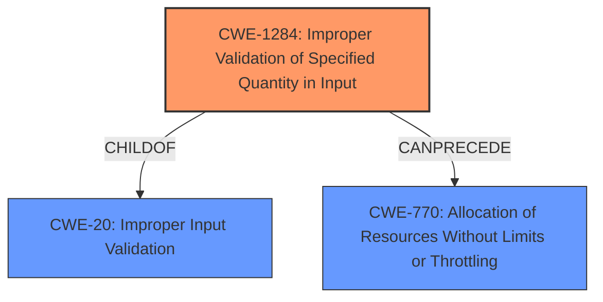

# Analysis for CVE-2020-0441

# Summary
| CWE ID  | CWE Name                                                                                                 | Confidence | CWE Abstraction Level | CWE Vulnerability Mapping Label | CWE-Vulnerability Mapping Notes |
| :-------- | :--------------------------------------------------------------------------------------------------------- | :---------- | :---------------------- | :------------------------------ | :------------------------------ |
| CWE-1284 | Improper Validation of Specified Quantity in Input                                                       | 0.9        | Base                    | Primary                         | Allowed                         |
| CWE-770  | Allocation of Resources Without Limits or Throttling                                                      | 0.75       | Base                    | Secondary                       | Allowed                         |
| CWE-20   | Improper Input Validation                                                                                 | 0.5        | Class                   | Secondary                       | Discouraged                     |

## Evidence and Confidence

*   **Confidence Score:** 0.8
*   **Evidence Strength:** HIGH

## Relationship Analysis
The primary CWE is CWE-1284, which focuses on the improper validation of specified quantities in input. It is a child of CWE-20 (Improper Input Validation). CWE-770 (Allocation of Resources Without Limits or Throttling) can be caused by CWE-1284. CWE-20 is a general class of weakness and is discouraged from being used directly if a more specific CWE is available.

## Vulnerability Chain
The vulnerability chain starts with **improper input validation** (CWE-1284), leading to a resource exhaustion vulnerability. The **improper validation** allows the allocation of resources without limits or throttling (CWE-770), which results in a remote denial of service.

## Summary of Analysis
Initially, the description indicates **improper input validation** as the root cause, leading to resource exhaustion and remote denial of service. The key phrase in the vulnerability description is "**improper input validation**". The CVE Reference Links Content Summary supports this by stating that the vulnerability is caused by a "**lack of proper sanitization of notification text fields**".

The Retriever Results suggest CWE-1284 (Improper Validation of Specified Quantity in Input) and CWE-770 (Allocation of Resources Without Limits or Throttling). CWE-1284 aligns well because it deals with the **improper validation** of input that specifies a quantity. The description mentions resource exhaustion, which can be related to a quantity (e.g., size of a message, number of messages). CWE-770 fits since it describes the allocation of resources without limits.

CWE-20 (Improper Input Validation) is a general class and is discouraged. Since CWE-1284 is a more specific type of **improper input validation**, it is preferred.

CWE-1284 is at the Base level, which is the preferred level of abstraction. CWE-770 is also at the Base level. CWE-20 is at the Class level.

The final assessment is based primarily on the "**improper input validation**" description, the CVE Reference Links Content Summary mentioning "**lack of proper sanitization**", and the Retriever Results pointing to CWE-1284.

The selected CWEs are at the optimal level of specificity because CWE-1284 directly addresses the **improper validation** aspect, while CWE-770 covers the resource allocation issue that results from the **improper validation**. CWE-20 is too general.

Relevant CWE Information:

# Enhanced Context (25 CWEs)

## CWE-662: Improper Synchronization
**Abstraction Level**: Class
**Similarity Score**: 0.78
**Source**: dense

**Description**:
The product utilizes multiple threads or processes to allow temporary access to a shared resource that can only be exclusive to one process at a time, but it does not properly synchronize these actions, which might cause simultaneous accesses of this resource by multiple threads or processes.

**Mapping Guidance**:
- Usage: Discouraged
- Rationale: This CWE entry is a level-1 Class (i.e., a child of a Pillar). It might have lower-level children that would be more appropriate

## CWE-366: Race Condition within a Thread
**Abstraction Level**: Base
**Similarity Score**: 0.77
**Source**: dense

**Description**:
If two threads of execution use a resource simultaneously, there exists the possibility that resources may be used while invalid, in turn making the state of execution undefined.

**Mapping Guidance**:
- Usage: Allowed
- Rationale: This CWE entry is at the Base level of abstraction, which is a preferred level of abstraction for mapping to the root causes of vulnerabilities.

## CWE-667: Improper Locking
**Abstraction Level**: Class
**Similarity Score**: 0.77
**Source**: dense

**Description**:
The product does not properly acquire or release a lock on a resource, leading to unexpected resource state changes and behaviors.

**Mapping Guidance**:
- Usage: Allowed-with-Review
- Rationale: This CWE entry is a Class and might have Base-level children that would be more appropriate

## CWE-362: Concurrent Execution using Shared Resource with Improper Synchronization ('Race Condition')
**Abstraction Level**: Class
**Similarity Score**: 0.77
**Source**: dense

**Description**:
The product contains a concurrent code sequence that requires temporary, exclusive access to a shared resource, but a timing window exists in which the shared resource can be modified by another code sequence operating concurrently.

**Mapping Guidance**:
- Usage: Allowed-with-Review
- Rationale: This CWE entry is a Class and might have Base-level children that would be more appropriate

## CWE-367: Time-of-check Time-of-use (TOCTOU) Race Condition
**Abstraction Level**: Base
**Similarity Score**: 0.76
**Source**: dense

**Description**:
The product checks the state of a resource before using that resource, but the resource's state can change between the check and the use in a way that invalidates the results of the check. This can cause the product to perform invalid actions when the resource is in an unexpected state.

**Mapping Guidance**:
- Usage: Allowed
- Rationale: This CWE entry is at the Base level of abstraction, which is a preferred level of abstraction for mapping to the root causes of vulnerabilities.

## CWE-404: Improper Resource Shutdown or Release
**Abstraction Level**: Class
**Similarity Score**: 0.75
**Source**: dense

**Description**:
The product does not release or incorrectly releases a resource before it is made available for re-use.

**Mapping Guidance**:
- Usage: Allowed-with-Review
- Rationale: This CWE entry is a Class and might have Base-level children that would be more appropriate

## CWE-1289: Improper Validation of Unsafe Equivalence in Input
**Abstraction Level**: Base
**Similarity Score**: 0.75
**Source**: dense

**Description**:
The product receives an input value that is used as a resource identifier or other type of reference, but it does not validate or incorrectly validates that the input is equivalent to a potentially-unsafe value.

**Mapping Guidance**:
- Usage: Allowed
- Rationale: This CWE entry is at the Base level of abstraction, which is a preferred level of abstraction for mapping to the root causes of vulnerabilities.

## CWE-754: Improper Check for Unusual or Exceptional Conditions
**Abstraction Level**: Class
**Similarity Score**: 0.73
**Source**: dense

**Description**:
The product does not check or incorrectly checks for unusual or exceptional conditions that are not expected to occur frequently during day to day operation of the product.

**Mapping Guidance**:
- Usage: Allowed-with-Review
- Rationale: This CWE entry is a Class and might have Base-level children that would be more appropriate

## CWE-799: Improper Control of Interaction Frequency
**Abstraction Level**: Class
**Similarity Score**: 0.73
**Source**: dense

**Description**:
The product does not properly limit the number or frequency of interactions that it has with an actor, such as the number of incoming requests.

**Mapping Guidance**:
- Usage: Allowed-with-Review
- Rationale: This CWE entry is a Class and might have Base-level children that would be more appropriate

## CWE-653: Improper Isolation or Compartmentalization
**Abstraction Level**: Class
**Similarity Score**: 0.73
**Source**: dense

**Description**:
The product does not properly compartmentalize or isolate functionality, processes, or resources that require different privilege levels, rights, or permissions.

**Mapping Guidance**: