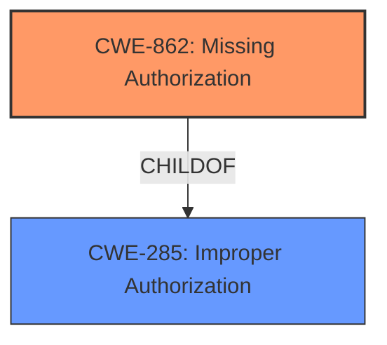

# Analysis Report for CVE-2020-0475

# Vulnerability Analysis Report: CVE-2020-0475

## Description


## Analysis (with Relationship Data)

# Summary
| CWE ID | CWE Name | Confidence | CWE Abstraction Level | CWE Vulnerability Mapping Label | CWE-Vulnerability Mapping Notes |
|---|---|---|---|---|---|
| CWE-862 | Missing Authorization | 0.9 | Class | Allowed-with-Review | Primary CWE |

## Evidence and Confidence

*   **Confidence Score:** 0.9
*   **Evidence Strength:** HIGH

## Relationship Analysis
The primary relationship influencing the decision is that CWE-862 is a Class-level CWE, suggesting a search for more specific Base or Variant-level CWEs. However, given the direct match of "**missing permission check**" to the description of CWE-862, it serves as the most appropriate mapping in the absence of a more granular option. CWE-862 is child of CWE-285 (Improper Authorization), showing a hierarchical connection.



## Vulnerability Chain
The vulnerability chain involves a **missing permission check** (CWE-862) leading to the ability to block and intercept input events.
  - **Root Cause:** Missing Authorization (CWE-862)
  - **Impact:** Block and intercept input events (Local escalation of privilege)

## Summary of Analysis
The initial assessment identified CWE-862 as the primary candidate due to the explicit mention of a "**missing permission check**" in both the vulnerability description and the CVE reference. The analysis of the provided evidence, particularly the "**rootcause: missing permission check**" from the vulnerability description key phrases and "The vulnerability is due to the lack of proper permission checks" from the CVE reference links, strongly supports this classification.

The Retriever Results also listed CWE-862 as the top candidate, further reinforcing this choice.

The decision to use CWE-862 is based on the explicit evidence available and its direct relevance to the vulnerability's root cause. While it is a Class-level CWE, the absence of more granular details prevents a more specific mapping.

Relevant CWE Information:

# Enhanced Context (25 CWEs)
The following CWEs were identified as potentially relevant to this vulnerability:

## CWE-1289: Improper Validation of Unsafe Equivalence in Input
**Abstraction Level**: Base
**Similarity Score**: 0.80
**Source**: dense

**Description**:
The product receives an input value that is used as a resource identifier or other type of reference, but it does not validate or incorrectly validates that the input is equivalent to a potentially-unsafe value.

**Mapping Guidance**:
- Usage: Allowed
- Rationale: This CWE entry is at the Base level of abstraction, which is a preferred level of abstraction for mapping to the root causes of vulnerabilities.

## CWE-807: Reliance on Untrusted Inputs in a Security Decision
**Abstraction Level**: Base
**Similarity Score**: 0.78
**Source**: dense

**Description**:
The product uses a protection mechanism that relies on the existence or values of an input, but the input can be modified by an untrusted actor in a way that bypasses the protection mechanism.

**Mapping Guidance**:
- Usage: Allowed
- Rationale: This CWE entry is at the Base level of abstraction, which is a preferred level of abstraction for mapping to the root causes of vulnerabilities.

## CWE-183: Permissive List of Allowed Inputs
**Abstraction Level**: Base
**Similarity Score**: 0.77
**Source**: dense

**Description**:
The product implements a protection mechanism that relies on a list of inputs (or properties of inputs) that are explicitly allowed by policy because the inputs are assumed to be safe, but the list is too permissive - that is, it allows an input that is unsafe, leading to resultant weaknesses.

**Mapping Guidance**:
- Usage: Allowed
- Rationale: This CWE entry is at the Base level of abstraction, which is a preferred level of abstraction for mapping to the root causes of vulnerabilities.

## CWE-1288: Improper Validation of Consistency within Input
**Abstraction Level**: Base
**Similarity Score**: 0.77
**Source**: dense

**Description**:
The product receives a complex input with multiple elements or fields that must be consistent with each other, but it does not validate or incorrectly validates that the input is actually consistent.

**Mapping Guidance**:
- Usage: Allowed
- Rationale: This CWE entry is at the Base level of abstraction, which is a preferred level of abstraction for mapping to the root causes of vulnerabilities.

## CWE-184: Incomplete List of Disallowed Inputs
**Abstraction Level**: Base
**Similarity Score**: 0.76
**Source**: dense

**Description**:
The product implements a protection mechanism that relies on a list of inputs (or properties of inputs) that are not allowed by policy or otherwise require other action to neutralize before additional processing takes place, but the list is incomplete.

**Mapping Guidance**:
- Usage: Allowed
- Rationale: This CWE entry is at the Base level of abstraction, which is a preferred level of abstraction for mapping to the root causes of vulnerabilities.

## CWE-179: Incorrect Behavior Order: Early Validation
**Abstraction Level**: Base
**Similarity Score**: 0.76
**Source**: dense

**Description**:
The product validates input before applying protection mechanisms that modify the input, which could allow an attacker to bypass the validation via dangerous inputs that only arise after the modification.

**Mapping Guidance**:
- Usage: Allowed
- Rationale: This CWE entry is at the Base level of abstraction, which is a preferred level of abstraction for mapping to the root causes of vulnerabilities.

## CWE-606: Unchecked Input for Loop Condition
**Abstraction Level**: Base
**Similarity Score**: 0.76
**Source**: dense

**Description**:
The product does not properly check inputs that are used for loop conditions, potentially leading to a denial of service or other consequences because of excessive looping.

**Mapping Guidance**:
- Usage: Allowed
- Rationale: This CWE entry is at the Base level of abstraction, which is a preferred level of abstraction for mapping to the root causes of vulnerabilities.

## CWE-754: Improper Check for Unusual or Exceptional Conditions
**Abstraction Level**: Class
**Similarity Score**: 0.75
**Source**: dense

**Description**:
The product does not check or incorrectly checks for unusual or exceptional conditions that are not expected to occur frequently during day to day operation of the product.

**Mapping Guidance**:
- Usage: Allowed-with-Review
- Rationale: This CWE entry is a Class and might have Base-level children that would be more appropriate

## CWE-667: Improper Locking
**Abstraction Level**: Class
**Similarity Score**: 0.75
**Source**: dense

**Description**:
The product does not properly acquire or release a lock on a resource, leading to unexpected resource state changes and behaviors.

**Mapping Guidance**:
- Usage: Allowed-with-Review
- Rationale: This CWE entry is a Class and might have Base-level children that would be more appropriate

## CWE-451: User Interface (UI) Misrepresentation of Critical Information
**Abstraction Level**: Class
**Similarity Score**: 0.75
**Source**: dense

**Description**:
The user interface (UI) does not properly represent critical information to the user, allowing the information - or its source - to be obscured or spoofed. This is often a component in phishing attacks.

**Mapping Guidance**:
- Usage: Allowed-with-Review
- Rationale: This CWE entry is a Class and might have Base-level children that would be more appropriate

## CWE-667: Improper Locking
**Abstraction Level**: Class
**Similarity Score**: 6326.52
**Source**: sparse

**Description**:
The product does not properly acquire or release a lock on a resource, leading to unexpected resource state changes and behaviors.

**Mapping Guidance**:
- Usage: Allowed-with-Review
- Rationale: This CWE entry is a Class and might have Base-level children that would be more appropriate

## CWE-367: Time-of-check Time-of-use (TOCTOU) Race Condition
**Abstraction Level**: Base
**Similarity Score**: 6306.71
**Source**: sparse

**Description**:
The product checks the state of a resource before using that resource, but the resource's state can change between the check and the use in a way that invalidates the results of the check. This can cause the product to perform invalid actions when the resource is in an unexpected state.

**Mapping Guidance**:
- Usage: Allowed
- Rationale: This CWE entry is at the Base level of abstraction, which is a preferred level of abstraction for mapping to the root causes of vulnerabilities.

## CWE-362: Concurrent Execution using Shared Resource with Improper Synchronization ('Race Condition')
**Abstraction Level**: Class
**Similarity Score**: 6291.97
**Source**: sparse

**Description


## CWE Relationship Analysis

Current CWEs represent these abstraction levels: .


### Vulnerability Chain Analysis

**Chain starting from CWE-754:**
- 754 (Improper Check for Unusual or Exceptional Conditions) - ROOT


**Chain starting from CWE-667:**
- 667 (Improper Locking) - ROOT


### CWE Relationship Diagram

```mermaid
graph TD
    classDef primary fill:#f96,stroke:#333,stroke-width:2px
    classDef secondary fill:#69f,stroke:#333
    classDef tertiary fill:#9e9,stroke:#333
```


*Report generated on 2025-04-02 01:42:13*
