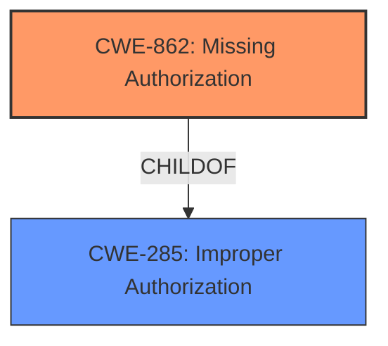

# Analysis for CVE-2020-0479

# Summary
| CWE ID | CWE Name | Confidence | CWE Abstraction Level | CWE Vulnerability Mapping Label | CWE-Vulnerability Mapping Notes |
|---|---|---|---|---|---|
| CWE-862 | Missing Authorization | 0.9 | Class | Primary | Allowed-with-Review |
| CWE-285 | Improper Authorization | 0.6 | Class | Secondary | Discouraged |

## Evidence and Confidence

*   **Confidence Score:** 0.9
*   **Evidence Strength:** HIGH

## Relationship Analysis
The primary CWE is CWE-862 **Missing Authorization**, a Class-level CWE. It falls under the parent CWE-285 **Improper Authorization**, which is also a Class-level CWE. The choice of CWE-862 is favored due to its specific focus on missing authorization checks, while CWE-285 is a more general case of incorrect authorization. The vulnerability description clearly indicates a **lack of** authorization, making CWE-862 a better fit.

## Vulnerability Chain
The vulnerability chain starts with the **missing authorization** check within the `DocumentsProvider` component. This **lack of** validation allows a malicious application to access files without user permission, ultimately leading to a local escalation of privilege.
  - Missing Authorization (CWE-862) -> Access to Files Without Permission -> Local Escalation of Privilege

## Summary of Analysis
The initial analysis pointed towards authorization-related CWEs. The vulnerability description and CVE reference links content summary highlight a **lack of** proper authorization checks in the `DocumentsProvider` component, which allows malicious applications to bypass permissions and access files without user consent.

The selection of CWE-862 is strongly supported by the evidence, which states that there is a "possible permissions bypass" because of the way `callUnchecked` in `DocumentsProvider.java` is implemented. The CVE reference links content summary confirms this by stating that the vulnerability stems from a **lack of** validation of user-supplied URIs in `DocumentsProvider` calls. Specifically, the core issue is that user-provided URIs are not adequately validated before being used by the `DocumentsProvider`.

While CWE-285 could also be considered, CWE-862 is a more specific child that accurately reflects the root cause: a **missing** authorization check. The MITRE mapping guidance for CWE-285 discourages its use when lower-level CWEs can be used instead.

The selected CWE is at the optimal level of specificity because it precisely identifies the **lack of** an authorization check as the root cause of the vulnerability.

Relevant CWE Information:

# Enhanced Context (25 CWEs)
The following CWEs were identified as potentially relevant to this vulnerability:

## CWE-404: Improper Resource Shutdown or Release
**Abstraction Level**: Class
**Similarity Score**: 0.78
**Source**: dense

**Description**:
The product does not release or incorrectly releases a resource before it is made available for re-use.
**Not Used:** This CWE focuses on resource release, which is not the primary issue in the vulnerability description. The problem lies in the **lack of** proper authorization, not in how resources are managed after use.

## CWE-667: Improper Locking
**Abstraction Level**: Class
**Similarity Score**: 0.78
**Source**: dense

**Description**:
The product does not properly acquire or release a lock on a resource, leading to unexpected resource state changes and behaviors.
**Not Used:** This CWE relates to locking mechanisms, which are not mentioned or implied in the vulnerability description. The focus is on permissions and authorization, not concurrency control.

## CWE-226: Sensitive Information in Resource Not Removed Before Reuse
**Abstraction Level**: Base
**Similarity Score**: 0.78
**Source**: dense

**Description**:
The product releases a resource such as memory or a file so that it can be made available for reuse, but it does not clear or "zeroize" the information contained in the resource before the product performs a critical state transition or makes the resource available for reuse by other entities.
**Not Used:** This CWE relates to the failure to clear sensitive data before resource reuse, which is not relevant to the described vulnerability. The core issue is the **lack of** authorization checks, not data sanitization.

## CWE-754: Improper Check for Unusual or Exceptional Conditions
**Abstraction Level**: Class
**Similarity Score**: 0.77
**Source**: dense

**Description**:
The product does not check or incorrectly checks for unusual or exceptional conditions that are not expected to occur frequently during day to day operation of the product.
**Not Used:** This CWE is about failing to check for unusual conditions, which is not the same as failing to perform authorization checks.

## CWE-668: Exposure of Resource to Wrong Sphere
**Abstraction Level**: Class
**Similarity Score**: 0.77
**Source**: dense

**Description**:
The product exposes a resource to the wrong control sphere, providing unintended actors with inappropriate access to the resource.
**Not Used:** This CWE is too broad and does not specifically address the root cause.

## CWE-451: User Interface (UI) Misrepresentation of Critical Information
**Abstraction Level**: Class
**Similarity Score**: 0.77
**Source**: dense

**Description**:
The user interface (UI) does not properly represent critical information to the user, allowing the information - or its source - to be obscured or spoofed. This is often a component in phishing attacks.
**Not Used:** This CWE relates to UI misrepresentation, which is not the primary concern in this vulnerability.

## CWE-665: Improper Initialization
**Abstraction Level**: Class
**Similarity Score**: 0.77
**Source**: dense

**Description**:
The product does not initialize or incorrectly initializes a resource, which might leave the resource in an unexpected state when it is accessed or used.
**Not Used:** This CWE relates to initialization issues, which are not the root cause of this vulnerability.

## CWE-908: Use of Uninitialized Resource
**Abstraction Level**: Base
**Similarity Score**: 0.77
**Source**: dense

**Description**:
The product uses or accesses a resource that has not been initialized.
**Not Used:** Similar to CWE-665, this is not the root cause of the vulnerability.

## CWE-41: Improper Resolution of Path Equivalence
**Abstraction Level**: Base
**Similarity Score**: 0.76
**Source**: dense

**Description**:
The product is vulnerable to file system contents disclosure through path equivalence. Path equivalence involves the use of special characters in file and directory names. The associated manipulations are intended to generate multiple names for the same object.
**Not Used:** This CWE is about path equivalence issues, which is not relevant to the described vulnerability.

## CWE-280: Improper Handling of Insufficient Permissions or Privileges
**Abstraction Level**: Base
**Similarity Score**: 0.76
**Source**: dense

**Description**:
The product does not handle or incorrectly handles when it has insufficient privileges to access resources or functionality as specified by their permissions. This may cause it to follow unexpected code paths that may leave the product in an invalid state.
**Not Used:** While related to permissions, this CWE is about handling *insufficient* permissions, while the core issue is that no permission check is being done.

## CWE-927: Use of Implicit Intent for Sensitive Communication
**Abstraction Level**: Variant
**Similarity Score**: 5014.39
**Source**: sparse

**Description**:
The Android application uses an implicit intent for transmitting sensitive data to other applications.
**Not Used:** Not relevant to this vulnerability

## CWE-863: Incorrect Authorization
**Abstraction Level**: Class
**Similarity Score**: 4975.82
**Source**: sparse

**Description**:
The product performs an authorization check when an actor attempts to access a resource or perform an action, but it does not correctly perform the check.
**Not Used:** While related to authorization, it is about performing a check *incorrectly*

## CWE-367: Time-of-check Time-of-use (TOCTOU) Race Condition
**Abstraction Level**: Base
**Similarity Score**: 4837.12
**Source**: sparse

**Description**:
The product checks the state of a resource before using that resource, but the resource's state can change between the check and the use in a way that invalidates the results of the check. This can cause the product to perform invalid actions when the resource is in an unexpected state.
**Not Used:** Not relevant to this vulnerability

## CWE-425: Direct Request ('Forced Browsing')
**Abstraction Level**: base
**Similarity Score**: 4.33
**Source**: graph

**Description**:
CWE-425: Direct Request ('Forced Browsing')
**Not Used:** Not relevant to this