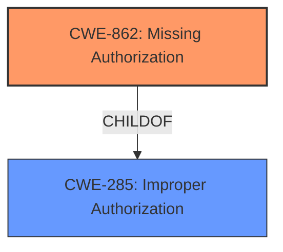

# Analysis for CVE-2020-0479

# Summary
| CWE ID | CWE Name | Confidence | CWE Abstraction Level | CWE Vulnerability Mapping Label | CWE-Vulnerability Mapping Notes |
|---|---|---|---|---|---|
| CWE-862 | Missing Authorization | 0.9 | Class | Primary | Allowed-with-Review |
| CWE-285 | Improper Authorization | 0.6 | Class | Secondary | Discouraged |

## Evidence and Confidence

*   **Confidence Score:** 0.9
*   **Evidence Strength:** HIGH

## Relationship Analysis
The primary CWE is CWE-862 **Missing Authorization**, a Class-level CWE. It falls under the parent CWE-285 **Improper Authorization**, which is also a Class-level CWE. The choice of CWE-862 is favored due to its specific focus on missing authorization checks, while CWE-285 is a more general case of incorrect authorization. The vulnerability description clearly indicates a **lack of** authorization, making CWE-862 a better fit.

## Vulnerability Chain
The vulnerability chain starts with the **missing authorization** check within the `DocumentsProvider` component. This **lack of** validation allows a malicious application to access files without user permission, ultimately leading to a local escalation of privilege.
  - Missing Authorization (CWE-862) -> Access to Files Without Permission -> Local Escalation of Privilege

## Summary of Analysis
The initial analysis pointed towards authorization-related CWEs. The vulnerability description and CVE reference links content summary highlight a **lack of** proper authorization checks in the `DocumentsProvider` component, which allows malicious applications to bypass permissions and access files without user consent.

The selection of CWE-862 is strongly supported by the evidence, which states that there is a "possible permissions bypass" because of the way `callUnchecked` in `DocumentsProvider.java` is implemented. The CVE reference links content summary confirms this by stating that the vulnerability stems from a **lack of** validation of user-supplied URIs in `DocumentsProvider` calls. Specifically, the core issue is that user-provided URIs are not adequately validated before being used by the `DocumentsProvider`.

While CWE-285 could also be considered, CWE-862 is a more specific child that accurately reflects the root cause: a **missing** authorization check. The MITRE mapping guidance for CWE-285 discourages its use when lower-level CWEs can be used instead.

The selected CWE is at the optimal level of specificity because it precisely identifies the **lack of** an authorization check as the root cause of the vulnerability.

Relevant CWE Information:

# Enhanced Context (25 CWEs)
The following CWEs were identified as potentially relevant to this vulnerability:

## CWE-404: Improper Resource Shutdown or Release
**Abstraction Level**: Class
**Similarity Score**: 0.78
**Source**: dense

**Description**:
The product does not release or incorrectly releases a resource before it is made available for re-use.
**Not Used:** This CWE focuses on resource release, which is not the primary issue in the vulnerability description. The problem lies in the **lack of** proper authorization, not in how resources are managed after use.

## CWE-667: Improper Locking
**Abstraction Level**: Class
**Similarity Score**: 0.78
**Source**: dense

**Description**:
The product does not properly acquire or release a lock on a resource, leading to unexpected resource state changes and behaviors.
**Not Used:** This CWE relates to locking mechanisms, which are not mentioned or implied in the vulnerability description. The focus is on permissions and authorization, not concurrency control.

## CWE-226: Sensitive Information in Resource Not Removed Before Reuse
**Abstraction Level**: Base
**Similarity Score**: 0.78
**Source**: dense

**Description**:
The product releases a resource such as memory or a file so that it can be made available for reuse, but it does not clear or "zeroize" the information contained in the resource before the product performs a critical state transition or makes the resource available for reuse by other entities.
**Not Used:** This CWE relates to the failure to clear sensitive data before resource reuse, which is not relevant to the described vulnerability. The core issue is the **lack of** authorization checks, not data sanitization.

## CWE-754: Improper Check for Unusual or Exceptional Conditions
**Abstraction Level**: Class
**Similarity Score**: 0.77
**Source**: dense

**Description**:
The product does not check or incorrectly checks for unusual or exceptional conditions that are not expected to occur frequently during day to day operation of the product.
**Not Used:** This CWE is about failing to check for unusual conditions, which is not the same as failing to perform authorization checks.

## CWE-668: Exposure of Resource to Wrong Sphere
**Abstraction Level**: Class
**Similarity Score**: 0.77
**Source**: dense

**Description**:
The product exposes a resource to the wrong control sphere, providing unintended actors with inappropriate access to the resource.
**Not Used:** This CWE is too broad and does not specifically address the root cause.

## CWE-451: User Interface (UI) Misrepresentation of Critical Information
**Abstraction Level**: Class
**Similarity Score**: 0.77
**Source**: dense

**Description**:
The user interface (UI) does not properly represent critical information to the user, allowing the information - or its source - to be obscured or spoofed. This is often a component in phishing attacks.
**Not Used:** This CWE relates to UI misrepresentation, which is not the primary concern in this vulnerability.

## CWE-665: Improper Initialization
**Abstraction Level**: Class
**Similarity Score**: 0.77
**Source**: dense

**Description**:
The product does not initialize or incorrectly initializes a resource, which might leave the resource in an unexpected state when it is accessed or used.
**Not Used:** This CWE relates to initialization issues, which are not the root cause of this vulnerability.

## CWE-908: Use of Uninitialized Resource
**Abstraction Level**: Base
**Similarity Score**: 0.77
**Source**: dense

**Description**:
The product uses or accesses a resource that has not been initialized.
**Not Used:** Similar to CWE-665, this is not the root cause of the vulnerability.

## CWE-41: Improper Resolution of Path Equivalence
**Abstraction Level**: Base
**Similarity Score**: 0.76
**Source**: dense

**Description**:
The product is vulnerable to file system contents disclosure through path equivalence. Path equivalence involves the use of special characters in file and directory names. The associated manipulations are intended to generate multiple names for the same object.
**Not Used:** This CWE is about path equivalence issues, which is not relevant to the described vulnerability.

## CWE-280: Improper Handling of Insufficient Permissions or Privileges
**Abstraction Level**: Base
**Similarity Score**: 0.76
**Source**: dense

**Description**:
The product does not handle or incorrectly handles when it has insufficient privileges to access resources or functionality as specified by their permissions. This may cause it to follow unexpected code paths that may leave the product in an invalid state.
**Not Used:** While related to permissions, this CWE is about handling *insufficient* permissions, while the core issue is that no permission check is being done.

## CWE-927: Use of Implicit Intent for Sensitive Communication
**Abstraction Level**: Variant
**Similarity Score**: 5014.39
**Source**: sparse

**Description**:
The Android application uses an implicit intent for transmitting sensitive data to other applications.
**Not Used:** Not relevant to this vulnerability

## CWE-863: Incorrect Authorization
**Abstraction Level**: Class
**Similarity Score**: 4975.82
**Source**: sparse

**Description**:
The product performs an authorization check when an actor attempts to access a resource or perform an action, but it does not correctly perform the check.
**Not Used:** While related to authorization, it is about performing a check *incorrectly*

## CWE-367: Time-of-check Time-of-use (TOCTOU) Race Condition
**Abstraction Level**: Base
**Similarity Score**: 4837.12
**Source**: sparse

**Description**:
The product checks the state of a resource before using that resource, but the resource's state can change between the check and the use in a way that invalidates the results of the check. This can cause the product to perform invalid actions when the resource is in an unexpected state.
**Not Used:** Not relevant to this vulnerability

## CWE-425: Direct Request ('Forced Browsing')
**Abstraction Level**: base
**Similarity Score**: 4.33
**Source**: graph

**Description**:
CWE-425: Direct Request ('Forced Browsing')
**Not Used:** Not relevant to this

# Enhanced Query for CVE-2020-0479

## Vulnerability Description
In callUnchecked of DocumentsProvider.java, there is a possible permissions bypass. This could lead to local escalation of privilege allowing a malicious app to access files available to the DocumentProvider without user permission, with no additional execution privileges needed. User interaction is needed for exploitation.Product AndroidVersions Android-11Android ID A-157294893

### Vulnerability Description Key Phrases
- **impact:** access files without user permission
- **attacker:** malicious app
- **product:** Android
- **version:** 11
- **component:** callUnchecked of DocumentsProvider.java

## CVE Reference Links Content Summary
Based on the provided content, here's an analysis of CVE-2020-0479:

**Root Cause of Vulnerability:**

The vulnerability stems from a lack of validation of user-supplied URIs in `DocumentsProvider` calls. This allows malicious apps to potentially exploit the system by providing crafted URIs with specific authorities that are not properly checked.

**Weaknesses/Vulnerabilities Present:**

*   **Insufficient Input Validation:** The core issue is that user-provided URIs are not adequately validated before being used by the `DocumentsProvider`. This lack of validation creates an opportunity for attackers to inject malicious URIs.
*   **URI Authority Manipulation:** Malicious applications can craft URIs with specific authorities that, when processed by the vulnerable code, lead to unintended actions or information disclosure.

**Impact of Exploitation:**

*   **Elevation of Privilege (EoP):** The CVE is categorized as an EoP vulnerability. While the provided text doesn't give exact details on the kind of privilege escalation, it implies that successful exploitation could allow a malicious app to gain unauthorized access or control beyond its permitted scope.
*   **Information Disclosure (ID):** The vulnerability might also lead to some information disclosure by reading sensitive data with the crafted URI.

**Attack Vectors:**

*   **Malicious Application:** The primary attack vector involves a malicious application crafting and supplying a specially crafted URI to the `DocumentsProvider` component.
*   **Inter-process Communication (IPC):** The vulnerability likely exists within the IPC mechanisms of Android, where an app communicates with the `DocumentsProvider` using URIs as input.

**Required Attacker Capabilities/Position:**

*   **Ability to install an app:** An attacker must be able to install a malicious application on the affected Android device.
*   **Basic understanding of Android components:** The attacker needs to have some knowledge of how `DocumentsProvider` and URIs function within the Android framework to create the exploit.

**Additional Notes:**

* The provided commit log message for the fix includes the following information:
     -   The fix involves adding permission checks to `createInputConsumer`/`destroyInputConsumer` in `WindowManagerService` to prevent apps from consuming all touch events, denying them from reaching System UI.
     - It also limits the usage of `createInputConsumer` to defined types.
* The commit log indicates a fix for the vulnerability is addressed by validating user-supplied URIs within the `DocumentsProvider`, specifically targeting the authorities of the URIs.

In summary, CVE-2020-0479 is a moderate severity Elevation of Privilege and Information Disclosure vulnerability in Android's `DocumentsProvider` due to insufficient validation of user-supplied URIs. This allows malicious applications to potentially gain elevated privileges or disclose sensitive data by providing specially crafted URIs.

## Retriever Results

### Top Combined Results

| Rank | CWE ID | Name | Abstraction | Usage  | Retrievers | Individual Scores |
|------|--------|------|-------------|-------|------------|-------------------|
| 1 | 84 | Improper Neutralization of Encoded URI Schemes in a Web Page | Variant | Allowed | sparse | 0.150 |
| 2 | 862 | Missing Authorization | Class | Allowed-with-Review | sparse | 0.138 |
| 3 | 1021 | Improper Restriction of Rendered UI Layers or Frames | Base | Allowed | sparse | 0.135 |
| 4 | 223 | Omission of Security-relevant Information | Base | Allowed | sparse | 0.122 |
| 5 | 667 | Improper Locking | Class | Allowed-with-Review | sparse | 0.121 |
| 6 | 927 | Use of Implicit Intent for Sensitive Communication | Variant | Allowed | dense | 0.579 |
| 7 | 425 | Direct Request ('Forced Browsing') | Base | Allowed | graph | 0.001 |
| 8 | 732 | Incorrect Permission Assignment for Critical Resource | Class | Allowed-with-Review | sparse | 0.120 |
| 9 | 514 | Covert Channel | Class | Allowed-with-Review | sparse | 0.120 |
| 10 | 908 | Use of Uninitialized Resource | Base | Allowed | sparse | 0.116 |

# Complete CWE Specifications

## CWE-84: Improper Neutralization of Encoded URI Schemes in a Web Page
**Abstraction:** Variant
**Status:** Draft

### Description
The web application improperly neutralizes user-controlled input for executable script disguised with URI encodings.

### Extended Description
Not provided

### Alternative Terms
None

### Relationships
ChildOf -> CWE-79

### Mapping Guidance
**Usage:** Allowed
**Rationale:** This CWE entry is at the Variant level of abstraction, which is a preferred level of abstraction for mapping to the root causes of vulnerabilities.
**Comments:** Carefully read both the name and description to ensure that this mapping is an appropriate fit. Do not try to 'force' a mapping to a lower-level Base/Variant simply to comply with this preferred level of abstraction.
**Reasons:**
- Acceptable-Use

### Observed Examples
- **CVE-2005-0563:** Cross-site scripting (XSS) vulnerability in Microsoft Outlook Web Access (OWA) component in Exchange Server 5.5 allows remote attackers to inject arbitrary web script or HTML via an email message with an encoded javascript: URL ("jav&#X41sc&#0010;ript:") in an IMG tag.
- **CVE-2005-2276:** Cross-site scripting (XSS) vulnerability in Novell Groupwise WebAccess 6.5 before July 11, 2005 allows remote attackers to inject arbitrary web script or HTML via an e-mail message with an encoded javascript URI (e.g. "j&#X41vascript" in an IMG tag).
- **CVE-2005-0692:** Encoded script within BBcode IMG tag.

## CWE-862: Missing Authorization
**Abstraction:** Class
**Status:** Incomplete

### Description
The product does not perform an authorization check when an actor attempts to access a resource or perform an action.

### Extended Description
Not provided

### Alternative Terms
AuthZ: "AuthZ" is typically used as an abbreviation of "authorization" within the web application security community. It is distinct from "AuthN" (or, sometimes, "AuthC") which is an abbreviation of "authentication." The use of "Auth" as an abbreviation is discouraged, since it could be used for either authentication or authorization.

### Relationships
ChildOf -> CWE-285
ChildOf -> CWE-284

### Mapping Guidance
**Usage:** Allowed-with-Review
**Rationale:** This CWE entry is a Class and might have Base-level children that would be more appropriate
**Comments:** Examine children of this entry to see if there is a better fit
**Reasons:**
- Abstraction

### Additional Notes
**[Terminology]** Assuming a user with a given identity, authorization is the process of determining whether that user can access a given resource, based on the user's privileges and any permissions or other access-control specifications that apply to the resource.

### Observed Examples
- **CVE-2022-24730:** Go-based continuous deployment product does not check that a user has certain privileges to update or create an app, allowing adversaries to read sensitive repository information
- **CVE-2009-3168:** Web application does not restrict access to admin scripts, allowing authenticated users to reset administrative passwords.
- **CVE-2009-3597:** Web application stores database file under the web root with insufficient access control (CWE-219), allowing direct request.

## CWE-1021: Improper Restriction of Rendered UI Layers or Frames
**Abstraction:** Base
**Status:** Incomplete

### Description
The web application does not restrict or incorrectly restricts frame objects or UI layers that belong to another application or domain, which can lead to user confusion about which interface the user is interacting with.

### Extended Description
A web application is expected to place restrictions on whether it is allowed to be rendered within frames, iframes, objects, embed or applet elements. Without the restrictions, users can be tricked into interacting with the application when they were not intending to.

### Alternative Terms
Clickjacking
UI Redress Attack
Tapjacking: "Tapjacking" is similar to clickjacking, except it is used for mobile applications in which the user "taps" the application instead of performing a mouse click.

### Relationships
ChildOf -> CWE-441
ChildOf -> CWE-610
ChildOf -> CWE-451

### Mapping Guidance
**Usage:** Allowed
**Rationale:** This CWE entry is at the Base level of abstraction, which is a preferred level of abstraction for mapping to the root causes of vulnerabilities.
**Comments:** Carefully read both the name and description to ensure that this mapping is an appropriate fit. Do not try to 'force' a mapping to a lower-level Base/Variant simply to comply with this preferred level of abstraction.
**Reasons:**
- Acceptable-Use

### Observed Examples
- **CVE-2017-7440:** E-mail preview feature in a desktop application allows clickjacking attacks via a crafted e-mail message
- **CVE-2017-5697:** Hardware/firmware product has insufficient clickjacking protection in its web user interface
- **CVE-2017-4015:** Clickjacking in data-loss prevention product via HTTP response header.

## CWE-223: Omission of Security-relevant Information
**Abstraction:** Base
**Status:** Draft

### Description
The product does not record or display information that would be important for identifying the source or nature of an attack, or determining if an action is safe.

### Extended Description
Not provided

### Alternative Terms
None

### Relationships
ChildOf -> CWE-221

### Mapping Guidance
**Usage:** Allowed
**Rationale:** This CWE entry is at the Base level of abstraction, which is a preferred level of abstraction for mapping to the root causes of vulnerabilities.
**Comments:** Carefully read both the name and description to ensure that this mapping is an appropriate fit. Do not try to 'force' a mapping to a lower-level Base/Variant simply to comply with this preferred level of abstraction.
**Reasons:**
- Acceptable-Use

### Observed Examples
- **CVE-1999-1029:** Login attempts are not recorded if the user disconnects before the maximum number of tries.
- **CVE-2002-1839:** Sender's IP address not recorded in outgoing e-mail.
- **CVE-2000-0542:** Failed authentication attempts are not recorded if later attempt succeeds.

## CWE-667: Improper Locking
**Abstraction:** Class
**Status:** Draft

### Description
The product does not properly acquire or release a lock on a resource, leading to unexpected resource state changes and behaviors.

### Extended Description

Locking is a type of synchronization behavior that ensures that multiple independently-operating processes or threads do not interfere with each other when accessing the same resource. All processes/threads are expected to follow the same steps for locking. If these steps are not followed precisely - or if no locking is done at all - then another process/thread could modify the shared resource in a way that is not visible or predictable to the original process. This can lead to data or memory corruption, denial of service, etc.

### Alternative Terms
None

### Relationships
ChildOf -> CWE-662
ChildOf -> CWE-662
ChildOf -> CWE-662
ChildOf -> CWE-662

### Mapping Guidance
**Usage:** Allowed-with-Review
**Rationale:** This CWE entry is a Class and might have Base-level children that would be more appropriate
**Comments:** Examine children of this entry to see if there is a better fit
**Reasons:**
- Abstraction

### Additional Notes
**[Maintenance]** Deeper research is necessary for synchronization and related mechanisms, including locks, mutexes, semaphores, and other mechanisms. Multiple entries are dependent on this research, which includes relationships to concurrency, race conditions, reentrant functions, etc. CWE-662 and its children - including CWE-667, CWE-820, CWE-821, and others - may need to be modified significantly, along with their relationships.

### Observed Examples
- **CVE-2021-1782:** Chain: improper locking (CWE-667) leads to race condition (CWE-362), as exploited in the wild per CISA KEV.
- **CVE-2009-0935:** Attacker provides invalid address to a memory-reading function, causing a mutex to be unlocked twice
- **CVE-2010-4210:** function in OS kernel unlocks a mutex that was not previously locked, causing a panic or overwrite of arbitrary memory.

## CWE-927: Use of Implicit Intent for Sensitive Communication
**Abstraction:** Variant
**Status:** Incomplete

### Description
The Android application uses an implicit intent for transmitting sensitive data to other applications.

### Extended Description

Since an implicit intent does not specify a particular application to receive the data, any application can process the intent by using an Intent Filter for that intent. This can allow untrusted applications to obtain sensitive data. There are two variations on the standard broadcast intent, ordered and sticky.

Ordered broadcast intents are delivered to a series of registered receivers in order of priority as declared by the Receivers. A malicious receiver can give itself a high priority and cause a denial of service by stopping the broadcast from propagating further down the chain. There is also the possibility of malicious data modification, as a receiver may also alter the data within the Intent before passing it on to the next receiver. The downstream components have no way of asserting that the data has not been altered earlier in the chain.

Sticky broadcast intents remain accessible after the initial broadcast. An old sticky intent will be broadcast again to any new receivers that register for it in the future, greatly increasing the chances of information exposure over time. Also, sticky broadcasts cannot be protected by permissions that may apply to other kinds of intents.

In addition, any broadcast intent may include a URI that references data that the receiving component does not normally have the privileges to access. The sender of the intent can include special privileges that grant the receiver read or write access to the specific URI included in the intent. A malicious receiver that intercepts this intent will also gain those privileges and be able to read or write the resource at the specified URI.

### Alternative Terms
None

### Relationships
ChildOf -> CWE-285
ChildOf -> CWE-668

### Mapping Guidance
**Usage:** Allowed
**Rationale:** This CWE entry is at the Variant level of abstraction, which is a preferred level of abstraction for mapping to the root causes of vulnerabilities.
**Comments:** Carefully read both the name and description to ensure that this mapping is an appropriate fit. Do not try to 'force' a mapping to a lower-level Base/Variant simply to comply with this preferred level of abstraction.
**Reasons:**
- Acceptable-Use

### Observed Examples
- **CVE-2022-4903:** An Android application does not use FLAG_IMMUTABLE when creating a PendingIntent.

## CWE-425: Direct Request ('Forced Browsing')
**Abstraction:** Base
**Status:** Incomplete

### Description
The web application does not adequately enforce appropriate authorization on all restricted URLs, scripts, or files.

### Extended Description
Web applications susceptible to direct request attacks often make the false assumption that such resources can only be reached through a given navigation path and so only apply authorization at certain points in the path.

### Alternative Terms
forced browsing: The "forced browsing" term could be misinterpreted to include weaknesses such as CSRF or XSS, so its use is discouraged.

### Relationships
ChildOf -> CWE-862
ChildOf -> CWE-862
ChildOf -> CWE-288
ChildOf -> CWE-424
CanPrecede -> CWE-471
CanPrecede -> CWE-98

### Mapping Guidance
**Usage:** Allowed
**Rationale:** This CWE entry is at the Base level of abstraction, which is a preferred level of abstraction for mapping to the root causes of vulnerabilities.
**Comments:** Carefully read both the name and description to ensure that this mapping is an appropriate fit. Do not try to 'force' a mapping to a lower-level Base/Variant simply to comply with this preferred level of abstraction.
**Reasons:**
- Acceptable-Use

### Additional Notes
**[Relationship]** Overlaps Modification of Assumed-Immutable Data (MAID), authorization errors, container errors; often primary to other weaknesses such as XSS and SQL injection.

**[Theoretical]** "Forced browsing" is a step-based manipulation involving the omission of one or more steps, whose order is assumed to be immutable. The application does not verify that the first step was performed successfully before the second step. The consequence is typically "authentication bypass" or "path disclosure," although it can be primary to all kinds of weaknesses, especially in languages such as PHP, which allow external modification of assumed-immutable variables.

### Observed Examples
- **CVE-2022-29238:** Access-control setting in web-based document collaboration tool is not properly implemented by the code, which prevents listing hidden directories but does not prevent direct requests to files in those directories.
- **CVE-2022-23607:** Python-based HTTP library did not scope cookies to a particular domain such that "supercookies" could be sent to any domain on redirect.
- **CVE-2004-2144:** Bypass authentication via direct request.

## CWE-732: Incorrect Permission Assignment for Critical Resource
**Abstraction:** Class
**Status:** Draft

### Description
The product specifies permissions for a security-critical resource in a way that allows that resource to be read or modified by unintended actors.

### Extended Description
When a resource is given a permission setting that provides access to a wider range of actors than required, it could lead to the exposure of sensitive information, or the modification of that resource by unintended parties. This is especially dangerous when the resource is related to program configuration, execution, or sensitive user data. For example, consider a misconfigured storage account for the cloud that can be read or written by a public or anonymous user.

### Alternative Terms
None

### Relationships
ChildOf -> CWE-285
ChildOf -> CWE-668

### Mapping Guidance
**Usage:** Allowed-with-Review
**Rationale:** While the name itself indicates an assignment of permissions for resources, this is often misused for vulnerabilities in which "permissions" are not checked, which is an "authorization" weakness (CWE-285 or descendants) within CWE's model [REF-1287].
**Comments:** Closely analyze the specific mistake that is allowing the resource to be exposed, and perform a CWE mapping for that mistake.
**Reasons:**
- Frequent Misuse

### Additional Notes
**[Maintenance]** The relationships between privileges, permissions, and actors (e.g. users and groups) need further refinement within the Research view. One complication is that these concepts apply to two different pillars, related to control of resources (CWE-664) and protection mechanism failures (CWE-693).

### Observed Examples
- **CVE-2022-29527:** Go application for cloud management creates a world-writable sudoers file that allows local attackers to inject sudo rules and escalate privileges to root by winning a race condition.
- **CVE-2009-3482:** Anti-virus product sets insecure "Everyone: Full Control" permissions for files under the "Program Files" folder, allowing attackers to replace executables with Trojan horses.
- **CVE-2009-3897:** Product creates directories with 0777 permissions at installation, allowing users to gain privileges and access a socket used for authentication.

## CWE-514: Covert Channel
**Abstraction:** Class
**Status:** Incomplete

### Description
A covert channel is a path that can be used to transfer information in a way not intended by the system's designers.

### Extended Description
Typically the system has not given authorization for the transmission and has no knowledge of its occurrence.

### Alternative Terms
None

### Relationships
ChildOf -> CWE-1229

### Mapping Guidance
**Usage:** Allowed-with-Review
**Rationale:** This CWE entry is a Class and might have Base-level children that would be more appropriate
**Comments:** Examine children of this entry to see if there is a better fit
**Reasons:**
- Abstraction

### Additional Notes
**[Theoretical]** A covert channel can be thought of as an emergent resource, meaning that it was not an originally intended resource, however it exists due the application's behaviors.

**[Maintenance]** As of CWE 4.9, members of the CWE Hardware SIG are working to improve CWE's coverage of transient execution weaknesses, which include issues related to Spectre, Meltdown, and other attacks that create or exploit covert channels. As a result of that work, this entry might change in CWE 4.10.

## CWE-908: Use of Uninitialized Resource
**Abstraction:** Base
**Status:** Incomplete

### Description
The product uses or accesses a resource that has not been initialized.

### Extended Description
When a resource has not been properly initialized, the product may behave unexpectedly. This may lead to a crash or invalid memory access, but the consequences vary depending on the type of resource and how it is used within the product.

### Alternative Terms
None

### Relationships
ChildOf -> CWE-665
ChildOf -> CWE-665

### Mapping Guidance
**Usage:** Allowed
**Rationale:** This CWE entry is at the Base level of abstraction, which is a preferred level of abstraction for mapping to the root causes of vulnerabilities.
**Comments:** Carefully read both the name and description to ensure that this mapping is an appropriate fit. Do not try to 'force' a mapping to a lower-level Base/Variant simply to comply with this preferred level of abstraction.
**Reasons:**
- Acceptable-Use

### Observed Examples
- **CVE-2019-9805:** Chain: Creation of the packet client occurs before initialization is complete (CWE-696) resulting in a read from uninitialized memory (CWE-908), causing memory corruption.
- **CVE-2008-4197:** Use of uninitialized memory may allow code execution.
- **CVE-2008-2934:** Free of an uninitialized pointer leads to crash and possible code execution.

