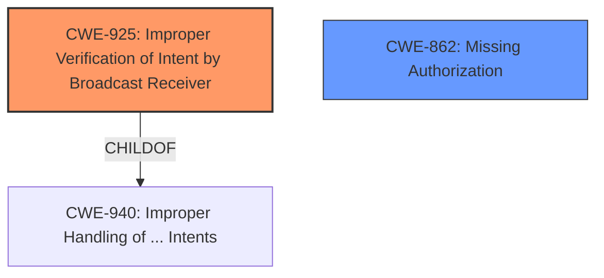

# Analysis Report for CVE-2020-0481

# Vulnerability Analysis Report: CVE-2020-0481

## Description


## Analysis (with Relationship Data)

# Summary
| CWE ID | CWE Name | Confidence | CWE Abstraction Level | CWE Vulnerability Mapping Label | CWE-Vulnerability Mapping Notes |
|---|---|---|---|---|---|
| CWE-925 | Improper Verification of Intent by Broadcast Receiver | 0.9 | Variant | Allowed | Primary CWE |
| CWE-862 | Missing Authorization | 0.7 | Class | Allowed-with-Review | Secondary CWE |

## Evidence and Confidence

*   **Confidence Score:** 0.8
*   **Evidence Strength:** HIGH

## Relationship Analysis
The primary CWE, CWE-925 (Improper Verification of Intent by Broadcast Receiver), is a variant of CWE-940, indicating a more specific type of weakness related to Android applications. The secondary CWE, CWE-862 (Missing Authorization), is a class-level CWE. While broader, it reflects the high-level authorization issue present.



## Vulnerability Chain
The vulnerability chain involves a **permissions bypass** in the AndroidManifest.xml, leading to a non-system app being able to send a broadcast without proper authorization.
  - **Root Cause:** **Permissions Bypass** due to **Improper Verification of Intent**
  - **Weakness:** **Missing Authorization**
  - **Impact:** Non-system app sends broadcast without permission.

## Summary of Analysis
The primary assessment is based on the vulnerability description, key phrases, and CVE reference summary. The most relevant aspect of the vulnerability is that a non-system app can send a broadcast due to a **permissions bypass**, leading to local escalation of privilege. The **permissions bypass** indicates that the broadcast receiver is not properly verifying the intent.

The selection of CWE-925 is based on its description: "The Android application uses a Broadcast Receiver that receives an Intent but does not properly verify that the Intent came from an authorized source." This aligns directly with the vulnerability description and the CVE reference summary, which describes the issue as an improper access control or handling of Bluetooth device actions.

The secondary CWE, CWE-862, is relevant because the root cause leads to a missing authorization check.

CWE-927 (Use of Implicit Intent for Sensitive Communication) was considered but deemed less appropriate because the primary issue isn't about the use of implicit intents for sensitive communication, but rather the **improper verification** of the intent's source.

Relevant CWE Information:

# Enhanced Context (25 CWEs)
The following CWEs were identified as potentially relevant to this vulnerability:

## CWE-223: Omission of Security-relevant Information
**Abstraction Level**: Base
**Similarity Score**: 0.77
**Source**: dense

**Description**:
The product does not record or display information that would be important for identifying the source or nature of an attack, or determining if an action is safe.

**Mapping Guidance**:
- Usage: Allowed
- Rationale: This CWE entry is at the Base level of abstraction, which is a preferred level of abstraction for mapping to the root causes of vulnerabilities.


## CWE-667: Improper Locking
**Abstraction Level**: Class
**Similarity Score**: 0.76
**Source**: dense

**Description**:
The product does not properly acquire or release a lock on a resource, leading to unexpected resource state changes and behaviors.

**Mapping Guidance**:
- Usage: Allowed-with-Review
- Rationale: This CWE entry is a Class and might have Base-level children that would be more appropriate


## CWE-754: Improper Check for Unusual or Exceptional Conditions
**Abstraction Level**: Class
**Similarity Score**: 0.76
**Source**: dense

**Description**:
The product does not check or incorrectly checks for unusual or exceptional conditions that are not expected to occur frequently during day to day operation of the product.

**Mapping Guidance**:
- Usage: Allowed-with-Review
- Rationale: This CWE entry is a Class and might have Base-level children that would be more appropriate


## CWE-203: Observable Discrepancy
**Abstraction Level**: Base
**Similarity Score**: 0.76
**Source**: dense

**Description**:
The product behaves differently or sends different responses under different circumstances in a way that is observable to an unauthorized actor, which exposes security-relevant information about the state of the product, such as whether a particular operation was successful or not.

**Mapping Guidance**:
- Usage: Allowed
- Rationale: This CWE entry is at the Base level of abstraction, which is a preferred level of abstraction for mapping to the root causes of vulnerabilities.


## CWE-941: Incorrectly Specified Destination in a Communication Channel
**Abstraction Level**: Base
**Similarity Score**: 0.76
**Source**: dense

**Description**:
The product creates a communication channel to initiate an outgoing request to an actor, but it does not correctly specify the intended destination for that actor.

**Mapping Guidance**:
- Usage: Allowed
- Rationale: This CWE entry is at the Base level of abstraction, which is a preferred level of abstraction for mapping to the root causes of vulnerabilities.


## CWE-451: User Interface (UI) Misrepresentation of Critical Information
**Abstraction Level**: Class
**Similarity Score**: 0.75
**Source**: dense

**Description**:
The user interface (UI) does not properly represent critical information to the user, allowing the information - or its source - to be obscured or spoofed. This is often a component in phishing attacks.

**Mapping Guidance**:
- Usage: Allowed-with-Review
- Rationale: This CWE entry is a Class and might have Base-level children that would be more appropriate


## CWE-668: Exposure of Resource to Wrong Sphere
**Abstraction Level**: Class
**Similarity Score**: 0.75
**Source**: dense

**Description**:
The product exposes a resource to the wrong control sphere, providing unintended actors with inappropriate access to the resource.

**Mapping Guidance**:
- Usage: Discouraged
- Rationale: CWE-668 is high-level and is often misused as a catch-all when lower-level CWE IDs might be applicable. It is sometimes used for low-information vulnerability reports [REF-1287]. It is a level-1 Class (i.e., a child of a Pillar). It is not useful for trend analysis.


## CWE-226: Sensitive Information in Resource Not Removed Before Reuse
**Abstraction Level**: Base
**Similarity Score**: 0.75
**Source**: dense

**Description**:
The product releases a resource such as memory or a file so that it can be made available for reuse, but it does not clear or "zeroize" the information contained in the resource before the product performs a critical state transition or makes the resource available for reuse by other entities.

**Mapping Guidance**:
- Usage: Allowed
- Rationale: This CWE entry is at the Base level of abstraction, which is a preferred level of abstraction for mapping to the root causes of vulnerabilities.


## CWE-404: Improper Resource Shutdown or Release
**Abstraction Level**: Class
**Similarity Score**: 0.75
**Source**: dense

**Description**:
The product does not release or incorrectly releases a resource before it is made available for re-use.

**Mapping Guidance**:
- Usage: Allowed-with-Review
- Rationale: This CWE entry is a Class and might have Base-level children that would be more appropriate


## CWE-345: Insufficient Verification of Data Authenticity
**Abstraction Level**: Class
**Similarity Score**: 0.75
**Source**: dense

**Description**:
The product does not sufficiently verify the origin or authenticity of data, in a way that causes it to accept invalid data.

**Mapping Guidance**:
- Usage: Discouraged
- Rationale: This CWE entry is a level-1 Class (i.e., a child of a Pillar). It might have lower-level children that would be more appropriate


## CWE-667: Improper Locking
**Abstraction Level**: Class
**Similarity Score**: 5388.07
**Source**: sparse

**Description**:
The product does not properly acquire or release a lock on a resource, leading to unexpected resource state changes and behaviors.

**Mapping Guidance**:
- Usage: Allowed-with-Review
- Rationale: This CWE entry is a Class and might have Base-level children that would be more appropriate


## CWE-927: Use of Implicit Intent for Sensitive Communication
**Abstraction Level**: Variant
**Similarity Score**: 5381.05
**Source**: sparse

**Description**:
The Android application uses an implicit intent for transmitting sensitive data to other applications.

**Mapping Guidance**:
- Usage: Allowed
- Rationale: This CWE entry


## CWE Relationship Analysis

Current CWEs represent these abstraction levels: .


### Vulnerability Chain Analysis

**Chain starting from CWE-667:**
- 667 (Improper Locking) - ROOT


**Chain starting from CWE-754:**
- 754 (Improper Check for Unusual or Exceptional Conditions) - ROOT


### CWE Relationship Diagram

```mermaid
graph TD
    classDef primary fill:#f96,stroke:#333,stroke-width:2px
    classDef secondary fill:#69f,stroke:#333
    classDef tertiary fill:#9e9,stroke:#333
```


*Report generated on 2025-04-02 02:00:05*
