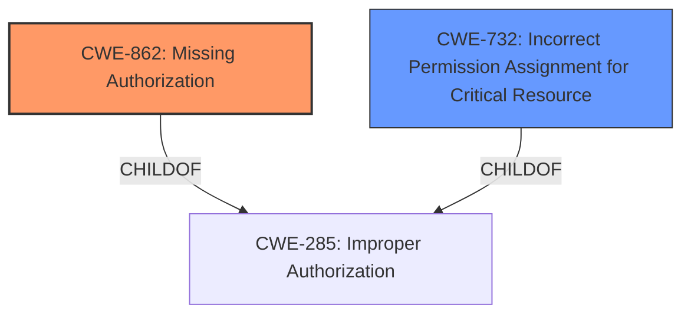

# Analysis Report for CVE-2020-0485

# Vulnerability Analysis Report: CVE-2020-0485

## Description


## Analysis (with Relationship Data)

# Summary
| CWE ID  | CWE Name                                                                                      | Confidence | CWE Abstraction Level | CWE Vulnerability Mapping Label | CWE-Vulnerability Mapping Notes |
| ------- | --------------------------------------------------------------------------------------------- | ---------- | ----------------------- | ------------------------------- | ------------------------------- |
| CWE-862 | **CWE-862: Missing Authorization**                                                            | 0.9        | Class                   | Primary                         | Allowed-with-Review             |
| CWE-732 | **CWE-732: Incorrect Permission Assignment for Critical Resource**                             | 0.7        | Class                   | Secondary                       | Allowed-with-Review             |

## Evidence and Confidence

*   **Confidence Score:** 0.9
*   **Evidence Strength:** HIGH

## Relationship Analysis
The primary relationship that influenced the decision was the hierarchical relationship, specifically the parent-child relationship between CWE-285 (Improper Authorization) and CWE-862 (**CWE-862: Missing Authorization**).
CWE-862 is a child of CWE-285, representing a more specific case of missing authorization.
CWE-732 (**CWE-732: Incorrect Permission Assignment for Critical Resource**) is also a child of CWE-285, representing an alternative, but less precise, classification.



## Vulnerability Chain
The chain of events starts with a **missing permission check** in the code, leading to unauthorized access to tethering functionality.
  - **Root Cause:** **Missing Authorization** (CWE-862)
  - **Impact:** Access to tethering from a guest account (local escalation of privilege)

## Summary of Analysis
The initial analysis focused on identifying the root cause of the vulnerability, which was clearly stated as a **"missing permission check"**. This pointed strongly towards authorization-related CWEs.
The Retriever results also highlighted CWE-862 (**CWE-862: Missing Authorization**) as the top candidate. The description of CWE-862, stating that "The product does not perform an authorization check when an actor attempts to access a resource or perform an action," aligns perfectly with the vulnerability description.
The CVE Reference Links Content Summary confirms the vulnerability stems from improper access control, further supporting the selection of CWE-862.

CWE-732 (**CWE-732: Incorrect Permission Assignment for Critical Resource**) was also considered but deemed less accurate. While the vulnerability involves permissions, the core issue is the *absence* of a check, rather than an incorrect assignment.
The mapping guidance for CWE-732 also suggests caution, noting that it is often misused for vulnerabilities in which "permissions" are not checked, which is an "authorization" weakness.

The final decision to prioritize CWE-862 (**CWE-862: Missing Authorization**) was based on the direct evidence of a **missing permission check**, the high relevance score from the Retriever, and the alignment with the CWE description. This decision is further supported by the parent-child relationship between CWE-862 and the broader CWE-285 (Improper Authorization). CWE-862 represents the most specific and accurate classification for this vulnerability.

The selected CWEs are at the optimal level of specificity because CWE-862 is a Class-level CWE.

Relevant CWE Information:

# Enhanced Context (25 CWEs)
The following CWEs were identified as potentially relevant to this vulnerability:

## CWE-404: Improper Resource Shutdown or Release
**Abstraction Level**: Class
**Similarity Score**: 0.80
**Source**: dense

**Description**:
The product does not release or incorrectly releases a resource before it is made available for re-use.

**Mapping Guidance**:
- Usage: Allowed-with-Review
- Rationale: This CWE entry is a Class and might have Base-level children that would be more appropriate

## CWE-667: Improper Locking
**Abstraction Level**: Class
**Similarity Score**: 0.79
**Source**: dense

**Description**:
The product does not properly acquire or release a lock on a resource, leading to unexpected resource state changes and behaviors.

**Mapping Guidance**:
- Usage: Allowed-with-Review
- Rationale: This CWE entry is a Class and might have Base-level children that would be more appropriate

## CWE-226: Sensitive Information in Resource Not Removed Before Reuse
**Abstraction Level**: Base
**Similarity Score**: 0.78
**Source**: dense

**Description**:
The product releases a resource such as memory or a file so that it can be made available for reuse, but it does not clear or "zeroize" the information contained in the resource before the product performs a critical state transition or makes the resource available for reuse by other entities.

**Mapping Guidance**:
- Usage: Allowed
- Rationale: This CWE entry is at the Base level of abstraction, which is a preferred level of abstraction for mapping to the root causes of vulnerabilities.

## CWE-754: Improper Check for Unusual or Exceptional Conditions
**Abstraction Level**: Class
**Similarity Score**: 0.77
**Source**: dense

**Description**:
The product does not check or incorrectly checks for unusual or exceptional conditions that are not expected to occur frequently during day to day operation of the product.

**Mapping Guidance**:
- Usage: Allowed-with-Review
- Rationale: This CWE entry is a Class and might have Base-level children that would be more appropriate

## CWE-362: Concurrent Execution using Shared Resource with Improper Synchronization ('Race Condition')
**Abstraction Level**: Class
**Similarity Score**: 0.77
**Source**: dense

**Description**:
The product contains a concurrent code sequence that requires temporary, exclusive access to a shared resource, but a timing window exists in which the shared resource can be modified by another code sequence operating concurrently.

**Mapping Guidance**:
- Usage: Allowed-with-Review
- Rationale: This CWE entry is a Class and might have Base-level children that would be more appropriate

## CWE-789: Memory Allocation with Excessive Size Value
**Abstraction Level**: Variant
**Similarity Score**: 0.77
**Source**: dense

**Description**:
The product allocates memory based on an untrusted, large size value, but it does not ensure that the size is within expected limits, allowing arbitrary amounts of memory to be allocated.

**Mapping Guidance**:
- Usage: Allowed
- Rationale: This CWE entry is at the Variant level of abstraction, which is a preferred level of abstraction for mapping to the root causes of vulnerabilities.

## CWE-909: Missing Initialization of Resource
**Abstraction Level**: Class
**Similarity Score**: 0.77
**Source**: dense

**Description**:
The product does not initialize a critical resource.

**Mapping Guidance**:
- Usage: Allowed-with-Review
- Rationale: This CWE entry is a Class and might have Base-level children that would be more appropriate

## CWE-405: Asymmetric Resource Consumption (Amplification)
**Abstraction Level**: Class
**Similarity Score**: 0.77
**Source**: dense

**Description**:
The product does not properly control situations in which an adversary can cause the product to consume or produce excessive resources without requiring the adversary to invest equivalent work or otherwise prove authorization, i.e., the adversary's influence is "asymmetric."

**Mapping Guidance**:
- Usage: Allowed-with-Review
- Rationale: This CWE entry is a Class and might have Base-level children that would be more appropriate

## CWE-908: Use of Uninitialized Resource
**Abstraction Level**: Base
**Similarity Score**: 0.76
**Source**: dense

**Description**:
The product uses or accesses a resource that has not been initialized.

**Mapping Guidance**:
- Usage: Allowed
- Rationale: This CWE entry is at the Base level of abstraction, which is a preferred level of abstraction for mapping to the root causes of vulnerabilities.

## CWE-664: Improper Control of a Resource Through its Lifetime
**Abstraction Level**: Pillar
**Similarity Score**: 0.76
**Source**: dense

**Description**:
The product does not maintain or incorrectly maintains control over a resource throughout its lifetime of creation, use, and release.

**Mapping Guidance**:
- Usage: Discouraged
- Rationale: This CWE entry is high-level when lower-level children are available.

## CWE-667: Improper Locking
**Abstraction Level**: Class
**Similarity Score**: 5680.24
**Source**: sparse

**Description**:
The product does not properly acquire or release a lock on a resource, leading to unexpected resource state changes and behaviors.

**Mapping


## CWE Relationship Analysis

Current CWEs represent these abstraction levels: .


### Vulnerability Chain Analysis

**Chain starting from CWE-732:**
- 732 (Incorrect Permission Assignment for Critical Resource) - ROOT


**Chain starting from CWE-667:**
- 667 (Improper Locking) - ROOT


### CWE Relationship Diagram

```mermaid
graph TD
    classDef primary fill:#f96,stroke:#333,stroke-width:2px
    classDef secondary fill:#69f,stroke:#333
    classDef tertiary fill:#9e9,stroke:#333
```


*Report generated on 2025-04-02 17:05:21*
