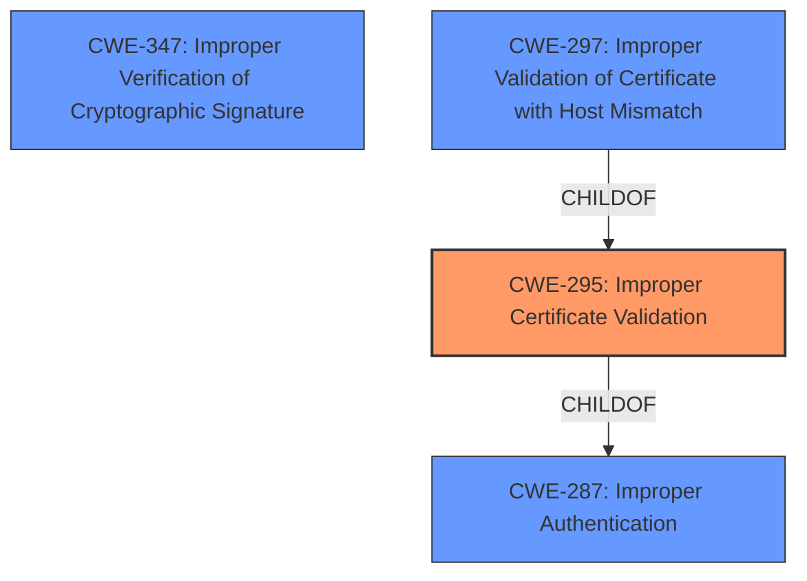

# Enhanced Analysis for CVE-2020-0601

# Summary
| CWE ID | CWE Name | Confidence | CWE Abstraction Level | CWE Vulnerability Mapping Label | CWE-Vulnerability Mapping Notes |
|---|---|---|---|---|---|
| CWE-295 | Improper Certificate Validation | 1.0 | Base | Allowed | Primary CWE |

## Evidence and Confidence

*   **Confidence Score:** 1.0
*   **Evidence Strength:** HIGH

## Relationship Analysis
The primary relationship influencing the decision is the ChildOf relationship between CWE-295 and CWE-287 (Improper Authentication). While CWE-287 is a parent, CWE-295 provides the specificity needed for this vulnerability, which involves the **improper validation** of certificates as the root cause. Other CWEs considered, like CWE-347 (Improper Verification of Cryptographic Signature) and CWE-297 (Improper Validation of Certificate with Host Mismatch), are related but less directly applicable based on the provided description. The relationships show that certificate validation issues can lead to broader authentication problems or signature-related vulnerabilities.



## Vulnerability Chain
The vulnerability chain starts with **improper certificate validation** (CWE-295), leading to a spoofed code-signing certificate being used to sign a malicious executable. This allows the executable to appear as if it's from a trusted source, thus bypassing security measures that rely on certificate validity.

## Summary of Analysis
The analysis is based on the provided vulnerability description, particularly the key phrase indicating **improper certificate validation** as the **rootcause**. The vulnerability description states that "An attacker could exploit the vulnerability by using a spoofed code-signing certificate to sign a malicious executable, making it appear the file was from a trusted, legitimate source".

CWE-295 (Improper Certificate Validation) aligns directly with this description, as it specifies that "The product does not validate, or incorrectly validates, a certificate." This **improper validation** allows an attacker to use a spoofed certificate to sign malicious code, which matches the vulnerability's impact.

The selection of CWE-295 is at the optimal level of specificity because it directly addresses the **rootcause** of the vulnerability (i.e., the **improper validation** of certificates). Other CWEs, such as CWE-347 (Improper Verification of Cryptographic Signature), are related but more general. CWE-295 specifically addresses the certificate validation aspect, making it the most accurate and specific choice based on the available evidence. The retriever results listed CWE-295 as the top combined result.


## CWE Relationship Analysis

Current CWEs represent these abstraction levels: .


### Vulnerability Chain Analysis

**Chain starting from CWE-295:**
- 295 (Improper Certificate Validation) - ROOT


**Chain starting from CWE-287:**
- 287 (Improper Authentication) - ROOT


### CWE Relationship Diagram

```mermaid
graph TD
    classDef primary fill:#f96,stroke:#333,stroke-width:2px
    classDef secondary fill:#69f,stroke:#333
    classDef tertiary fill:#9e9,stroke:#333
```