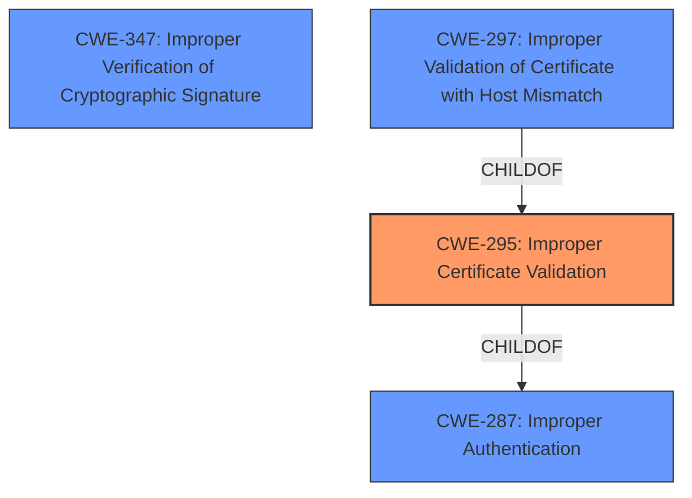

# Analysis for CVE-2020-0601

# Summary
| CWE ID | CWE Name | Confidence | CWE Abstraction Level | CWE Vulnerability Mapping Label | CWE-Vulnerability Mapping Notes |
|---|---|---|---|---|---|
| CWE-295 | Improper Certificate Validation | 1.0 | Base | Allowed | Primary CWE |

## Evidence and Confidence

*   **Confidence Score:** 1.0
*   **Evidence Strength:** HIGH

## Relationship Analysis
The primary relationship influencing the decision is the ChildOf relationship between CWE-295 and CWE-287 (Improper Authentication). While CWE-287 is a parent, CWE-295 provides the specificity needed for this vulnerability, which involves the **improper validation** of certificates as the root cause. Other CWEs considered, like CWE-347 (Improper Verification of Cryptographic Signature) and CWE-297 (Improper Validation of Certificate with Host Mismatch), are related but less directly applicable based on the provided description. The relationships show that certificate validation issues can lead to broader authentication problems or signature-related vulnerabilities.

## Vulnerability Chain
The vulnerability chain starts with **improper certificate validation** (CWE-295), leading to a spoofed code-signing certificate being used to sign a malicious executable. This allows the executable to appear as if it's from a trusted source, thus bypassing security measures that rely on certificate validity.

## Summary of Analysis
The analysis is based on the provided vulnerability description, particularly the key phrase indicating **improper certificate validation** as the **rootcause**. The vulnerability description states that "An attacker could exploit the vulnerability by using a spoofed code-signing certificate to sign a malicious executable, making it appear the file was from a trusted, legitimate source".

CWE-295 (Improper Certificate Validation) aligns directly with this description, as it specifies that "The product does not validate, or incorrectly validates, a certificate." This **improper validation** allows an attacker to use a spoofed certificate to sign malicious code, which matches the vulnerability's impact.

The selection of CWE-295 is at the optimal level of specificity because it directly addresses the **rootcause** of the vulnerability (i.e., the **improper validation** of certificates). Other CWEs, such as CWE-347 (Improper Verification of Cryptographic Signature), are related but more general. CWE-295 specifically addresses the certificate validation aspect, making it the most accurate and specific choice based on the available evidence. The retriever results listed CWE-295 as the top combined result.

# Enhanced Query for CVE-2020-0601

## Vulnerability Description
A spoofing vulnerability exists in the way Windows CryptoAPI (Crypt32.dll) validates Elliptic Curve Cryptography (ECC) certificates.An attacker could exploit the vulnerability by using a spoofed code-signing certificate to sign a malicious executable, making it appear the file was from a trusted, legitimate source, aka 'Windows CryptoAPI Spoofing Vulnerability'.

### Vulnerability Description Key Phrases
- **rootcause:** **improper certificate validation**
- **impact:** sign a malicious executable with spoofed code-signing certificate
- **product:** Windows CryptoAPI
- **component:** Crypt32.dll

## CVE Reference Links Content Summary
Based on the provided content, there's no information related to CVE-2020-0601. The content consists of website layouts and javascript errors and does not contain any vulnerability details.

NOINFO

## Retriever Results

### Top Combined Results

| Rank | CWE ID | Name | Abstraction | Usage  | Retrievers | Individual Scores |
|------|--------|------|-------------|-------|------------|-------------------|
| 1 | 295 | Improper Certificate Validation | Base | Allowed | sparse | 0.454 |
| 2 | 347 | Improper Verification of Cryptographic Signature | Base | Allowed | sparse | 0.280 |
| 3 | 1007 | Insufficient Visual Distinction of Homoglyphs Presented to User | Base | Allowed | sparse | 0.259 |
| 4 | 451 | User Interface (UI) Misrepresentation of Critical Information | Class | Allowed-with-Review | sparse | 0.258 |
| 5 | 358 | Improperly Implemented Security Check for Standard | Base | Allowed | sparse | 0.255 |
| 6 | 297 | Improper Validation of Certificate with Host Mismatch | Variant | Allowed | dense | 0.547 |
| 7 | 325 | Missing Cryptographic Step | Base | Allowed | graph | 0.002 |
| 8 | 290 | Authentication Bypass by Spoofing | Base | Allowed | sparse | 0.252 |
| 9 | 299 | Improper Check for Certificate Revocation | Base | Allowed | sparse | 0.246 |
| 10 | 427 | Uncontrolled Search Path Element | Base | Allowed | sparse | 0.232 |

# Complete CWE Specifications

## CWE-295: Improper Certificate Validation
**Abstraction:** Base
**Status:** Draft

### Description
The product does not validate, or incorrectly validates, a certificate.

### Extended Description
When a certificate is invalid or malicious, it might allow an attacker to spoof a trusted entity by interfering in the communication path between the host and client. The product might connect to a malicious host while believing it is a trusted host, or the product might be deceived into accepting spoofed data that appears to originate from a trusted host.

### Alternative Terms
None

### Relationships
ChildOf -> CWE-287
ChildOf -> CWE-287
PeerOf -> CWE-322

### Mapping Guidance
**Usage:** Allowed
**Rationale:** This CWE entry is at the Base level of abstraction, which is a preferred level of abstraction for mapping to the root causes of vulnerabilities.
**Comments:** Carefully read both the name and description to ensure that this mapping is an appropriate fit. Do not try to 'force' a mapping to a lower-level Base/Variant simply to comply with this preferred level of abstraction.
**Reasons:**
- Acceptable-Use

### Observed Examples
- **CVE-2019-12496:** A Go framework for robotics, drones, and IoT devices skips verification of root CA certificates by default.
- **CVE-2014-1266:** chain: incorrect "goto" in Apple SSL product bypasses certificate validation, allowing Adversary-in-the-Middle (AITM) attack (Apple "goto fail" bug). CWE-705 (Incorrect Control Flow Scoping) -> CWE-561 (Dead Code) -> CWE-295 (Improper Certificate Validation) -> CWE-393 (Return of Wrong Status Code) -> CWE-300 (Channel Accessible by Non-Endpoint).
- **CVE-2021-22909:** Chain: router's firmware update procedure uses curl with "-k" (insecure) option that disables certificate validation (CWE-295), allowing adversary-in-the-middle (AITM) compromise with a malicious firmware image (CWE-494).

## CWE-347: Improper Verification of Cryptographic Signature
**Abstraction:** Base
**Status:** Draft

### Description
The product does not verify, or incorrectly verifies, the cryptographic signature for data.

### Extended Description
Not provided

### Alternative Terms
None

### Relationships
ChildOf -> CWE-345
ChildOf -> CWE-345

### Mapping Guidance
**Usage:** Allowed
**Rationale:** This CWE entry is at the Base level of abstraction, which is a preferred level of abstraction for mapping to the root causes of vulnerabilities.
**Comments:** Carefully read both the name and description to ensure that this mapping is an appropriate fit. Do not try to 'force' a mapping to a lower-level Base/Variant simply to comply with this preferred level of abstraction.
**Reasons:**
- Acceptable-Use

### Observed Examples
- **CVE-2002-1796:** Does not properly verify signatures for "trusted" entities.
- **CVE-2005-2181:** Insufficient verification allows spoofing.
- **CVE-2005-2182:** Insufficient verification allows spoofing.

## CWE-1007: Insufficient Visual Distinction of Homoglyphs Presented to User
**Abstraction:** Base
**Status:** Incomplete

### Description
The product displays information or identifiers to a user, but the display mechanism does not make it easy for the user to distinguish between visually similar or identical glyphs (homoglyphs), which may cause the user to misinterpret a glyph and perform an unintended, insecure action.

### Extended Description

Some glyphs, pictures, or icons can be semantically distinct to a program, while appearing very similar or identical to a human user. These are referred to as homoglyphs. For example, the lowercase "l" (ell) and uppercase "I" (eye) have different character codes, but these characters can be displayed in exactly the same way to a user, depending on the font. This can also occur between different character sets. For example, the Latin capital letter "A" and the Greek capital letter "Α" (Alpha) are treated as distinct by programs, but may be displayed in exactly the same way to a user. Accent marks may also cause letters to appear very similar, such as the Latin capital letter grave mark "À" and its equivalent "Á" with the acute accent.

Adversaries can exploit this visual similarity for attacks such as phishing, e.g. by providing a link to an attacker-controlled hostname that looks like a hostname that the victim trusts. In a different use of homoglyphs, an adversary may create a back door username that is visually similar to the username of a regular user, which then makes it more difficult for a system administrator to detect the malicious username while reviewing logs.

### Alternative Terms
Homograph Attack: "Homograph" is often used as a synonym of "homoglyph" by researchers, but according to Wikipedia, a homograph is a word that has multiple, distinct meanings.

### Relationships
ChildOf -> CWE-451

### Mapping Guidance
**Usage:** Allowed
**Rationale:** This CWE entry is at the Base level of abstraction, which is a preferred level of abstraction for mapping to the root causes of vulnerabilities.
**Comments:** Carefully read both the name and description to ensure that this mapping is an appropriate fit. Do not try to 'force' a mapping to a lower-level Base/Variant simply to comply with this preferred level of abstraction.
**Reasons:**
- Acceptable-Use

### Observed Examples
- **CVE-2013-7236:** web forum allows impersonation of users with homoglyphs in account names
- **CVE-2012-0584:** Improper character restriction in URLs in web browser
- **CVE-2009-0652:** Incomplete denylist does not include homoglyphs of "/" and "?" characters in URLs

## CWE-451: User Interface (UI) Misrepresentation of Critical Information
**Abstraction:** Class
**Status:** Draft

### Description
The user interface (UI) does not properly represent critical information to the user, allowing the information - or its source - to be obscured or spoofed. This is often a component in phishing attacks.

### Extended Description

If an attacker can cause the UI to display erroneous data, or to otherwise convince the user to display information that appears to come from a trusted source, then the attacker could trick the user into performing the wrong action. This is often a component in phishing attacks, but other kinds of problems exist. For example, if the UI is used to monitor the security state of a system or network, then omitting or obscuring an important indicator could prevent the user from detecting and reacting to a security-critical event.

UI misrepresentation can take many forms:

  - Incorrect indicator: incorrect information is displayed, which prevents the user from understanding the true state of the product or the environment the product is monitoring, especially of potentially-dangerous conditions or operations. This can be broken down into several different subtypes.

  - Overlay: an area of the display is intended to give critical information, but another process can modify the display by overlaying another element on top of it. The user is not interacting with the expected portion of the user interface. This is the problem that enables clickjacking attacks, although many other types of attacks exist that involve overlay.

  - Icon manipulation: the wrong icon, or the wrong color indicator, can be influenced (such as making a dangerous .EXE executable look like a harmless .GIF)

  - Timing: the product is performing a state transition or context switch that is presented to the user with an indicator, but a race condition can cause the wrong indicator to be used before the product has fully switched context. The race window could be extended indefinitely if the attacker can trigger an error.

  - Visual truncation: important information could be truncated from the display, such as a long filename with a dangerous extension that is not displayed in the GUI because the malicious portion is truncated. The use of excessive whitespace can also cause truncation, or place the potentially-dangerous indicator outside of the user's field of view (e.g. "filename.txt .exe"). A different type of truncation can occur when a portion of the information is removed due to reasons other than length, such as the accidental insertion of an end-of-input marker in the middle of an input, such as a NUL byte in a C-style string.

  - Visual distinction: visual information might be presented in a way that makes it difficult for the user to quickly and correctly distinguish between critical and unimportant segments of the display.

  - Homographs: letters from different character sets, fonts, or languages can appear very similar (i.e. may be visually equivalent) in a way that causes the human user to misread the text (for example, to conduct phishing attacks to trick a user into visiting a malicious web site with a visually-similar name as a trusted site). This can be regarded as a type of visual distinction issue.

### Alternative Terms
None

### Relationships
ChildOf -> CWE-684
ChildOf -> CWE-221
PeerOf -> CWE-346

### Mapping Guidance
**Usage:** Allowed-with-Review
**Rationale:** This CWE entry is a Class and might have Base-level children that would be more appropriate
**Comments:** Examine children of this entry to see if there is a better fit
**Reasons:**
- Abstraction

### Additional Notes
**[Maintenance]** This entry should be broken down into more precise entries. See extended description.

**[Research Gap]** Misrepresentation problems are frequently studied in web browsers, but there are no known efforts for classifying these kinds of problems in terms of the shortcomings of the interface. In addition, many misrepresentation issues are resultant.

### Observed Examples
- **CVE-2004-2227:** Web browser's filename selection dialog only shows the beginning portion of long filenames, which can trick users into launching executables with dangerous extensions.
- **CVE-2001-0398:** Attachment with many spaces in filename bypasses "dangerous content" warning and uses different icon. Likely resultant.
- **CVE-2001-0643:** Misrepresentation and equivalence issue.

## CWE-358: Improperly Implemented Security Check for Standard
**Abstraction:** Base
**Status:** Draft

### Description
The product does not implement or incorrectly implements one or more security-relevant checks as specified by the design of a standardized algorithm, protocol, or technique.

### Extended Description
Not provided

### Alternative Terms
None

### Relationships
ChildOf -> CWE-573
ChildOf -> CWE-693
CanAlsoBe -> CWE-345
CanAlsoBe -> CWE-290

### Mapping Guidance
**Usage:** Allowed
**Rationale:** This CWE entry is at the Base level of abstraction, which is a preferred level of abstraction for mapping to the root causes of vulnerabilities.
**Comments:** Carefully read both the name and description to ensure that this mapping is an appropriate fit. Do not try to 'force' a mapping to a lower-level Base/Variant simply to comply with this preferred level of abstraction.
**Reasons:**
- Acceptable-Use

### Additional Notes
**[Relationship]** This is a "missing step" error on the product side, which can overlap weaknesses such as insufficient verification and spoofing. It is frequently found in cryptographic and authentication errors. It is sometimes resultant.

### Observed Examples
- **CVE-2002-0862:** Browser does not verify Basic Constraints of a certificate, even though it is required, allowing spoofing of trusted certificates.
- **CVE-2002-0970:** Browser does not verify Basic Constraints of a certificate, even though it is required, allowing spoofing of trusted certificates.
- **CVE-2002-1407:** Browser does not verify Basic Constraints of a certificate, even though it is required, allowing spoofing of trusted certificates.

## CWE-297: Improper Validation of Certificate with Host Mismatch
**Abstraction:** Variant
**Status:** Incomplete

### Description
The product communicates with a host that provides a certificate, but the product does not properly ensure that the certificate is actually associated with that host.

### Extended Description

Even if a certificate is well-formed, signed, and follows the chain of trust, it may simply be a valid certificate for a different site than the site that the product is interacting with. If the certificate's host-specific data is not properly checked - such as the Common Name (CN) in the Subject or the Subject Alternative Name (SAN) extension of an X.509 certificate - it may be possible for a redirection or spoofing attack to allow a malicious host with a valid certificate to provide data, impersonating a trusted host. In order to ensure data integrity, the certificate must be valid and it must pertain to the site that is being accessed.

Even if the product attempts to check the hostname, it is still possible to incorrectly check the hostname. For example, attackers could create a certificate with a name that begins with a trusted name followed by a NUL byte, which could cause some string-based comparisons to only examine the portion that contains the trusted name.

This weakness can occur even when the product uses Certificate Pinning, if the product does not verify the hostname at the time a certificate is pinned.

### Alternative Terms
None

### Relationships
ChildOf -> CWE-923
ChildOf -> CWE-295

### Mapping Guidance
**Usage:** Allowed
**Rationale:** This CWE entry is at the Variant level of abstraction, which is a preferred level of abstraction for mapping to the root causes of vulnerabilities.
**Comments:** Carefully read both the name and description to ensure that this mapping is an appropriate fit. Do not try to 'force' a mapping to a lower-level Base/Variant simply to comply with this preferred level of abstraction.
**Reasons:**
- Acceptable-Use

### Observed Examples
- **CVE-2012-5810:** Mobile banking application does not verify hostname, leading to financial loss.
- **CVE-2012-5811:** Mobile application for printing documents does not verify hostname, allowing attackers to read sensitive documents.
- **CVE-2012-5807:** Software for electronic checking does not verify hostname, leading to financial loss.

## CWE-325: Missing Cryptographic Step
**Abstraction:** Base
**Status:** Draft

### Description
The product does not implement a required step in a cryptographic algorithm, resulting in weaker encryption than advertised by the algorithm.

### Extended Description
Not provided

### Alternative Terms
None

### Relationships
ChildOf -> CWE-573
PeerOf -> CWE-358

### Mapping Guidance
**Usage:** Allowed
**Rationale:** This CWE entry is at the Base level of abstraction, which is a preferred level of abstraction for mapping to the root causes of vulnerabilities.
**Comments:** Carefully read both the name and description to ensure that this mapping is an appropriate fit. Do not try to 'force' a mapping to a lower-level Base/Variant simply to comply with this preferred level of abstraction.
**Reasons:**
- Acceptable-Use

### Additional Notes
**[Relationship]** Overlaps incomplete/missing security check.

**[Relationship]** Can be resultant.

### Observed Examples
- **CVE-2001-1585:** Missing challenge-response step allows authentication bypass using public key.

## CWE-290: Authentication Bypass by Spoofing
**Abstraction:** Base
**Status:** Incomplete

### Description
This attack-focused weakness is caused by incorrectly implemented authentication schemes that are subject to spoofing attacks.

### Extended Description
Not provided

### Alternative Terms
None

### Relationships
ChildOf -> CWE-1390
ChildOf -> CWE-287

### Mapping Guidance
**Usage:** Allowed
**Rationale:** This CWE entry is at the Base level of abstraction, which is a preferred level of abstraction for mapping to the root causes of vulnerabilities.
**Comments:** Carefully read both the name and description to ensure that this mapping is an appropriate fit. Do not try to 'force' a mapping to a lower-level Base/Variant simply to comply with this preferred level of abstraction.
**Reasons:**
- Acceptable-Use

### Additional Notes
**[Relationship]** This can be resultant from insufficient verification.

### Observed Examples
- **CVE-2022-30319:** S-bus functionality in a home automation product performs access control using an IP allowlist, which can be bypassed by a forged IP address.
- **CVE-2009-1048:** VOIP product allows authentication bypass using 127.0.0.1 in the Host header.

## CWE-299: Improper Check for Certificate Revocation
**Abstraction:** Base
**Status:** Draft

### Description
The product does not check or incorrectly checks the revocation status of a certificate, which may cause it to use a certificate that has been compromised.

### Extended Description
An improper check for certificate revocation is a far more serious flaw than related certificate failures. This is because the use of any revoked certificate is almost certainly malicious. The most common reason for certificate revocation is compromise of the system in question, with the result that no legitimate servers will be using a revoked certificate, unless they are sorely out of sync.

### Alternative Terms
None

### Relationships
ChildOf -> CWE-295
ChildOf -> CWE-404

### Mapping Guidance
**Usage:** Allowed
**Rationale:** This CWE entry is at the Base level of abstraction, which is a preferred level of abstraction for mapping to the root causes of vulnerabilities.
**Comments:** Carefully read both the name and description to ensure that this mapping is an appropriate fit. Do not try to 'force' a mapping to a lower-level Base/Variant simply to comply with this preferred level of abstraction.
**Reasons:**
- Acceptable-Use

### Observed Examples
- **CVE-2011-2014:** LDAP-over-SSL implementation does not check Certificate Revocation List (CRL), allowing spoofing using a revoked certificate.
- **CVE-2011-0199:** Operating system does not check Certificate Revocation List (CRL) in some cases, allowing spoofing using a revoked certificate.
- **CVE-2010-5185:** Antivirus product does not check whether certificates from signed executables have been revoked.

## CWE-427: Uncontrolled Search Path Element
**Abstraction:** Base
**Status:** Draft

### Description
The product uses a fixed or controlled search path to find resources, but one or more locations in that path can be under the control of unintended actors.

### Extended Description

Although this weakness can occur with any type of resource, it is frequently introduced when a product uses a directory search path to find executables or code libraries, but the path contains a directory that can be modified by an attacker, such as "/tmp" or the current working directory.

In Windows-based systems, when the LoadLibrary or LoadLibraryEx function is called with a DLL name that does not contain a fully qualified path, the function follows a search order that includes two path elements that might be uncontrolled:

  - the directory from which the program has been loaded

  - the current working directory

In some cases, the attack can be conducted remotely, such as when SMB or WebDAV network shares are used.

One or more locations in that path could include the Windows drive root or its subdirectories. This often exists in Linux-based code assuming the controlled nature of the root directory (/) or its subdirectories (/etc, etc), or a code that recursively accesses the parent directory. In Windows, the drive root and some of its subdirectories have weak permissions by default, which makes them uncontrolled.

In some Unix-based systems, a PATH might be created that contains an empty element, e.g. by splicing an empty variable into the PATH. This empty element can be interpreted as equivalent to the current working directory, which might be an untrusted search element.

In software package management frameworks (e.g., npm, RubyGems, or PyPi), the framework may identify dependencies on third-party libraries or other packages, then consult a repository that contains the desired package. The framework may search a public repository before a private repository. This could be exploited by attackers by placing a malicious package in the public repository that has the same name as a package from the private repository. The search path might not be directly under control of the developer relying on the framework, but this search order effectively contains an untrusted element.

### Alternative Terms
DLL preloading: This term is one of several that are used to describe exploitation of untrusted search path elements in Windows systems, which received wide attention in August 2010. From a weakness perspective, the term is imprecise because it can apply to both CWE-426 and CWE-427.
Binary planting: This term is one of several that are used to describe exploitation of untrusted search path elements in Windows systems, which received wide attention in August 2010. From a weakness perspective, the term is imprecise because it can apply to both CWE-426 and CWE-427.
Insecure library loading: This term is one of several that are used to describe exploitation of untrusted search path elements in Windows systems, which received wide attention in August 2010. From a weakness perspective, the term is imprecise because it can apply to both CWE-426 and CWE-427.
Dependency confusion: As of February 2021, this term is used to describe CWE-427 in the context of managing installation of software package dependencies, in which attackers release packages on public sites where the names are the same as package names used by private repositories, and the search for the dependent package tries the public site first, downloading untrusted code. It may also be referred to as a "substitution attack."

### Relationships
ChildOf -> CWE-668
ChildOf -> CWE-668

### Mapping Guidance
**Usage:** Allowed
**Rationale:** This CWE entry is at the Base level of abstraction, which is a preferred level of abstraction for mapping to the root causes of vulnerabilities.
**Comments:** Carefully read both the name and description to ensure that this mapping is an appropriate fit. Do not try to 'force' a mapping to a lower-level Base/Variant simply to comply with this preferred level of abstraction.
**Reasons:**
- Acceptable-Use

### Additional Notes
**[Relationship]** Unlike untrusted search path (CWE-426), which inherently involves control over the definition of a control sphere (i.e., modification of a search path), this entry concerns a fixed control sphere in which some part of the sphere may be under attacker control (i.e., the search path cannot be modified by an attacker, but one element of the path can be under attacker control).

**[Theoretical]** This weakness is not a clean fit under CWE-668 or CWE-610, which suggests that the control sphere model might need enhancement or clarification.

### Observed Examples
- **CVE-2023-25815:** chain: a change in an underlying package causes the gettext function to use implicit initialization with a hard-coded path (CWE-1419) under the user-writable C:\ drive, introducing an untrusted search path element (CWE-427) that enables spoofing of messages.
- **CVE-2022-4826:** Go-based git extension on Windows can search for and execute a malicious "..exe" in a repository because Go searches the current working directory if git.exe is not found in the PATH
- **CVE-2020-26284:** A Static Site Generator built in Go, when running on Windows, searches the current working directory for a command, possibly allowing code execution using a malicious .exe or .bat file with the name being searched

