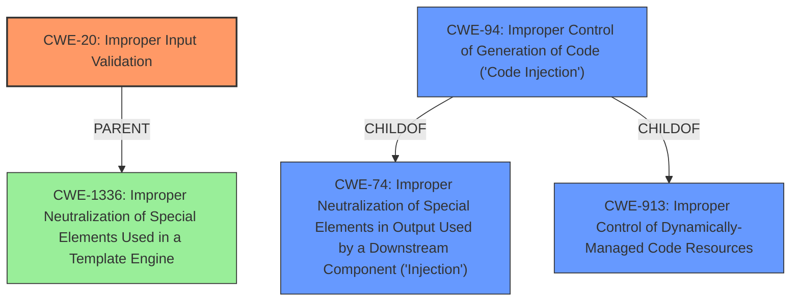

# Enhanced Analysis for CVE-2020-0646

# Summary
| CWE ID | CWE Name | Confidence | CWE Abstraction Level | CWE Vulnerability Mapping Label | CWE-Vulnerability Mapping Notes |
|---|---|---|---|---|---|
| CWE-20 | Improper Input Validation | 0.75 | Class | Primary | Discouraged |
| CWE-94 | Improper Control of Generation of Code ('Code Injection') | 0.5 | Base | Secondary | Allowed-with-Review |

## Evidence and Confidence

*   **Confidence Score:** 0.75
*   **Evidence Strength:** MEDIUM

## Relationship Analysis
The primary CWE identified is CWE-20 [Improper Input Validation], which is a class-level CWE. Due to the limited information about the specific type of input **validation failure**, a more specific base or variant CWE could not be determined. CWE-20 [Improper Input Validation] is a parent of several more specific input validation errors. CWE-94 [Improper Control of Generation of Code ('Code Injection')] is a child of CWE-74 [Improper Neutralization of Special Elements in Output Used by a Downstream Component ('Injection')] and CWE-913 [Improper Control of Dynamically-Managed Code Resources].



## Vulnerability Chain
The vulnerability chain starts with the **failure to validate input properly** (CWE-20 [Improper Input Validation]), which leads to remote code execution. Code Injection (CWE-94 [Improper Control of Generation of Code ('Code Injection')]) could be the next step in the chain, if the improperly validated input is used to construct a code segment.

## Summary of Analysis
The initial analysis identified that the **root cause** of the vulnerability is a **failure to validate input properly**. This is directly stated in the Vulnerability Description: "A remote code execution vulnerability exists when the Microsoft .NET Framework **fails to validate input properly**...".

Given the limited information, I am assigning CWE-20 [Improper Input Validation] as the primary CWE. CWE-20 [Improper Input Validation] is a class-level CWE, and the mapping guidance discourages its use when more specific CWEs are available. However, without more information about *how* the input **validation fails**, a more specific CWE cannot be selected.

CWE-94 [Improper Control of Generation of Code ('Code Injection')] is considered as a secondary CWE since **improperly validated input** can be used to construct a code segment.

Relevant CWE Information:
*   CWE-20 [Improper Input Validation]: The product receives input or data, but it does not validate or incorrectly validates that the input has the properties that are required to process the data safely and correctly.
*   CWE-94 [Improper Control of Generation of Code ('Code Injection')]: The product constructs all or part of a code segment using externally-influenced input from an upstream component, but it does not neutralize or incorrectly neutralizes special elements that could modify the syntax or behavior of the intended code segment.


## CWE Relationship Analysis

Current CWEs represent these abstraction levels: .


### Vulnerability Chain Analysis

**Chain starting from CWE-1336:**
- 1336 (Improper Neutralization of Special Elements Used in a Template Engine) - ROOT


**Chain starting from CWE-74:**
- 74 (Improper Neutralization of Special Elements in Output Used by a Downstream Component ('Injection')) - ROOT


### CWE Relationship Diagram

```mermaid
graph TD
    classDef primary fill:#f96,stroke:#333,stroke-width:2px
    classDef secondary fill:#69f,stroke:#333
    classDef tertiary fill:#9e9,stroke:#333
```