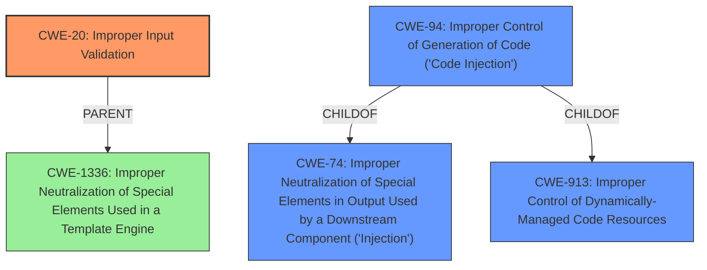

# Analysis for CVE-2020-0646

# Summary
| CWE ID | CWE Name | Confidence | CWE Abstraction Level | CWE Vulnerability Mapping Label | CWE-Vulnerability Mapping Notes |
|---|---|---|---|---|---|
| CWE-20 | Improper Input Validation | 0.75 | Class | Primary | Discouraged |
| CWE-94 | Improper Control of Generation of Code ('Code Injection') | 0.5 | Base | Secondary | Allowed-with-Review |

## Evidence and Confidence

*   **Confidence Score:** 0.75
*   **Evidence Strength:** MEDIUM

## Relationship Analysis
The primary CWE identified is CWE-20 [Improper Input Validation], which is a class-level CWE. Due to the limited information about the specific type of input **validation failure**, a more specific base or variant CWE could not be determined. CWE-20 [Improper Input Validation] is a parent of several more specific input validation errors. CWE-94 [Improper Control of Generation of Code ('Code Injection')] is a child of CWE-74 [Improper Neutralization of Special Elements in Output Used by a Downstream Component ('Injection')] and CWE-913 [Improper Control of Dynamically-Managed Code Resources].

## Vulnerability Chain
The vulnerability chain starts with the **failure to validate input properly** (CWE-20 [Improper Input Validation]), which leads to remote code execution. Code Injection (CWE-94 [Improper Control of Generation of Code ('Code Injection')]) could be the next step in the chain, if the improperly validated input is used to construct a code segment.

## Summary of Analysis
The initial analysis identified that the **root cause** of the vulnerability is a **failure to validate input properly**. This is directly stated in the Vulnerability Description: "A remote code execution vulnerability exists when the Microsoft .NET Framework **fails to validate input properly**...".

Given the limited information, I am assigning CWE-20 [Improper Input Validation] as the primary CWE. CWE-20 [Improper Input Validation] is a class-level CWE, and the mapping guidance discourages its use when more specific CWEs are available. However, without more information about *how* the input **validation fails**, a more specific CWE cannot be selected.

CWE-94 [Improper Control of Generation of Code ('Code Injection')] is considered as a secondary CWE since **improperly validated input** can be used to construct a code segment.

Relevant CWE Information:
*   CWE-20 [Improper Input Validation]: The product receives input or data, but it does not validate or incorrectly validates that the input has the properties that are required to process the data safely and correctly.
*   CWE-94 [Improper Control of Generation of Code ('Code Injection')]: The product constructs all or part of a code segment using externally-influenced input from an upstream component, but it does not neutralize or incorrectly neutralizes special elements that could modify the syntax or behavior of the intended code segment.

# Enhanced Query for CVE-2020-0646

## Vulnerability Description
A remote code execution vulnerability exists when the Microsoft .NET Framework **fails to validate input properly**, aka '.NET Framework Remote Code Execution Injection Vulnerability'.

### Vulnerability Description Key Phrases
- **rootcause:** **fails to validate input properly**
- **impact:** remote code execution
- **product:** Microsoft .NET Framework

## CVE Reference Links Content Summary
UNRELATED

## Retriever Results

### Top Combined Results

| Rank | CWE ID | Name | Abstraction | Usage  | Retrievers | Individual Scores |
|------|--------|------|-------------|-------|------------|-------------------|
| 1 | 502 | Deserialization of Untrusted Data | Base | Allowed | sparse | 0.174 |
| 2 | 472 | External Control of Assumed-Immutable Web Parameter | Base | Allowed | sparse | 0.162 |
| 3 | 138 | Improper Neutralization of Special Elements | Class | Discouraged | sparse | 0.140 |
| 4 | 674 | Uncontrolled Recursion | Class | Allowed-with-Review | sparse | 0.139 |
| 5 | 915 | Improperly Controlled Modification of Dynamically-Determined Object Attributes | Base | Allowed | sparse | 0.137 |
| 6 | 554 | ASP.NET Misconfiguration: Not Using Input Validation Framework | Variant | Allowed | dense | 0.593 |
| 7 | 41 | Improper Resolution of Path Equivalence | Base | Allowed | graph | 0.002 |
| 8 | 94 | Improper Control of Generation of Code ('Code Injection') | Base | Allowed-with-Review | sparse | 0.135 |
| 9 | 20 | Improper Input Validation | Class | Discouraged | sparse | 0.133 |
| 10 | 1336 | Improper Neutralization of Special Elements Used in a Template Engine | Base | Allowed | sparse | 0.133 |

# Complete CWE Specifications

## CWE-502: Deserialization of Untrusted Data
**Abstraction:** Base
**Status:** Draft

### Description
The product deserializes untrusted data without sufficiently ensuring that the resulting data will be valid.

### Extended Description
Not provided

### Alternative Terms
Marshaling, Unmarshaling: Marshaling and unmarshaling are effectively synonyms for serialization and deserialization, respectively.
Pickling, Unpickling: In Python, the "pickle" functionality is used to perform serialization and deserialization.
PHP Object Injection: Some PHP application researchers use this term when attacking unsafe use of the unserialize() function; but it is also used for CWE-915.

### Relationships
ChildOf -> CWE-913
ChildOf -> CWE-913
PeerOf -> CWE-915

### Mapping Guidance
**Usage:** Allowed
**Rationale:** This CWE entry is at the Base level of abstraction, which is a preferred level of abstraction for mapping to the root causes of vulnerabilities.
**Comments:** Carefully read both the name and description to ensure that this mapping is an appropriate fit. Do not try to 'force' a mapping to a lower-level Base/Variant simply to comply with this preferred level of abstraction.
**Reasons:**
- Acceptable-Use

### Additional Notes
**[Maintenance]** The relationships between CWE-502 and CWE-915 need further exploration. CWE-915 is more narrowly scoped to object modification, and is not necessarily used for deserialization.

### Observed Examples
- **CVE-2019-12799:** chain: bypass of untrusted deserialization issue (CWE-502) by using an assumed-trusted class (CWE-183)
- **CVE-2015-8103:** Deserialization issue in commonly-used Java library allows remote execution.
- **CVE-2015-4852:** Deserialization issue in commonly-used Java library allows remote execution.

## CWE-472: External Control of Assumed-Immutable Web Parameter
**Abstraction:** Base
**Status:** Draft

### Description
The web application does not sufficiently verify inputs that are assumed to be immutable but are actually externally controllable, such as hidden form fields.

### Extended Description

If a web product does not properly protect assumed-immutable values from modification in hidden form fields, parameters, cookies, or URLs, this can lead to modification of critical data. Web applications often mistakenly make the assumption that data passed to the client in hidden fields or cookies is not susceptible to tampering. Improper validation of data that are user-controllable can lead to the application processing incorrect, and often malicious, input.

For example, custom cookies commonly store session data or persistent data across sessions. This kind of session data is normally involved in security related decisions on the server side, such as user authentication and access control. Thus, the cookies might contain sensitive data such as user credentials and privileges. This is a dangerous practice, as it can often lead to improper reliance on the value of the client-provided cookie by the server side application.

### Alternative Terms
Assumed-Immutable Parameter Tampering

### Relationships
ChildOf -> CWE-642
ChildOf -> CWE-471

### Mapping Guidance
**Usage:** Allowed
**Rationale:** This CWE entry is at the Base level of abstraction, which is a preferred level of abstraction for mapping to the root causes of vulnerabilities.
**Comments:** Carefully read both the name and description to ensure that this mapping is an appropriate fit. Do not try to 'force' a mapping to a lower-level Base/Variant simply to comply with this preferred level of abstraction.
**Reasons:**
- Acceptable-Use

### Additional Notes
**[Relationship]** This is a primary weakness for many other weaknesses and functional consequences, including XSS, SQL injection, path disclosure, and file inclusion.

**[Theoretical]** This is a technology-specific MAID problem.

### Observed Examples
- **CVE-2002-0108:** Forum product allows spoofed messages of other users via hidden form fields for name and e-mail address.
- **CVE-2000-0253:** Shopping cart allows price modification via hidden form field.
- **CVE-2000-0254:** Shopping cart allows price modification via hidden form field.

## CWE-138: Improper Neutralization of Special Elements
**Abstraction:** Class
**Status:** Draft

### Description
The product receives input from an upstream component, but it does not neutralize or incorrectly neutralizes special elements that could be interpreted as control elements or syntactic markers when they are sent to a downstream component.

### Extended Description
Most languages and protocols have their own special elements such as characters and reserved words. These special elements can carry control implications. If product does not prevent external control or influence over the inclusion of such special elements, the control flow of the program may be altered from what was intended. For example, both Unix and Windows interpret the symbol < ("less than") as meaning "read input from a file".

### Alternative Terms
None

### Relationships
ChildOf -> CWE-707

### Mapping Guidance
**Usage:** Discouraged
**Rationale:** This CWE entry is a level-1 Class (i.e., a child of a Pillar). It might have lower-level children that would be more appropriate
**Comments:** Examine children of this entry to see if there is a better fit
**Reasons:**
- Abstraction

### Additional Notes
**[Relationship]** This weakness can be related to interpretation conflicts or interaction errors in intermediaries (such as proxies or application firewalls) when the intermediary's model of an endpoint does not account for protocol-specific special elements.

**[Relationship]** See this entry's children for different types of special elements that have been observed at one point or another. However, it can be difficult to find suitable CVE examples. In an attempt to be complete, CWE includes some types that do not have any associated observed example.

**[Research Gap]** This weakness is probably under-studied for proprietary or custom formats. It is likely that these issues are fairly common in applications that use their own custom format for configuration files, logs, meta-data, messaging, etc. They would only be found by accident or with a focused effort based on an understanding of the format.

### Observed Examples
- **CVE-2001-0677:** Read arbitrary files from mail client by providing a special MIME header that is internally used to store pathnames for attachments.
- **CVE-2000-0703:** Setuid program does not cleanse special escape sequence before sending data to a mail program, causing the mail program to process those sequences.
- **CVE-2003-0020:** Multi-channel issue. Terminal escape sequences not filtered from log files.

## CWE-674: Uncontrolled Recursion
**Abstraction:** Class
**Status:** Draft

### Description
The product does not properly control the amount of recursion that takes place,  consuming excessive resources, such as allocated memory or the program stack.

### Extended Description
Not provided

### Alternative Terms
Stack Exhaustion

### Relationships
ChildOf -> CWE-834

### Mapping Guidance
**Usage:** Allowed-with-Review
**Rationale:** This CWE entry is a Class and might have Base-level children that would be more appropriate
**Comments:** Examine children of this entry to see if there is a better fit
**Reasons:**
- Abstraction

### Observed Examples
- **CVE-2007-1285:** Deeply nested arrays trigger stack exhaustion.
- **CVE-2007-3409:** Self-referencing pointers create infinite loop and resultant stack exhaustion.
- **CVE-2016-10707:** Javascript application accidentally changes input in a way that prevents a recursive call from detecting an exit condition.

## CWE-915: Improperly Controlled Modification of Dynamically-Determined Object Attributes
**Abstraction:** Base
**Status:** Incomplete

### Description
The product receives input from an upstream component that specifies multiple attributes, properties, or fields that are to be initialized or updated in an object, but it does not properly control which attributes can be modified.

### Extended Description

If the object contains attributes that were only intended for internal use, then their unexpected modification could lead to a vulnerability.

This weakness is sometimes known by the language-specific mechanisms that make it possible, such as mass assignment, autobinding, or object injection.

### Alternative Terms
Mass Assignment: "Mass assignment" is the name of a feature in Ruby on Rails that allows simultaneous modification of multiple object attributes.
AutoBinding: The "Autobinding" term is used in frameworks such as Spring MVC and ASP.NET MVC.
PHP Object Injection: Some PHP application researchers use this term for attacking unsafe use of the unserialize() function, but it is also used for CWE-502.

### Relationships
ChildOf -> CWE-913
PeerOf -> CWE-502

### Mapping Guidance
**Usage:** Allowed
**Rationale:** This CWE entry is at the Base level of abstraction, which is a preferred level of abstraction for mapping to the root causes of vulnerabilities.
**Comments:** Carefully read both the name and description to ensure that this mapping is an appropriate fit. Do not try to 'force' a mapping to a lower-level Base/Variant simply to comply with this preferred level of abstraction.
**Reasons:**
- Acceptable-Use

### Additional Notes
**[Maintenance]** The relationships between CWE-502 and CWE-915 need further exploration. CWE-915 is more narrowly scoped to object modification, and is not necessarily used for deserialization.

### Observed Examples
- **CVE-2024-3283:** Application for using LLMs allows modification of a sensitive variable using mass assignment.
- **CVE-2012-2054:** Mass assignment allows modification of arbitrary attributes using modified URL.
- **CVE-2012-2055:** Source version control product allows modification of trusted key using mass assignment.

## CWE-554: ASP.NET Misconfiguration: Not Using Input Validation Framework
**Abstraction:** Variant
**Status:** Draft

### Description
The ASP.NET application does not use an input validation framework.

### Extended Description
Not provided

### Alternative Terms
None

### Relationships
ChildOf -> CWE-1173

### Mapping Guidance
**Usage:** Allowed
**Rationale:** This CWE entry is at the Variant level of abstraction, which is a preferred level of abstraction for mapping to the root causes of vulnerabilities.
**Comments:** Carefully read both the name and description to ensure that this mapping is an appropriate fit. Do not try to 'force' a mapping to a lower-level Base/Variant simply to comply with this preferred level of abstraction.
**Reasons:**
- Acceptable-Use

## CWE-41: Improper Resolution of Path Equivalence
**Abstraction:** Base
**Status:** Incomplete

### Description
The product is vulnerable to file system contents disclosure through path equivalence. Path equivalence involves the use of special characters in file and directory names. The associated manipulations are intended to generate multiple names for the same object.

### Extended Description
Path equivalence is usually employed in order to circumvent access controls expressed using an incomplete set of file name or file path representations. This is different from path traversal, wherein the manipulations are performed to generate a name for a different object.

### Alternative Terms
None

### Relationships
ChildOf -> CWE-706

### Mapping Guidance
**Usage:** Allowed
**Rationale:** This CWE entry is at the Base level of abstraction, which is a preferred level of abstraction for mapping to the root causes of vulnerabilities.
**Comments:** Carefully read both the name and description to ensure that this mapping is an appropriate fit. Do not try to 'force' a mapping to a lower-level Base/Variant simply to comply with this preferred level of abstraction.
**Reasons:**
- Acceptable-Use

### Additional Notes
**[Relationship]** Some of these manipulations could be effective in path traversal issues, too.

### Observed Examples
- **CVE-2000-1114:** Source code disclosure using trailing dot
- **CVE-2002-1986:** Source code disclosure using trailing dot
- **CVE-2004-2213:** Source code disclosure using trailing dot or trailing encoding space "%20"

## CWE-94: Improper Control of Generation of Code ('Code Injection')
**Abstraction:** Base
**Status:** Draft

### Description
The product constructs all or part of a code segment using externally-influenced input from an upstream component, but it does not neutralize or incorrectly neutralizes special elements that could modify the syntax or behavior of the intended code segment.

### Extended Description

When a product allows a user's input to contain code syntax, it might be possible for an attacker to craft the code in such a way that it will alter the intended control flow of the product. Such an alteration could lead to arbitrary code execution.

Injection problems encompass a wide variety of issues -- all mitigated in very different ways. For this reason, the most effective way to discuss these weaknesses is to note the distinct features which classify them as injection weaknesses. The most important issue to note is that all injection problems share one thing in common -- i.e., they allow for the injection of control plane data into the user-controlled data plane. This means that the execution of the process may be altered by sending code in through legitimate data channels, using no other mechanism. While buffer overflows, and many other flaws, involve the use of some further issue to gain execution, injection problems need only for the data to be parsed. The most classic instantiations of this category of weakness are SQL injection and format string vulnerabilities.

### Alternative Terms
None

### Relationships
ChildOf -> CWE-74
ChildOf -> CWE-74
ChildOf -> CWE-913

### Mapping Guidance
**Usage:** Allowed-with-Review
**Rationale:** This entry is frequently misused for vulnerabilities with a technical impact of "code execution," which does not by itself indicate a root cause weakness, since dozens of weaknesses can enable code execution.
**Comments:** This weakness only applies when the product's functionality intentionally constructs all or part of a code segment. It could be that executing code could be the result of other weaknesses that do not involve the construction of code segments.
**Reasons:**
- Frequent Misuse
- Frequent Misinterpretation

### Observed Examples
- **CVE-2023-29374:** Math component in an LLM framework translates user input into a Python expression that is input into the Python exec() method, allowing code execution - one variant of a "prompt injection" attack.
- **CVE-2024-5565:** Python-based library uses an LLM prompt containing user input to dynamically generate code that is then fed as input into the Python exec() method, allowing code execution - one variant of a "prompt injection" attack.
- **CVE-2024-4181:** Framework for LLM applications allows eval injection via a crafted response from a hosting provider.

## CWE-20: Improper Input Validation
**Abstraction:** Class
**Status:** Stable

### Description
The product receives input or data, but it does
        not validate or incorrectly validates that the input has the
        properties that are required to process the data safely and
        correctly.

### Extended Description

Input validation is a frequently-used technique for checking potentially dangerous inputs in order to ensure that the inputs are safe for processing within the code, or when communicating with other components. When software does not validate input properly, an attacker is able to craft the input in a form that is not expected by the rest of the application. This will lead to parts of the system receiving unintended input, which may result in altered control flow, arbitrary control of a resource, or arbitrary code execution.

Input validation is not the only technique for processing input, however. Other techniques attempt to transform potentially-dangerous input into something safe, such as filtering (CWE-790) - which attempts to remove dangerous inputs - or encoding/escaping (CWE-116), which attempts to ensure that the input is not misinterpreted when it is included in output to another component. Other techniques exist as well (see CWE-138 for more examples.)

Input validation can be applied to:

  - raw data - strings, numbers, parameters, file contents, etc.

  - metadata - information about the raw data, such as headers or size

Data can be simple or structured. Structured data can be composed of many nested layers, composed of combinations of metadata and raw data, with other simple or structured data.

Many properties of raw data or metadata may need to be validated upon entry into the code, such as:

  - specified quantities such as size, length, frequency, price, rate, number of operations, time, etc.

  - implied or derived quantities, such as the actual size of a file instead of a specified size

  - indexes, offsets, or positions into more complex data structures

  - symbolic keys or other elements into hash tables, associative arrays, etc.

  - well-formedness, i.e. syntactic correctness - compliance with expected syntax 

  - lexical token correctness - compliance with rules for what is treated as a token

  - specified or derived type - the actual type of the input (or what the input appears to be)

  - consistency - between individual data elements, between raw data and metadata, between references, etc.

  - conformance to domain-specific rules, e.g. business logic 

  - equivalence - ensuring that equivalent inputs are treated the same

  - authenticity, ownership, or other attestations about the input, e.g. a cryptographic signature to prove the source of the data

Implied or derived properties of data must often be calculated or inferred by the code itself. Errors in deriving properties may be considered a contributing factor to improper input validation. 

Note that "input validation" has very different meanings to different people, or within different classification schemes. Caution must be used when referencing this CWE entry or mapping to it. For example, some weaknesses might involve inadvertently giving control to an attacker over an input when they should not be able to provide an input at all, but sometimes this is referred to as input validation.

Finally, it is important to emphasize that the distinctions between input validation and output escaping are often blurred, and developers must be careful to understand the difference, including how input validation is not always sufficient to prevent vulnerabilities, especially when less stringent data types must be supported, such as free-form text. Consider a SQL injection scenario in which a person's last name is inserted into a query. The name "O'Reilly" would likely pass the validation step since it is a common last name in the English language. However, this valid name cannot be directly inserted into the database because it contains the "'" apostrophe character, which would need to be escaped or otherwise transformed. In this case, removing the apostrophe might reduce the risk of SQL injection, but it would produce incorrect behavior because the wrong name would be recorded.

### Alternative Terms
None

### Relationships
ChildOf -> CWE-707
PeerOf -> CWE-345
CanPrecede -> CWE-22
CanPrecede -> CWE-41
CanPrecede -> CWE-74
CanPrecede -> CWE-119
CanPrecede -> CWE-770

### Mapping Guidance
**Usage:** Discouraged
**Rationale:** CWE-20 is commonly misused in low-information vulnerability reports when lower-level CWEs could be used instead, or when more details about the vulnerability are available [REF-1287]. It is not useful for trend analysis. It is also a level-1 Class (i.e., a child of a Pillar).
**Comments:** Consider lower-level children such as Improper Use of Validation Framework (CWE-1173) or improper validation involving specific types or properties of input such as Specified Quantity (CWE-1284); Specified Index, Position, or Offset (CWE-1285); Syntactic Correctness (CWE-1286); Specified Type (CWE-1287); Consistency within Input (CWE-1288); or Unsafe Equivalence (CWE-1289).
**Reasons:**
- Frequent Misuse
**Suggested Alternatives:**
- CWE-1284: Specified Quantity
- CWE-1285: Specified Index, Position, or Offset
- CWE-1286: Syntactic Correctness
- CWE-1287: Specified Type
- CWE-1288: Consistency within Input
- CWE-1289: Unsafe Equivalence
- CWE-116: Improper Encoding or Escaping of Output

### Additional Notes
**[Relationship]** 

CWE-116 and CWE-20 have a close association because, depending on the nature of the structured message, proper input validation can indirectly prevent special characters from changing the meaning of a structured message. For example, by validating that a numeric ID field should only contain the 0-9 characters, the programmer effectively prevents injection attacks.

**[Maintenance]** As of 2020, this entry is used more often than preferred, and it is a source of frequent confusion. It is being actively modified for CWE 4.1 and subsequent versions.

**[Maintenance]** Concepts such as validation, data transformation, and neutralization are being refined, so relationships between CWE-20 and other entries such as CWE-707 may change in future versions, along with an update to the Vulnerability Theory document.

**[Maintenance]** Input validation - whether missing or incorrect - is such an essential and widespread part of secure development that it is implicit in many different weaknesses. Traditionally, problems such as buffer overflows and XSS have been classified as input validation problems by many security professionals. However, input validation is not necessarily the only protection mechanism available for avoiding such problems, and in some cases it is not even sufficient. The CWE team has begun capturing these subtleties in chains within the Research Concepts view (CWE-1000), but more work is needed.

**[Terminology]** 

The "input validation" term is extremely common, but it is used in many different ways. In some cases its usage can obscure the real underlying weakness or otherwise hide chaining and composite relationships.

Some people use "input validation" as a general term that covers many different neutralization techniques for ensuring that input is appropriate, such as filtering, canonicalization, and escaping. Others use the term in a more narrow context to simply mean "checking if an input conforms to expectations without changing it." CWE uses this more narrow interpretation.

### Observed Examples
- **CVE-2024-37032:** Large language model (LLM) management tool does not validate the format of a digest value (CWE-1287) from a private, untrusted model registry, enabling relative path traversal (CWE-23), a.k.a. Probllama
- **CVE-2022-45918:** Chain: a learning management tool debugger uses external input to locate previous session logs (CWE-73) and does not properly validate the given path (CWE-20), allowing for filesystem path traversal using "../" sequences (CWE-24)
- **CVE-2021-30860:** Chain: improper input validation (CWE-20) leads to integer overflow (CWE-190) in mobile OS, as exploited in the wild per CISA KEV.

## CWE-1336: Improper Neutralization of Special Elements Used in a Template Engine
**Abstraction:** Base
**Status:** Incomplete

### Description
The product uses a template engine to insert or process externally-influenced input, but it does not neutralize or incorrectly neutralizes special elements or syntax that can be interpreted as template expressions or other code directives when processed by the engine.

### Extended Description

Many web applications use template engines that allow developers to insert externally-influenced values into free text or messages in order to generate a full web page, document, message, etc. Such engines include Twig, Jinja2, Pug, Java Server Pages, FreeMarker, Velocity, ColdFusion, Smarty, and many others - including PHP itself. Some CMS (Content Management Systems) also use templates.

Template engines often have their own custom command or expression language. If an attacker can influence input into a template before it is processed, then the attacker can invoke arbitrary expressions, i.e. perform injection attacks. For example, in some template languages, an attacker could inject the expression "{{7*7}}" and determine if the output returns "49" instead. The syntax varies depending on the language.

In some cases, XSS-style attacks can work, which can obscure the root cause if the developer does not closely investigate the root cause of the error.

Template engines can be used on the server or client, so both "sides" could be affected by injection. The mechanisms of attack or the affected technologies might be different, but the mistake is fundamentally the same.

### Alternative Terms
Server-Side Template Injection / SSTI: This term is used for injection into template engines being used by a server.
Client-Side Template Injection / CSTI: This term is used for injection into template engines being used by a client.

### Relationships
ChildOf -> CWE-94

### Mapping Guidance
**Usage:** Allowed
**Rationale:** This CWE entry is at the Base level of abstraction, which is a preferred level of abstraction for mapping to the root causes of vulnerabilities.
**Comments:** Carefully read both the name and description to ensure that this mapping is an appropriate fit. Do not try to 'force' a mapping to a lower-level Base/Variant simply to comply with this preferred level of abstraction.
**Reasons:**
- Acceptable-Use

### Additional Notes
**[Relationship]** Since expression languages are often used in templating languages, there may be some overlap with CWE-917 (Expression Language Injection). XSS (CWE-79) is also co-located with template injection.

**[Maintenance]** The interrelationships and differences between CWE-917 and CWE-1336 need to be further clarified.

### Observed Examples
- **CVE-2024-34359:** Chain: Python bindings for LLM library do not use a sandboxed environment when parsing a template and constructing a prompt, allowing jinja2 Server Side Template Injection and code execution - one variant of a "prompt injection" attack.
- **CVE-2017-16783:** server-side template injection in content management server
- **CVE-2020-9437:** authentication / identity management product has client-side template injection

