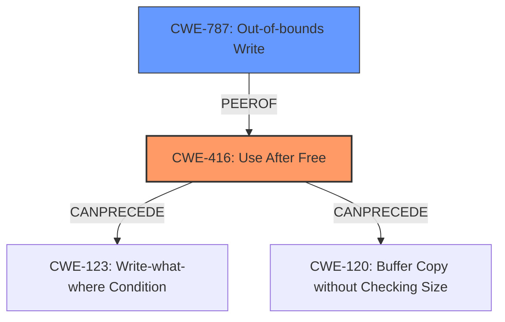

# Raw Analyzer Response for CVE-2020-0674

# Summary
| CWE ID | CWE Name | Confidence | CWE Abstraction Level | CWE Vulnerability Mapping Label | CWE-Vulnerability Mapping Notes |
|---|---|---|---|---|---|
| CWE-416 | Use After Free | 0.9 | Variant | Allowed | Primary CWE |
| CWE-787 | Out-of-bounds Write | 0.7 | Base | Allowed | Secondary Candidate |

## Evidence and Confidence

*   **Confidence Score:** 0.9
*   **Evidence Strength:** HIGH

## Relationship Analysis
The primary CWE is CWE-416, a Variant level weakness indicating a use-after-free condition, where memory is accessed after it has been freed. CWE-787, an Out-of-bounds Write, is a base level weakness and a potential consequence of memory corruption which can happen in this type of vulnerability. CWE-416 can precede CWE-123 (Write-what-where Condition) or CWE-120 (Buffer Copy without Checking Size).

## Vulnerability Chain
The vulnerability chain starts with the **improper handling of objects in memory**, leading to a use-after-free condition (CWE-416). This can potentially lead to an out-of-bounds write (CWE-787) and ultimately remote code execution.

## Summary of Analysis
The initial assessment focused on the **improper handling of objects in memory** which is the root cause, as stated in the vulnerability description key phrases. The primary CWE match from similar CVE descriptions is CWE-787 (Out-of-bounds Write). However, the CVE Reference Links Content Summary for CVE-2020-0674 indicates a "Use-after-free vulnerability in the legacy jscript engine." This suggests that the **improper handling of objects in memory** leads to memory being freed prematurely, and then accessed, causing a use-after-free.

The graph relationships show that CWE-416 (Use After Free) can precede CWE-123 (Write-what-where Condition), indicating a potential chain of events. While CWE-787 is a popular match, the more specific root cause described in the reference link points to a use-after-free condition. Therefore, CWE-416 is selected as the primary CWE, with CWE-787 as a potential consequence. This decision is based on the evidence from the CVE reference link, which provides more detail about the **weakness** than the generic description.

CWE-190, CWE-131, CWE-362, CWE-364, CWE-680, CWE-681, CWE-667, CWE-703, CWE-191, CWE-197, CWE-125, CWE-170, CWE-1284, CWE-825 were considered, but these were not selected because they did not match the specific vulnerability of a use-after-free condition due to **improper handling of objects in memory**.

Relevant CWE Information:

# Enhanced Context (25 CWEs)

## CWE-191: Integer Underflow (Wrap or Wraparound)
**Abstraction Level**: Base
**Similarity Score**: 0.79
**Source**: dense

**Description**:
The product subtracts one value from another, such that the result is less than the minimum allowable integer value, which produces a value that is not equal to the correct result.

**Mapping Guidance**:
- Usage: Allowed
- Rationale: This CWE entry is at the Base level of abstraction, which is a preferred level of abstraction for mapping to the root causes of vulnerabilities.

## CWE-197: Numeric Truncation Error
**Abstraction Level**: Base
**Similarity Score**: 0.76
**Source**: dense

**Description**:
Truncation errors occur when a primitive is cast to a primitive of a smaller size and data is lost in the conversion.

**Mapping Guidance**:
- Usage: Allowed
- Rationale: This CWE entry is at the Base level of abstraction, which is a preferred level of abstraction for mapping to the root causes of vulnerabilities.

## CWE-366: Race Condition within a Thread
**Abstraction Level**: Base
**Similarity Score**: 0.76
**Source**: dense

**Description**:
If two threads of execution use a resource simultaneously, there exists the possibility that resources may be used while invalid, in turn making the state of execution undefined.

**Mapping Guidance**:
- Usage: Allowed
- Rationale: This CWE entry is at the Base level of abstraction, which is a preferred level of abstraction for mapping to the root causes of vulnerabilities.

## CWE-131: Incorrect Calculation of Buffer Size
**Abstraction Level**: Base
**Similarity Score**: 0.76
**Source**: dense

**Description**:
The product does not correctly calculate the size to be used when allocating a buffer, which could lead to a buffer overflow.

**Mapping Guidance**:
- Usage: Allowed
- Rationale: This CWE entry is at the Base level of abstraction, which is a preferred level of abstraction for mapping to the root causes of vulnerabilities.

## CWE-681: Incorrect Conversion between Numeric Types
**Abstraction Level**: Base
**Similarity Score**: 0.76
**Source**: dense

**Description**:
When converting from one data type to another, such as long to integer, data can be omitted or translated in a way that produces unexpected values. If the resulting values are used in a sensitive context, then dangerous behaviors may occur.

**Mapping Guidance**:
- Usage: Allowed
- Rationale: This CWE entry is at the Base level of abstraction, which is a preferred level of abstraction for mapping to the root causes of vulnerabilities.

## CWE-190: Integer Overflow or Wraparound
**Abstraction Level**: Base
**Similarity Score**: 0.75
**Source**: dense

**Description**:
The product performs a calculation that can
         produce an integer overflow or wraparound when the logic
         assumes that the resulting value will always be larger than
         the original value. This occurs when an integer value is
         incremented to a value that is too large to store in the
         associated representation. When this occurs, the value may
         become a very small or negative number.

**Mapping Guidance**:
- Usage: Allowed
- Rationale: This CWE entry is at the Base level of abstraction, which is a preferred level of abstraction for mapping to the root causes of vulnerabilities.

## CWE-667: Improper Locking
**Abstraction Level**: Class
**Similarity Score**: 0.75
**Source**: dense

**Description**:
The product does not properly acquire or release a lock on a resource, leading to unexpected resource state changes and behaviors.

**Mapping Guidance**:
- Usage: Allowed-with-Review
- Rationale: This CWE entry is a Class and might have Base-level children that would be more appropriate

## CWE-703: Improper Check or Handling of Exceptional Conditions
**Abstraction Level**: Pillar
**Similarity Score**: 0.75
**Source**: dense

**Description**:
The product does not properly anticipate or handle exceptional conditions that rarely occur during normal operation of the product.

**Mapping Guidance**:
- Usage: Discouraged
- Rationale: This CWE entry is extremely high-level, a Pillar.

## CWE-680: Integer Overflow to Buffer Overflow
**Abstraction Level**: Compound
**Similarity Score**: 0.75
**Source**: dense

**Description**:
The product performs a calculation to determine how much memory to allocate, but an integer overflow can occur that causes less memory to be allocated than expected, leading to a buffer overflow.

**Mapping Guidance**:
- Usage: Discouraged
- Rationale: This CWE entry is a named chain, which combines multiple weaknesses.

## CWE-362: Concurrent Execution using Shared Resource with Improper Synchronization ('Race Condition')
**Abstraction Level**: Class
**Similarity Score**: 0.75
**Source**: dense

**Description**:
The product contains a concurrent code sequence that requires temporary, exclusive access to a shared resource, but a timing window exists in which the shared resource can be modified by another code sequence operating concurrently.

**Mapping Guidance**:
- Usage: Allowed-with-Review
- Rationale: This CWE entry is a Class and might have Base-level children that would be more appropriate

## CWE-364: Signal Handler Race Condition
**Abstraction Level**: Base
**Similarity Score**: 6866.43
**Source**: