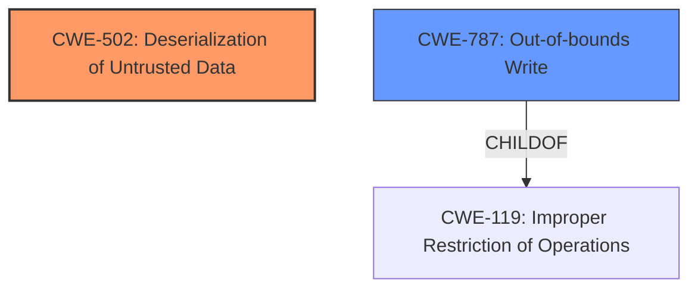

# Analysis for CVE-2020-0688

# Summary
| CWE ID | CWE Name | Confidence | CWE Abstraction Level | CWE Vulnerability Mapping Label | CWE-Vulnerability Mapping Notes |
|---|---|---|---|---|---|
| CWE-502 | Deserialization of Untrusted Data | 0.9 | Base | Primary | Allowed |
| CWE-787 | Out-of-bounds Write | 0.5 | Base | Secondary | Allowed |

## Evidence and Confidence

*   **Confidence Score:** 0.7
*   **Evidence Strength:** MEDIUM

## Relationship Analysis
The primary relationship influencing the decision is that CWE-502 is a **Base** level CWE, which is preferred. CWE-502 is also listed as the second-highest candidate from the Retriever Results.
CWE-787 is a **Base** level CWE that can result from other weaknesses.

## Vulnerability Chain
The vulnerability chain starts with the Exchange Control Panel failing to generate a unique cryptographic key, leading to deserialization of untrusted data, and potentially leading to remote code execution.

## Summary of Analysis
The initial assessment considered the vulnerability description's key phrases and the CVE reference summary, which both pointed towards **improper input handling** and **deserialization of untrusted data**. The Retriever Results also highlighted CWE-502 as a strong candidate.

The analysis focused on identifying the root cause of the vulnerability. The key evidence for selecting CWE-502 comes from the CVE Reference Links Content Summary, which states, "The vulnerability stems from Microsoft Exchange Server's Exchange Control Panel web application failing to generate a unique cryptographic key during installation. This leads to the potential for deserialization of untrusted data."

The selection of CWE-502 as the primary CWE is based on its direct relevance to the root cause described in the CVE reference summary. It accurately captures the **weakness** of deserializing untrusted data without sufficient validation, which is a critical aspect of the vulnerability.

CWE-787 was considered as a secondary CWE because the "**fails to properly handle objects in memory**" phrase in the vulnerability description can potentially result in memory corruption such as an out-of-bounds write.

The selected CWEs are at the optimal level of specificity because they accurately represent the root cause (CWE-502) and a potential consequence (CWE-787) of the vulnerability, providing a comprehensive understanding of the security flaw.

Relevant CWE Information:

# Enhanced Context (25 CWEs)
The following CWEs were identified as potentially relevant to this vulnerability:

## CWE-799: Improper Control of Interaction Frequency
**Abstraction Level**: Class
**Similarity Score**: 0.79
**Source**: dense

**Description**:
The product does not properly limit the number or frequency of interactions that it has with an actor, such as the number of incoming requests.

**Mapping Guidance**:
- Usage: Allowed-with-Review
- Rationale: This CWE entry is a Class and might have Base-level children that would be more appropriate

## CWE-1289: Improper Validation of Unsafe Equivalence in Input
**Abstraction Level**: Base
**Similarity Score**: 0.75
**Source**: dense

**Description**:
The product receives an input value that is used as a resource identifier or other type of reference, but it does not validate or incorrectly validates that the input is equivalent to a potentially-unsafe value.

**Mapping Guidance**:
- Usage: Allowed
- Rationale: This CWE entry is at the Base level of abstraction, which is a preferred level of abstraction for mapping to the root causes of vulnerabilities.

## CWE-405: Asymmetric Resource Consumption (Amplification)
**Abstraction Level**: Class
**Similarity Score**: 0.74
**Source**: dense

**Description**:
The product does not properly control situations in which an adversary can cause the product to consume or produce excessive resources without requiring the adversary to invest equivalent work or otherwise prove authorization, i.e., the adversary's influence is "asymmetric."

**Mapping Guidance**:
- Usage: Allowed-with-Review
- Rationale: This CWE entry is a Class and might have Base-level children that would be more appropriate

## CWE-807: Reliance on Untrusted Inputs in a Security Decision
**Abstraction Level**: Base
**Similarity Score**: 0.73
**Source**: dense

**Description**:
The product uses a protection mechanism that relies on the existence or values of an input, but the input can be modified by an untrusted actor in a way that bypasses the protection mechanism.

**Mapping Guidance**:
- Usage: Allowed
- Rationale: This CWE entry is at the Base level of abstraction, which is a preferred level of abstraction for mapping to the root causes of vulnerabilities.

## CWE-606: Unchecked Input for Loop Condition
**Abstraction Level**: Base
**Similarity Score**: 0.73
**Source**: dense

**Description**:
The product does not properly check inputs that are used for loop conditions, potentially leading to a denial of service or other consequences because of excessive looping.

**Mapping Guidance**:
- Usage: Allowed
- Rationale: This CWE entry is at the Base level of abstraction, which is a preferred level of abstraction for mapping to the root causes of vulnerabilities.

## CWE-1220: Insufficient Granularity of Access Control
**Abstraction Level**: Base
**Similarity Score**: 0.73
**Source**: dense

**Description**:
The product implements access controls via a policy or other feature with the intention to disable or restrict accesses (reads and/or writes) to assets in a system from untrusted agents. However, implemented access controls lack required granularity, which renders the control policy too broad because it allows accesses from unauthorized agents to the security-sensitive assets.

**Mapping Guidance**:
- Usage: Allowed
- Rationale: This CWE entry is at the Base level of abstraction, which is a preferred level of abstraction for mapping to the root causes of vulnerabilities.

## CWE-691: Insufficient Control Flow Management
**Abstraction Level**: Pillar
**Similarity Score**: 0.73
**Source**: dense

**Description**:
The code does not sufficiently manage its control flow during execution, creating conditions in which the control flow can be modified in unexpected ways.

**Mapping Guidance**:
- Usage: Discouraged
- Rationale: This CWE entry is extremely high-level, a Pillar. However, classification research is limited for weaknesses of this type, so there can be gaps or organizational difficulties within CWE that force use of this weakness, even at such a high level of abstraction.

## CWE-653: Improper Isolation or Compartmentalization
**Abstraction Level**: Class
**Similarity Score**: 0.72
**Source**: dense

**Description**:
The product does not properly compartmentalize or isolate functionality, processes, or resources that require different privilege levels, rights, or permissions.

**Mapping Guidance**:
- Usage: Allowed
- Rationale: This CWE entry is at the Base level of abstraction, which is a preferred level of abstraction for mapping to the root causes of vulnerabilities.

## CWE-664: Improper Control of a Resource Through its Lifetime
**Abstraction Level**: Pillar
**Similarity Score**: 0.72
**Source**: dense

**Description**:
The product does not maintain or incorrectly maintains control over a resource throughout its lifetime of creation, use, and release.

**Mapping Guidance**:
- Usage: Discouraged
- Rationale: This CWE entry is high-level when lower-level children are available.

## CWE-184: Incomplete List of Disallowed Inputs
**Abstraction Level**: Base
**Similarity Score**: 0.72
**Source**: dense

**Description**:
The product implements a protection mechanism that relies on a list of inputs (or properties of inputs) that are not allowed by policy or otherwise require other action to neutralize before additional processing takes place, but the list is incomplete.

**Mapping Guidance**:
- Usage: Allowed
- Rationale: This CWE entry is at the Base level of abstraction, which is a preferred level of abstraction for mapping to the root causes of vulnerabilities.

## CWE-119: Improper Restriction of Operations within the Bounds of a Memory Buffer
**Abstraction Level**: Class
**Similarity Score**: 7196.62
**Source**: sparse

**Description**:
The product performs operations on a memory buffer, but it reads from or writes to a memory location outside the buffer's intended boundary. This may result in read or write operations on unexpected memory locations that could be linked to other variables, data structures, or internal program data.

**Mapping Guidance**:
- Usage: Discouraged
- Rationale: CWE-119 is commonly misused in low-information vulnerability reports when lower-level CWEs could be used instead, or when more details about the vulnerability are available.

##