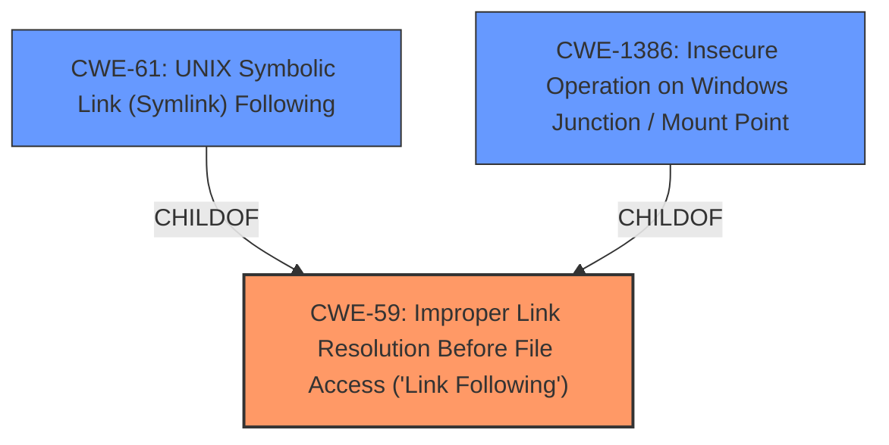

# Analysis for CVE-2020-0787

# Summary
| CWE ID  | CWE Name                                                                    | Confidence | CWE Abstraction Level | CWE Vulnerability Mapping Label | CWE-Vulnerability Mapping Notes |
| :-------- | :-------------------------------------------------------------------------- | :--------- | :-------------------- | :------------------------------ | :------------------------------ |
| CWE-59    | Improper Link Resolution Before File Access ('Link Following')             | 0.9        | Base                  | Primary CWE                     | Allowed                       |
| CWE-61    | UNIX Symbolic Link (Symlink) Following                                      | 0.6        | Compound              | Secondary                       | Allowed                       |
| CWE-1386  | Insecure Operation on Windows Junction / Mount Point                      | 0.6        | Base                  | Secondary                       | Allowed                       |

## Evidence and Confidence

*   **Confidence Score:** 0.9
*   **Evidence Strength:** MEDIUM

## Relationship Analysis
The primary weakness is CWE-59, which represents the **improper handling of symbolic links** during file access. CWE-61 (UNIX Symbolic Link Following) and CWE-1386 (Insecure Operation on Windows Junction / Mount Point) are related. CWE-61 is a compound CWE that includes CWE-59. CWE-1386 is a child of CWE-59 and represents a Windows-specific issue with junctions and mount points. The choice of CWE-59 as the primary CWE is based on the vulnerability description mentioning "symbolic links" without specifying the operating system or the presence of factors required by CWE-61.

## Vulnerability Chain
The chain of events is as follows:
1.  **Root Cause:** **Improper Handling of Symbolic Links** (CWE-59) by the Windows Background Intelligent Transfer Service (BITS).
2.  **Impact:** Elevation of Privilege.

## Summary of Analysis
The analysis is based on the provided vulnerability description, which states that the Windows BITS **improperly handles symbolic links**, leading to an elevation of privilege.

The primary CWE selected is CWE-59 (Improper Link Resolution Before File Access ('Link Following')). This is because the description directly mentions **improper handling of symbolic links**.

CWE-61 (UNIX Symbolic Link (Symlink) Following) was considered because it relates to symbolic link vulnerabilities. However, it is a compound CWE and includes factors not explicitly mentioned in the description (e.g., the need for specific conditions related to UNIX systems). Therefore, CWE-59 is a better fit as the primary weakness.

CWE-1386 (Insecure Operation on Windows Junction / Mount Point) was also considered because the vulnerability affects a Windows service. However, the description only mentions "symbolic links" and does not explicitly mention junctions or mount points, making CWE-59 a more general and appropriate choice.

The choice of CWE-59 is at the Base level of abstraction, which is preferred. The evidence, while limited, directly supports the selection of CWE-59.

Relevant CWE Information:

# Enhanced Context (25 CWEs)

## CWE-366: Race Condition within a Thread
**Abstraction Level**: Base
**Similarity Score**: 0.78
**Source**: dense

**Description**:
If two threads of execution use a resource simultaneously, there exists the possibility that resources may be used while invalid, in turn making the state of execution undefined.

**Mapping Guidance**:
- Usage: Allowed
- Rationale: This CWE entry is at the Base level of abstraction, which is a preferred level of abstraction for mapping to the root causes of vulnerabilities.

## CWE-367: Time-of-check Time-of-use (TOCTOU) Race Condition
**Abstraction Level**: Base
**Similarity Score**: 0.78
**Source**: dense

**Description**:
The product checks the state of a resource before using that resource, but the resource's state can change between the check and the use in a way that invalidates the results of the check. This can cause the product to perform invalid actions when the resource is in an unexpected state.

**Mapping Guidance**:
- Usage: Allowed
- Rationale: This CWE entry is at the Base level of abstraction, which is a preferred level of abstraction for mapping to the root causes of vulnerabilities.

## CWE-362: Concurrent Execution using Shared Resource with Improper Synchronization ('Race Condition')
**Abstraction Level**: Class
**Similarity Score**: 0.77
**Source**: dense

**Description**:
The product contains a concurrent code sequence that requires temporary, exclusive access to a shared resource, but a timing window exists in which the shared resource can be modified by another code sequence operating concurrently.

**Mapping Guidance**:
- Usage: Allowed-with-Review
- Rationale: This CWE entry is a Class and might have Base-level children that would be more appropriate

## CWE-363: Race Condition Enabling Link Following
**Abstraction Level**: Base
**Similarity Score**: 0.77
**Source**: dense

**Description**:
The product checks the status of a file or directory before accessing it, which produces a race condition in which the file can be replaced with a link before the access is performed, causing the product to access the wrong file.

**Mapping Guidance**:
- Usage: Allowed
- Rationale: This CWE entry is at the Base level of abstraction, which is a preferred level of abstraction for mapping to the root causes of vulnerabilities.

## CWE-59: Improper Link Resolution Before File Access ('Link Following')
**Abstraction Level**: Base
**Similarity Score**: 0.77
**Source**: dense

**Description**:
The product attempts to access a file based on the filename, but it does not properly prevent that filename from identifying a link or shortcut that resolves to an unintended resource.

**Mapping Guidance**:
- Usage: Allowed
- Rationale: This CWE entry is at the Base level of abstraction, which is a preferred level of abstraction for mapping to the root causes of vulnerabilities.

## CWE-667: Improper Locking
**Abstraction Level**: Class
**Similarity Score**: 0.75
**Source**: dense

**Description**:
The product does not properly acquire or release a lock on a resource, leading to unexpected resource state changes and behaviors.

**Mapping Guidance**:
- Usage: Allowed-with-Review
- Rationale: This CWE entry is a Class and might have Base-level children that would be more appropriate

## CWE-662: Improper Synchronization
**Abstraction Level**: Class
**Similarity Score**: 0.75
**Source**: dense

**Description**:
The product utilizes multiple threads or processes to allow temporary access to a shared resource that can only be exclusive to one process at a time, but it does not properly synchronize these actions, which might cause simultaneous accesses of this resource by multiple threads or processes.

**Mapping Guidance**:
- Usage: Discouraged
- Rationale: This CWE entry is a level-1 Class (i.e., a child of a Pillar). It might have lower-level children that would be more appropriate

## CWE-368: Context Switching Race Condition
**Abstraction Level**: Base
**Similarity Score**: 0.74
**Source**: dense

**Description**:
A product performs a series of non-atomic actions to switch between contexts that cross privilege or other security boundaries, but a race condition allows an attacker to modify or misrepresent the product's behavior during the switch.

**Mapping Guidance**:
- Usage: Allowed
- Rationale: This CWE entry is at the Base level of abstraction, which is a preferred level of abstraction for mapping to the root causes of vulnerabilities.

## CWE-61: UNIX Symbolic Link (Symlink) Following
**Abstraction Level**: Compound
**Similarity Score**: 0.73
**Source**: dense

**Description**:
The product, when opening a file or directory, does not sufficiently account for when the file is a symbolic link that resolves to a target outside of the intended control sphere. This could allow an attacker to cause the product to operate on unauthorized files.

**Mapping Guidance**:
- Usage: Allowed
- Rationale: This is a well-known Composite of multiple weaknesses that must all occur simultaneously, although it is attack-oriented in nature.

## CWE-404: Improper Resource Shutdown or Release
**Abstraction Level**: Class
**Similarity Score**: 0.73
**Source**: dense

**Description**:
The product does not release or incorrectly releases a resource before it is made available for re-use.

**Mapping Guidance**:
- Usage: Allowed-with-Review
- Rationale: This CWE entry is a Class and might have Base-level children that would be more appropriate

## CWE-59: Improper Link Resolution Before