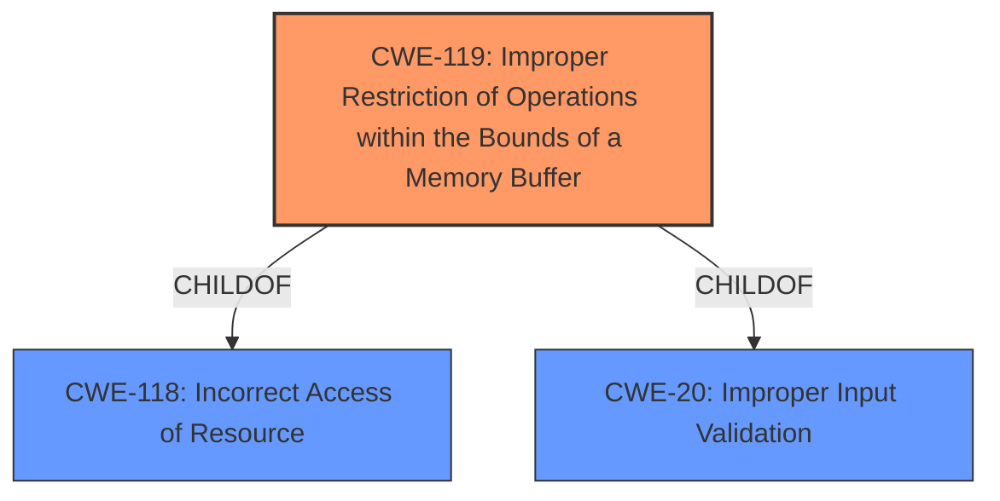

# Raw Analyzer Response for CVE-2020-0796

# Summary
| CWE ID | CWE Name | Confidence | CWE Abstraction Level | CWE Vulnerability Mapping Label | CWE-Vulnerability Mapping Notes |
|---|---|---|---|---|---|
| CWE-119 | Improper Restriction of Operations within the Bounds of a Memory Buffer | 0.7 | Class | Primary | Discouraged usage, but matches the description of memory operations outside the intended boundary. |

## Evidence and Confidence

*   **Confidence Score:** 0.7
*   **Evidence Strength:** LOW

## Relationship Analysis
The primary CWE, CWE-119, is a Class-level CWE, which suggests that more specific CWEs might be applicable if more information were available.

## Vulnerability Chain
The chain of events is not clear from the description. It indicates a vulnerability in how SMBv3 handles certain requests, leading to remote code execution. The **ROOT CAUSE** appears to be related to the handling of requests, but the precise nature of the **WEAKNESS** is not specified.

## Summary of Analysis
The analysis is limited by the lack of detailed information in the vulnerability description and the CVE reference links. The description mentions a remote code execution vulnerability in SMBv3 related to how it handles certain requests. Without more information, it is difficult to pinpoint the exact **ROOT CAUSE** of the vulnerability, but it seems to involve improper handling of memory buffers.

The assigned CWE, CWE-119, is based on the general description of memory buffer handling.

The retriever results suggested several CWEs, including CWE-918, CWE-78, CWE-23, CWE-20, CWE-88, CWE-502, and CWE-1284. However, these options are not specific enough given the limited information.

The choice of CWE-119 is influenced by its description: "The product performs operations on a memory buffer, but it reads from or writes to a memory location outside the buffer's intended boundary." While the evidence is weak, this aligns with a potential memory corruption issue within SMBv3's request handling.

Relevant CWE Information:
The following CWEs were considered:
* CWE-20: Improper Input Validation - This is a very general CWE and doesn't accurately describe the specific vulnerability.
* CWE-78: Improper Neutralization of Special Elements used in an OS Command ('OS Command Injection') - This CWE relates to command injection, which is not directly indicated in the description.
* CWE-22: Improper Limitation of a Pathname to a Restricted Directory ('Path Traversal') - Path traversal is not mentioned in the vulnerability description.
* CWE-770: Allocation of Resources Without Limits or Throttling - Resource allocation issues are not directly indicated.
* CWE-1284: Improper Validation of Specified Quantity in Input - Quantity validation issues are not evident from the description.
* CWE-59: Improper Link Resolution Before File Access ('Link Following') - Link following is not applicable based on the information provided.
* CWE-789: Memory Allocation with Excessive Size Value - While related to memory, it's too specific without concrete evidence.
* CWE-88: Improper Neutralization of Argument Delimiters in a Command ('Argument Injection') - Argument injection isn't directly implied.
* CWE-611: Improper Restriction of XML External Entity Reference - This is specific to XML, which is not mentioned.
* CWE-918: Server-Side Request Forgery (SSRF) - Not directly related to the vulnerability description.
* CWE-1284: Improper Validation of Specified Quantity in Input - Input quantity validation issues are not directly indicated.
* CWE-345: Insufficient Verification of Data Authenticity - Data authenticity is not directly mentioned.
* CWE-23: Relative Path Traversal - Path traversal is not indicated.
* CWE-78: Improper Neutralization of Special Elements used in an OS Command ('OS Command Injection') - Command injection isn't directly mentioned.
* CWE-190: Integer Overflow or Wraparound - Integer overflow is not directly indicated.
* CWE-23: Relative Path Traversal - Path traversal is not indicated.
* CWE-1284: Improper Validation of Specified Quantity in Input - Input quantity validation issues are not directly indicated.
* CWE-190: Integer Overflow or Wraparound - Integer overflow is not directly indicated.
* CWE-23: Relative Path Traversal - Path traversal is not indicated.
* CWE-184: Incomplete List of Disallowed Inputs - No evidence to support this.
* CWE-138: Improper Neutralization of Special Elements - Too generic, like CWE-20.
* CWE-807: Reliance on Untrusted Inputs in a Security Decision - Not specifically indicated.
* CWE-41: Improper Resolution of Path Equivalence - Not applicable based on description.
* CWE-183: Permissive List of Allowed Inputs - Not applicable based on description.
* CWE-115: Misinterpretation of Input - Too generic, like CWE-20.
* CWE-73: External Control of File Name or Path - Not applicable based on description.
* CWE-74: Improper Neutralization of Special Elements - Too generic, like CWE-20.
* CWE-1289: Improper Validation of Unsafe Equivalence in Input - No evidence to support this.

The selected CWE is at the optimal level of specificity given the limited information. Further investigation would be needed to determine a more precise **ROOT CAUSE**.