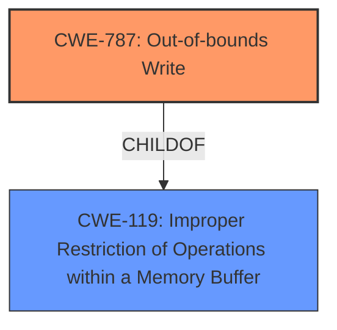

# Enhanced Analysis for CVE-2020-0878

# Summary
| CWE ID | CWE Name | Confidence | CWE Abstraction Level | CWE Vulnerability Mapping Label | CWE-Vulnerability Mapping Notes |
|---|---|---|---|---|---|
| CWE-787 | Out-of-bounds Write | 0.8 | Base | Primary | Allowed |
| CWE-119 | Improper Restriction of Operations within a Memory Buffer | 0.6 | Class | Secondary | Allowed |

## Evidence and Confidence

*   **Confidence Score:** 0.7
*   **Evidence Strength:** MEDIUM

## Relationship Analysis
The primary CWE is CWE-787, which is a base-level CWE that accurately represents the **improper memory access** described in the vulnerability. CWE-787 is a child of CWE-119 (Improper Restriction of Operations within a Memory Buffer), a more general class-level CWE. The vulnerability description indicates that the **improper memory access** could lead to arbitrary code execution, suggesting an out-of-bounds write condition.



## Vulnerability Chain
The vulnerability chain starts with **improper memory access** (**rootcause**) which leads to out-of-bounds write, finally allowing remote code execution.

## Summary of Analysis
The analysis is based on the vulnerability description, which highlights **improper memory access** as the root cause. The description strongly suggests an out-of-bounds write scenario where an attacker can overwrite memory, leading to arbitrary code execution.

The primary CWE selected is CWE-787 (Out-of-bounds Write), which is a base-level CWE that accurately represents the weakness. The vulnerability description states that the "vulnerability could corrupt memory in a way that could allow an attacker to execute arbitrary code." This aligns directly with the characteristics of CWE-787.

The relationship graph shows that CWE-787 is a child of CWE-119 (Improper Restriction of Operations within a Memory Buffer). While CWE-119 is a broader category, CWE-787 provides a more specific and accurate representation of the vulnerability.

Other CWEs Considered but Not Used:

*   CWE-23 (Relative Path Traversal): This CWE is not applicable because the vulnerability involves **improper memory access**, not file path manipulation.
*   CWE-59 (Improper Link Resolution Before File Access ('Link Following')): This CWE is not applicable because the vulnerability does not involve symbolic links.
*   CWE-732 (Incorrect Permission Assignment for Critical Resource): This CWE is not applicable because the vulnerability involves **improper memory access**, not permission issues.
*   CWE-863 (Incorrect Authorization): This CWE is not applicable because the vulnerability does not involve authorization checks.
*   CWE-502 (Deserialization of Untrusted Data): This CWE is not applicable because the vulnerability does not involve deserialization.
*   CWE-269 (Improper Privilege Management) and CWE-287 (Improper Authentication): These CWEs are Class-level and are discouraged for use when more specific Base or Variant level CWEs are available. The vulnerability involves **improper memory access**, not privilege or authentication issues.

The selection of CWE-787 is at the optimal level of specificity because it directly describes the **root cause** of the vulnerability (**improper memory access** leading to out-of-bounds write).
Relevant CWE Information:

# Enhanced Context (25 CWEs)
The following CWEs were identified as potentially relevant to this vulnerability:

## CWE-274: Improper Handling of Insufficient Privileges
**Abstraction Level**: Base
**Similarity Score**: 0.77
**Source**: dense

**Description**:
The product does not handle or incorrectly handles when it has insufficient privileges to perform an operation, leading to resultant weaknesses.

**Mapping Guidance**:
- Usage: Discouraged
- Rationale: This CWE entry could be deprecated in a future version of CWE.


## CWE-653: Improper Isolation or Compartmentalization
**Abstraction Level**: Class
**Similarity Score**: 0.77
**Source**: dense

**Description**:
The product does not properly compartmentalize or isolate functionality, processes, or resources that require different privilege levels, rights, or permissions.

**Mapping Guidance**:
- Usage: Allowed
- Rationale: This CWE entry is at the Base level of abstraction, which is a preferred level of abstraction for mapping to the root causes of vulnerabilities.


## CWE-280: Improper Handling of Insufficient Permissions or Privileges 
**Abstraction Level**: Base
**Similarity Score**: 0.76
**Source**: dense

**Description**:
The product does not handle or incorrectly handles when it has insufficient privileges to access resources or functionality as specified by their permissions. This may cause it to follow unexpected code paths that may leave the product in an invalid state.

**Mapping Guidance**:
- Usage: Allowed
- Rationale: This CWE entry is at the Base level of abstraction, which is a preferred level of abstraction for mapping to the root causes of vulnerabilities.


## CWE-266: Incorrect Privilege Assignment
**Abstraction Level**: Base
**Similarity Score**: 0.76
**Source**: dense

**Description**:
A product incorrectly assigns a privilege to a particular actor, creating an unintended sphere of control for that actor.

**Mapping Guidance**:
- Usage: Allowed
- Rationale: This CWE entry is at the Base level of abstraction, which is a preferred level of abstraction for mapping to the root causes of vulnerabilities.


## CWE-807: Reliance on Untrusted Inputs in a Security Decision
**Abstraction Level**: Base
**Similarity Score**: 0.76
**Source**: dense

**Description**:
The product uses a protection mechanism that relies on the existence or values of an input, but the input can be modified by an untrusted actor in a way that bypasses the protection mechanism.

**Mapping Guidance**:
- Usage: Allowed
- Rationale: This CWE entry is at the Base level of abstraction, which is a preferred level of abstraction for mapping to the root causes of vulnerabilities.


## CWE-639: Authorization Bypass Through User-Controlled Key
**Abstraction Level**: Base
**Similarity Score**: 0.76
**Source**: dense

**Description**:
The system's authorization functionality does not prevent one user from gaining access to another user's data or record by modifying the key value identifying the data.

**Mapping Guidance**:
- Usage: Allowed
- Rationale: This CWE entry is at the Base level of abstraction, which is a preferred level of abstraction for mapping to the root causes of vulnerabilities.


## CWE-303: Incorrect Implementation of Authentication Algorithm
**Abstraction Level**: Base
**Similarity Score**: 0.76
**Source**: dense

**Description**:
The requirements for the product dictate the use of an established authentication algorithm, but the implementation of the algorithm is incorrect.

**Mapping Guidance**:
- Usage: Allowed
- Rationale: This CWE entry is at the Base level of abstraction, which is a preferred level of abstraction for mapping to the root causes of vulnerabilities.


## CWE-1289: Improper Validation of Unsafe Equivalence in Input
**Abstraction Level**: Base
**Similarity Score**: 0.76
**Source**: dense

**Description**:
The product receives an input value that is used as a resource identifier or other type of reference, but it does not validate or incorrectly validates that the input is equivalent to a potentially-unsafe value.

**Mapping Guidance**:
- Usage: Allowed
- Rationale: This CWE entry is at the Base level of abstraction, which is a preferred level of abstraction for mapping to the root causes of vulnerabilities.


## CWE-668: Exposure of Resource to Wrong Sphere
**Abstraction Level**: Class
**Similarity Score**: 0.76
**Source**: dense

**Description**:
The product exposes a resource to the wrong control sphere, providing unintended actors with inappropriate access to the resource.

**Mapping Guidance**:
- Usage: Discouraged
- Rationale: CWE-668 is high-level and is often misused as a catch-all when lower-level CWE IDs might be applicable. It is sometimes used for low-information vulnerability reports [REF-1287]. It is a level-1 Class (i.e., a child of a Pillar). It is not useful for trend analysis.


## CWE-267: Privilege Defined With Unsafe Actions
**Abstraction Level**: Base
**Similarity Score**: 0.76
**Source**: dense

**Description**:
A particular privilege, role, capability, or right can be used to perform unsafe actions that were not intended, even when it is assigned to the correct entity.

**Mapping Guidance**:
- Usage: Allowed
- Rationale: This CWE entry is at the Base level of abstraction, which is a preferred level of abstraction for mapping to the root causes of vulnerabilities.


## CWE-23: Relative Path Traversal
**


## CWE Relationship Analysis

Current CWEs represent these abstraction levels: .


### Vulnerability Chain Analysis

**Chain starting from CWE-502:**
- 502 (Deserialization of Untrusted Data) - ROOT


**Chain starting from CWE-787:**
- 787 (Out-of-bounds Write) - ROOT


### CWE Relationship Diagram

```mermaid
graph TD
    classDef primary fill:#f96,stroke:#333,stroke-width:2px
    classDef secondary fill:#69f,stroke:#333
    classDef tertiary fill:#9e9,stroke:#333
```