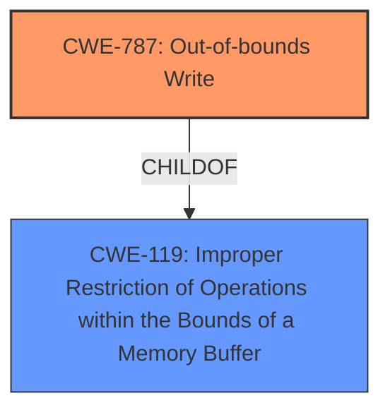

# Analysis for CVE-2020-0938

# Summary
| CWE ID | CWE Name | Confidence | CWE Abstraction Level | CWE Vulnerability Mapping Label | CWE-Vulnerability Mapping Notes |
|---|---|---|---|---|---|
| CWE-787 | Out-of-bounds Write | 1.0 | Base | Allowed | Primary CWE |
| CWE-119 | Improper Restriction of Operations within the Bounds of a Memory Buffer | 0.7 | Class | Allowed | Secondary CWE |

## Evidence and Confidence

*   **Confidence Score:** 1.0
*   **Evidence Strength:** HIGH

## Relationship Analysis
The primary CWE is CWE-787, which is a Base level CWE and a child of CWE-119. The vulnerability description points to an **improper handling** of a font, which leads to writing outside the intended buffer.

## Vulnerability Chain
The vulnerability chain starts with the **improper handling** of a specially-crafted font, leading to an out-of-bounds write (CWE-787), which in turn enables remote code execution.

## Summary of Analysis
The initial analysis, based on the vulnerability description and key phrases, points towards a memory corruption issue due to **improper handling** of a font. The description states the Windows Adobe Type Manager Library **improperly handles a specially-crafted multi-master font - Adobe Type 1 PostScript format**. This **improper handling** leads to an out-of-bounds write (CWE-787) condition, allowing an attacker to execute code remotely.

The evidence is strong, with the vulnerability description explicitly mentioning **improper handling** of a font and the resulting remote code execution. The primary CWE match in similar CVE descriptions is CWE-787. The Retriever Results also list CWE-787 as a high-ranking candidate.

CWE-787 is at the optimal level of specificity (Base) as it directly describes the **out-of-bounds write** condition caused by the **improper handling** of the font.

Relevant CWE Information:

# Enhanced Context (25 CWEs)

## CWE-59: Improper Link Resolution Before File Access ('Link Following')
**Abstraction Level**: Base
**Similarity Score**: 0.82
**Source**: dense

**Description**:
The product attempts to access a file based on the filename, but it does not properly prevent that filename from identifying a link or shortcut that resolves to an unintended resource.

**Mapping Guidance**:
- Usage: Allowed
- Rationale: This CWE entry is at the Base level of abstraction, which is a preferred level of abstraction for mapping to the root causes of vulnerabilities.

## CWE-41: Improper Resolution of Path Equivalence
**Abstraction Level**: Base
**Similarity Score**: 0.80
**Source**: dense

**Description**:
The product is vulnerable to file system contents disclosure through path equivalence. Path equivalence involves the use of special characters in file and directory names. The associated manipulations are intended to generate multiple names for the same object.

**Mapping Guidance**:
- Usage: Allowed
- Rationale: This CWE entry is at the Base level of abstraction, which is a preferred level of abstraction for mapping to the root causes of vulnerabilities.

## CWE-73: External Control of File Name or Path
**Abstraction Level**: Base
**Similarity Score**: 0.79
**Source**: dense

**Description**:
The product allows user input to control or influence paths or file names that are used in filesystem operations.

**Mapping Guidance**:
- Usage: Allowed
- Rationale: This CWE entry is at the Base level of abstraction, which is a preferred level of abstraction for mapping to the root causes of vulnerabilities.

## CWE-23: Relative Path Traversal
**Abstraction Level**: Base
**Similarity Score**: 0.78
**Source**: dense

**Description**:
The product uses external input to construct a pathname that should be within a restricted directory, but it does not properly neutralize sequences such as ".." that can resolve to a location that is outside of that directory.

**Mapping Guidance**:
- Usage: Allowed
- Rationale: This CWE entry is at the Base level of abstraction, which is a preferred level of abstraction for mapping to the root causes of vulnerabilities.

## CWE-61: UNIX Symbolic Link (Symlink) Following
**Abstraction Level**: Compound
**Similarity Score**: 0.78
**Source**: dense

**Description**:
The product, when opening a file or directory, does not sufficiently account for when the file is a symbolic link that resolves to a target outside of the intended control sphere. This could allow an attacker to cause the product to operate on unauthorized files.

**Mapping Guidance**:
- Usage: Allowed
- Rationale: This is a well-known Composite of multiple weaknesses that must all occur simultaneously, although it is attack-oriented in nature.

## CWE-1289: Improper Validation of Unsafe Equivalence in Input
**Abstraction Level**: Base
**Similarity Score**: 0.78
**Source**: dense

**Description**:
The product receives an input value that is used as a resource identifier or other type of reference, but it does not validate or incorrectly validates that the input is equivalent to a potentially-unsafe value.

**Mapping Guidance**:
- Usage: Allowed
- Rationale: This CWE entry is at the Base level of abstraction, which is a preferred level of abstraction for mapping to the root causes of vulnerabilities.

## CWE-184: Incomplete List of Disallowed Inputs
**Abstraction Level**: Base
**Similarity Score**: 0.78
**Source**: dense

**Description**:
The product implements a protection mechanism that relies on a list of inputs (or properties of inputs) that are not allowed by policy or otherwise require other action to neutralize before additional processing takes place, but the list is incomplete.

**Mapping Guidance**:
- Usage: Allowed
- Rationale: This CWE entry is at the Base level of abstraction, which is a preferred level of abstraction for mapping to the root causes of vulnerabilities.

## CWE-427: Uncontrolled Search Path Element
**Abstraction Level**: Base
**Similarity Score**: 0.77
**Source**: dense

**Description**:
The product uses a fixed or controlled search path to find resources, but one or more locations in that path can be under the control of unintended actors.

**Mapping Guidance**:
- Usage: Allowed
- Rationale: This CWE entry is at the Base level of abstraction, which is a preferred level of abstraction for mapping to the root causes of vulnerabilities.

## CWE-74: Improper Neutralization of Special Elements in Output Used by a Downstream Component ('Injection')
**Abstraction Level**: Class
**Similarity Score**: 0.77
**Source**: dense

**Description**:
The product constructs all or part of a command, data structure, or record using externally-influenced input from an upstream component, but it does not neutralize or incorrectly neutralizes special elements that could modify how it is parsed or interpreted when it is sent to a downstream component.

**Mapping Guidance**:
- Usage: Discouraged
- Rationale: CWE-74 is high-level and often misused when lower-level weaknesses are more appropriate.

## CWE-125: Out-of-bounds Read
**Abstraction Level**: Base
**Similarity Score**: 0.77
**Source**: dense

**Description**:
The product reads data past the end, or before the beginning, of the intended buffer.

**Mapping Guidance**:
- Usage: Allowed
- Rationale: This CWE entry is at the Base level of abstraction, which is a preferred level of abstraction for mapping to the root causes of vulnerabilities.

## CWE-427: Uncontrolled Search Path Element
**Abstraction Level**: Base
**Similarity Score**: 7792.56
**Source**: sparse

**Description**:
The product uses a fixed or controlled search path to find resources, but one or more locations in that path can be under the control of unintended actors.

**Mapping Guidance**:
- Usage: Allowed
- Rationale: This CWE entry is at the Base level of abstraction, which is a preferred level of abstraction for mapping to the root causes of vulnerabilities.

## CWE-22: Improper Limitation of a Pathname to a Restricted Directory ('Path Traversal')
**Abstraction Level**: Base
**Similarity Score**: 7090.22
**Source**: sparse

**Description**:
The product uses external input to construct a pathname that is intended to identify a file or directory that is located underneath a restricted parent directory, but the product does not properly neutralize special elements within the pathname that can cause the pathname to resolve to a location that is outside of the restricted directory.

**Mapping Guidance**:
- Usage: Allowed
- Rationale: This CWE entry is at the Base level of abstraction, which is a preferred level of abstraction for mapping to

# Enhanced Query for CVE-2020-0938

## Vulnerability Description
A remote code execution vulnerability exists in Microsoft Windows when the Windows Adobe Type Manager Library **improperly handles a specially-crafted multi-master font - Adobe Type 1 PostScript format**.For all systems except Windows 10, an attacker who successfully exploited the vulnerability could execute code remotely, aka 'Adobe Font Manager Library Remote Code Execution Vulnerability'. This CVE ID is unique from CVE-2020-1020.

### Vulnerability Description Key Phrases
- **rootcause:** **improperly handles a specially-crafted multi-master font - Adobe Type 1 PostScript format**
- **impact:** execute code remotely
- **attacker:** attacker
- **product:** Microsoft Windows
- **component:** Windows Adobe Type Manager Library

### CWE for similar CVE Descriptions
### Primary CWE Match
CWE-787

#### Top CWEs
- CWE-787 (Count: 9)

## CVE Reference Links Content Summary
Based on the provided content, here's an analysis for CVE-2020-0938:

**Analysis:**

The content consists of two parts:

1.  A message indicating JavaScript is required to run an application. This is unrelated to CVE-2020-0938.
2.  A lockout message from packetstormsecurity.com indicating a 24-hour lockout due to exceeding rate limiting controls or repeated failed hacking attempts. This is also unrelated to CVE-2020-0938.

**Conclusion:**

UNRELATED

## Retriever Results

### Top Combined Results

| Rank | CWE ID | Name | Abstraction | Usage  | Retrievers | Individual Scores |
|------|--------|------|-------------|-------|------------|-------------------|
| 1 | 121 | Stack-based Buffer Overflow | Variant | Allowed | sparse | 0.407 |
| 2 | 787 | Out-of-bounds Write | Base | Allowed | sparse | 0.399 |
| 3 | 122 | Heap-based Buffer Overflow | Variant | Allowed | sparse | 0.346 |
| 4 | 665 | Improper Initialization | Class | Discouraged | sparse | 0.339 |
| 5 | 788 | Access of Memory Location After End of Buffer | Base | Discouraged | sparse | 0.337 |
| 6 | 427 | Uncontrolled Search Path Element | Base | Allowed | dense | 0.559 |
| 7 | 98 | Improper Control of Filename for Include/Require Statement in PHP Program ('PHP Remote File Inclusion') | Variant | Allowed | graph | 0.002 |
| 8 | 20 | Improper Input Validation | Class | Discouraged | sparse | 0.334 |
| 9 | 138 | Improper Neutralization of Special Elements | Class | Discouraged | sparse | 0.334 |
| 10 | 59 | Improper Link Resolution Before File Access ('Link Following') | Base | Allowed | sparse | 0.330 |

# Complete CWE Specifications

## CWE-121: Stack-based Buffer Overflow
**Abstraction:** Variant
**Status:** Draft

### Description
A stack-based buffer overflow condition is a condition where the buffer being overwritten is allocated on the stack (i.e., is a local variable or, rarely, a parameter to a function).

### Extended Description
Not provided

### Alternative Terms
Stack Overflow: "Stack Overflow" is often used to mean the same thing as stack-based buffer overflow, however it is also used on occasion to mean stack exhaustion, usually a result from an excessively recursive function call. Due to the ambiguity of the term, use of stack overflow to describe either circumstance is discouraged.

### Relationships
ChildOf -> CWE-788
ChildOf -> CWE-787

### Mapping Guidance
**Usage:** Allowed
**Rationale:** This CWE entry is at the Variant level of abstraction, which is a preferred level of abstraction for mapping to the root causes of vulnerabilities.
**Comments:** Carefully read both the name and description to ensure that this mapping is an appropriate fit. Do not try to 'force' a mapping to a lower-level Base/Variant simply to comply with this preferred level of abstraction.
**Reasons:**
- Acceptable-Use

### Additional Notes
**[Other]** Stack-based buffer overflows can instantiate in return address overwrites, stack pointer overwrites or frame pointer overwrites. They can also be considered function pointer overwrites, array indexer overwrites or write-what-where condition, etc.

### Observed Examples
- **CVE-2021-35395:** Stack-based buffer overflows in SFK for wifi chipset used for IoT/embedded devices, as exploited in the wild per CISA KEV.

## CWE-787: Out-of-bounds Write
**Abstraction:** Base
**Status:** Draft

### Description
The product writes data past the end, or before the beginning, of the intended buffer.

### Extended Description
Not provided

### Alternative Terms
Memory Corruption: Often used to describe the consequences of writing to memory outside the bounds of a buffer, or to memory that is otherwise invalid.

### Relationships
ChildOf -> CWE-119
ChildOf -> CWE-119
ChildOf -> CWE-119
ChildOf -> CWE-119

### Mapping Guidance
**Usage:** Allowed
**Rationale:** This CWE entry is at the Base level of abstraction, which is a preferred level of abstraction for mapping to the root causes of vulnerabilities.
**Comments:** Carefully read both the name and description to ensure that this mapping is an appropriate fit. Do not try to 'force' a mapping to a lower-level Base/Variant simply to comply with this preferred level of abstraction.
**Reasons:**
- Acceptable-Use

### Observed Examples
- **CVE-2023-1017:** The reference implementation code for a Trusted Platform Module does not implement length checks on data, allowing for an attacker to write 2 bytes past the end of a buffer.
- **CVE-2021-21220:** Chain: insufficient input validation (CWE-20) in browser allows heap corruption (CWE-787), as exploited in the wild per CISA KEV.
- **CVE-2021-28664:** GPU kernel driver allows memory corruption because a user can obtain read/write access to read-only pages, as exploited in the wild per CISA KEV.

## CWE-122: Heap-based Buffer Overflow
**Abstraction:** Variant
**Status:** Draft

### Description
A heap overflow condition is a buffer overflow, where the buffer that can be overwritten is allocated in the heap portion of memory, generally meaning that the buffer was allocated using a routine such as malloc().

### Extended Description
Not provided

### Alternative Terms
None

### Relationships
ChildOf -> CWE-788
ChildOf -> CWE-787

### Mapping Guidance
**Usage:** Allowed
**Rationale:** This CWE entry is at the Variant level of abstraction, which is a preferred level of abstraction for mapping to the root causes of vulnerabilities.
**Comments:** Carefully read both the name and description to ensure that this mapping is an appropriate fit. Do not try to 'force' a mapping to a lower-level Base/Variant simply to comply with this preferred level of abstraction.
**Reasons:**
- Acceptable-Use

### Additional Notes
**[Relationship]** Heap-based buffer overflows are usually just as dangerous as stack-based buffer overflows.

### Observed Examples
- **CVE-2021-43537:** Chain: in a web browser, an unsigned 64-bit integer is forcibly cast to a 32-bit integer (CWE-681) and potentially leading to an integer overflow (CWE-190). If an integer overflow occurs, this can cause heap memory corruption (CWE-122)
- **CVE-2007-4268:** Chain: integer signedness error (CWE-195) passes signed comparison, leading to heap overflow (CWE-122)
- **CVE-2009-2523:** Chain: product does not handle when an input string is not NULL terminated (CWE-170), leading to buffer over-read (CWE-125) or heap-based buffer overflow (CWE-122).

## CWE-665: Improper Initialization
**Abstraction:** Class
**Status:** Draft

### Description
The product does not initialize or incorrectly initializes a resource, which might leave the resource in an unexpected state when it is accessed or used.

### Extended Description
This can have security implications when the associated resource is expected to have certain properties or values, such as a variable that determines whether a user has been authenticated or not.

### Alternative Terms
None

### Relationships
ChildOf -> CWE-664

### Mapping Guidance
**Usage:** Discouraged
**Rationale:** This CWE entry is a level-1 Class (i.e., a child of a Pillar). It might have lower-level children that would be more appropriate
**Comments:** Examine children of this entry to see if there is a better fit
**Reasons:**
- Abstraction

### Observed Examples
- **CVE-2001-1471:** chain: an invalid value prevents a library file from being included, skipping initialization of key variables, leading to resultant eval injection.
- **CVE-2008-3637:** Improper error checking in protection mechanism produces an uninitialized variable, allowing security bypass and code execution.
- **CVE-2008-4197:** Use of uninitialized memory may allow code execution.

## CWE-788: Access of Memory Location After End of Buffer
**Abstraction:** Base
**Status:** Incomplete

### Description
The product reads or writes to a buffer using an index or pointer that references a memory location after the end of the buffer.

### Extended Description
This typically occurs when a pointer or its index is incremented to a position after the buffer; or when pointer arithmetic results in a position after the buffer.

### Alternative Terms
None

### Relationships
ChildOf -> CWE-119
ChildOf -> CWE-119
ChildOf -> CWE-119

### Mapping Guidance
**Usage:** Discouraged
**Rationale:** The CWE entry might be misused when lower-level CWE entries might be available. It also overlaps existing CWE entries and might be deprecated in the future.
**Comments:** If the "Access" operation is known to be a read or a write, then investigate children of entries such as CWE-787: Out-of-bounds Write and CWE-125: Out-of-bounds Read.
**Reasons:**
- Potential Deprecation
- Frequent Misuse

### Observed Examples
- **CVE-2009-2550:** Classic stack-based buffer overflow in media player using a long entry in a playlist
- **CVE-2009-2403:** Heap-based buffer overflow in media player using a long entry in a playlist
- **CVE-2009-0689:** large precision value in a format string triggers overflow

## CWE-427: Uncontrolled Search Path Element
**Abstraction:** Base
**Status:** Draft

### Description
The product uses a fixed or controlled search path to find resources, but one or more locations in that path can be under the control of unintended actors.

### Extended Description

Although this weakness can occur with any type of resource, it is frequently introduced when a product uses a directory search path to find executables or code libraries, but the path contains a directory that can be modified by an attacker, such as "/tmp" or the current working directory.

In Windows-based systems, when the LoadLibrary or LoadLibraryEx function is called with a DLL name that does not contain a fully qualified path, the function follows a search order that includes two path elements that might be uncontrolled:

  - the directory from which the program has been loaded

  - the current working directory

In some cases, the attack can be conducted remotely, such as when SMB or WebDAV network shares are used.

One or more locations in that path could include the Windows drive root or its subdirectories. This often exists in Linux-based code assuming the controlled nature of the root directory (/) or its subdirectories (/etc, etc), or a code that recursively accesses the parent directory. In Windows, the drive root and some of its subdirectories have weak permissions by default, which makes them uncontrolled.

In some Unix-based systems, a PATH might be created that contains an empty element, e.g. by splicing an empty variable into the PATH. This empty element can be interpreted as equivalent to the current working directory, which might be an untrusted search element.

In software package management frameworks (e.g., npm, RubyGems, or PyPi), the framework may identify dependencies on third-party libraries or other packages, then consult a repository that contains the desired package. The framework may search a public repository before a private repository. This could be exploited by attackers by placing a malicious package in the public repository that has the same name as a package from the private repository. The search path might not be directly under control of the developer relying on the framework, but this search order effectively contains an untrusted element.

### Alternative Terms
DLL preloading: This term is one of several that are used to describe exploitation of untrusted search path elements in Windows systems, which received wide attention in August 2010. From a weakness perspective, the term is imprecise because it can apply to both CWE-426 and CWE-427.
Binary planting: This term is one of several that are used to describe exploitation of untrusted search path elements in Windows systems, which received wide attention in August 2010. From a weakness perspective, the term is imprecise because it can apply to both CWE-426 and CWE-427.
Insecure library loading: This term is one of several that are used to describe exploitation of untrusted search path elements in Windows systems, which received wide attention in August 2010. From a weakness perspective, the term is imprecise because it can apply to both CWE-426 and CWE-427.
Dependency confusion: As of February 2021, this term is used to describe CWE-427 in the context of managing installation of software package dependencies, in which attackers release packages on public sites where the names are the same as package names used by private repositories, and the search for the dependent package tries the public site first, downloading untrusted code. It may also be referred to as a "substitution attack."

### Relationships
ChildOf -> CWE-668
ChildOf -> CWE-668

### Mapping Guidance
**Usage:** Allowed
**Rationale:** This CWE entry is at the Base level of abstraction, which is a preferred level of abstraction for mapping to the root causes of vulnerabilities.
**Comments:** Carefully read both the name and description to ensure that this mapping is an appropriate fit. Do not try to 'force' a mapping to a lower-level Base/Variant simply to comply with this preferred level of abstraction.
**Reasons:**
- Acceptable-Use

### Additional Notes
**[Relationship]** Unlike untrusted search path (CWE-426), which inherently involves control over the definition of a control sphere (i.e., modification of a search path), this entry concerns a fixed control sphere in which some part of the sphere may be under attacker control (i.e., the search path cannot be modified by an attacker, but one element of the path can be under attacker control).

**[Theoretical]** This weakness is not a clean fit under CWE-668 or CWE-610, which suggests that the control sphere model might need enhancement or clarification.

### Observed Examples
- **CVE-2023-25815:** chain: a change in an underlying package causes the gettext function to use implicit initialization with a hard-coded path (CWE-1419) under the user-writable C:\ drive, introducing an untrusted search path element (CWE-427) that enables spoofing of messages.
- **CVE-2022-4826:** Go-based git extension on Windows can search for and execute a malicious "..exe" in a repository because Go searches the current working directory if git.exe is not found in the PATH
- **CVE-2020-26284:** A Static Site Generator built in Go, when running on Windows, searches the current working directory for a command, possibly allowing code execution using a malicious .exe or .bat file with the name being searched

## CWE-98: Improper Control of Filename for Include/Require Statement in PHP Program ('PHP Remote File Inclusion')
**Abstraction:** Variant
**Status:** Draft

### Description
The PHP application receives input from an upstream component, but it does not restrict or incorrectly restricts the input before its usage in "require," "include," or similar functions.

### Extended Description
In certain versions and configurations of PHP, this can allow an attacker to specify a URL to a remote location from which the product will obtain the code to execute. In other cases in association with path traversal, the attacker can specify a local file that may contain executable statements that can be parsed by PHP.

### Alternative Terms
Remote file include
RFI: The Remote File Inclusion (RFI) acronym is often used by vulnerability researchers.
Local file inclusion: This term is frequently used in cases in which remote download is disabled, or when the first part of the filename is not under the attacker's control, which forces use of relative path traversal (CWE-23) attack techniques to access files that may contain previously-injected PHP code, such as web access logs.

### Relationships
ChildOf -> CWE-706
ChildOf -> CWE-829
CanPrecede -> CWE-94
CanAlsoBe -> CWE-426

### Mapping Guidance
**Usage:** Allowed
**Rationale:** This CWE entry is at the Variant level of abstraction, which is a preferred level of abstraction for mapping to the root causes of vulnerabilities.
**Comments:** Carefully read both the name and description to ensure that this mapping is an appropriate fit. Do not try to 'force' a mapping to a lower-level Base/Variant simply to comply with this preferred level of abstraction.
**Reasons:**
- Acceptable-Use

### Additional Notes
**[Relationship]** 

This is frequently a functional consequence of other weaknesses. It is usually multi-factor with other factors (e.g. MAID), although not all inclusion bugs involve assumed-immutable data. Direct request weaknesses frequently play a role.

Can overlap directory traversal in local inclusion problems.

### Observed Examples
- **CVE-2004-0285:** Modification of assumed-immutable configuration variable in include file allows file inclusion via direct request.
- **CVE-2004-0030:** Modification of assumed-immutable configuration variable in include file allows file inclusion via direct request.
- **CVE-2004-0068:** Modification of assumed-immutable configuration variable in include file allows file inclusion via direct request.

## CWE-20: Improper Input Validation
**Abstraction:** Class
**Status:** Stable

### Description
The product receives input or data, but it does
        not validate or incorrectly validates that the input has the
        properties that are required to process the data safely and
        correctly.

### Extended Description

Input validation is a frequently-used technique for checking potentially dangerous inputs in order to ensure that the inputs are safe for processing within the code, or when communicating with other components. When software does not validate input properly, an attacker is able to craft the input in a form that is not expected by the rest of the application. This will lead to parts of the system receiving unintended input, which may result in altered control flow, arbitrary control of a resource, or arbitrary code execution.

Input validation is not the only technique for processing input, however. Other techniques attempt to transform potentially-dangerous input into something safe, such as filtering (CWE-790) - which attempts to remove dangerous inputs - or encoding/escaping (CWE-116), which attempts to ensure that the input is not misinterpreted when it is included in output to another component. Other techniques exist as well (see CWE-138 for more examples.)

Input validation can be applied to:

  - raw data - strings, numbers, parameters, file contents, etc.

  - metadata - information about the raw data, such as headers or size

Data can be simple or structured. Structured data can be composed of many nested layers, composed of combinations of metadata and raw data, with other simple or structured data.

Many properties of raw data or metadata may need to be validated upon entry into the code, such as:

  - specified quantities such as size, length, frequency, price, rate, number of operations, time, etc.

  - implied or derived quantities, such as the actual size of a file instead of a specified size

  - indexes, offsets, or positions into more complex data structures

  - symbolic keys or other elements into hash tables, associative arrays, etc.

  - well-formedness, i.e. syntactic correctness - compliance with expected syntax 

  - lexical token correctness - compliance with rules for what is treated as a token

  - specified or derived type - the actual type of the input (or what the input appears to be)

  - consistency - between individual data elements, between raw data and metadata, between references, etc.

  - conformance to domain-specific rules, e.g. business logic 

  - equivalence - ensuring that equivalent inputs are treated the same

  - authenticity, ownership, or other attestations about the input, e.g. a cryptographic signature to prove the source of the data

Implied or derived properties of data must often be calculated or inferred by the code itself. Errors in deriving properties may be considered a contributing factor to improper input validation. 

Note that "input validation" has very different meanings to different people, or within different classification schemes. Caution must be used when referencing this CWE entry or mapping to it. For example, some weaknesses might involve inadvertently giving control to an attacker over an input when they should not be able to provide an input at all, but sometimes this is referred to as input validation.

Finally, it is important to emphasize that the distinctions between input validation and output escaping are often blurred, and developers must be careful to understand the difference, including how input validation is not always sufficient to prevent vulnerabilities, especially when less stringent data types must be supported, such as free-form text. Consider a SQL injection scenario in which a person's last name is inserted into a query. The name "O'Reilly" would likely pass the validation step since it is a common last name in the English language. However, this valid name cannot be directly inserted into the database because it contains the "'" apostrophe character, which would need to be escaped or otherwise transformed. In this case, removing the apostrophe might reduce the risk of SQL injection, but it would produce incorrect behavior because the wrong name would be recorded.

### Alternative Terms
None

### Relationships
ChildOf -> CWE-707
PeerOf -> CWE-345
CanPrecede -> CWE-22
CanPrecede -> CWE-41
CanPrecede -> CWE-74
CanPrecede -> CWE-119
CanPrecede -> CWE-770

### Mapping Guidance
**Usage:** Discouraged
**Rationale:** CWE-20 is commonly misused in low-information vulnerability reports when lower-level CWEs could be used instead, or when more details about the vulnerability are available [REF-1287]. It is not useful for trend analysis. It is also a level-1 Class (i.e., a child of a Pillar).
**Comments:** Consider lower-level children such as Improper Use of Validation Framework (CWE-1173) or improper validation involving specific types or properties of input such as Specified Quantity (CWE-1284); Specified Index, Position, or Offset (CWE-1285); Syntactic Correctness (CWE-1286); Specified Type (CWE-1287); Consistency within Input (CWE-1288); or Unsafe Equivalence (CWE-1289).
**Reasons:**
- Frequent Misuse
**Suggested Alternatives:**
- CWE-1284: Specified Quantity
- CWE-1285: Specified Index, Position, or Offset
- CWE-1286: Syntactic Correctness
- CWE-1287: Specified Type
- CWE-1288: Consistency within Input
- CWE-1289: Unsafe Equivalence
- CWE-116: Improper Encoding or Escaping of Output

### Additional Notes
**[Relationship]** 

CWE-116 and CWE-20 have a close association because, depending on the nature of the structured message, proper input validation can indirectly prevent special characters from changing the meaning of a structured message. For example, by validating that a numeric ID field should only contain the 0-9 characters, the programmer effectively prevents injection attacks.

**[Maintenance]** As of 2020, this entry is used more often than preferred, and it is a source of frequent confusion. It is being actively modified for CWE 4.1 and subsequent versions.

**[Maintenance]** Concepts such as validation, data transformation, and neutralization are being refined, so relationships between CWE-20 and other entries such as CWE-707 may change in future versions, along with an update to the Vulnerability Theory document.

**[Maintenance]** Input validation - whether missing or incorrect - is such an essential and widespread part of secure development that it is implicit in many different weaknesses. Traditionally, problems such as buffer overflows and XSS have been classified as input validation problems by many security professionals. However, input validation is not necessarily the only protection mechanism available for avoiding such problems, and in some cases it is not even sufficient. The CWE team has begun capturing these subtleties in chains within the Research Concepts view (CWE-1000), but more work is needed.

**[Terminology]** 

The "input validation" term is extremely common, but it is used in many different ways. In some cases its usage can obscure the real underlying weakness or otherwise hide chaining and composite relationships.

Some people use "input validation" as a general term that covers many different neutralization techniques for ensuring that input is appropriate, such as filtering, canonicalization, and escaping. Others use the term in a more narrow context to simply mean "checking if an input conforms to expectations without changing it." CWE uses this more narrow interpretation.

### Observed Examples
- **CVE-2024-37032:** Large language model (LLM) management tool does not validate the format of a digest value (CWE-1287) from a private, untrusted model registry, enabling relative path traversal (CWE-23), a.k.a. Probllama
- **CVE-2022-45918:** Chain: a learning management tool debugger uses external input to locate previous session logs (CWE-73) and does not properly validate the given path (CWE-20), allowing for filesystem path traversal using "../" sequences (CWE-24)
- **CVE-2021-30860:** Chain: improper input validation (CWE-20) leads to integer overflow (CWE-190) in mobile OS, as exploited in the wild per CISA KEV.

## CWE-138: Improper Neutralization of Special Elements
**Abstraction:** Class
**Status:** Draft

### Description
The product receives input from an upstream component, but it does not neutralize or incorrectly neutralizes special elements that could be interpreted as control elements or syntactic markers when they are sent to a downstream component.

### Extended Description
Most languages and protocols have their own special elements such as characters and reserved words. These special elements can carry control implications. If product does not prevent external control or influence over the inclusion of such special elements, the control flow of the program may be altered from what was intended. For example, both Unix and Windows interpret the symbol < ("less than") as meaning "read input from a file".

### Alternative Terms
None

### Relationships
ChildOf -> CWE-707

### Mapping Guidance
**Usage:** Discouraged
**Rationale:** This CWE entry is a level-1 Class (i.e., a child of a Pillar). It might have lower-level children that would be more appropriate
**Comments:** Examine children of this entry to see if there is a better fit
**Reasons:**
- Abstraction

### Additional Notes
**[Relationship]** This weakness can be related to interpretation conflicts or interaction errors in intermediaries (such as proxies or application firewalls) when the intermediary's model of an endpoint does not account for protocol-specific special elements.

**[Relationship]** See this entry's children for different types of special elements that have been observed at one point or another. However, it can be difficult to find suitable CVE examples. In an attempt to be complete, CWE includes some types that do not have any associated observed example.

**[Research Gap]** This weakness is probably under-studied for proprietary or custom formats. It is likely that these issues are fairly common in applications that use their own custom format for configuration files, logs, meta-data, messaging, etc. They would only be found by accident or with a focused effort based on an understanding of the format.

### Observed Examples
- **CVE-2001-0677:** Read arbitrary files from mail client by providing a special MIME header that is internally used to store pathnames for attachments.
- **CVE-2000-0703:** Setuid program does not cleanse special escape sequence before sending data to a mail program, causing the mail program to process those sequences.
- **CVE-2003-0020:** Multi-channel issue. Terminal escape sequences not filtered from log files.

## CWE-59: Improper Link Resolution Before File Access ('Link Following')
**Abstraction:** Base
**Status:** Draft

### Description
The product attempts to access a file based on the filename, but it does not properly prevent that filename from identifying a link or shortcut that resolves to an unintended resource.

### Extended Description
Not provided

### Alternative Terms
insecure temporary file: Some people use the phrase "insecure temporary file" when referring to a link following weakness, but other weaknesses can produce insecure temporary files without any symlink involvement at all.
Zip Slip: "Zip slip" is an attack that uses file archives (e.g., ZIP, tar, rar, etc.) that contain filenames with path traversal sequences that cause the files to be written outside of the directory under which the archive is expected to be extracted [REF-1282]. It is most commonly used for relative path traversal (CWE-23) and link following (CWE-59).

### Relationships
ChildOf -> CWE-706
ChildOf -> CWE-706

### Mapping Guidance
**Usage:** Allowed
**Rationale:** This CWE entry is at the Base level of abstraction, which is a preferred level of abstraction for mapping to the root causes of vulnerabilities.
**Comments:** Carefully read both the name and description to ensure that this mapping is an appropriate fit. Do not try to 'force' a mapping to a lower-level Base/Variant simply to comply with this preferred level of abstraction.
**Reasons:**
- Acceptable-Use

### Additional Notes
**[Theoretical]** 

Link following vulnerabilities are Multi-factor Vulnerabilities (MFV). They are the combination of multiple elements: file or directory permissions, filename predictability, race conditions, and in some cases, a design limitation in which there is no mechanism for performing atomic file creation operations.

Some potential factors are race conditions, permissions, and predictability.

### Observed Examples
- **CVE-1999-1386:** Some versions of Perl follow symbolic links when running with the -e option, which allows local users to overwrite arbitrary files via a symlink attack.
- **CVE-2000-1178:** Text editor follows symbolic links when creating a rescue copy during an abnormal exit, which allows local users to overwrite the files of other users.
- **CVE-2004-0217:** Antivirus update allows local users to create or append to arbitrary files via a symlink attack on a logfile.

