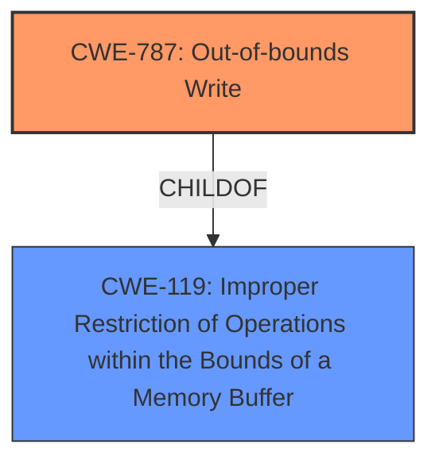

# Analysis Report for CVE-2020-0938

# Vulnerability Analysis Report: CVE-2020-0938

## Description


## Analysis (with Relationship Data)

# Summary
| CWE ID | CWE Name | Confidence | CWE Abstraction Level | CWE Vulnerability Mapping Label | CWE-Vulnerability Mapping Notes |
|---|---|---|---|---|---|
| CWE-787 | Out-of-bounds Write | 1.0 | Base | Allowed | Primary CWE |
| CWE-119 | Improper Restriction of Operations within the Bounds of a Memory Buffer | 0.7 | Class | Allowed | Secondary CWE |

## Evidence and Confidence

*   **Confidence Score:** 1.0
*   **Evidence Strength:** HIGH

## Relationship Analysis
The primary CWE is CWE-787, which is a Base level CWE and a child of CWE-119. The vulnerability description points to an **improper handling** of a font, which leads to writing outside the intended buffer.



## Vulnerability Chain
The vulnerability chain starts with the **improper handling** of a specially-crafted font, leading to an out-of-bounds write (CWE-787), which in turn enables remote code execution.

## Summary of Analysis
The initial analysis, based on the vulnerability description and key phrases, points towards a memory corruption issue due to **improper handling** of a font. The description states the Windows Adobe Type Manager Library **improperly handles a specially-crafted multi-master font - Adobe Type 1 PostScript format**. This **improper handling** leads to an out-of-bounds write (CWE-787) condition, allowing an attacker to execute code remotely.

The evidence is strong, with the vulnerability description explicitly mentioning **improper handling** of a font and the resulting remote code execution. The primary CWE match in similar CVE descriptions is CWE-787. The Retriever Results also list CWE-787 as a high-ranking candidate.

CWE-787 is at the optimal level of specificity (Base) as it directly describes the **out-of-bounds write** condition caused by the **improper handling** of the font.

Relevant CWE Information:

# Enhanced Context (25 CWEs)

## CWE-59: Improper Link Resolution Before File Access ('Link Following')
**Abstraction Level**: Base
**Similarity Score**: 0.82
**Source**: dense

**Description**:
The product attempts to access a file based on the filename, but it does not properly prevent that filename from identifying a link or shortcut that resolves to an unintended resource.

**Mapping Guidance**:
- Usage: Allowed
- Rationale: This CWE entry is at the Base level of abstraction, which is a preferred level of abstraction for mapping to the root causes of vulnerabilities.

## CWE-41: Improper Resolution of Path Equivalence
**Abstraction Level**: Base
**Similarity Score**: 0.80
**Source**: dense

**Description**:
The product is vulnerable to file system contents disclosure through path equivalence. Path equivalence involves the use of special characters in file and directory names. The associated manipulations are intended to generate multiple names for the same object.

**Mapping Guidance**:
- Usage: Allowed
- Rationale: This CWE entry is at the Base level of abstraction, which is a preferred level of abstraction for mapping to the root causes of vulnerabilities.

## CWE-73: External Control of File Name or Path
**Abstraction Level**: Base
**Similarity Score**: 0.79
**Source**: dense

**Description**:
The product allows user input to control or influence paths or file names that are used in filesystem operations.

**Mapping Guidance**:
- Usage: Allowed
- Rationale: This CWE entry is at the Base level of abstraction, which is a preferred level of abstraction for mapping to the root causes of vulnerabilities.

## CWE-23: Relative Path Traversal
**Abstraction Level**: Base
**Similarity Score**: 0.78
**Source**: dense

**Description**:
The product uses external input to construct a pathname that should be within a restricted directory, but it does not properly neutralize sequences such as ".." that can resolve to a location that is outside of that directory.

**Mapping Guidance**:
- Usage: Allowed
- Rationale: This CWE entry is at the Base level of abstraction, which is a preferred level of abstraction for mapping to the root causes of vulnerabilities.

## CWE-61: UNIX Symbolic Link (Symlink) Following
**Abstraction Level**: Compound
**Similarity Score**: 0.78
**Source**: dense

**Description**:
The product, when opening a file or directory, does not sufficiently account for when the file is a symbolic link that resolves to a target outside of the intended control sphere. This could allow an attacker to cause the product to operate on unauthorized files.

**Mapping Guidance**:
- Usage: Allowed
- Rationale: This is a well-known Composite of multiple weaknesses that must all occur simultaneously, although it is attack-oriented in nature.

## CWE-1289: Improper Validation of Unsafe Equivalence in Input
**Abstraction Level**: Base
**Similarity Score**: 0.78
**Source**: dense

**Description**:
The product receives an input value that is used as a resource identifier or other type of reference, but it does not validate or incorrectly validates that the input is equivalent to a potentially-unsafe value.

**Mapping Guidance**:
- Usage: Allowed
- Rationale: This CWE entry is at the Base level of abstraction, which is a preferred level of abstraction for mapping to the root causes of vulnerabilities.

## CWE-184: Incomplete List of Disallowed Inputs
**Abstraction Level**: Base
**Similarity Score**: 0.78
**Source**: dense

**Description**:
The product implements a protection mechanism that relies on a list of inputs (or properties of inputs) that are not allowed by policy or otherwise require other action to neutralize before additional processing takes place, but the list is incomplete.

**Mapping Guidance**:
- Usage: Allowed
- Rationale: This CWE entry is at the Base level of abstraction, which is a preferred level of abstraction for mapping to the root causes of vulnerabilities.

## CWE-427: Uncontrolled Search Path Element
**Abstraction Level**: Base
**Similarity Score**: 0.77
**Source**: dense

**Description**:
The product uses a fixed or controlled search path to find resources, but one or more locations in that path can be under the control of unintended actors.

**Mapping Guidance**:
- Usage: Allowed
- Rationale: This CWE entry is at the Base level of abstraction, which is a preferred level of abstraction for mapping to the root causes of vulnerabilities.

## CWE-74: Improper Neutralization of Special Elements in Output Used by a Downstream Component ('Injection')
**Abstraction Level**: Class
**Similarity Score**: 0.77
**Source**: dense

**Description**:
The product constructs all or part of a command, data structure, or record using externally-influenced input from an upstream component, but it does not neutralize or incorrectly neutralizes special elements that could modify how it is parsed or interpreted when it is sent to a downstream component.

**Mapping Guidance**:
- Usage: Discouraged
- Rationale: CWE-74 is high-level and often misused when lower-level weaknesses are more appropriate.

## CWE-125: Out-of-bounds Read
**Abstraction Level**: Base
**Similarity Score**: 0.77
**Source**: dense

**Description**:
The product reads data past the end, or before the beginning, of the intended buffer.

**Mapping Guidance**:
- Usage: Allowed
- Rationale: This CWE entry is at the Base level of abstraction, which is a preferred level of abstraction for mapping to the root causes of vulnerabilities.

## CWE-427: Uncontrolled Search Path Element
**Abstraction Level**: Base
**Similarity Score**: 7792.56
**Source**: sparse

**Description**:
The product uses a fixed or controlled search path to find resources, but one or more locations in that path can be under the control of unintended actors.

**Mapping Guidance**:
- Usage: Allowed
- Rationale: This CWE entry is at the Base level of abstraction, which is a preferred level of abstraction for mapping to the root causes of vulnerabilities.

## CWE-22: Improper Limitation of a Pathname to a Restricted Directory ('Path Traversal')
**Abstraction Level**: Base
**Similarity Score**: 7090.22
**Source**: sparse

**Description**:
The product uses external input to construct a pathname that is intended to identify a file or directory that is located underneath a restricted parent directory, but the product does not properly neutralize special elements within the pathname that can cause the pathname to resolve to a location that is outside of the restricted directory.

**Mapping Guidance**:
- Usage: Allowed
- Rationale: This CWE entry is at the Base level of abstraction, which is a preferred level of abstraction for mapping to


## CWE Relationship Analysis

Current CWEs represent these abstraction levels: .


### Vulnerability Chain Analysis

**Chain starting from CWE-787:**
- 787 (Out-of-bounds Write) - ROOT


**Chain starting from CWE-73:**
- 73 (External Control of File Name or Path) - ROOT


### CWE Relationship Diagram

```mermaid
graph TD
    classDef primary fill:#f96,stroke:#333,stroke-width:2px
    classDef secondary fill:#69f,stroke:#333
    classDef tertiary fill:#9e9,stroke:#333
```


*Report generated on 2025-04-02 12:29:49*
