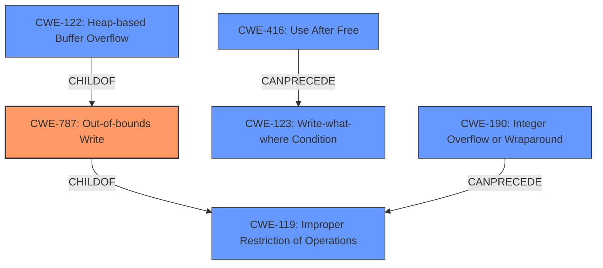

# Analysis for CVE-2020-0968

# Summary
| CWE ID | CWE Name | Confidence | CWE Abstraction Level | CWE Vulnerability Mapping Label | CWE-Vulnerability Mapping Notes |
|---|---|---|---|---|---|
| CWE-787 | Out-of-bounds Write | 1.0 | Base | Allowed | Primary CWE |

## Evidence and Confidence

*   **Confidence Score:** 1.0
*   **Evidence Strength:** HIGH

## Relationship Analysis
The primary CWE, CWE-787 **Out-of-bounds Write**, is a Base level CWE. It has a hierarchical relationship with CWE-119 **Improper Restriction of Operations within the Bounds of a Memory Buffer**. The retriever results do not have a strong secondary CWE, but it does have CWE-416 **Use After Free**, CWE-123 **Write-what-where Condition**, CWE-190 **Integer Overflow or Wraparound**, and CWE-122 **Heap-based Buffer Overflow** which are all variant or base CWEs that could have contributed to this vulnerability.

## Vulnerability Chain
The vulnerability chain starts with **improper input handling** leading to **memory corruption**, and ultimately results in remote code execution.

## Summary of Analysis
The vulnerability description clearly indicates a **memory corruption** issue due to the scripting engine's handling of objects in memory. The key phrase "improper input handling" suggests a flaw in how the application processes or validates incoming data, leading to memory corruption. The primary CWE match from similar CVE descriptions is CWE-787 **Out-of-bounds Write**, which aligns with the **memory corruption** and the ability to write data past the intended buffer. The retriever results also list CWE-787 as the top combined result.

The evidence provided in the "Vulnerability Description Key Phrases" section and the "CWE for similar CVE Descriptions" section provides sufficient support for mapping this vulnerability to CWE-787. The description clearly indicates that the **improper input handling** leads to **memory corruption**, which is the root cause of the vulnerability.

I considered other CWEs such as CWE-416 **Use After Free**, CWE-123 **Write-what-where Condition**, and CWE-190 **Integer Overflow or Wraparound**, but these are not as directly relevant as CWE-787. While these other weaknesses could potentially contribute to or result from the **memory corruption**, the primary issue described is the **out-of-bounds write** itself. Therefore, CWE-787 is the most appropriate and specific CWE to classify this vulnerability.

# Enhanced Query for CVE-2020-0968

## Vulnerability Description
A remote code execution vulnerability exists in the way that the scripting engine handles objects in memory in Internet Explorer, aka 'Scripting Engine Memory Corruption Vulnerability'. This CVE ID is unique from CVE-2020-0970.

### Vulnerability Description Key Phrases
- **rootcause:** **improper input handling**
- **weakness:** **memory corruption**
- **impact:** remote code execution
- **product:** Internet Explorer
- **component:** scripting engine

### CWE for similar CVE Descriptions
### Primary CWE Match
CWE-787

#### Top CWEs
- CWE-787 (Count: 137)
- CWE-NVD-noinfo (Count: 30)
- CWE-843 (Count: 7)

## Retriever Results

### Top Combined Results

| Rank | CWE ID | Name | Abstraction | Usage  | Retrievers | Individual Scores |
|------|--------|------|-------------|-------|------------|-------------------|
| 1 | 787 | Out-of-bounds Write | Base | Allowed | alternate_terms | 1.000 |
| 2 | 665 | Improper Initialization | Class | Discouraged | sparse | 0.209 |
| 3 | 20 | Improper Input Validation | Class | Discouraged | sparse | 0.208 |
| 4 | 416 | Use After Free | Variant | Allowed | sparse | 0.208 |
| 5 | 190 | Integer Overflow or Wraparound | Base | Allowed | sparse | 0.207 |
| 6 | 80 | Improper Neutralization of Script-Related HTML Tags in a Web Page (Basic XSS) | Variant | Allowed | dense | 0.604 |
| 7 | 123 | Write-what-where Condition | Base | Allowed | graph | 0.003 |
| 8 | 755 | Improper Handling of Exceptional Conditions | Class | Discouraged | sparse | 0.206 |
| 9 | 122 | Heap-based Buffer Overflow | Variant | Allowed | sparse | 0.204 |
| 10 | 362 | Concurrent Execution using Shared Resource with Improper Synchronization ('Race Condition') | Class | Allowed-with-Review | sparse | 0.203 |

# Complete CWE Specifications

## CWE-787: Out-of-bounds Write
**Abstraction:** Base
**Status:** Draft

### Description
The product writes data past the end, or before the beginning, of the intended buffer.

### Extended Description
Not provided

### Alternative Terms
Memory Corruption: Often used to describe the consequences of writing to memory outside the bounds of a buffer, or to memory that is otherwise invalid.

### Relationships
ChildOf -> CWE-119
ChildOf -> CWE-119
ChildOf -> CWE-119
ChildOf -> CWE-119

### Mapping Guidance
**Usage:** Allowed
**Rationale:** This CWE entry is at the Base level of abstraction, which is a preferred level of abstraction for mapping to the root causes of vulnerabilities.
**Comments:** Carefully read both the name and description to ensure that this mapping is an appropriate fit. Do not try to 'force' a mapping to a lower-level Base/Variant simply to comply with this preferred level of abstraction.
**Reasons:**
- Acceptable-Use

### Observed Examples
- **CVE-2023-1017:** The reference implementation code for a Trusted Platform Module does not implement length checks on data, allowing for an attacker to write 2 bytes past the end of a buffer.
- **CVE-2021-21220:** Chain: insufficient input validation (CWE-20) in browser allows heap corruption (CWE-787), as exploited in the wild per CISA KEV.
- **CVE-2021-28664:** GPU kernel driver allows memory corruption because a user can obtain read/write access to read-only pages, as exploited in the wild per CISA KEV.

## CWE-665: Improper Initialization
**Abstraction:** Class
**Status:** Draft

### Description
The product does not initialize or incorrectly initializes a resource, which might leave the resource in an unexpected state when it is accessed or used.

### Extended Description
This can have security implications when the associated resource is expected to have certain properties or values, such as a variable that determines whether a user has been authenticated or not.

### Alternative Terms
None

### Relationships
ChildOf -> CWE-664

### Mapping Guidance
**Usage:** Discouraged
**Rationale:** This CWE entry is a level-1 Class (i.e., a child of a Pillar). It might have lower-level children that would be more appropriate
**Comments:** Examine children of this entry to see if there is a better fit
**Reasons:**
- Abstraction

### Observed Examples
- **CVE-2001-1471:** chain: an invalid value prevents a library file from being included, skipping initialization of key variables, leading to resultant eval injection.
- **CVE-2008-3637:** Improper error checking in protection mechanism produces an uninitialized variable, allowing security bypass and code execution.
- **CVE-2008-4197:** Use of uninitialized memory may allow code execution.

## CWE-20: Improper Input Validation
**Abstraction:** Class
**Status:** Stable

### Description
The product receives input or data, but it does
        not validate or incorrectly validates that the input has the
        properties that are required to process the data safely and
        correctly.

### Extended Description

Input validation is a frequently-used technique for checking potentially dangerous inputs in order to ensure that the inputs are safe for processing within the code, or when communicating with other components. When software does not validate input properly, an attacker is able to craft the input in a form that is not expected by the rest of the application. This will lead to parts of the system receiving unintended input, which may result in altered control flow, arbitrary control of a resource, or arbitrary code execution.

Input validation is not the only technique for processing input, however. Other techniques attempt to transform potentially-dangerous input into something safe, such as filtering (CWE-790) - which attempts to remove dangerous inputs - or encoding/escaping (CWE-116), which attempts to ensure that the input is not misinterpreted when it is included in output to another component. Other techniques exist as well (see CWE-138 for more examples.)

Input validation can be applied to:

  - raw data - strings, numbers, parameters, file contents, etc.

  - metadata - information about the raw data, such as headers or size

Data can be simple or structured. Structured data can be composed of many nested layers, composed of combinations of metadata and raw data, with other simple or structured data.

Many properties of raw data or metadata may need to be validated upon entry into the code, such as:

  - specified quantities such as size, length, frequency, price, rate, number of operations, time, etc.

  - implied or derived quantities, such as the actual size of a file instead of a specified size

  - indexes, offsets, or positions into more complex data structures

  - symbolic keys or other elements into hash tables, associative arrays, etc.

  - well-formedness, i.e. syntactic correctness - compliance with expected syntax 

  - lexical token correctness - compliance with rules for what is treated as a token

  - specified or derived type - the actual type of the input (or what the input appears to be)

  - consistency - between individual data elements, between raw data and metadata, between references, etc.

  - conformance to domain-specific rules, e.g. business logic 

  - equivalence - ensuring that equivalent inputs are treated the same

  - authenticity, ownership, or other attestations about the input, e.g. a cryptographic signature to prove the source of the data

Implied or derived properties of data must often be calculated or inferred by the code itself. Errors in deriving properties may be considered a contributing factor to improper input validation. 

Note that "input validation" has very different meanings to different people, or within different classification schemes. Caution must be used when referencing this CWE entry or mapping to it. For example, some weaknesses might involve inadvertently giving control to an attacker over an input when they should not be able to provide an input at all, but sometimes this is referred to as input validation.

Finally, it is important to emphasize that the distinctions between input validation and output escaping are often blurred, and developers must be careful to understand the difference, including how input validation is not always sufficient to prevent vulnerabilities, especially when less stringent data types must be supported, such as free-form text. Consider a SQL injection scenario in which a person's last name is inserted into a query. The name "O'Reilly" would likely pass the validation step since it is a common last name in the English language. However, this valid name cannot be directly inserted into the database because it contains the "'" apostrophe character, which would need to be escaped or otherwise transformed. In this case, removing the apostrophe might reduce the risk of SQL injection, but it would produce incorrect behavior because the wrong name would be recorded.

### Alternative Terms
None

### Relationships
ChildOf -> CWE-707
PeerOf -> CWE-345
CanPrecede -> CWE-22
CanPrecede -> CWE-41
CanPrecede -> CWE-74
CanPrecede -> CWE-119
CanPrecede -> CWE-770

### Mapping Guidance
**Usage:** Discouraged
**Rationale:** CWE-20 is commonly misused in low-information vulnerability reports when lower-level CWEs could be used instead, or when more details about the vulnerability are available [REF-1287]. It is not useful for trend analysis. It is also a level-1 Class (i.e., a child of a Pillar).
**Comments:** Consider lower-level children such as Improper Use of Validation Framework (CWE-1173) or improper validation involving specific types or properties of input such as Specified Quantity (CWE-1284); Specified Index, Position, or Offset (CWE-1285); Syntactic Correctness (CWE-1286); Specified Type (CWE-1287); Consistency within Input (CWE-1288); or Unsafe Equivalence (CWE-1289).
**Reasons:**
- Frequent Misuse
**Suggested Alternatives:**
- CWE-1284: Specified Quantity
- CWE-1285: Specified Index, Position, or Offset
- CWE-1286: Syntactic Correctness
- CWE-1287: Specified Type
- CWE-1288: Consistency within Input
- CWE-1289: Unsafe Equivalence
- CWE-116: Improper Encoding or Escaping of Output

### Additional Notes
**[Relationship]** 

CWE-116 and CWE-20 have a close association because, depending on the nature of the structured message, proper input validation can indirectly prevent special characters from changing the meaning of a structured message. For example, by validating that a numeric ID field should only contain the 0-9 characters, the programmer effectively prevents injection attacks.

**[Maintenance]** As of 2020, this entry is used more often than preferred, and it is a source of frequent confusion. It is being actively modified for CWE 4.1 and subsequent versions.

**[Maintenance]** Concepts such as validation, data transformation, and neutralization are being refined, so relationships between CWE-20 and other entries such as CWE-707 may change in future versions, along with an update to the Vulnerability Theory document.

**[Maintenance]** Input validation - whether missing or incorrect - is such an essential and widespread part of secure development that it is implicit in many different weaknesses. Traditionally, problems such as buffer overflows and XSS have been classified as input validation problems by many security professionals. However, input validation is not necessarily the only protection mechanism available for avoiding such problems, and in some cases it is not even sufficient. The CWE team has begun capturing these subtleties in chains within the Research Concepts view (CWE-1000), but more work is needed.

**[Terminology]** 

The "input validation" term is extremely common, but it is used in many different ways. In some cases its usage can obscure the real underlying weakness or otherwise hide chaining and composite relationships.

Some people use "input validation" as a general term that covers many different neutralization techniques for ensuring that input is appropriate, such as filtering, canonicalization, and escaping. Others use the term in a more narrow context to simply mean "checking if an input conforms to expectations without changing it." CWE uses this more narrow interpretation.

### Observed Examples
- **CVE-2024-37032:** Large language model (LLM) management tool does not validate the format of a digest value (CWE-1287) from a private, untrusted model registry, enabling relative path traversal (CWE-23), a.k.a. Probllama
- **CVE-2022-45918:** Chain: a learning management tool debugger uses external input to locate previous session logs (CWE-73) and does not properly validate the given path (CWE-20), allowing for filesystem path traversal using "../" sequences (CWE-24)
- **CVE-2021-30860:** Chain: improper input validation (CWE-20) leads to integer overflow (CWE-190) in mobile OS, as exploited in the wild per CISA KEV.

## CWE-416: Use After Free
**Abstraction:** Variant
**Status:** Stable

### Description
The product reuses or references memory after it has been freed. At some point afterward, the memory may be allocated again and saved in another pointer, while the original pointer references a location somewhere within the new allocation. Any operations using the original pointer are no longer valid because the memory "belongs" to the code that operates on the new pointer.

### Extended Description
Not provided

### Alternative Terms
Dangling pointer: a pointer that no longer points to valid memory, often after it has been freed
UAF: commonly used acronym for Use After Free
Use-After-Free

### Relationships
ChildOf -> CWE-825
ChildOf -> CWE-672
ChildOf -> CWE-672
ChildOf -> CWE-672
CanPrecede -> CWE-120
CanPrecede -> CWE-123

### Mapping Guidance
**Usage:** Allowed
**Rationale:** This CWE entry is at the Variant level of abstraction, which is a preferred level of abstraction for mapping to the root causes of vulnerabilities.
**Comments:** Carefully read both the name and description to ensure that this mapping is an appropriate fit. Do not try to 'force' a mapping to a lower-level Base/Variant simply to comply with this preferred level of abstraction.
**Reasons:**
- Acceptable-Use

### Observed Examples
- **CVE-2022-20141:** Chain: an operating system kernel has insufficent resource locking (CWE-413) leading to a use after free (CWE-416).
- **CVE-2022-2621:** Chain: two threads in a web browser use the same resource (CWE-366), but one of those threads can destroy the resource before the other has completed (CWE-416).
- **CVE-2021-0920:** Chain: mobile platform race condition (CWE-362) leading to use-after-free (CWE-416), as exploited in the wild per CISA KEV.

## CWE-190: Integer Overflow or Wraparound
**Abstraction:** Base
**Status:** Stable

### Description
The product performs a calculation that can
         produce an integer overflow or wraparound when the logic
         assumes that the resulting value will always be larger than
         the original value. This occurs when an integer value is
         incremented to a value that is too large to store in the
         associated representation. When this occurs, the value may
         become a very small or negative number.

### Extended Description
Not provided

### Alternative Terms
Overflow: The terms "overflow" and "wraparound" are used interchangeably by some people, but they can have more precise distinctions by others. See Terminology Notes.
Wraparound: The terms "overflow" and "wraparound" are used interchangeably by some people, but they can have more precise distinctions by others. See Terminology Notes.
wrap, wrap-around, wrap around: Alternate spellings of "wraparound"

### Relationships
ChildOf -> CWE-682
ChildOf -> CWE-682
ChildOf -> CWE-20
CanPrecede -> CWE-119

### Mapping Guidance
**Usage:** Allowed
**Rationale:** This CWE entry is at the Base level of abstraction, which is a preferred level of abstraction for mapping to the root causes of vulnerabilities.
**Comments:** Be careful of terminology problems with "overflow," "underflow," and "wraparound" - see Terminology Notes. Carefully read both the name and description to ensure that this mapping is an appropriate fit. Do not try to 'force' a mapping to a lower-level Base/Variant simply to comply with this preferred level of abstraction.
**Reasons:**
- Acceptable-Use
**Suggested Alternatives:**
- CWE-191: Integer Underflow (Wrap or Wraparound). Consider CWE-191 when the result is less than the minimum value that can be represented (sometimes called "underflows").

### Additional Notes
**[Relationship]** Integer overflows can be primary to buffer overflows when they cause less memory to be allocated than expected.

**[Terminology]** 

"Integer overflow" is sometimes used to cover several types of errors, including signedness errors, or buffer overflows that involve manipulation of integer data types instead of characters. Part of the confusion results from the fact that 0xffffffff is -1 in a signed context. Other confusion also arises because of the role that integer overflows have in chains.

A "wraparound" is a well-defined, standard behavior that follows specific rules for how to handle situations when the intended numeric value is too large or too small to be represented, as specified in standards such as C11.

"Overflow" is sometimes conflated with "wraparound" but typically indicates a non-standard or undefined behavior.

The "overflow" term is sometimes used to indicate cases where either the maximum or the minimum is exceeded, but others might only use "overflow" to indicate exceeding the maximum while using "underflow" for exceeding the minimum.

Some people use "overflow" to mean any value outside the representable range - whether greater than the maximum, or less than the minimum - but CWE uses "underflow" for cases in which the intended result is less than the minimum.

See [REF-1440] for additional explanation of the ambiguity of terminology.

**[Other]** While there may be circumstances in which the logic intentionally relies on wrapping - such as with modular arithmetic in timers or counters - it can have security consequences if the wrap is unexpected. This is especially the case if the integer overflow can be triggered using user-supplied inputs.

### Observed Examples
- **CVE-2021-43537:** Chain: in a web browser, an unsigned 64-bit integer is forcibly cast to a 32-bit integer (CWE-681) and potentially leading to an integer overflow (CWE-190). If an integer overflow occurs, this can cause heap memory corruption (CWE-122)
- **CVE-2022-21668:** Chain: Python library does not limit the resources used to process images that specify a very large number of bands (CWE-1284), leading to excessive memory consumption (CWE-789) or an integer overflow (CWE-190).
- **CVE-2022-0545:** Chain: 3D renderer has an integer overflow (CWE-190) leading to write-what-where condition (CWE-123) using a crafted image.

## CWE-80: Improper Neutralization of Script-Related HTML Tags in a Web Page (Basic XSS)
**Abstraction:** Variant
**Status:** Incomplete

### Description
The product receives input from an upstream component, but it does not neutralize or incorrectly neutralizes special characters such as "<", ">", and "&" that could be interpreted as web-scripting elements when they are sent to a downstream component that processes web pages.

### Extended Description
This may allow such characters to be treated as control characters, which are executed client-side in the context of the user's session. Although this can be classified as an injection problem, the more pertinent issue is the improper conversion of such special characters to respective context-appropriate entities before displaying them to the user.

### Alternative Terms
None

### Relationships
ChildOf -> CWE-79

### Mapping Guidance
**Usage:** Allowed
**Rationale:** This CWE entry is at the Variant level of abstraction, which is a preferred level of abstraction for mapping to the root causes of vulnerabilities.
**Comments:** Carefully read both the name and description to ensure that this mapping is an appropriate fit. Do not try to 'force' a mapping to a lower-level Base/Variant simply to comply with this preferred level of abstraction.
**Reasons:**
- Acceptable-Use

### Observed Examples
- **CVE-2002-0938:** XSS in parameter in a link.
- **CVE-2002-1495:** XSS in web-based email product via attachment filenames.
- **CVE-2003-1136:** HTML injection in posted message.

## CWE-123: Write-what-where Condition
**Abstraction:** Base
**Status:** Draft

### Description
Any condition where the attacker has the ability to write an arbitrary value to an arbitrary location, often as the result of a buffer overflow.

### Extended Description
Not provided

### Alternative Terms
None

### Relationships
ChildOf -> CWE-787
ChildOf -> CWE-119
ChildOf -> CWE-119

### Mapping Guidance
**Usage:** Allowed
**Rationale:** This CWE entry is at the Base level of abstraction, which is a preferred level of abstraction for mapping to the root causes of vulnerabilities.
**Comments:** Carefully read both the name and description to ensure that this mapping is an appropriate fit. Do not try to 'force' a mapping to a lower-level Base/Variant simply to comply with this preferred level of abstraction.
**Reasons:**
- Acceptable-Use

### Observed Examples
- **CVE-2022-21668:** Chain: Python library does not limit the resources used to process images that specify a very large number of bands (CWE-1284), leading to excessive memory consumption (CWE-789) or an integer overflow (CWE-190).
- **CVE-2022-0545:** Chain: 3D renderer has an integer overflow (CWE-190) leading to write-what-where condition (CWE-123) using a crafted image.

## CWE-755: Improper Handling of Exceptional Conditions
**Abstraction:** Class
**Status:** Incomplete

### Description
The product does not handle or incorrectly handles an exceptional condition.

### Extended Description
Not provided

### Alternative Terms
None

### Relationships
ChildOf -> CWE-703

### Mapping Guidance
**Usage:** Discouraged
**Rationale:** This CWE entry is a level-1 Class (i.e., a child of a Pillar). It might have lower-level children that would be more appropriate
**Comments:** Examine children of this entry to see if there is a better fit
**Reasons:**
- Abstraction

### Observed Examples
- **CVE-2023-41151:** SDK for OPC Unified Architecture (OPC UA) server has uncaught exception when a socket is blocked for writing but the server tries to send an error
- **[REF-1374]:** Chain: JavaScript-based cryptocurrency library can fall back to the insecure Math.random() function instead of reporting a failure (CWE-392), thus reducing the entropy (CWE-332) and leading to generation of non-unique cryptographic keys for Bitcoin wallets (CWE-1391)
- **CVE-2021-3011:** virtual interrupt controller in a virtualization product allows crash of host by writing a certain invalid value to a register, which triggers a fatal error instead of returning an error code

## CWE-122: Heap-based Buffer Overflow
**Abstraction:** Variant
**Status:** Draft

### Description
A heap overflow condition is a buffer overflow, where the buffer that can be overwritten is allocated in the heap portion of memory, generally meaning that the buffer was allocated using a routine such as malloc().

### Extended Description
Not provided

### Alternative Terms
None

### Relationships
ChildOf -> CWE-788
ChildOf -> CWE-787

### Mapping Guidance
**Usage:** Allowed
**Rationale:** This CWE entry is at the Variant level of abstraction, which is a preferred level of abstraction for mapping to the root causes of vulnerabilities.
**Comments:** Carefully read both the name and description to ensure that this mapping is an appropriate fit. Do not try to 'force' a mapping to a lower-level Base/Variant simply to comply with this preferred level of abstraction.
**Reasons:**
- Acceptable-Use

### Additional Notes
**[Relationship]** Heap-based buffer overflows are usually just as dangerous as stack-based buffer overflows.

### Observed Examples
- **CVE-2021-43537:** Chain: in a web browser, an unsigned 64-bit integer is forcibly cast to a 32-bit integer (CWE-681) and potentially leading to an integer overflow (CWE-190). If an integer overflow occurs, this can cause heap memory corruption (CWE-122)
- **CVE-2007-4268:** Chain: integer signedness error (CWE-195) passes signed comparison, leading to heap overflow (CWE-122)
- **CVE-2009-2523:** Chain: product does not handle when an input string is not NULL terminated (CWE-170), leading to buffer over-read (CWE-125) or heap-based buffer overflow (CWE-122).

## CWE-362: Concurrent Execution using Shared Resource with Improper Synchronization ('Race Condition')
**Abstraction:** Class
**Status:** Draft

### Description
The product contains a concurrent code sequence that requires temporary, exclusive access to a shared resource, but a timing window exists in which the shared resource can be modified by another code sequence operating concurrently.

### Extended Description

A race condition occurs within concurrent environments, and it is effectively a property of a code sequence. Depending on the context, a code sequence may be in the form of a function call, a small number of instructions, a series of program invocations, etc.

A race condition violates these properties, which are closely related:

  - Exclusivity - the code sequence is given exclusive access to the shared resource, i.e., no other code sequence can modify properties of the shared resource before the original sequence has completed execution.

  - Atomicity - the code sequence is behaviorally atomic, i.e., no other thread or process can concurrently execute the same sequence of instructions (or a subset) against the same resource.

A race condition exists when an "interfering code sequence" can still access the shared resource, violating exclusivity.

The interfering code sequence could be "trusted" or "untrusted." A trusted interfering code sequence occurs within the product; it cannot be modified by the attacker, and it can only be invoked indirectly. An untrusted interfering code sequence can be authored directly by the attacker, and typically it is external to the vulnerable product.

### Alternative Terms
Race Condition

### Relationships
ChildOf -> CWE-691
CanPrecede -> CWE-416
CanPrecede -> CWE-476

### Mapping Guidance
**Usage:** Allowed-with-Review
**Rationale:** This CWE entry is a Class and might have Base-level children that would be more appropriate
**Comments:** Examine children of this entry to see if there is a better fit
**Reasons:**
- Abstraction

### Additional Notes
**[Maintenance]** The relationship between race conditions and synchronization problems (CWE-662) needs to be further developed. They are not necessarily two perspectives of the same core concept, since synchronization is only one technique for avoiding race conditions, and synchronization can be used for other purposes besides race condition prevention.

**[Research Gap]** Race conditions in web applications are under-studied and probably under-reported. However, in 2008 there has been growing interest in this area.

**[Research Gap]** Much of the focus of race condition research has been in Time-of-check Time-of-use (TOCTOU) variants (CWE-367), but many race conditions are related to synchronization problems that do not necessarily require a time-of-check.

**[Research Gap]** From a classification/taxonomy perspective, the relationships between concurrency and program state need closer investigation and may be useful in organizing related issues.

### Observed Examples
- **CVE-2022-29527:** Go application for cloud management creates a world-writable sudoers file that allows local attackers to inject sudo rules and escalate privileges to root by winning a race condition.
- **CVE-2021-1782:** Chain: improper locking (CWE-667) leads to race condition (CWE-362), as exploited in the wild per CISA KEV.
- **CVE-2021-0920:** Chain: mobile platform race condition (CWE-362) leading to use-after-free (CWE-416), as exploited in the wild per CISA KEV.

