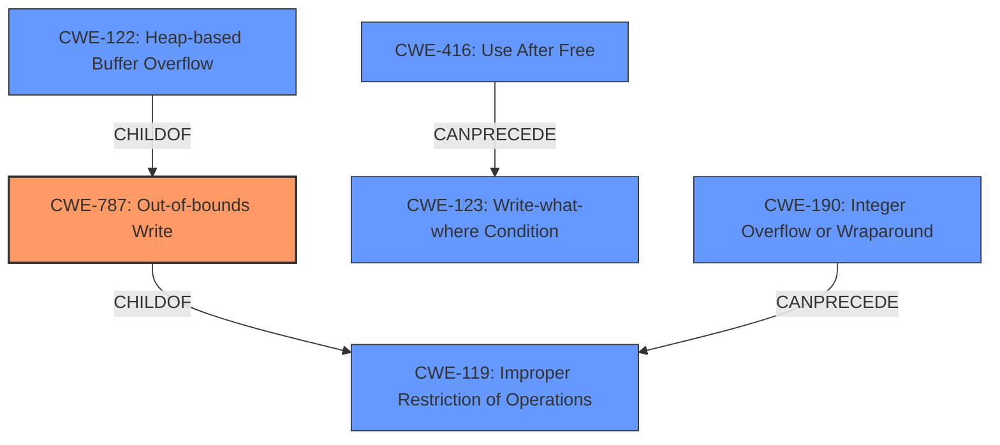

# Analysis Report for CVE-2020-0968

# Vulnerability Analysis Report: CVE-2020-0968

## Description


## Analysis (with Relationship Data)

# Summary
| CWE ID | CWE Name | Confidence | CWE Abstraction Level | CWE Vulnerability Mapping Label | CWE-Vulnerability Mapping Notes |
|---|---|---|---|---|---|
| CWE-787 | Out-of-bounds Write | 1.0 | Base | Allowed | Primary CWE |

## Evidence and Confidence

*   **Confidence Score:** 1.0
*   **Evidence Strength:** HIGH

## Relationship Analysis
The primary CWE, CWE-787 **Out-of-bounds Write**, is a Base level CWE. It has a hierarchical relationship with CWE-119 **Improper Restriction of Operations within the Bounds of a Memory Buffer**. The retriever results do not have a strong secondary CWE, but it does have CWE-416 **Use After Free**, CWE-123 **Write-what-where Condition**, CWE-190 **Integer Overflow or Wraparound**, and CWE-122 **Heap-based Buffer Overflow** which are all variant or base CWEs that could have contributed to this vulnerability.



## Vulnerability Chain
The vulnerability chain starts with **improper input handling** leading to **memory corruption**, and ultimately results in remote code execution.

## Summary of Analysis
The vulnerability description clearly indicates a **memory corruption** issue due to the scripting engine's handling of objects in memory. The key phrase "improper input handling" suggests a flaw in how the application processes or validates incoming data, leading to memory corruption. The primary CWE match from similar CVE descriptions is CWE-787 **Out-of-bounds Write**, which aligns with the **memory corruption** and the ability to write data past the intended buffer. The retriever results also list CWE-787 as the top combined result.

The evidence provided in the "Vulnerability Description Key Phrases" section and the "CWE for similar CVE Descriptions" section provides sufficient support for mapping this vulnerability to CWE-787. The description clearly indicates that the **improper input handling** leads to **memory corruption**, which is the root cause of the vulnerability.

I considered other CWEs such as CWE-416 **Use After Free**, CWE-123 **Write-what-where Condition**, and CWE-190 **Integer Overflow or Wraparound**, but these are not as directly relevant as CWE-787. While these other weaknesses could potentially contribute to or result from the **memory corruption**, the primary issue described is the **out-of-bounds write** itself. Therefore, CWE-787 is the most appropriate and specific CWE to classify this vulnerability.


## CWE Relationship Analysis

Current CWEs represent these abstraction levels: .


### Vulnerability Chain Analysis

**Chain starting from CWE-787:**
- 787 (Out-of-bounds Write) - ROOT


**Chain starting from CWE-123:**
- 123 (Write-what-where Condition) - ROOT


### CWE Relationship Diagram

```mermaid
graph TD
    classDef primary fill:#f96,stroke:#333,stroke-width:2px
    classDef secondary fill:#69f,stroke:#333
    classDef tertiary fill:#9e9,stroke:#333
```


*Report generated on 2025-04-02 04:42:39*
