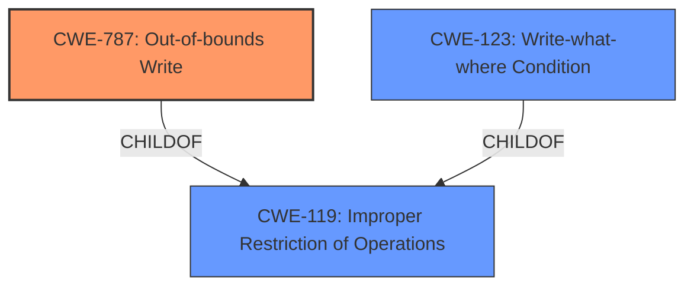

# Raw Analyzer Response for CVE-2020-0986

# Summary
| CWE ID | CWE Name | Confidence | CWE Abstraction Level | CWE Vulnerability Mapping Label | CWE-Vulnerability Mapping Notes |
|---|---|---|---|---|---|
| CWE-787 | Out-of-bounds Write | 0.7 | Base | Primary | Allowed |

## Evidence and Confidence

*   **Confidence Score:** 0.7
*   **Evidence Strength:** MEDIUM

## Relationship Analysis
The primary CWE selected is CWE-787 **Out-of-bounds Write**, which is a base level CWE. It is related to CWE-119 **Improper Restriction of Operations within the Bounds of a Memory Buffer**, as it is a child of this class-level CWE. It also relates to CWE-123 **Write-what-where Condition**, where the attacker has the ability to write an arbitrary value to an arbitrary location, but is a more specific type of **out-of-bounds write**.

## Vulnerability Chain
The vulnerability chain starts with the Windows kernel **failing to properly handle objects in memory**, which leads to an **out-of-bounds write**, and this in turn leads to an elevation of privilege.

## Summary of Analysis
The initial assessment pointed to CWE-NVD-noinfo because similar CVE descriptions mapped to it; however, the description contains more specific information about the root cause. The vulnerability description indicates that the Windows kernel **fails to properly handle objects in memory**, leading to an elevation of privilege. This suggests a memory corruption issue. Given the available information, the most appropriate CWE is CWE-787 **Out-of-bounds Write**, which describes a scenario where the product writes data past the end or before the beginning of the intended buffer. This is further supported by the fact that CWE-787 is a top CWE match for similar **Vulnerability Descriptions**.

The confidence in this assessment is moderate (0.7) because the description is quite general, and it lacks detailed technical information about the specific type of memory corruption. However, the description is more specific than "no information".

Relevant CWE Information:

# Enhanced Context (25 CWEs)

## CWE-367: Time-of-check Time-of-use (TOCTOU) Race Condition
**Abstraction Level**: Base
**Similarity Score**: 0.81
**Source**: dense

**Description**:
The product checks the state of a resource before using that resource, but the resource's state can change between the check and the use in a way that invalidates the results of the check. This can cause the product to perform invalid actions when the resource is in an unexpected state.

**Mapping Guidance**:
- Usage: Allowed
- Rationale: This CWE entry is at the Base level of abstraction, which is a preferred level of abstraction for mapping to the root causes of vulnerabilities.

## CWE-362: Concurrent Execution using Shared Resource with Improper Synchronization ('Race Condition')
**Abstraction Level**: Class
**Similarity Score**: 0.79
**Source**: dense

**Description**:
The product contains a concurrent code sequence that requires temporary, exclusive access to a shared resource, but a timing window exists in which the shared resource can be modified by another code sequence operating concurrently.

**Mapping Guidance**:
- Usage: Allowed-with-Review
- Rationale: This CWE entry is a Class and might have Base-level children that would be more appropriate

## CWE-667: Improper Locking
**Abstraction Level**: Class
**Similarity Score**: 0.78
**Source**: dense

**Description**:
The product does not properly acquire or release a lock on a resource, leading to unexpected resource state changes and behaviors.

**Mapping Guidance**:
- Usage: Allowed-with-Review
- Rationale: This CWE entry is a Class and might have Base-level children that would be more appropriate

## CWE-366: Race Condition within a Thread
**Abstraction Level**: Base
**Similarity Score**: 0.78
**Source**: dense

**Description**:
If two threads of execution use a resource simultaneously, there exists the possibility that resources may be used while invalid, in turn making the state of execution undefined.

**Mapping Guidance**:
- Usage: Allowed
- Rationale: This CWE entry is at the Base level of abstraction, which is a preferred level of abstraction for mapping to the root causes of vulnerabilities.

## CWE-754: Improper Check for Unusual or Exceptional Conditions
**Abstraction Level**: Class
**Similarity Score**: 0.77
**Source**: dense

**Description**:
The product does not check or incorrectly checks for unusual or exceptional conditions that are not expected to occur frequently during day to day operation of the product.

**Mapping Guidance**:
- Usage: Allowed-with-Review
- Rationale: This CWE entry is a Class and might have Base-level children that would be more appropriate

## CWE-703: Improper Check or Handling of Exceptional Conditions
**Abstraction Level**: Pillar
**Similarity Score**: 0.77
**Source**: dense

**Description**:
The product does not properly anticipate or handle exceptional conditions that rarely occur during normal operation of the product.

**Mapping Guidance**:
- Usage: Discouraged
- Rationale: This CWE entry is extremely high-level, a Pillar.

## CWE-59: Improper Link Resolution Before File Access ('Link Following')
**Abstraction Level**: Base
**Similarity Score**: 0.76
**Source**: dense

**Description**:
The product attempts to access a file based on the filename, but it does not properly prevent that filename from identifying a link or shortcut that resolves to an unintended resource.

**Mapping Guidance**:
- Usage: Allowed
- Rationale: This CWE entry is at the Base level of abstraction, which is a preferred level of abstraction for mapping to the root causes of vulnerabilities.

## CWE-404: Improper Resource Shutdown or Release
**Abstraction Level**: Class
**Similarity Score**: 0.76
**Source**: dense

**Description**:
The product does not release or incorrectly releases a resource before it is made available for re-use.

**Mapping Guidance**:
- Usage: Allowed-with-Review
- Rationale: This CWE entry is a Class and might have Base-level children that would be more appropriate

## CWE-125: Out-of-bounds Read
**Abstraction Level**: Base
**Similarity Score**: 0.76
**Source**: dense

**Description**:
The product reads data past the end, or before the beginning, of the intended buffer.

**Mapping Guidance**:
- Usage: Allowed
- Rationale: This CWE entry is at the Base level of abstraction, which is a preferred level of abstraction for mapping to the root causes of vulnerabilities.

## CWE-755: Improper Handling of Exceptional Conditions
**Abstraction Level**: Class
**Similarity Score**: 0.76
**Source**: dense

**Description**:
The product does not handle or incorrectly handles an exceptional condition.

**Mapping Guidance**:
- Usage: Discouraged
- Rationale: This CWE entry is a level-1 Class (i.e., a child of a Pillar). It might have lower-level children that would be more appropriate

## CWE-364: Signal Handler Race Condition
**Abstraction Level**: Base
**Similarity Score**: 6900.40
**Source**: sparse

**Description**:
The product uses a signal handler that introduces a race condition.

**Mapping Guidance**:
- Usage: Allowed
- Rationale: This CWE entry is at the Base level of abstraction, which is a preferred level of abstraction for mapping to the root causes of vulnerabilities.

## CWE-367: Time-of-check Time-of-use (TOCTOU) Race Condition
**Abstraction Level**: Base
**Similarity Score**: 6279.48
**Source**: sparse

**Description**:
The product checks the state of a resource before using that resource, but the resource's state can change between the check and the use in a way that invalidates the results of the check. This can cause the product to perform invalid actions when the resource is in an unexpected state.

**Mapping Guidance**:
- Usage: Allowed
- Rationale: This CWE entry is at the Base level of abstraction, which is a preferred level of abstraction for mapping to the root causes of vulnerabilities.

## CWE-362: Concurrent Execution using Shared Resource with Improper Synchronization ('Race Condition')
**Abstraction Level**: Class
**Similarity Score**: 6233.52
**Source**: sparse

**Description**:
The product contains a concurrent code sequence that requires temporary, exclusive access to a shared resource, but a timing window