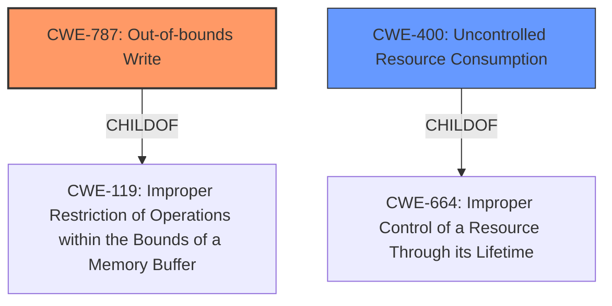

# Analysis for CVE-2020-10005

# Summary
| CWE ID | CWE Name | Confidence | CWE Abstraction Level | CWE Vulnerability Mapping Label | CWE-Vulnerability Mapping Notes |
|---|---|---|---|---|---|
| CWE-787 | Out-of-bounds Write | 0.9 | Base | Allowed | Primary CWE |
| CWE-400 | Uncontrolled Resource Consumption | 0.6 | Class | Discouraged | Secondary Candidate |

## Evidence and Confidence

*   **Confidence Score:** 0.8
*   **Evidence Strength:** HIGH

## Relationship Analysis
The primary relationship influencing the decision is that CWE-787 (Out-of-bounds Write) is a child of CWE-119 (Improper Restriction of Operations within the Bounds of a Memory Buffer). The vulnerability involves writing past the end of a fixed-size buffer, which directly aligns with CWE-787. CWE-400 (Uncontrolled Resource Consumption) is considered a secondary candidate because the root cause involves writing beyond buffer bounds, which can lead to resource exhaustion. The abstraction level of CWE-787 (Base) is preferred over the Class level of CWE-400 because it offers a more specific description of the **weakness**.

## Vulnerability Chain
The vulnerability chain starts with a specially crafted SMB packet containing an oversized share path. This leads to a **buffer overflow** due to the `memcpy` function copying data without proper bounds checking (CWE-787). The impact of this overflow can be arbitrary code execution, memory corruption, or denial of service. While **resource exhaustion** is mentioned in the initial description, the root cause is the **out-of-bounds write** itself.

## Summary of Analysis
The initial assessment considered both CWE-787 and CWE-400. However, after analyzing the CVE Reference Links Content Summary, it became clear that the root cause is a stack-based buffer overflow due to missing bounds checking when copying data into a fixed-size buffer.

Evidence: "The `memcpy` function copies data from the SMB request to a fixed-size stack buffer without proper bounds checking."

This directly aligns with CWE-787 (Out-of-bounds Write), which describes writing data past the end of the intended buffer. The vulnerability description mentions "resource exhaustion," but this is a potential impact of the **out-of-bounds write**, not the primary weakness. Therefore, CWE-787 is the more accurate and specific classification.

The graph relationships support selecting CWE-787 as the primary CWE because it is a base-level weakness directly related to memory buffer handling, whereas CWE-400 is a more general class of weaknesses related to resource management.

The selected CWEs are at the optimal level of specificity. CWE-787 is a Base level CWE that accurately describes the **root cause**, while CWE-400 is a Class level CWE that describes a potential impact.

Relevant CWE Information:

# Enhanced Context (25 CWEs)
The following CWEs were identified as potentially relevant to this vulnerability:

## CWE-404: Improper Resource Shutdown or Release
**Abstraction Level**: Class
**Similarity Score**: 0.79
**Source**: dense

**Description**:
The product does not release or incorrectly releases a resource before it is made available for re-use.

**Mapping Guidance**:
- Usage: Allowed-with-Review
- Rationale: This CWE entry is a Class and might have Base-level children that would be more appropriate

## CWE-226: Sensitive Information in Resource Not Removed Before Reuse
**Abstraction Level**: Base
**Similarity Score**: 0.78
**Source**: dense

**Description**:
The product releases a resource such as memory or a file so that it can be made available for reuse, but it does not clear or "zeroize" the information contained in the resource before the product performs a critical state transition or makes the resource available for reuse by other entities.

**Mapping Guidance**:
- Usage: Allowed
- Rationale: This CWE entry is at the Base level of abstraction, which is a preferred level of abstraction for mapping to the root causes of vulnerabilities.

## CWE-667: Improper Locking
**Abstraction Level**: Class
**Similarity Score**: 0.76
**Source**: dense

**Description**:
The product does not properly acquire or release a lock on a resource, leading to unexpected resource state changes and behaviors.

**Mapping Guidance**:
- Usage: Allowed-with-Review
- Rationale: This CWE entry is a Class and might have Base-level children that would be more appropriate

## CWE-664: Improper Control of a Resource Through its Lifetime
**Abstraction Level**: Pillar
**Similarity Score**: 0.75
**Source**: dense

**Description**:
The product does not maintain or incorrectly maintains control over a resource throughout its lifetime of creation, use, and release.

**Mapping Guidance**:
- Usage: Discouraged
- Rationale: This CWE entry is high-level when lower-level children are available.

## CWE-415: Double Free
**Abstraction Level**: Variant
**Similarity Score**: 0.74
**Source**: dense

**Description**:
The product calls free() twice on the same memory address, potentially leading to modification of unexpected memory locations.

**Mapping Guidance**:
- Usage: Allowed
- Rationale: This CWE entry is at the Variant level of abstraction, which is a preferred level of abstraction for mapping to the root causes of vulnerabilities.

## CWE-1325: Improperly Controlled Sequential Memory Allocation
**Abstraction Level**: Base
**Similarity Score**: 0.73
**Source**: dense

**Description**:
The product manages a group of objects or resources and performs a separate memory allocation for each object, but it does not properly limit the total amount of memory that is consumed by all of the combined objects.

**Mapping Guidance**:
- Usage: Allowed
- Rationale: This CWE entry is at the Base level of abstraction, which is a preferred level of abstraction for mapping to the root causes of vulnerabilities.

## CWE-405: Asymmetric Resource Consumption (Amplification)
**Abstraction Level**: Class
**Similarity Score**: 0.73
**Source**: dense

**Description**:
The product does not properly control situations in which an adversary can cause the product to consume or produce excessive resources without requiring the adversary to invest equivalent work or otherwise prove authorization, i.e., the adversary's influence is "asymmetric."

**Mapping Guidance**:
- Usage: Allowed-with-Review
- Rationale: This CWE entry is a Class and might have Base-level children that would be more appropriate

## CWE-772: Missing Release of Resource after Effective Lifetime
**Abstraction Level**: Base
**Similarity Score**: 0.73
**Source**: dense

**Description**:
The product does not release a resource after its effective lifetime has ended, i.e., after the resource is no longer needed.

**Mapping Guidance**:
- Usage: Allowed
- Rationale: This CWE entry is at the Base level of abstraction, which is a preferred level of abstraction for mapping to the root causes of vulnerabilities.

## CWE-662: Improper Synchronization
**Abstraction Level**: Class
**Similarity Score**: 0.73
**Source**: dense

**Description**:
The product utilizes multiple threads or processes to allow temporary access to a shared resource that can only be exclusive to one process at a time, but it does not properly synchronize these actions, which might cause simultaneous accesses of this resource by multiple threads or processes.

**Mapping Guidance**:
- Usage: Discouraged
- Rationale: This CWE entry is a level-1 Class (i.e., a child of a Pillar). It might have lower-level children that would be more appropriate

## CWE-789: Memory Allocation with Excessive Size Value
**Abstraction Level**: Variant
**Similarity Score**: 0.73
**Source**: dense

**Description**:
The product allocates memory based on an untrusted, large size value, but it does not ensure that the size is within expected limits, allowing arbitrary amounts of memory to be allocated.

**Mapping Guidance**:
- Usage: Allowed
- Rationale: This CWE entry is at the Variant level of abstraction, which is a preferred level of abstraction for mapping to the root causes of vulnerabilities.

## CWE-770: Allocation of Resources Without Limits or Throttling
**Abstraction Level**: Base
**Similarity Score**: 7292.14
**Source**: sparse

**Description**:
The product allocates a reusable resource or group of resources on behalf of an