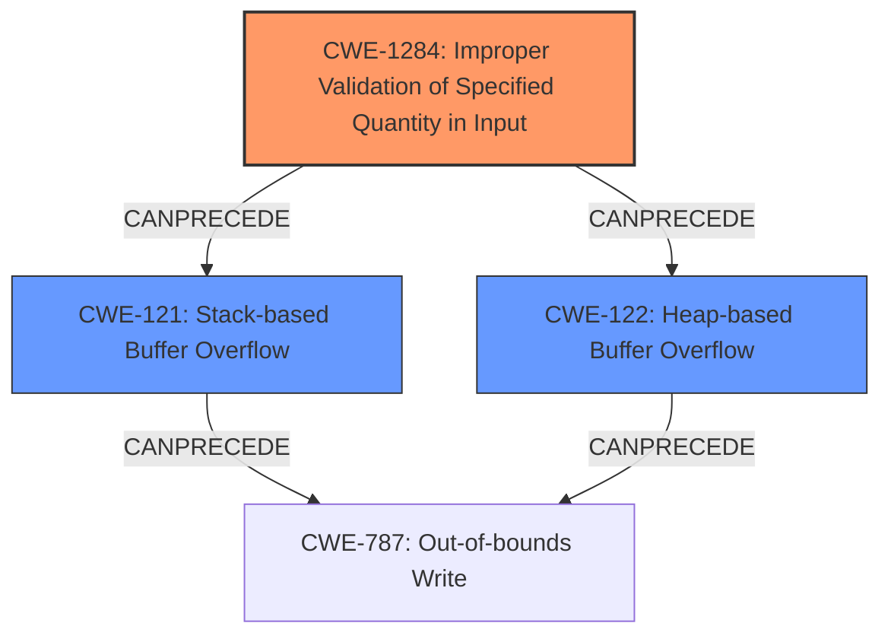

# Analysis Report for CVE-2020-10064

# Vulnerability Analysis Report: CVE-2020-10064

## Description


## Analysis (with Relationship Data)

# Summary
| CWE ID    | CWE Name                                               | Confidence | CWE Abstraction Level | CWE Vulnerability Mapping Label | CWE-Vulnerability Mapping Notes |
| --------- | ------------------------------------------------------ | ---------- | --------------------- | ------------------------------- | ------------------------------- |
| CWE-1284  | Improper Validation of Specified Quantity in Input    | 0.95       | Base                  | Primary                         | Allowed                       |
| CWE-121   | Stack-based Buffer Overflow                            | 0.90       | Base                  | Secondary                       | Allowed                       |
| CWE-122   | Heap-based Buffer Overflow                             | 0.90       | Base                  | Secondary                       | Allowed                       |

## Evidence and Confidence

*   **Confidence Score:** 0.90
*   **Evidence Strength:** HIGH

## Relationship Analysis
The primary weakness is the **improper validation of the input frame**, which leads to the buffer overflows. CWE-1284 (Improper Validation of Specified Quantity in Input) is the root cause, as the input frame's size or length isn't properly validated. This can then lead to either CWE-121 (Stack-based Buffer Overflow) or CWE-122 (Heap-based Buffer Overflow), depending on where the buffer is allocated. All three CWEs are at the Base level of abstraction.



## Vulnerability Chain
The vulnerability chain starts with **improper input frame validation** (CWE-1284), which allows a malformed frame to be processed. This then results in either a **stack-based buffer overflow** (CWE-121) or a **heap-based buffer overflow** (CWE-122), depending on the memory allocation. The final impact is an out-of-bounds write (CWE-787), which can lead to code execution or denial of service.

## Summary of Analysis
The primary CWE is CWE-1284 (Improper Validation of Specified Quantity in Input) because the root cause is the **lack of proper validation** of the input frame's size. The vulnerability description explicitly mentions "**Improper Input Frame Validation**" and indicates that this leads to buffer overflows.

The secondary CWEs are CWE-121 (Stack-based Buffer Overflow) and CWE-122 (Heap-based Buffer Overflow), as these are the direct consequences of the **improper input validation**. The description states "**Stack-based Buffer Overflow**" and "**Heap-based Buffer Overflow**".

The evidence directly supports these mappings, and the relationship analysis shows how these CWEs are connected. CWE-1284 can precede both CWE-121 and CWE-122.

The alternative CWEs, such as CWE-130 and CWE-191, were considered but deemed less relevant because they are not as directly related to the described vulnerability. For example, while CWE-130 (Improper Handling of Length Parameter Inconsistency) is similar, CWE-1284 focuses specifically on the **lack of validation** rather than how the length is handled after validation. CWE-191 (Integer Underflow) does not fit the vulnerability description.

The chosen CWEs are at the optimal level of specificity, as they accurately represent the root cause and the resulting buffer overflows.

Relevant CWE Information:

# Enhanced Context (25 CWEs)
The following CWEs were identified as potentially relevant to this vulnerability:

## CWE-130: Improper Handling of Length Parameter Inconsistency
**Abstraction Level**: Base
**Similarity Score**: 0.74
**Source**: dense

**Description**:
The product parses a formatted message or structure, but it does not handle or incorrectly handles a length field that is inconsistent with the actual length of the associated data.

**Mapping Guidance**:
- Usage: Allowed
- Rationale: This CWE entry is at the Base level of abstraction, which is a preferred level of abstraction for mapping to the root causes of vulnerabilities.


## CWE-703: Improper Check or Handling of Exceptional Conditions
**Abstraction Level**: Pillar
**Similarity Score**: 0.73
**Source**: dense

**Description**:
The product does not properly anticipate or handle exceptional conditions that rarely occur during normal operation of the product.

**Mapping Guidance**:
- Usage: Discouraged
- Rationale: This CWE entry is extremely high-level, a Pillar.


## CWE-131: Incorrect Calculation of Buffer Size
**Abstraction Level**: Base
**Similarity Score**: 0.72
**Source**: dense

**Description**:
The product does not correctly calculate the size to be used when allocating a buffer, which could lead to a buffer overflow.

**Mapping Guidance**:
- Usage: Allowed
- Rationale: This CWE entry is at the Base level of abstraction, which is a preferred level of abstraction for mapping to the root causes of vulnerabilities.


## CWE-696: Incorrect Behavior Order
**Abstraction Level**: Class
**Similarity Score**: 0.72
**Source**: dense

**Description**:
The product performs multiple related behaviors, but the behaviors are performed in the wrong order in ways which may produce resultant weaknesses.

**Mapping Guidance**:
- Usage: Allowed-with-Review
- Rationale: This CWE entry is a Class and might have Base-level children that would be more appropriate


## CWE-134: Use of Externally-Controlled Format String
**Abstraction Level**: Base
**Similarity Score**: 0.71
**Source**: dense

**Description**:
The product uses a function that accepts a format string as an argument, but the format string originates from an external source.

**Mapping Guidance**:
- Usage: Allowed
- Rationale: This CWE entry is at the Base level of abstraction, which is a preferred level of abstraction for mapping to the root causes of vulnerabilities.


## CWE-191: Integer Underflow (Wrap or Wraparound)
**Abstraction Level**: Base
**Similarity Score**: 0.71
**Source**: dense

**Description**:
The product subtracts one value from another, such that the result is less than the minimum allowable integer value, which produces a value that is not equal to the correct result.

**Mapping Guidance**:
- Usage: Allowed
- Rationale: This CWE entry is at the Base level of abstraction, which is a preferred level of abstraction for mapping to the root causes of vulnerabilities.


## CWE-824: Access of Uninitialized Pointer
**Abstraction Level**: Base
**Similarity Score**: 0.71
**Source**: dense

**Description**:
The product accesses or uses a pointer that has not been initialized.

**Mapping Guidance**:
- Usage: Allowed
- Rationale: This CWE entry is at the Base level of abstraction, which is a preferred level of abstraction for mapping to the root causes of vulnerabilities.


## CWE-657: Violation of Secure Design Principles
**Abstraction Level**: Class
**Similarity Score**: 0.71
**Source**: dense

**Description**:
The product violates well-established principles for secure design.

**Mapping Guidance**:
- Usage: Discouraged
- Rationale: This CWE entry is a level-1 Class (i.e., a child of a Pillar). It might have lower-level children that would be more appropriate


## CWE-1285: Improper Validation of Specified Index, Position, or Offset in Input
**Abstraction Level**: Base
**Similarity Score**: 0.70
**Source**: dense

**Description**:
The product receives input that is expected to specify an index, position, or offset into an indexable resource such as a buffer or file, but it does not validate or incorrectly validates that the specified index/position/offset has the required properties.

**Mapping Guidance**:
- Usage: Allowed
- Rationale: This CWE entry is at the Base level of abstraction, which is a preferred level of abstraction for mapping to the root causes of vulnerabilities.


## CWE-682: Incorrect Calculation
**Abstraction Level**: Pillar
**Similarity Score**: 0.70
**Source**: dense

**Description**:
The product performs a calculation that generates incorrect or unintended results that are later used in security-critical decisions or resource management.

**Mapping Guidance**:
- Usage: Discouraged
- Rationale: This CWE entry is extremely high-level, a Pillar. In many cases, lower-level children or descendants are more appropriate. However,


## CWE Relationship Analysis

Current CWEs represent these abstraction levels: .


### Vulnerability Chain Analysis

**Chain starting from CWE-121:**
- 121 (Stack-based Buffer Overflow) - ROOT


**Chain starting from CWE-787:**
- 787 (Out-of-bounds Write) - ROOT


### CWE Relationship Diagram

```mermaid
graph TD
    classDef primary fill:#f96,stroke:#333,stroke-width:2px
    classDef secondary fill:#69f,stroke:#333
    classDef tertiary fill:#9e9,stroke:#333
```


*Report generated on 2025-04-01 23:37:46*
