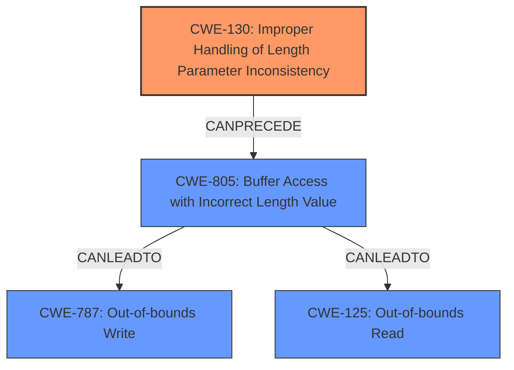

# Analysis for CVE-2020-10065

# Summary
| CWE ID | CWE Name | Confidence | CWE Abstraction Level | CWE Vulnerability Mapping Label | CWE-Vulnerability Mapping Notes |
|---|---|---|---|---|---|
| CWE-130 | Improper Handling of Length Parameter Inconsistency | 1.0 | Base | Allowed | Primary CWE |
| CWE-125 | Out-of-bounds Read | 0.7 | Base | Allowed | Secondary CWE |
| CWE-787 | Out-of-bounds Write | 0.7 | Base | Allowed | Secondary CWE |

## Evidence and Confidence

*   **Confidence Score:** 0.9
*   **Evidence Strength:** HIGH

## Relationship Analysis
The primary CWE, CWE-130 [Improper Handling of Length Parameter Inconsistency], is directly supported by the vulnerability description which explicitly mentions it as the **rootcause**. The retriever results also list it as the top candidate. CWE-130 is related to out-of-bounds read/write issues, as an inconsistent length parameter can lead to accessing memory outside the intended buffer. This is reflected in the `CanPrecede` relationship to CWE-805 [Buffer Access with Incorrect Length Value], which can then lead to CWE-787 [Out-of-bounds Write] or CWE-125 [Out-of-bounds Read].

## Vulnerability Chain
The vulnerability chain begins with **Improper Handling of Length Parameter Inconsistency** (CWE-130), which leads to **Out-of-bounds Write** (CWE-787) or **Out-of-bounds Read** (CWE-125) when the program attempts to access memory locations beyond the allocated buffer due to the incorrect length.

## Summary of Analysis
The initial analysis identified CWE-130 [Improper Handling of Length Parameter Inconsistency] as the primary **rootcause**, supported by the explicit mention in the vulnerability description and the Retriever results. The subsequent analysis considered the downstream effects of this weakness, leading to the inclusion of CWE-787 [Out-of-bounds Write] or CWE-125 [Out-of-bounds Read] as secondary CWEs, representing the potential impacts of the vulnerability.

The primary decision is based on the following evidence: "Zephyr versions >= v1.14.2, >= v2.2.0 contain **Improper Handling of Length Parameter Inconsistency** (CWE-130)."

The graph relationships helped to solidify the understanding of how the initial weakness (CWE-130) can lead to out-of-bounds access (CWE-787 or CWE-125). The selected CWEs are at the optimal level of specificity because they accurately represent the **rootcause** and potential impacts of the vulnerability, while also aligning with the recommended abstraction levels (Base and Variant).

Relevant CWE Information:

# Enhanced Context (25 CWEs)
The following CWEs were identified as potentially relevant to this vulnerability:

## CWE-476: NULL Pointer Dereference
**Abstraction Level**: Base
**Similarity Score**: 0.78
**Source**: dense

**Description**:
The product dereferences a pointer that it expects to be valid but is NULL.

**Mapping Guidance**:
- Usage: Allowed
- Rationale: This CWE entry is at the Base level of abstraction, which is a preferred level of abstraction for mapping to the root causes of vulnerabilities.

## CWE-191: Integer Underflow (Wrap or Wraparound)
**Abstraction Level**: Base
**Similarity Score**: 0.77
**Source**: dense

**Description**:
The product subtracts one value from another, such that the result is less than the minimum allowable integer value, which produces a value that is not equal to the correct result.

**Mapping Guidance**:
- Usage: Allowed
- Rationale: This CWE entry is at the Base level of abstraction, which is a preferred level of abstraction for mapping to the root causes of vulnerabilities.

## CWE-131: Incorrect Calculation of Buffer Size
**Abstraction Level**: Base
**Similarity Score**: 0.77
**Source**: dense

**Description**:
The product does not correctly calculate the size to be used when allocating a buffer, which could lead to a buffer overflow.

**Mapping Guidance**:
- Usage: Allowed
- Rationale: This CWE entry is at the Base level of abstraction, which is a preferred level of abstraction for mapping to the root causes of vulnerabilities.

## CWE-130: Improper Handling of Length Parameter Inconsistency
**Abstraction Level**: Base
**Similarity Score**: 0.77
**Source**: dense

**Description**:
The product parses a formatted message or structure, but it does not handle or incorrectly handles a length field that is inconsistent with the actual length of the associated data.

**Mapping Guidance**:
- Usage: Allowed
- Rationale: This CWE entry is at the Base level of abstraction, which is a preferred level of abstraction for mapping to the root causes of vulnerabilities.

## CWE-805: Buffer Access with Incorrect Length Value
**Abstraction Level**: Base
**Similarity Score**: 0.77
**Source**: dense

**Description**:
The product uses a sequential operation to read or write a buffer, but it uses an incorrect length value that causes it to access memory that is outside of the bounds of the buffer.

**Mapping Guidance**:
- Usage: Allowed
- Rationale: This CWE entry is at the Base level of abstraction, which is a preferred level of abstraction for mapping to the root causes of vulnerabilities.

## CWE-824: Access of Uninitialized Pointer
**Abstraction Level**: Base
**Similarity Score**: 0.76
**Source**: dense

**Description**:
The product accesses or uses a pointer that has not been initialized.

**Mapping Guidance**:
- Usage: Allowed
- Rationale: This CWE entry is at the Base level of abstraction, which is a preferred level of abstraction for mapping to the root causes of vulnerabilities.

## CWE-703: Improper Check or Handling of Exceptional Conditions
**Abstraction Level**: Pillar
**Similarity Score**: 0.75
**Source**: dense

**Description**:
The product does not properly anticipate or handle exceptional conditions that rarely occur during normal operation of the product.

**Mapping Guidance**:
- Usage: Discouraged
- Rationale: This CWE entry is extremely high-level, a Pillar.

## CWE-226: Sensitive Information in Resource Not Removed Before Reuse
**Abstraction Level**: Base
**Similarity Score**: 0.75
**Source**: dense

**Description**:
The product releases a resource such as memory or a file so that it can be made available for reuse, but it does not clear or "zeroize" the information contained in the resource before the product performs a critical state transition or makes the resource available for reuse by other entities.

**Mapping Guidance**:
- Usage: Allowed
- Rationale: This CWE entry is at the Base level of abstraction, which is a preferred level of abstraction for mapping to the root causes of vulnerabilities.

## CWE-126: Buffer Over-read
**Abstraction Level**: Variant
**Similarity Score**: 0.75
**Source**: dense

**Description**:
The product reads from a buffer using buffer access mechanisms such as indexes or pointers that reference memory locations after the targeted buffer.

**Mapping Guidance**:
- Usage: Allowed
- Rationale: This CWE entry is at the Variant level of abstraction, which is a preferred level of abstraction for mapping to the root causes of vulnerabilities.

## CWE-822: Untrusted Pointer Dereference
**Abstraction Level**: Base
**Similarity Score**: 0.75
**Source**: dense

**Description**:
The product obtains a value from an untrusted source, converts this value to a pointer, and dereferences the resulting pointer.

**Mapping Guidance**:
- Usage: Allowed
- Rationale: This CWE entry is at the Base level of abstraction, which is a preferred level of abstraction for mapping to the root causes of vulnerabilities.

## CWE-1284: Improper Validation of Specified Quantity in Input
**Abstraction Level**: Base
**Similarity Score**: 4714.69
**Source**: sparse

**Description**:
The product receives input that is expected to specify a quantity (such as size or length), but it does not validate or incorrectly validates that the quantity has the required properties.

**Mapping Guidance**: