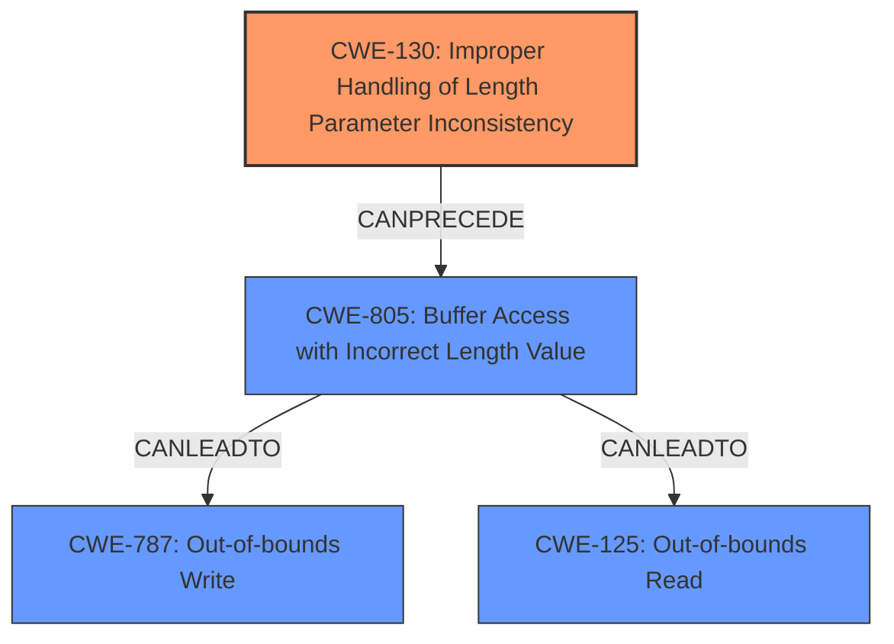

# Analysis for CVE-2020-10065

# Summary
| CWE ID | CWE Name | Confidence | CWE Abstraction Level | CWE Vulnerability Mapping Label | CWE-Vulnerability Mapping Notes |
|---|---|---|---|---|---|
| CWE-130 | Improper Handling of Length Parameter Inconsistency | 1.0 | Base | Allowed | Primary CWE |
| CWE-125 | Out-of-bounds Read | 0.7 | Base | Allowed | Secondary CWE |
| CWE-787 | Out-of-bounds Write | 0.7 | Base | Allowed | Secondary CWE |

## Evidence and Confidence

*   **Confidence Score:** 0.9
*   **Evidence Strength:** HIGH

## Relationship Analysis
The primary CWE, CWE-130 [Improper Handling of Length Parameter Inconsistency], is directly supported by the vulnerability description which explicitly mentions it as the **rootcause**. The retriever results also list it as the top candidate. CWE-130 is related to out-of-bounds read/write issues, as an inconsistent length parameter can lead to accessing memory outside the intended buffer. This is reflected in the `CanPrecede` relationship to CWE-805 [Buffer Access with Incorrect Length Value], which can then lead to CWE-787 [Out-of-bounds Write] or CWE-125 [Out-of-bounds Read].

## Vulnerability Chain
The vulnerability chain begins with **Improper Handling of Length Parameter Inconsistency** (CWE-130), which leads to **Out-of-bounds Write** (CWE-787) or **Out-of-bounds Read** (CWE-125) when the program attempts to access memory locations beyond the allocated buffer due to the incorrect length.

## Summary of Analysis
The initial analysis identified CWE-130 [Improper Handling of Length Parameter Inconsistency] as the primary **rootcause**, supported by the explicit mention in the vulnerability description and the Retriever results. The subsequent analysis considered the downstream effects of this weakness, leading to the inclusion of CWE-787 [Out-of-bounds Write] or CWE-125 [Out-of-bounds Read] as secondary CWEs, representing the potential impacts of the vulnerability.

The primary decision is based on the following evidence: "Zephyr versions >= v1.14.2, >= v2.2.0 contain **Improper Handling of Length Parameter Inconsistency** (CWE-130)."

The graph relationships helped to solidify the understanding of how the initial weakness (CWE-130) can lead to out-of-bounds access (CWE-787 or CWE-125). The selected CWEs are at the optimal level of specificity because they accurately represent the **rootcause** and potential impacts of the vulnerability, while also aligning with the recommended abstraction levels (Base and Variant).

Relevant CWE Information:

# Enhanced Context (25 CWEs)
The following CWEs were identified as potentially relevant to this vulnerability:

## CWE-476: NULL Pointer Dereference
**Abstraction Level**: Base
**Similarity Score**: 0.78
**Source**: dense

**Description**:
The product dereferences a pointer that it expects to be valid but is NULL.

**Mapping Guidance**:
- Usage: Allowed
- Rationale: This CWE entry is at the Base level of abstraction, which is a preferred level of abstraction for mapping to the root causes of vulnerabilities.

## CWE-191: Integer Underflow (Wrap or Wraparound)
**Abstraction Level**: Base
**Similarity Score**: 0.77
**Source**: dense

**Description**:
The product subtracts one value from another, such that the result is less than the minimum allowable integer value, which produces a value that is not equal to the correct result.

**Mapping Guidance**:
- Usage: Allowed
- Rationale: This CWE entry is at the Base level of abstraction, which is a preferred level of abstraction for mapping to the root causes of vulnerabilities.

## CWE-131: Incorrect Calculation of Buffer Size
**Abstraction Level**: Base
**Similarity Score**: 0.77
**Source**: dense

**Description**:
The product does not correctly calculate the size to be used when allocating a buffer, which could lead to a buffer overflow.

**Mapping Guidance**:
- Usage: Allowed
- Rationale: This CWE entry is at the Base level of abstraction, which is a preferred level of abstraction for mapping to the root causes of vulnerabilities.

## CWE-130: Improper Handling of Length Parameter Inconsistency
**Abstraction Level**: Base
**Similarity Score**: 0.77
**Source**: dense

**Description**:
The product parses a formatted message or structure, but it does not handle or incorrectly handles a length field that is inconsistent with the actual length of the associated data.

**Mapping Guidance**:
- Usage: Allowed
- Rationale: This CWE entry is at the Base level of abstraction, which is a preferred level of abstraction for mapping to the root causes of vulnerabilities.

## CWE-805: Buffer Access with Incorrect Length Value
**Abstraction Level**: Base
**Similarity Score**: 0.77
**Source**: dense

**Description**:
The product uses a sequential operation to read or write a buffer, but it uses an incorrect length value that causes it to access memory that is outside of the bounds of the buffer.

**Mapping Guidance**:
- Usage: Allowed
- Rationale: This CWE entry is at the Base level of abstraction, which is a preferred level of abstraction for mapping to the root causes of vulnerabilities.

## CWE-824: Access of Uninitialized Pointer
**Abstraction Level**: Base
**Similarity Score**: 0.76
**Source**: dense

**Description**:
The product accesses or uses a pointer that has not been initialized.

**Mapping Guidance**:
- Usage: Allowed
- Rationale: This CWE entry is at the Base level of abstraction, which is a preferred level of abstraction for mapping to the root causes of vulnerabilities.

## CWE-703: Improper Check or Handling of Exceptional Conditions
**Abstraction Level**: Pillar
**Similarity Score**: 0.75
**Source**: dense

**Description**:
The product does not properly anticipate or handle exceptional conditions that rarely occur during normal operation of the product.

**Mapping Guidance**:
- Usage: Discouraged
- Rationale: This CWE entry is extremely high-level, a Pillar.

## CWE-226: Sensitive Information in Resource Not Removed Before Reuse
**Abstraction Level**: Base
**Similarity Score**: 0.75
**Source**: dense

**Description**:
The product releases a resource such as memory or a file so that it can be made available for reuse, but it does not clear or "zeroize" the information contained in the resource before the product performs a critical state transition or makes the resource available for reuse by other entities.

**Mapping Guidance**:
- Usage: Allowed
- Rationale: This CWE entry is at the Base level of abstraction, which is a preferred level of abstraction for mapping to the root causes of vulnerabilities.

## CWE-126: Buffer Over-read
**Abstraction Level**: Variant
**Similarity Score**: 0.75
**Source**: dense

**Description**:
The product reads from a buffer using buffer access mechanisms such as indexes or pointers that reference memory locations after the targeted buffer.

**Mapping Guidance**:
- Usage: Allowed
- Rationale: This CWE entry is at the Variant level of abstraction, which is a preferred level of abstraction for mapping to the root causes of vulnerabilities.

## CWE-822: Untrusted Pointer Dereference
**Abstraction Level**: Base
**Similarity Score**: 0.75
**Source**: dense

**Description**:
The product obtains a value from an untrusted source, converts this value to a pointer, and dereferences the resulting pointer.

**Mapping Guidance**:
- Usage: Allowed
- Rationale: This CWE entry is at the Base level of abstraction, which is a preferred level of abstraction for mapping to the root causes of vulnerabilities.

## CWE-1284: Improper Validation of Specified Quantity in Input
**Abstraction Level**: Base
**Similarity Score**: 4714.69
**Source**: sparse

**Description**:
The product receives input that is expected to specify a quantity (such as size or length), but it does not validate or incorrectly validates that the quantity has the required properties.

**Mapping Guidance**:

# Enhanced Query for CVE-2020-10065

## Vulnerability Description
Missing Size Checks in Bluetooth HCI over SPI. Zephyr versions >= v1.14.2, >= v2.2.0 contain **Improper Handling of Length Parameter Inconsistency** (CWE-130). For more information, see https//github.com/zephyrproject-rtos/zephyr/security/advisories/GHSA-hg2w-62p6-g67c

### Vulnerability Description Key Phrases
- **rootcause:** **Improper Handling of Length Parameter Inconsistency**
- **product:** Zephyr
- **version:** versions >= v1.14.2, >= v2.2.0
- **component:** Bluetooth HCI over SPI

## CVE Reference Links Content Summary
Based on the provided information, here's a breakdown of the vulnerability described:

**Root Cause:**

- The vulnerability lies in the `bt_spi_rx_thread` function within the Bluetooth HCI over SPI driver (`drivers/bluetooth/hci/spi.c`).
- The code directly copies a size value from the ACL header of an incoming SPI message without proper validation. This size value is then used to copy data into a fixed-size buffer, leading to an out-of-bounds write if the attacker provides a large size value in the ACL header.

**Weaknesses/Vulnerabilities:**

- **Lack of input validation:** The code fails to validate the length field (`acl_hdr.len`) read from the received data. It is treated as trusted data without any checks.
- **Out-of-bounds write:** The size read from the header is used to write data to a fixed-size buffer (defaulting to 77 bytes). If the length is greater than the buffer's capacity, a write outside of the buffer occurs, causing a buffer overflow.

**Impact of Exploitation:**

- **Denial of Service (DoS):** A large specified size could cause a crash, resulting in denial of service.
- **Remote Code Execution (RCE):** The out-of-bounds write can be potentially exploited to achieve arbitrary code execution. By carefully crafting the data to be copied, an attacker may overwrite critical parts of memory.

**Attack Vectors:**

- **Physical Access via SPI:** The attack vector is physical access to the SPI interface connected to the vulnerable device. The attacker needs to be able to send a crafted Bluetooth HCI message over SPI.

**Required Attacker Capabilities/Position:**

- **Physical access to the SPI bus.** The attacker must have the ability to send SPI messages to the vulnerable device.
- **Ability to control the data sent:** The attacker must be able to craft a HCI_ACL message and manipulate the `len` field in the `acl_hdr`.

**Additional Notes:**

- The vulnerability is present in Zephyr versions v1.14.2, and v2.2.0-v2.7.0 and is fixed in version v3.0.0.
- The vulnerability has a low CVSS severity score of 3.8, primarily due to the physical attack vector.
- The vulnerability is related to CWE-130: Improper Handling of Length Parameter Inconsistency.

## Retriever Results

### Top Combined Results

| Rank | CWE ID | Name | Abstraction | Usage  | Retrievers | Individual Scores |
|------|--------|------|-------------|-------|------------|-------------------|
| 1 | 130 | Improper Handling of Length Parameter Inconsistency | Base | Allowed | sparse | 0.468 |
| 2 | 191 | Integer Underflow (Wrap or Wraparound) | Base | Allowed | sparse | 0.257 |
| 3 | 588 | Attempt to Access Child of a Non-structure Pointer | Variant | Allowed | sparse | 0.253 |
| 4 | 703 | Improper Check or Handling of Exceptional Conditions | Pillar | Discouraged | sparse | 0.248 |
| 5 | 694 | Use of Multiple Resources with Duplicate Identifier | Base | Allowed | sparse | 0.242 |
| 6 | 805 | Buffer Access with Incorrect Length Value | Base | Allowed | dense | 0.543 |
| 7 | 806 | Buffer Access Using Size of Source Buffer | Variant | Allowed | graph | 0.002 |
| 8 | 1284 | Improper Validation of Specified Quantity in Input | Base | Allowed | sparse | 0.242 |
| 9 | 122 | Heap-based Buffer Overflow | Variant | Allowed | sparse | 0.203 |
| 10 | 476 | NULL Pointer Dereference | Base | Allowed | sparse | 0.189 |

# Complete CWE Specifications

## CWE-130: Improper Handling of Length Parameter Inconsistency
**Abstraction:** Base
**Status:** Incomplete

### Description
The product parses a formatted message or structure, but it does not handle or incorrectly handles a length field that is inconsistent with the actual length of the associated data.

### Extended Description
If an attacker can manipulate the length parameter associated with an input such that it is inconsistent with the actual length of the input, this can be leveraged to cause the target application to behave in unexpected, and possibly, malicious ways. One of the possible motives for doing so is to pass in arbitrarily large input to the application. Another possible motivation is the modification of application state by including invalid data for subsequent properties of the application. Such weaknesses commonly lead to attacks such as buffer overflows and execution of arbitrary code.

### Alternative Terms
length manipulation
length tampering

### Relationships
ChildOf -> CWE-240
ChildOf -> CWE-119
ChildOf -> CWE-119
CanPrecede -> CWE-805

### Mapping Guidance
**Usage:** Allowed
**Rationale:** This CWE entry is at the Base level of abstraction, which is a preferred level of abstraction for mapping to the root causes of vulnerabilities.
**Comments:** Carefully read both the name and description to ensure that this mapping is an appropriate fit. Do not try to 'force' a mapping to a lower-level Base/Variant simply to comply with this preferred level of abstraction.
**Reasons:**
- Acceptable-Use

### Additional Notes
**[Relationship]** This probably overlaps other categories including zero-length issues.

### Observed Examples
- **CVE-2014-0160:** Chain: "Heartbleed" bug receives an inconsistent length parameter (CWE-130) enabling an out-of-bounds read (CWE-126), returning memory that could include private cryptographic keys and other sensitive data.
- **CVE-2009-2299:** Web application firewall consumes excessive memory when an HTTP request contains a large Content-Length value but no POST data.
- **CVE-2001-0825:** Buffer overflow in internal string handling routine allows remote attackers to execute arbitrary commands via a length argument of zero or less, which disables the length check.

## CWE-191: Integer Underflow (Wrap or Wraparound)
**Abstraction:** Base
**Status:** Draft

### Description
The product subtracts one value from another, such that the result is less than the minimum allowable integer value, which produces a value that is not equal to the correct result.

### Extended Description
This can happen in signed and unsigned cases.

### Alternative Terms
Integer underflow: 

"Integer underflow" is sometimes used to identify signedness errors in which an originally positive number becomes negative as a result of subtraction. However, there are cases of bad subtraction in which unsigned integers are involved, so it's not always a signedness issue.

"Integer underflow" is occasionally used to describe array index errors in which the index is negative.

### Relationships
ChildOf -> CWE-682
ChildOf -> CWE-682

### Mapping Guidance
**Usage:** Allowed
**Rationale:** This CWE entry is at the Base level of abstraction, which is a preferred level of abstraction for mapping to the root causes of vulnerabilities.
**Comments:** Carefully read both the name and description to ensure that this mapping is an appropriate fit. Do not try to 'force' a mapping to a lower-level Base/Variant simply to comply with this preferred level of abstraction.
**Reasons:**
- Acceptable-Use

### Observed Examples
- **CVE-2004-0816:** Integer underflow in firewall via malformed packet.
- **CVE-2004-1002:** Integer underflow by packet with invalid length.
- **CVE-2005-0199:** Long input causes incorrect length calculation.

## CWE-588: Attempt to Access Child of a Non-structure Pointer
**Abstraction:** Variant
**Status:** Incomplete

### Description
Casting a non-structure type to a structure type and accessing a field can lead to memory access errors or data corruption.

### Extended Description
Not provided

### Alternative Terms
None

### Relationships
ChildOf -> CWE-704
ChildOf -> CWE-758

### Mapping Guidance
**Usage:** Allowed
**Rationale:** This CWE entry is at the Variant level of abstraction, which is a preferred level of abstraction for mapping to the root causes of vulnerabilities.
**Comments:** Carefully read both the name and description to ensure that this mapping is an appropriate fit. Do not try to 'force' a mapping to a lower-level Base/Variant simply to comply with this preferred level of abstraction.
**Reasons:**
- Acceptable-Use

### Observed Examples
- **CVE-2021-3510:** JSON decoder accesses a C union using an invalid offset to an object

## CWE-703: Improper Check or Handling of Exceptional Conditions
**Abstraction:** Pillar
**Status:** Incomplete

### Description
The product does not properly anticipate or handle exceptional conditions that rarely occur during normal operation of the product.

### Extended Description
Not provided

### Alternative Terms
None

### Relationships
None

### Mapping Guidance
**Usage:** Discouraged
**Rationale:** This CWE entry is extremely high-level, a Pillar.
**Comments:** Consider children or descendants of this entry instead.
**Reasons:**
- Abstraction

### Additional Notes
**[Relationship]** This is a high-level class that might have some overlap with other classes. It could be argued that even "normal" weaknesses such as buffer overflows involve unusual or exceptional conditions. In that sense, this might be an inherent aspect of most other weaknesses within CWE, similar to API Abuse (CWE-227) and Indicator of Poor Code Quality (CWE-398). However, this entry is currently intended to unify disparate concepts that do not have other places within the Research Concepts view (CWE-1000).

### Observed Examples
- **[REF-1374]:** Chain: JavaScript-based cryptocurrency library can fall back to the insecure Math.random() function instead of reporting a failure (CWE-392), thus reducing the entropy (CWE-332) and leading to generation of non-unique cryptographic keys for Bitcoin wallets (CWE-1391)
- **CVE-2022-22224:** Chain: an operating system does not properly process malformed Open Shortest Path First (OSPF) Type/Length/Value Identifiers (TLV) (CWE-703), which can cause the process to enter an infinite loop (CWE-835)

## CWE-694: Use of Multiple Resources with Duplicate Identifier
**Abstraction:** Base
**Status:** Incomplete

### Description
The product uses multiple resources that can have the same identifier, in a context in which unique identifiers are required.

### Extended Description
If the product assumes that each resource has a unique identifier, the product could operate on the wrong resource if attackers can cause multiple resources to be associated with the same identifier.

### Alternative Terms
None

### Relationships
ChildOf -> CWE-99
ChildOf -> CWE-573

### Mapping Guidance
**Usage:** Allowed
**Rationale:** This CWE entry is at the Base level of abstraction, which is a preferred level of abstraction for mapping to the root causes of vulnerabilities.
**Comments:** Carefully read both the name and description to ensure that this mapping is an appropriate fit. Do not try to 'force' a mapping to a lower-level Base/Variant simply to comply with this preferred level of abstraction.
**Reasons:**
- Acceptable-Use

### Additional Notes
**[Relationship]** This weakness is probably closely associated with other issues related to doubling, such as CWE-675 (Duplicate Operations on Resource). It's often a case of an API contract violation (CWE-227).

### Observed Examples
- **CVE-2013-4787:** chain: mobile OS verifies cryptographic signature of file in an archive, but then installs a different file with the same name that is also listed in the archive.

## CWE-805: Buffer Access with Incorrect Length Value
**Abstraction:** Base
**Status:** Incomplete

### Description
The product uses a sequential operation to read or write a buffer, but it uses an incorrect length value that causes it to access memory that is outside of the bounds of the buffer.

### Extended Description
When the length value exceeds the size of the destination, a buffer overflow could occur.

### Alternative Terms
None

### Relationships
ChildOf -> CWE-119
ChildOf -> CWE-119
ChildOf -> CWE-119

### Mapping Guidance
**Usage:** Allowed
**Rationale:** This CWE entry is at the Base level of abstraction, which is a preferred level of abstraction for mapping to the root causes of vulnerabilities.
**Comments:** Carefully read both the name and description to ensure that this mapping is an appropriate fit. Do not try to 'force' a mapping to a lower-level Base/Variant simply to comply with this preferred level of abstraction.
**Reasons:**
- Acceptable-Use

### Observed Examples
- **CVE-2011-1959:** Chain: large length value causes buffer over-read (CWE-126)
- **CVE-2011-1848:** Use of packet length field to make a calculation, then copy into a fixed-size buffer
- **CVE-2011-0105:** Chain: retrieval of length value from an uninitialized memory location

## CWE-806: Buffer Access Using Size of Source Buffer
**Abstraction:** Variant
**Status:** Incomplete

### Description
The product uses the size of a source buffer when reading from or writing to a destination buffer, which may cause it to access memory that is outside of the bounds of the buffer.

### Extended Description
When the size of the destination is smaller than the size of the source, a buffer overflow could occur.

### Alternative Terms
None

### Relationships
ChildOf -> CWE-805

### Mapping Guidance
**Usage:** Allowed
**Rationale:** This CWE entry is at the Variant level of abstraction, which is a preferred level of abstraction for mapping to the root causes of vulnerabilities.
**Comments:** Carefully read both the name and description to ensure that this mapping is an appropriate fit. Do not try to 'force' a mapping to a lower-level Base/Variant simply to comply with this preferred level of abstraction.
**Reasons:**
- Acceptable-Use

## CWE-1284: Improper Validation of Specified Quantity in Input
**Abstraction:** Base
**Status:** Incomplete

### Description
The product receives input that is expected to specify a quantity (such as size or length), but it does not validate or incorrectly validates that the quantity has the required properties.

### Extended Description

Specified quantities include size, length, frequency, price, rate, number of operations, time, and others. Code may rely on specified quantities to allocate resources, perform calculations, control iteration, etc. When the quantity is not properly validated, then attackers can specify malicious quantities to cause excessive resource allocation, trigger unexpected failures, enable buffer overflows, etc.

### Alternative Terms
None

### Relationships
ChildOf -> CWE-20
ChildOf -> CWE-20
CanPrecede -> CWE-789

### Mapping Guidance
**Usage:** Allowed
**Rationale:** This CWE entry is at the Base level of abstraction, which is a preferred level of abstraction for mapping to the root causes of vulnerabilities.
**Comments:** Carefully read both the name and description to ensure that this mapping is an appropriate fit. Do not try to 'force' a mapping to a lower-level Base/Variant simply to comply with this preferred level of abstraction.
**Reasons:**
- Acceptable-Use

### Additional Notes
**[Maintenance]** This entry is still under development and will continue to see updates and content improvements.

### Observed Examples
- **CVE-2022-21668:** Chain: Python library does not limit the resources used to process images that specify a very large number of bands (CWE-1284), leading to excessive memory consumption (CWE-789) or an integer overflow (CWE-190).
- **CVE-2008-1440:** lack of validation of length field leads to infinite loop
- **CVE-2008-2374:** lack of validation of string length fields allows memory consumption or buffer over-read

## CWE-122: Heap-based Buffer Overflow
**Abstraction:** Variant
**Status:** Draft

### Description
A heap overflow condition is a buffer overflow, where the buffer that can be overwritten is allocated in the heap portion of memory, generally meaning that the buffer was allocated using a routine such as malloc().

### Extended Description
Not provided

### Alternative Terms
None

### Relationships
ChildOf -> CWE-788
ChildOf -> CWE-787

### Mapping Guidance
**Usage:** Allowed
**Rationale:** This CWE entry is at the Variant level of abstraction, which is a preferred level of abstraction for mapping to the root causes of vulnerabilities.
**Comments:** Carefully read both the name and description to ensure that this mapping is an appropriate fit. Do not try to 'force' a mapping to a lower-level Base/Variant simply to comply with this preferred level of abstraction.
**Reasons:**
- Acceptable-Use

### Additional Notes
**[Relationship]** Heap-based buffer overflows are usually just as dangerous as stack-based buffer overflows.

### Observed Examples
- **CVE-2021-43537:** Chain: in a web browser, an unsigned 64-bit integer is forcibly cast to a 32-bit integer (CWE-681) and potentially leading to an integer overflow (CWE-190). If an integer overflow occurs, this can cause heap memory corruption (CWE-122)
- **CVE-2007-4268:** Chain: integer signedness error (CWE-195) passes signed comparison, leading to heap overflow (CWE-122)
- **CVE-2009-2523:** Chain: product does not handle when an input string is not NULL terminated (CWE-170), leading to buffer over-read (CWE-125) or heap-based buffer overflow (CWE-122).

## CWE-476: NULL Pointer Dereference
**Abstraction:** Base
**Status:** Stable

### Description
The product dereferences a pointer that it expects to be valid but is NULL.

### Extended Description
Not provided

### Alternative Terms
NPD: Common abbreviation for Null Pointer Dereference
null deref: Common abbreviation for Null Pointer Dereference
NPE: Common abbreviation for Null Pointer Exception
nil pointer dereference: used for access of nil in Go programs

### Relationships
ChildOf -> CWE-710
ChildOf -> CWE-754
ChildOf -> CWE-754

### Mapping Guidance
**Usage:** Allowed
**Rationale:** This CWE entry is at the Base level of abstraction, which is a preferred level of abstraction for mapping to the root causes of vulnerabilities.
**Comments:** Carefully read both the name and description to ensure that this mapping is an appropriate fit. Do not try to 'force' a mapping to a lower-level Base/Variant simply to comply with this preferred level of abstraction.
**Reasons:**
- Acceptable-Use

### Observed Examples
- **CVE-2005-3274:** race condition causes a table to be corrupted if a timer activates while it is being modified, leading to resultant NULL dereference; also involves locking.
- **CVE-2002-1912:** large number of packets leads to NULL dereference
- **CVE-2005-0772:** packet with invalid error status value triggers NULL dereference

