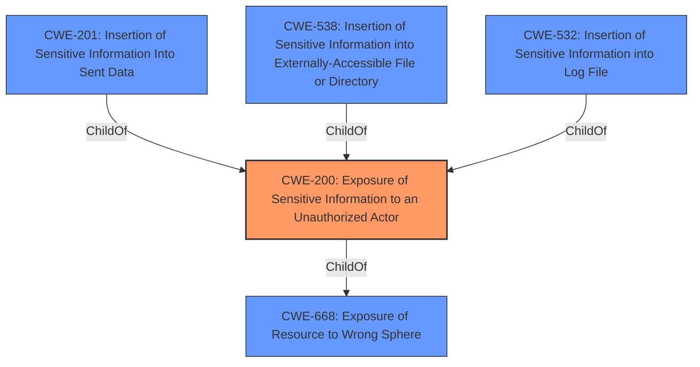

# Analysis for CVE-2020-10087

# Summary
| CWE ID | CWE Name | Confidence | CWE Abstraction Level | CWE Vulnerability Mapping Label | CWE-Vulnerability Mapping Notes |
|---|---|---|---|---|---|
| CWE-200 | Exposure of Sensitive Information to an Unauthorized Actor | 0.8 | Class | Primary | Discouraged |

## Evidence and Confidence

*   **Confidence Score:** 0.8
*   **Evidence Strength:** HIGH

## Relationship Analysis
The primary CWE selected is CWE-200, which is a Class-level CWE. While it's generally preferred to use Base or Variant level CWEs, the description directly relates to the exposure of the user's IP address, a form of sensitive information, to an unauthorized actor because the badge images were not being proxied. CWE-200 is the most fitting, despite being discouraged, because it is the direct result of the **weakness** of not proxying. Other CWEs, such as those related to authorization, are less relevant as the issue is not about access control, but rather about the **Information Disclosure** itself.

## Vulnerability Chain
The chain of events is straightforward: the badge images were not being proxied (**Root cause**), which resulted in the user's IP address being exposed (**Information Disclosure**).

## Summary of Analysis
The initial analysis identified CWE-200 as a strong candidate due to the explicit **Information Disclosure** mentioned in the vulnerability description. The **Root cause** was the lack of proxying for badge images, leading to the leakage of the user's IP address.

The Retriever Results also listed CWE-200 as the top combined result, reinforcing its relevance. However, the mapping guidance discourages its use because it's a high-level class. Despite this, it remains the most appropriate because the core issue is the exposure of sensitive information due to the **weakness** of not proxying.

The decision to use CWE-200 is based on the evidence that the IP address was directly leaked due to the lack of proxying. While other CWEs might be indirectly related, they don't capture the essence of the vulnerability as accurately as CWE-200.

Relevant CWE Information:
- CWE-200: Exposure of Sensitive Information to an Unauthorized Actor
  - The vulnerability description states "**Information Disclosure**." The reference links state "Badge images were not being proxied." "The lack of proxying for badge images caused mixed content warnings and exposed the user's IP address."
  - The security implication is the exposure of the user's IP address, which can be used for tracking or other malicious purposes.
  - This is a Class-level CWE, and while it's generally preferred to use Base or Variant level CWEs, the direct exposure of the IP address makes it the most fitting.
  - The MITRE mapping guidance discourages the use of CWE-200 as it is a class, but there isn't a better fitting base or variant CWE.

Other CWEs Considered:

*   CWE-923: Improper Restriction of Communication Channel to Intended Endpoints - While there is a communication channel involved, the core issue is not about restricting the channel but about the **Information Disclosure**.
*   CWE-863: Incorrect Authorization and CWE-862: Missing Authorization - These are not relevant as the vulnerability is not related to authorization.
*   CWE-319: Cleartext Transmission of Sensitive Information - While the IP address is transmitted, the issue is not about the transmission being in cleartext, but about the exposure of the IP address itself.
*   CWE-639: Authorization Bypass Through User-Controlled Key - Not applicable as there is no authorization bypass involved.

The selected CWE is at the optimal level of specificity because it directly addresses the **Information Disclosure** resulting from the lack of proxying. A more specific CWE would require additional details that are not provided in the vulnerability description.