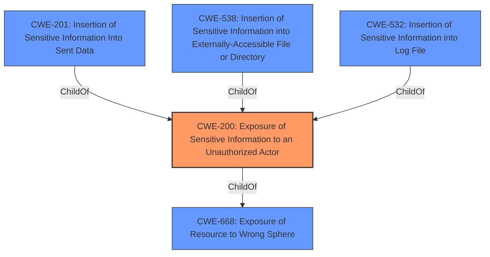

# Analysis for CVE-2020-10087

# Summary
| CWE ID | CWE Name | Confidence | CWE Abstraction Level | CWE Vulnerability Mapping Label | CWE-Vulnerability Mapping Notes |
|---|---|---|---|---|---|
| CWE-200 | Exposure of Sensitive Information to an Unauthorized Actor | 0.8 | Class | Primary | Discouraged |

## Evidence and Confidence

*   **Confidence Score:** 0.8
*   **Evidence Strength:** HIGH

## Relationship Analysis
The primary CWE selected is CWE-200, which is a Class-level CWE. While it's generally preferred to use Base or Variant level CWEs, the description directly relates to the exposure of the user's IP address, a form of sensitive information, to an unauthorized actor because the badge images were not being proxied. CWE-200 is the most fitting, despite being discouraged, because it is the direct result of the **weakness** of not proxying. Other CWEs, such as those related to authorization, are less relevant as the issue is not about access control, but rather about the **Information Disclosure** itself.

## Vulnerability Chain
The chain of events is straightforward: the badge images were not being proxied (**Root cause**), which resulted in the user's IP address being exposed (**Information Disclosure**).

## Summary of Analysis
The initial analysis identified CWE-200 as a strong candidate due to the explicit **Information Disclosure** mentioned in the vulnerability description. The **Root cause** was the lack of proxying for badge images, leading to the leakage of the user's IP address.

The Retriever Results also listed CWE-200 as the top combined result, reinforcing its relevance. However, the mapping guidance discourages its use because it's a high-level class. Despite this, it remains the most appropriate because the core issue is the exposure of sensitive information due to the **weakness** of not proxying.

The decision to use CWE-200 is based on the evidence that the IP address was directly leaked due to the lack of proxying. While other CWEs might be indirectly related, they don't capture the essence of the vulnerability as accurately as CWE-200.

Relevant CWE Information:
- CWE-200: Exposure of Sensitive Information to an Unauthorized Actor
  - The vulnerability description states "**Information Disclosure**." The reference links state "Badge images were not being proxied." "The lack of proxying for badge images caused mixed content warnings and exposed the user's IP address."
  - The security implication is the exposure of the user's IP address, which can be used for tracking or other malicious purposes.
  - This is a Class-level CWE, and while it's generally preferred to use Base or Variant level CWEs, the direct exposure of the IP address makes it the most fitting.
  - The MITRE mapping guidance discourages the use of CWE-200 as it is a class, but there isn't a better fitting base or variant CWE.

Other CWEs Considered:

*   CWE-923: Improper Restriction of Communication Channel to Intended Endpoints - While there is a communication channel involved, the core issue is not about restricting the channel but about the **Information Disclosure**.
*   CWE-863: Incorrect Authorization and CWE-862: Missing Authorization - These are not relevant as the vulnerability is not related to authorization.
*   CWE-319: Cleartext Transmission of Sensitive Information - While the IP address is transmitted, the issue is not about the transmission being in cleartext, but about the exposure of the IP address itself.
*   CWE-639: Authorization Bypass Through User-Controlled Key - Not applicable as there is no authorization bypass involved.

The selected CWE is at the optimal level of specificity because it directly addresses the **Information Disclosure** resulting from the lack of proxying. A more specific CWE would require additional details that are not provided in the vulnerability description.

# Enhanced Query for CVE-2020-10087

## Vulnerability Description
GitLab before 12.8.2 allows **Information Disclosure**. Badge images were not being proxied, causing mixed content warnings as well as leaking the IP address of the user.

### Vulnerability Description Key Phrases
- **weakness:** **Information Disclosure**
- **impact:** mixed content warnings and leaking IP address
- **product:** GitLab
- **version:** before 12.8.2

## CVE Reference Links Content Summary
- **Root cause of vulnerability**: Badge images were not being proxied.
- **Weaknesses/vulnerabilities present**:  The lack of proxying for badge images caused mixed content warnings and exposed the user's IP address.
-  **Impact of exploitation**: Leaking the user's IP address.
- **Attack vectors**:  Accessing badge images in GitLab.
- **Required attacker capabilities/position**:  The attacker would not need specific access but to simply trigger the loading of badge images on a victim's browser.

## Retriever Results

### Top Combined Results

| Rank | CWE ID | Name | Abstraction | Usage  | Retrievers | Individual Scores |
|------|--------|------|-------------|-------|------------|-------------------|
| 1 | 200 | Exposure of Sensitive Information to an Unauthorized Actor | Class | Discouraged | alternate_terms | 1.000 |
| 2 | 923 | Improper Restriction of Communication Channel to Intended Endpoints | Class | Allowed-with-Review | sparse | 0.195 |
| 3 | 863 | Incorrect Authorization | Class | Allowed-with-Review | sparse | 0.135 |
| 4 | 918 | Server-Side Request Forgery (SSRF) | Base | Allowed | sparse | 0.128 |
| 5 | 319 | Cleartext Transmission of Sensitive Information | Base | Allowed | sparse | 0.127 |
| 6 | 639 | Authorization Bypass Through User-Controlled Key | Base | Allowed | dense | 0.570 |
| 7 | 322 | Key Exchange without Entity Authentication | Base | Allowed | graph | 0.002 |
| 8 | 201 | Insertion of Sensitive Information Into Sent Data | Base | Allowed | sparse | 0.124 |
| 9 | 532 | Insertion of Sensitive Information into Log File | Base | Allowed | sparse | 0.123 |
| 10 | 862 | Missing Authorization | Class | Allowed-with-Review | sparse | 0.123 |

# Complete CWE Specifications

## CWE-200: Exposure of Sensitive Information to an Unauthorized Actor
**Abstraction:** Class
**Status:** Draft

### Description
The product exposes sensitive information to an actor that is not explicitly authorized to have access to that information.

### Extended Description

There are many different kinds of mistakes that introduce information exposures. The severity of the error can range widely, depending on the context in which the product operates, the type of sensitive information that is revealed, and the benefits it may provide to an attacker. Some kinds of sensitive information include:

  - private, personal information, such as personal messages, financial data, health records, geographic location, or contact details

  - system status and environment, such as the operating system and installed packages

  - business secrets and intellectual property

  - network status and configuration

  - the product's own code or internal state

  - metadata, e.g. logging of connections or message headers

  - indirect information, such as a discrepancy between two internal operations that can be observed by an outsider

Information might be sensitive to different parties, each of which may have their own expectations for whether the information should be protected. These parties include:

  - the product's own users

  - people or organizations whose information is created or used by the product, even if they are not direct product users

  - the product's administrators, including the admins of the system(s) and/or networks on which the product operates

  - the developer

Information exposures can occur in different ways:

  - the code  **explicitly inserts**  sensitive information into resources or messages that are intentionally made accessible to unauthorized actors, but should not contain the information - i.e., the information should have been "scrubbed" or "sanitized"

  - a different weakness or mistake  **indirectly inserts**  the sensitive information into resources, such as a web script error revealing the full system path of the program.

  - the code manages resources that intentionally contain sensitive information, but the resources are  **unintentionally made accessible**  to unauthorized actors. In this case, the information exposure is resultant - i.e., a different weakness enabled the access to the information in the first place.

It is common practice to describe any loss of confidentiality as an "information exposure," but this can lead to overuse of CWE-200 in CWE mapping. From the CWE perspective, loss of confidentiality is a technical impact that can arise from dozens of different weaknesses, such as insecure file permissions or out-of-bounds read. CWE-200 and its lower-level descendants are intended to cover the mistakes that occur in behaviors that explicitly manage, store, transfer, or cleanse sensitive information.

### Alternative Terms
Information Disclosure: This term is frequently used in vulnerability advisories to describe a consequence or technical impact, for any vulnerability that has a loss of confidentiality. Often, CWE-200 can be misused to represent the loss of confidentiality, even when the mistake - i.e., the weakness - is not directly related to the mishandling of the information itself, such as an out-of-bounds read that accesses sensitive memory contents; here, the out-of-bounds read is the primary weakness, not the disclosure of the memory. In addition, this phrase is also used frequently in policies and legal documents, but it does not refer to any disclosure of security-relevant information.
Information Leak: This is a frequently used term, however the "leak" term has multiple uses within security. In some cases it deals with the accidental exposure of information from a different weakness, but in other cases (such as "memory leak"), this deals with improper tracking of resources, which can lead to exhaustion. As a result, CWE is actively avoiding usage of the "leak" term.

### Relationships
ChildOf -> CWE-668

### Mapping Guidance
**Usage:** Discouraged
**Rationale:** CWE-200 is commonly misused to represent the loss of confidentiality in a vulnerability, but confidentiality loss is a technical impact - not a root cause error. As of CWE 4.9, over 400 CWE entries can lead to a loss of confidentiality. Other options are often available. [REF-1287].
**Comments:** If an error or mistake causes information to be disclosed, then use the CWE ID for that error. Consider starting with improper authorization (CWE-285), insecure permissions (CWE-732), improper authentication (CWE-287), etc. Also consider children such as Insertion of Sensitive Information Into Sent Data (CWE-201), Observable Discrepancy (CWE-203), Insertion of Sensitive Information into Externally-Accessible File or Directory (CWE-538), or others.
**Reasons:**
- Frequent Misuse

### Additional Notes
**[Maintenance]** As a result of mapping analysis in the 2020 Top 25 and more recent versions, this weakness is under review, since it is frequently misused in mapping to cover many problems that lead to loss of confidentiality. See Mapping Notes, Extended Description, and Alternate Terms.

### Observed Examples
- **CVE-2022-31162:** Rust library leaks Oauth client details in application debug logs
- **CVE-2021-25476:** Digital Rights Management (DRM) capability for mobile platform leaks pointer information, simplifying ASLR bypass
- **CVE-2001-1483:** Enumeration of valid usernames based on inconsistent responses

## CWE-923: Improper Restriction of Communication Channel to Intended Endpoints
**Abstraction:** Class
**Status:** Incomplete

### Description
The product establishes a communication channel to (or from) an endpoint for privileged or protected operations, but it does not properly ensure that it is communicating with the correct endpoint.

### Extended Description

Attackers might be able to spoof the intended endpoint from a different system or process, thus gaining the same level of access as the intended endpoint.

While this issue frequently involves authentication between network-based clients and servers, other types of communication channels and endpoints can have this weakness.

### Alternative Terms
None

### Relationships
ChildOf -> CWE-284

### Mapping Guidance
**Usage:** Allowed-with-Review
**Rationale:** This CWE entry is a Class and might have Base-level children that would be more appropriate
**Comments:** Examine children of this entry to see if there is a better fit
**Reasons:**
- Abstraction

### Observed Examples
- **CVE-2022-30319:** S-bus functionality in a home automation product performs access control using an IP allowlist, which can be bypassed by a forged IP address.
- **CVE-2022-22547:** A troubleshooting tool exposes a web server on a random port between 9000-65535 that could be used for information gathering
- **CVE-2022-4390:** A WAN interface on a router has firewall restrictions enabled for IPv4, but it does not for IPv6, which is enabled by default

## CWE-863: Incorrect Authorization
**Abstraction:** Class
**Status:** Incomplete

### Description
The product performs an authorization check when an actor attempts to access a resource or perform an action, but it does not correctly perform the check.

### Extended Description
Not provided

### Alternative Terms
AuthZ: "AuthZ" is typically used as an abbreviation of "authorization" within the web application security community. It is distinct from "AuthN" (or, sometimes, "AuthC") which is an abbreviation of "authentication." The use of "Auth" as an abbreviation is discouraged, since it could be used for either authentication or authorization.

### Relationships
ChildOf -> CWE-285
ChildOf -> CWE-284

### Mapping Guidance
**Usage:** Allowed-with-Review
**Rationale:** This CWE entry is a Class and might have Base-level children that would be more appropriate
**Comments:** Examine children of this entry to see if there is a better fit
**Reasons:**
- Abstraction

### Additional Notes
**[Terminology]** 

Assuming a user with a given identity, authorization is the process of determining whether that user can access a given resource, based on the user's privileges and any permissions or other access-control specifications that apply to the resource.

### Observed Examples
- **CVE-2021-39155:** Chain: A microservice integration and management platform compares the hostname in the HTTP Host header in a case-sensitive way (CWE-178, CWE-1289), allowing bypass of the authorization policy (CWE-863) using a hostname with mixed case or other variations.
- **CVE-2019-15900:** Chain: sscanf() call is used to check if a username and group exists, but the return value of sscanf() call is not checked (CWE-252), causing an uninitialized variable to be checked (CWE-457), returning success to allow authorization bypass for executing a privileged (CWE-863).
- **CVE-2009-2213:** Gateway uses default "Allow" configuration for its authorization settings.

## CWE-918: Server-Side Request Forgery (SSRF)
**Abstraction:** Base
**Status:** Incomplete

### Description
The web server receives a URL or similar request from an upstream component and retrieves the contents of this URL, but it does not sufficiently ensure that the request is being sent to the expected destination.

### Extended Description
Not provided

### Alternative Terms
XSPA: Cross Site Port Attack
SSRF: Server-Side Request Forgery

### Relationships
ChildOf -> CWE-441
ChildOf -> CWE-610

### Mapping Guidance
**Usage:** Allowed
**Rationale:** This CWE entry is at the Base level of abstraction, which is a preferred level of abstraction for mapping to the root causes of vulnerabilities.
**Comments:** Carefully read both the name and description to ensure that this mapping is an appropriate fit. Do not try to 'force' a mapping to a lower-level Base/Variant simply to comply with this preferred level of abstraction.
**Reasons:**
- Acceptable-Use

### Additional Notes
**[Relationship]** CWE-918 (SSRF) and CWE-611 (XXE) are closely related, because they both involve web-related technologies and can launch outbound requests to unexpected destinations. However, XXE can be performed client-side, or in other contexts in which the software is not acting directly as a server, so the "Server" portion of the SSRF acronym does not necessarily apply.

### Observed Examples
- **CVE-2023-32786:** Chain: LLM integration framework has prompt injection (CWE-1427) that allows an attacker to force the service to retrieve data from an arbitrary URL, essentially providing SSRF (CWE-918) and potentially injecting content into downstream tasks.
- **CVE-2021-26855:** Server Side Request Forgery (SSRF) in mail server, as exploited in the wild per CISA KEV.
- **CVE-2021-21973:** Server Side Request Forgery in cloud platform, as exploited in the wild per CISA KEV.

## CWE-319: Cleartext Transmission of Sensitive Information
**Abstraction:** Base
**Status:** Draft

### Description
The product transmits sensitive or security-critical data in cleartext in a communication channel that can be sniffed by unauthorized actors.

### Extended Description

Many communication channels can be "sniffed" (monitored) by adversaries during data transmission. For example, in networking, packets can traverse many intermediary nodes from the source to the destination, whether across the internet, an internal network, the cloud, etc. Some actors might have privileged access to a network interface or any link along the channel, such as a router, but they might not be authorized to collect the underlying data. As a result, network traffic could be sniffed by adversaries, spilling security-critical data.

Applicable communication channels are not limited to software products. Applicable channels include hardware-specific technologies such as internal hardware networks and external debug channels, supporting remote JTAG debugging. When mitigations are not applied to combat adversaries within the product's threat model, this weakness significantly lowers the difficulty of exploitation by such adversaries.

When full communications are recorded or logged, such as with a packet dump, an adversary could attempt to obtain the dump long after the transmission has occurred and try to "sniff" the cleartext from the recorded communications in the dump itself. Even if the information is encoded in a way that is not human-readable, certain techniques could determine which encoding is being used, then decode the information. 

### Alternative Terms
None

### Relationships
ChildOf -> CWE-311
ChildOf -> CWE-311

### Mapping Guidance
**Usage:** Allowed
**Rationale:** This CWE entry is at the Base level of abstraction, which is a preferred level of abstraction for mapping to the root causes of vulnerabilities.
**Comments:** Carefully read both the name and description to ensure that this mapping is an appropriate fit. Do not try to 'force' a mapping to a lower-level Base/Variant simply to comply with this preferred level of abstraction.
**Reasons:**
- Acceptable-Use

### Additional Notes
**[Maintenance]** The Taxonomy_Mappings to ISA/IEC 62443 were added in CWE 4.10, but they are still under review and might change in future CWE versions. These draft mappings were performed by members of the "Mapping CWE to 62443" subgroup of the CWE-CAPEC ICS/OT Special Interest Group (SIG), and their work is incomplete as of CWE 4.10. The mappings are included to facilitate discussion and review by the broader ICS/OT community, and they are likely to change in future CWE versions.

### Observed Examples
- **CVE-2022-29519:** Programmable Logic Controller (PLC) sends sensitive information in plaintext, including passwords and session tokens.
- **CVE-2022-30312:** Building Controller uses a protocol that transmits authentication credentials in plaintext.
- **CVE-2022-31204:** Programmable Logic Controller (PLC) sends password in plaintext.

## CWE-639: Authorization Bypass Through User-Controlled Key
**Abstraction:** Base
**Status:** Incomplete

### Description
The system's authorization functionality does not prevent one user from gaining access to another user's data or record by modifying the key value identifying the data.

### Extended Description

Retrieval of a user record occurs in the system based on some key value that is under user control. The key would typically identify a user-related record stored in the system and would be used to lookup that record for presentation to the user. It is likely that an attacker would have to be an authenticated user in the system. However, the authorization process would not properly check the data access operation to ensure that the authenticated user performing the operation has sufficient entitlements to perform the requested data access, hence bypassing any other authorization checks present in the system.

For example, attackers can look at places where user specific data is retrieved (e.g. search screens) and determine whether the key for the item being looked up is controllable externally. The key may be a hidden field in the HTML form field, might be passed as a URL parameter or as an unencrypted cookie variable, then in each of these cases it will be possible to tamper with the key value.

One manifestation of this weakness is when a system uses sequential or otherwise easily-guessable session IDs that would allow one user to easily switch to another user's session and read/modify their data.

### Alternative Terms
Insecure Direct Object Reference / IDOR: The "Insecure Direct Object Reference" term, as described in the OWASP Top Ten, is broader than this CWE because it also covers path traversal (CWE-22). Within the context of vulnerability theory, there is a similarity between the OWASP concept and CWE-706: Use of Incorrectly-Resolved Name or Reference.
Broken Object Level Authorization / BOLA: BOLA is used in the 2019 OWASP API Security Top 10 and is said to be the same as IDOR.
Horizontal Authorization: "Horizontal Authorization" is used to describe situations in which two users have the same privilege level, but must be prevented from accessing each other's resources. This is fairly common when using key-based access to resources in a multi-user context.

### Relationships
ChildOf -> CWE-863
ChildOf -> CWE-863
ChildOf -> CWE-284

### Mapping Guidance
**Usage:** Allowed
**Rationale:** This CWE entry is at the Base level of abstraction, which is a preferred level of abstraction for mapping to the root causes of vulnerabilities.
**Comments:** Carefully read both the name and description to ensure that this mapping is an appropriate fit. Do not try to 'force' a mapping to a lower-level Base/Variant simply to comply with this preferred level of abstraction.
**Reasons:**
- Acceptable-Use

### Observed Examples
- **CVE-2021-36539:** An educational application does not appropriately restrict file IDs to a particular user. The attacker can brute-force guess IDs, indicating IDOR.

## CWE-322: Key Exchange without Entity Authentication
**Abstraction:** Base
**Status:** Draft

### Description
The product performs a key exchange with an actor without verifying the identity of that actor.

### Extended Description
Performing a key exchange will preserve the integrity of the information sent between two entities, but this will not guarantee that the entities are who they claim they are. This may enable an attacker to impersonate an actor by modifying traffic between the two entities. Typically, this involves a victim client that contacts a malicious server that is impersonating a trusted server. If the client skips authentication or ignores an authentication failure, the malicious server may request authentication information from the user. The malicious server can then use this authentication information to log in to the trusted server using the victim's credentials, sniff traffic between the victim and trusted server, etc.

### Alternative Terms
None

### Relationships
ChildOf -> CWE-306
CanPrecede -> CWE-923
PeerOf -> CWE-295

### Mapping Guidance
**Usage:** Allowed
**Rationale:** This CWE entry is at the Base level of abstraction, which is a preferred level of abstraction for mapping to the root causes of vulnerabilities.
**Comments:** Carefully read both the name and description to ensure that this mapping is an appropriate fit. Do not try to 'force' a mapping to a lower-level Base/Variant simply to comply with this preferred level of abstraction.
**Reasons:**
- Acceptable-Use

## CWE-201: Insertion of Sensitive Information Into Sent Data
**Abstraction:** Base
**Status:** Draft

### Description
The code transmits data to another actor, but a portion of the data includes sensitive information that should not be accessible to that actor.

### Extended Description
Not provided

### Alternative Terms
None

### Relationships
ChildOf -> CWE-200
CanAlsoBe -> CWE-209
CanAlsoBe -> CWE-202

### Mapping Guidance
**Usage:** Allowed
**Rationale:** This CWE entry is at the Base level of abstraction, which is a preferred level of abstraction for mapping to the root causes of vulnerabilities.
**Comments:** Carefully read both the name and description to ensure that this mapping is an appropriate fit. Do not try to 'force' a mapping to a lower-level Base/Variant simply to comply with this preferred level of abstraction.
**Reasons:**
- Acceptable-Use

### Additional Notes
**[Other]** Sensitive information could include data that is sensitive in and of itself (such as credentials or private messages), or otherwise useful in the further exploitation of the system (such as internal file system structure).

### Observed Examples
- **CVE-2022-0708:** Collaboration platform does not clear team emails in a response, allowing leak of email addresses

## CWE-532: Insertion of Sensitive Information into Log File
**Abstraction:** Base
**Status:** Incomplete

### Description
The product writes sensitive information to a log file.

### Extended Description
Not provided

### Alternative Terms
None

### Relationships
ChildOf -> CWE-538
ChildOf -> CWE-200

### Mapping Guidance
**Usage:** Allowed
**Rationale:** This CWE entry is at the Base level of abstraction, which is a preferred level of abstraction for mapping to the root causes of vulnerabilities.
**Comments:** Carefully read both the name and description to ensure that this mapping is an appropriate fit. Do not try to 'force' a mapping to a lower-level Base/Variant simply to comply with this preferred level of abstraction.
**Reasons:**
- Acceptable-Use

### Observed Examples
- **CVE-2017-9615:** verbose logging stores admin credentials in a world-readable log file
- **CVE-2018-1999036:** SSH password for private key stored in build log

## CWE-862: Missing Authorization
**Abstraction:** Class
**Status:** Incomplete

### Description
The product does not perform an authorization check when an actor attempts to access a resource or perform an action.

### Extended Description
Not provided

### Alternative Terms
AuthZ: "AuthZ" is typically used as an abbreviation of "authorization" within the web application security community. It is distinct from "AuthN" (or, sometimes, "AuthC") which is an abbreviation of "authentication." The use of "Auth" as an abbreviation is discouraged, since it could be used for either authentication or authorization.

### Relationships
ChildOf -> CWE-285
ChildOf -> CWE-284

### Mapping Guidance
**Usage:** Allowed-with-Review
**Rationale:** This CWE entry is a Class and might have Base-level children that would be more appropriate
**Comments:** Examine children of this entry to see if there is a better fit
**Reasons:**
- Abstraction

### Additional Notes
**[Terminology]** Assuming a user with a given identity, authorization is the process of determining whether that user can access a given resource, based on the user's privileges and any permissions or other access-control specifications that apply to the resource.

### Observed Examples
- **CVE-2022-24730:** Go-based continuous deployment product does not check that a user has certain privileges to update or create an app, allowing adversaries to read sensitive repository information
- **CVE-2009-3168:** Web application does not restrict access to admin scripts, allowing authenticated users to reset administrative passwords.
- **CVE-2009-3597:** Web application stores database file under the web root with insufficient access control (CWE-219), allowing direct request.

