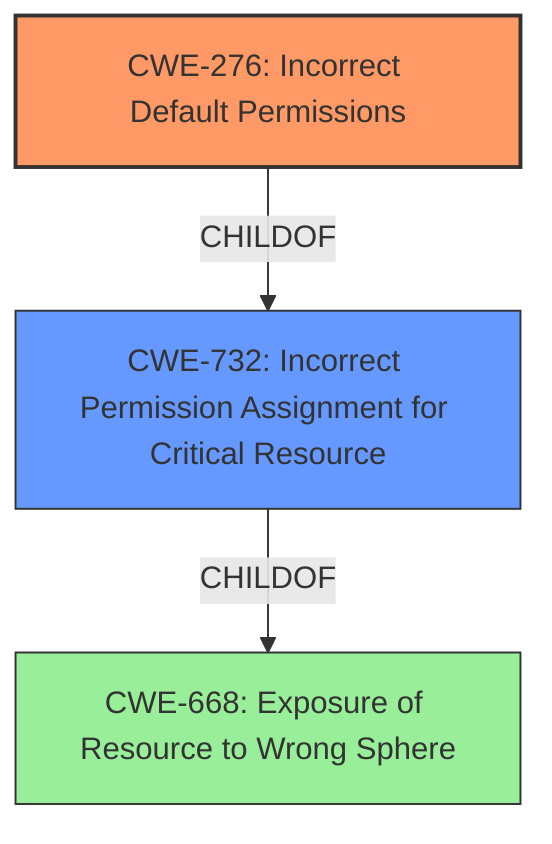

# Raw Analyzer Response for CVE-2020-10145

# Summary
| CWE ID | CWE Name | Confidence | CWE Abstraction Level | CWE Vulnerability Mapping Label | CWE-Vulnerability Mapping Notes |
|---|---|---|---|---|---|
| CWE-276 | Incorrect Default Permissions | 1.0 | Base | Allowed | Primary CWE |
| CWE-732 | Incorrect Permission Assignment for Critical Resource | 0.7 | Class | Allowed-with-Review | Secondary Candidate |

## Evidence and Confidence

*   **Confidence Score:** 0.9
*   **Evidence Strength:** HIGH

## Relationship Analysis
The primary relationship influencing the CWE selection is that CWE-276 (Incorrect Default Permissions) is a child of CWE-732 (Incorrect Permission Assignment for Critical Resource). This parent-child relationship guided the analysis to consider the more specific CWE-276, as it directly addresses the **root cause** of the vulnerability, which is the **incorrect default permissions** set during installation. The other relationships, such as those involving race conditions or path traversal, are not directly relevant to the described vulnerability.

## Vulnerability Chain
The vulnerability chain starts with the **failure to set a secure access-control list (ACL)** during the Adobe ColdFusion installation process, leading to **incorrect default permissions**. This allows unprivileged users to create files in the installation directory, ultimately resulting in privilege escalation and arbitrary code execution through DLL hijacking.

Root Cause: **Failure to set secure ACLs** -> Weakness: **Incorrect Default Permissions (CWE-276)** -> Impact: Privilege Escalation

## Summary of Analysis
The initial analysis focused on identifying the **root cause** of the vulnerability, which is the **failure to set a secure access-control list (ACL)** on the default installation directory. The evidence from the vulnerability description and CVE reference links summary clearly points to this **root cause**.

The Retriever Results highlighted several candidate CWEs, including CWE-276 (Incorrect Default Permissions), CWE-732 (Incorrect Permission Assignment for Critical Resource), and CWE-427 (Uncontrolled Search Path Element). After careful consideration, CWE-276 was selected as the primary CWE because it most accurately reflects the specific weakness: the Adobe ColdFusion installer **fails to set a secure access-control list (ACL)**, leading to **incorrect default permissions** on the installation directory. This directly matches the description of CWE-276, which states, "During installation, installed file permissions are set to allow anyone to modify those files."

CWE-732 (Incorrect Permission Assignment for Critical Resource) was considered as a secondary candidate, as it is a broader classification that encompasses the incorrect permission assignment. However, CWE-276 is a more specific child of CWE-732 and provides a more precise characterization of the vulnerability.

CWE-427 (Uncontrolled Search Path Element) was not selected because the vulnerability primarily involves incorrect default permissions rather than an uncontrolled search path. While the vulnerability can be exploited through DLL hijacking, which is related to search paths, the **root cause** is the **insecure ACL**, making CWE-276 the more appropriate choice.

The selection of CWE-276 is based on the MITRE mapping guidance, which recommends choosing the lowest level (Base or Variant) that accurately represents the weakness. CWE-276 is a Base-level CWE that directly addresses the **incorrect default permissions**, making it the optimal choice.

Relevant CWE Information:

# Enhanced Context (25 CWEs)

## CWE-276: Incorrect Default Permissions
**Abstraction:** Base
**Status:** Draft

### Description
During installation, installed file permissions are set to allow anyone to modify those files.

### Extended Description
Not provided

### Alternative Terms
None

### Relationships
ChildOf -> CWE-732
ChildOf -> CWE-732

### Mapping Guidance
**Usage:** Allowed
**Rationale:** This CWE entry is at the Base level of abstraction, which is a preferred level of abstraction for mapping to the root causes of vulnerabilities.
**Comments:** Carefully read both the name and description to ensure that this mapping is an appropriate fit. Do not try to 'force' a mapping to a lower-level Base/Variant simply to comply with this preferred level of abstraction.
**Reasons:**
- Acceptable-Use

### Observed Examples
- **CVE-2005-1941:** Executables installed world-writable.
- **CVE-2002-1713:** Home directories installed world-readable.
- **CVE-2001-1550:** World-writable log files allow information loss; world-readable file has cleartext passwords.

## CWE-732: Incorrect Permission Assignment for Critical Resource
**Abstraction:** Class
**Status:** Draft

### Description
The product specifies permissions for a security-critical resource in a way that allows that resource to be read or modified by unintended actors.

### Extended Description
When a resource is given a permission setting that provides access to a wider range of actors than required, it could lead to the exposure of sensitive information, or the modification of that resource by unintended parties. This is especially dangerous when the resource is related to program configuration, execution, or sensitive user data. For example, consider a misconfigured storage account for the cloud that can be read or written by a public or anonymous user.

### Alternative Terms
None

### Relationships
ChildOf -> CWE-285
ChildOf -> CWE-668

### Mapping Guidance
**Usage:** Allowed-with-Review
**Rationale:** While the name itself indicates an assignment of permissions for resources, this is often misused for vulnerabilities in which "permissions" are not checked, which is an "authorization" weakness (CWE-285 or descendants) within CWE's model [REF-1287].
**Comments:** Closely analyze the specific mistake that is allowing the resource to be exposed, and perform a CWE mapping for that mistake.
**Reasons:**
- Frequent Misuse

### Additional Notes
**[Maintenance]** The relationships between privileges, permissions, and actors (e.g. users and groups) need further refinement within the Research view. One complication is that these concepts apply to two different pillars, related to control of resources (CWE-664) and protection mechanism failures (CWE-693).

### Observed Examples
- **CVE-2022-29527:** Go application for cloud management creates a world-writable sudoers file that allows local attackers to inject sudo rules and escalate privileges to root by winning a race condition.
- **CVE-2009-3482:** Anti-virus product sets insecure "Everyone: Full Control" permissions for files under the "Program Files" folder, allowing attackers to replace executables with Trojan horses.
- **CVE-2009-3897:** Product creates directories with 0777 permissions at installation, allowing users to gain privileges and access a socket used for authentication.