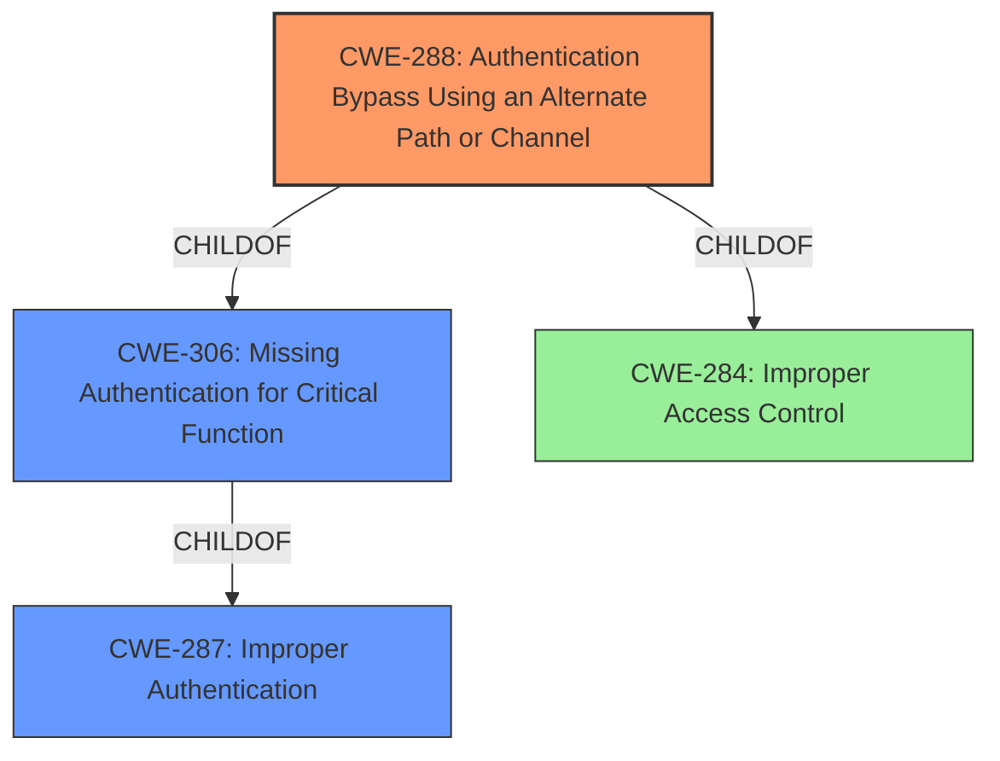

# Analysis for CVE-2020-10148

# Summary
| CWE ID | CWE Name | Confidence | CWE Abstraction Level | CWE Vulnerability Mapping Label | CWE-Vulnerability Mapping Notes |
|---|---|---|---|---|---|
| CWE-288 | Authentication Bypass Using an Alternate Path or Channel | 0.9 | Base | Allowed | Primary CWE |
| CWE-306 | Missing Authentication for Critical Function | 0.7 | Base | Allowed | Secondary Candidate |
| CWE-287 | Improper Authentication | 0.5 | Class | Discouraged | Secondary Candidate |

## Evidence and Confidence

*   **Confidence Score:** 0.9
*   **Evidence Strength:** HIGH

## Relationship Analysis
The primary CWE is CWE-288, Authentication Bypass Using an Alternate Path or Channel, which is a Base level CWE. This is a child of both CWE-306 (Missing Authentication for Critical Function) and CWE-284 (Improper Access Control). CWE-306, while relevant, is less specific, as it describes a complete lack of authentication, while CWE-288 indicates an alternate path that circumvents authentication. CWE-287 (Improper Authentication) is also related, but it is a Class-level CWE and is less specific than CWE-288. The hierarchical relationships influenced the selection by guiding towards the most specific Base-level CWE that accurately reflects the vulnerability.

## Vulnerability Chain
The vulnerability chain starts with **improper input handling** of the `PathInfo` parameter, leading to the **incorrect setting of the SkipAuthorization flag**, which results in the **authentication bypass**, and ultimately enables **remote command execution** and **compromise of the SolarWinds instance**.

## Summary of Analysis
The initial assessment identified the **authentication bypass** as the primary **weakness**. The CVE Reference Links Content Summary confirmed that the root cause is due to **improper handling of the PathInfo parameter**, which incorrectly sets the `SkipAuthorization` flag. This bypass allows remote attackers to execute API commands. The retriever results suggested CWE-288 (Authentication Bypass Using an Alternate Path or Channel), CWE-306 (Missing Authentication for Critical Function), and CWE-287 (Improper Authentication). After reviewing the CWE specifications, CWE-288 was selected as the primary CWE because it accurately describes the vulnerability where an alternate path is used to bypass authentication. CWE-306 could be considered, but it's less specific because authentication exists, but is bypassed. CWE-287 is too general.

The decision is based on the evidence provided in the CVE Reference Links Content Summary: "By appending specific parameters to the PathInfo, the application incorrectly sets the SkipAuthorization flag, leading to an authentication bypass."

The graph relationships influenced the final selection by highlighting the hierarchical structure and helping to identify the most specific and relevant CWE. CWE-288 is at the optimal level of specificity (Base) and accurately represents the vulnerability.

Relevant CWE Information:

# Enhanced Context (25 CWEs)

## CWE-274: Improper Handling of Insufficient Privileges
**Abstraction Level**: Base
**Similarity Score**: 0.77
**Source**: dense

**Description**:
The product does not handle or incorrectly handles when it has insufficient privileges to perform an operation, leading to resultant weaknesses.

**Mapping Guidance**:
- Usage: Discouraged
- Rationale: This CWE entry could be deprecated in a future version of CWE.

## CWE-1220: Insufficient Granularity of Access Control
**Abstraction Level**: Base
**Similarity Score**: 0.76
**Source**: dense

**Description**:
The product implements access controls via a policy or other feature with the intention to disable or restrict accesses (reads and/or writes) to assets in a system from untrusted agents. However, implemented access controls lack required granularity, which renders the control policy too broad because it allows accesses from unauthorized agents to the security-sensitive assets.

**Mapping Guidance**:
- Usage: Allowed
- Rationale: This CWE entry is at the Base level of abstraction, which is a preferred level of abstraction for mapping to the root causes of vulnerabilities.

## CWE-280: Improper Handling of Insufficient Permissions or Privileges
**Abstraction Level**: Base
**Similarity Score**: 0.76
**Source**: dense

**Description**:
The product does not handle or incorrectly handles when it has insufficient privileges to access resources or functionality as specified by their permissions. This may cause it to follow unexpected code paths that may leave the product in an invalid state.

**Mapping Guidance**:
- Usage: Allowed
- Rationale: This CWE entry is at the Base level of abstraction, which is a preferred level of abstraction for mapping to the root causes of vulnerabilities.

## CWE-807: Reliance on Untrusted Inputs in a Security Decision
**Abstraction Level**: Base
**Similarity Score**: 0.75
**Source**: dense

**Description**:
The product uses a protection mechanism that relies on the existence or values of an input, but the input can be modified by an untrusted actor in a way that bypasses the protection mechanism.

**Mapping Guidance**:
- Usage: Allowed
- Rationale: This CWE entry is at the Base level of abstraction, which is a preferred level of abstraction for mapping to the root causes of vulnerabilities.

## CWE-639: Authorization Bypass Through User-Controlled Key
**Abstraction Level**: Base
**Similarity Score**: 0.75
**Source**: dense

**Description**:
The system's authorization functionality does not prevent one user from gaining access to another user's data or record by modifying the key value identifying the data.

**Mapping Guidance**:
- Usage: Allowed
- Rationale: This CWE entry is at the Base level of abstraction, which is a preferred level of abstraction for mapping to the root causes of vulnerabilities.

## CWE-303: Incorrect Implementation of Authentication Algorithm
**Abstraction Level**: Base
**Similarity Score**: 0.75
**Source**: dense

**Description**:
The requirements for the product dictate the use of an established authentication algorithm, but the implementation of the algorithm is incorrect.

**Mapping Guidance**:
- Usage: Allowed
- Rationale: This CWE entry is at the Base level of abstraction, which is a preferred level of abstraction for mapping to the root causes of vulnerabilities.

## CWE-653: Improper Isolation or Compartmentalization
**Abstraction Level**: Class
**Similarity Score**: 0.75
**Source**: dense

**Description**:
The product does not properly compartmentalize or isolate functionality, processes, or resources that require different privilege levels, rights, or permissions.

**Mapping Guidance**:
- Usage: Allowed
- Rationale: This CWE entry is at the Base level of abstraction, which is a preferred level of abstraction for mapping to the root causes of vulnerabilities.

## CWE-424: Improper Protection of Alternate Path
**Abstraction Level**: Class
**Similarity Score**: 0.75
**Source**: dense

**Description**:
The product does not sufficiently protect all possible paths that a user can take to access restricted functionality or resources.

**Mapping Guidance**:
- Usage: Allowed-with-Review
- Rationale: This CWE entry is a Class and might have Base-level children that would be more appropriate

## CWE-1390: Weak Authentication
**Abstraction Level**: Class
**Similarity Score**: 0.74
**Source**: dense

**Description**:
The product uses an authentication mechanism to restrict access to specific users or identities, but the mechanism does not sufficiently prove that the claimed identity is correct.

**Mapping Guidance**:
- Usage: Allowed-with-Review
- Rationale: This CWE entry is a Class and might have Base-level children that would be more appropriate

## CWE-799: Improper Control of Interaction Frequency
**Abstraction Level**: Class
**Similarity Score**: 0.74
**Source**: dense

**Description**:
The product does not properly limit the number or frequency of interactions that it has with an actor, such as the number of incoming requests.

**Mapping Guidance**:
- Usage: Allowed-with-Review
- Rationale: This CWE entry is a Class and might have Base-level children that would be more appropriate

## CWE-863: Incorrect Authorization
**Abstraction Level**: Class
**Similarity Score**: 5569.29
**Source**: sparse

**Description**:
The product performs an authorization check when an actor attempts to access a resource or perform an