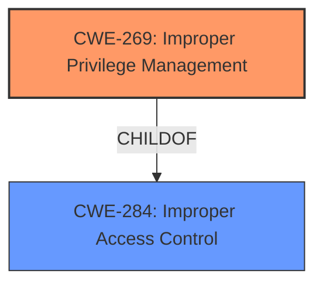

# Analysis Report for CVE-2020-10181

# Vulnerability Analysis Report: CVE-2020-10181

## Description


## Analysis (with Relationship Data)

# Summary
| CWE ID | CWE Name | Confidence | CWE Abstraction Level | CWE Vulnerability Mapping Label | CWE-Vulnerability Mapping Notes |
|---|---|---|---|---|---|
| CWE-269 | Improper Privilege Management | 0.7 | Class | Allowed-with-Review | Primary CWE |

## Evidence and Confidence

*   **Confidence Score:** 0.7
*   **Evidence Strength:** MEDIUM

## Relationship Analysis
The primary relationship impacting the decision is the ChildOf relationship between CWE-269 and CWE-284 (Improper Access Control). CWE-269 is a class-level CWE, and the description indicates a problem with privilege management, but the information provided does not allow us to pinpoint a more specific Base or Variant CWE.



## Vulnerability Chain
The vulnerability chain starts with the **improper** handling of user creation, leading to the **impact** of arbitrary user creation with elevated privileges.

## Summary of Analysis
Initially, several CWEs were considered based on the retriever results, including CWE-352 (Cross-Site Request Forgery), CWE-78 (OS Command Injection), and CWE-367 (Time-of-check Time-of-use Race Condition). However, these were deemed less relevant upon closer inspection of the vulnerability description, which focuses on the **creation of arbitrary users with elevated privileges**. The description states "goform/formEMR30 in Sumavision Enhanced Multimedia Router (EMR) 3.0.4.27 allows creation of arbitrary users with elevated privileges (administrator) on a device, as demonstrated by a setString=new_user<*1*>administrator<*1*>123456 request." This points directly to a flaw in **privilege management**, where the system **improperly** allows the creation of administrator accounts without proper authorization.

CWE-269 (Improper Privilege Management) is the most fitting CWE for this vulnerability because it directly addresses the issue of a product not properly assigning, modifying, tracking, or checking privileges for an actor, leading to an unintended sphere of control. While CWE-269 is a class-level CWE and thus discouraged for use by MITRE, the available evidence isn't detailed enough to narrow it down to a base or variant level CWE.

Relevant CWE Information:

# Enhanced Context (25 CWEs)

## CWE-269: Improper Privilege Management
**Abstraction Level**: Class
**Similarity Score**: 0.050 (sparse retriever)
**Description**:
The product does not properly assign, modify, track, or check privileges for an actor, creating an unintended sphere of control for that actor.
**Mapping Guidance**:
- Usage: Discouraged
- Rationale: CWE-269 is commonly misused. It can be conflated with "privilege escalation," which is a technical impact that is listed in many low-information vulnerability reports.
- Comments: If an error or mistake allows privilege escalation, then use the CWE ID for that mistake.

### Considered but not used:
- CWE-352: Cross-Site Request Forgery (CSRF) - This CWE was considered, but the vulnerability description does not explicitly indicate a CSRF attack vector. The issue is more directly related to **improper privilege management** during user creation.
- CWE-78: Improper Neutralization of Special Elements used in an OS Command ('OS Command Injection') - Although the CVE Reference mentions an exploit script, the vulnerability description focuses on user creation with elevated privileges rather than OS command injection.
- CWE-367: Time-of-check Time-of-use (TOCTOU) Race Condition - There is no indication of a race condition in the provided information.
- CWE-1188: Initialization of a Resource with an Insecure Default - While the vulnerability involves creating a user with administrator privileges, the root cause does not seem to be related to insecure default settings.
- CWE-472: External Control of Assumed-Immutable Web Parameter - This CWE is related to tampering with parameters, but the primary issue here is the **improper** granting of administrator privileges during user creation.
- CWE-79: Improper Neutralization of Input During Web Page Generation ('Cross-site Scripting') - Not applicable, as the vulnerability is not related to XSS.
- CWE-250: Execution with Unnecessary Privileges - While the created user ends up having unnecessary privileges, the root cause is the **improper** granting of privileges during user creation.
- CWE-732: Incorrect Permission Assignment for Critical Resource - The core issue is the **improper** creation of a user with administrator privileges, not necessarily the assignment of permissions to an existing resource.


## CWE Relationship Analysis

Current CWEs represent these abstraction levels: .


### Vulnerability Chain Analysis

**Chain starting from CWE-732:**
- 732 (Incorrect Permission Assignment for Critical Resource) - ROOT


**Chain starting from CWE-79:**
- 79 (Improper Neutralization of Input During Web Page Generation ('Cross-site Scripting')) - ROOT


### CWE Relationship Diagram

```mermaid
graph TD
    classDef primary fill:#f96,stroke:#333,stroke-width:2px
    classDef secondary fill:#69f,stroke:#333
    classDef tertiary fill:#9e9,stroke:#333
```


*Report generated on 2025-04-02 17:41:02*
