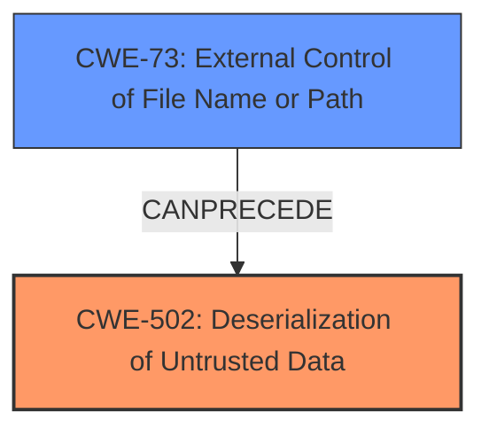

# Analysis for CVE-2020-10189

# Summary
| CWE ID | CWE Name | Confidence | CWE Abstraction Level | CWE Vulnerability Mapping Label | CWE-Vulnerability Mapping Notes |
|---|---|---|---|---|---|
| CWE-502 | Deserialization of Untrusted Data | 1.0 | Base | Allowed | Primary CWE |
| CWE-73 | External Control of File Name or Path | 0.5 | Base | Allowed | Secondary Candidate |

## Evidence and Confidence

*   **Confidence Score:** 0.9
*   **Evidence Strength:** HIGH

## Relationship Analysis
The primary relationship considered was the parent-child relationship, where CWE-502 is a base weakness. We looked at the alternative CWEs based on the Retriever results.
CWE-73 is indirectly related via CANPRECEDE relationship to CWE-502.

## Vulnerability Chain
The vulnerability chain starts with the **improper deserialization** of untrusted data (CWE-502), leading to remote code execution.
CWE-73 could precede CWE-502 if the attacker has control over the file path from which the data is deserialized.

## Summary of Analysis
The initial analysis focused on the **improper deserialization** aspect of the vulnerability. The `CVE Reference Links Content Summary` section states that "The vulnerability lies in the `FileStorage` class of the `CewolfServlet`. It arises from the lack of proper validation of user-supplied data (the 'img' parameter), which leads to deserialization of untrusted data. The `getChartImage` method in `FileStorage` creates a new `ObjectInputStream` from a filepath built using attacker-controlled input and then deserializes an object from the stream without validation." This clearly indicates CWE-502 as the primary weakness.

The graph relationships influenced the selection of CWE-73 as a secondary concern because it can precede CWE-502 if the attacker can control the file path.

The selected CWEs are at the optimal level of specificity, with CWE-502 being a Base level weakness directly addressing the **deserialization** issue.

Relevant CWE Information:

# Enhanced Context (25 CWEs)
The following CWEs were identified as potentially relevant to this vulnerability:

## CWE-330: Use of Insufficiently Random Values
**Abstraction Level**: Class
**Similarity Score**: 0.82
**Source**: dense

**Description**:
The product uses insufficiently random numbers or values in a security context that depends on unpredictable numbers.

**Mapping Guidance**:
- Usage: Discouraged
- Rationale: This CWE entry is a level-1 Class (i.e., a child of a Pillar). It might have lower-level children that would be more appropriate

## CWE-331: Insufficient Entropy
**Abstraction Level**: Base
**Similarity Score**: 0.78
**Source**: dense

**Description**:
The product uses an algorithm or scheme that produces insufficient entropy, leaving patterns or clusters of values that are more likely to occur than others.

**Mapping Guidance**:
- Usage: Allowed
- Rationale: This CWE entry is at the Base level of abstraction, which is a preferred level of abstraction for mapping to the root causes of vulnerabilities.

## CWE-345: Insufficient Verification of Data Authenticity
**Abstraction Level**: Class
**Similarity Score**: 0.78
**Source**: dense

**Description**:
The product does not sufficiently verify the origin or authenticity of data, in a way that causes it to accept invalid data.

**Mapping Guidance**:
- Usage: Discouraged
- Rationale: This CWE entry is a level-1 Class (i.e., a child of a Pillar). It might have lower-level children that would be more appropriate

## CWE-1391: Use of Weak Credentials
**Abstraction Level**: Class
**Similarity Score**: 0.78
**Source**: dense

**Description**:
The product uses weak credentials (such as a default key or hard-coded password) that can be calculated, derived, reused, or guessed by an attacker.

**Mapping Guidance**:
- Usage: Allowed-with-Review
- Rationale: This CWE entry is a Class and might have Base-level children that would be more appropriate

## CWE-668: Exposure of Resource to Wrong Sphere
**Abstraction Level**: Class
**Similarity Score**: 0.78
**Source**: dense

**Description**:
The product exposes a resource to the wrong control sphere, providing unintended actors with inappropriate access to the resource.

**Mapping Guidance**:
- Usage: Discouraged
- Rationale: CWE-668 is high-level and is often misused as a catch-all when lower-level CWE IDs might be applicable. It is sometimes used for low-information vulnerability reports [REF-1287]. It is a level-1 Class (i.e., a child of a Pillar). It is not useful for trend analysis.

## CWE-41: Improper Resolution of Path Equivalence
**Abstraction Level**: Base
**Similarity Score**: 0.78
**Source**: dense

**Description**:
The product is vulnerable to file system contents disclosure through path equivalence. Path equivalence involves the use of special characters in file and directory names. The associated manipulations are intended to generate multiple names for the same object.

**Mapping Guidance**:
- Usage: Allowed
- Rationale: This CWE entry is at the Base level of abstraction, which is a preferred level of abstraction for mapping to the root causes of vulnerabilities.

## CWE-23: Relative Path Traversal
**Abstraction Level**: Base
**Similarity Score**: 0.78
**Source**: dense

**Description**:
The product uses external input to construct a pathname that should be within a restricted directory, but it does not properly neutralize sequences such as ".." that can resolve to a location that is outside of that directory.

**Mapping Guidance**:
- Usage: Allowed
- Rationale: This CWE entry is at the Base level of abstraction, which is a preferred level of abstraction for mapping to the root causes of vulnerabilities.

## CWE-807: Reliance on Untrusted Inputs in a Security Decision
**Abstraction Level**: Base
**Similarity Score**: 0.78
**Source**: dense

**Description**:
The product uses a protection mechanism that relies on the existence or values of an input, but the input can be modified by an untrusted actor in a way that bypasses the protection mechanism.

**Mapping Guidance**:
- Usage: Allowed
- Rationale: This CWE entry is at the Base level of abstraction, which is a preferred level of abstraction for mapping to the root causes of vulnerabilities.

## CWE-703: Improper Check or Handling of Exceptional Conditions
**Abstraction Level**: Pillar
**Similarity Score**: 0.77
**Source**: dense

**Description**:
The product does not properly anticipate or handle exceptional conditions that rarely occur during normal operation of the product.

**Mapping Guidance**:
- Usage: Discouraged
- Rationale: This CWE entry is extremely high-level, a Pillar.

## CWE-203: Observable Discrepancy
**Abstraction Level**: Base
**Similarity Score**: 0.77
**Source**: dense

**Description**:
The product behaves differently or sends different responses under different circumstances in a way that is observable to an unauthorized actor, which exposes security-relevant information about the state of the product, such as whether a particular operation was successful or not.

**Mapping Guidance**:
- Usage: Allowed
- Rationale: This CWE entry is at the Base level of abstraction, which is a preferred level of abstraction for mapping to the root causes of vulnerabilities.

## CWE-22: Improper Limitation of a Pathname to a Restricted Directory ('Path Traversal')
**Abstraction Level**: Base
**Similarity Score**: 6087.89
**Source**: sparse

**Description**:
The product uses external input to construct a pathname that is intended to identify a file or directory that is located underneath a restricted parent directory, but the product does not properly neutralize special elements within the pathname that can cause the pathname to resolve to a location that is outside of the restricted directory.

**Mapping Guidance**:
- Usage: Allowed
- Rationale: This CWE entry is at the Base level of abstraction, which is a preferred level of abstraction for mapping to the root causes of vulnerabilities.

## CWE-502: Deserialization of Untrusted Data
**Abstraction Level**: Base
**Similarity Score**: 5900.52
**Source**: sparse

**Description**:
The product deserializes untrusted data without sufficiently ensuring that the resulting data will be valid.

**Mapping Guidance**:
- Usage: Allowed
- Rationale: This CWE entry is at the Base level of abstraction, which is a preferred level of abstraction for mapping to the root causes of vulnerabilities.

## CWE-23: Relative Path Traversal
**Abstraction Level**: Base
**Similarity Score**: 5