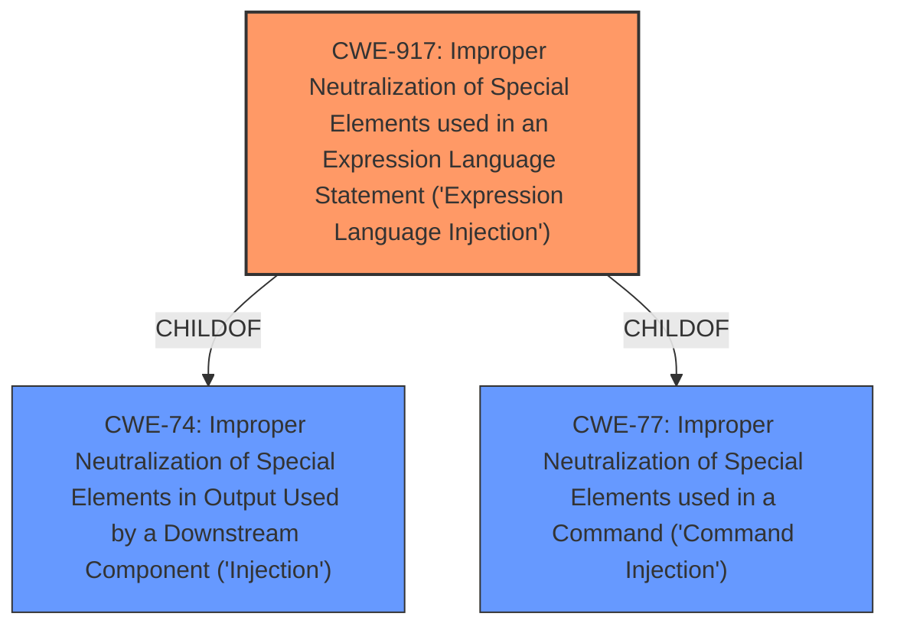

# Raw Analyzer Response for CVE-2020-10199

# Summary
| CWE ID | CWE Name | Confidence | CWE Abstraction Level | CWE Vulnerability Mapping Label | CWE-Vulnerability Mapping Notes |
|---|---|---|---|---|---|
| CWE-917 | Improper Neutralization of Special Elements used in an Expression Language Statement ('Expression Language Injection') | 1.0 | Base | Allowed | Primary CWE |

## Evidence and Confidence

*   **Confidence Score:** 1.0
*   **Evidence Strength:** HIGH

## Relationship Analysis
The primary relationship influencing the decision is the direct match of the vulnerability description to the definition of CWE-917. CWE-917 is a Base level CWE which is the preferred level of abstraction. Other CWEs were considered, especially those related to injection, but CWE-917 was the most specific and accurate.

## Vulnerability Chain
The vulnerability chain consists of the following sequence:
  1.  **Root Cause:** **JavaEL Injection** due to **improper neutralization** of special elements in an expression language statement.
  2.  **Impact:** Potential for code execution or other unexpected behaviors.

## Summary of Analysis
The primary CWE selected is CWE-917, which directly addresses the **JavaEL Injection** vulnerability. The vulnerability description explicitly mentions **JavaEL Injection**, aligning perfectly with the CWE's name and description: "Improper Neutralization of Special Elements used in an Expression Language Statement ('Expression Language Injection')." The evidence is strong, and the confidence level is high.

The selection of CWE-917 is based on the explicit mention of "JavaEL Injection" in the vulnerability description and its alignment with the CWE's definition. The CWE is at the Base level of abstraction, which is preferred. The relationship analysis confirms that while other injection-related CWEs exist, CWE-917 is the most specific and accurate representation of the vulnerability.

The provided evidence explicitly states: "Sonatype Nexus Repository before 3.21.2 allows **JavaEL Injection**". This statement directly supports the selection of CWE-917.

Other CWEs Considered:

*   CWE-74: Improper Neutralization of Special Elements in Output Used by a Downstream Component ('Injection') - While this is a general injection CWE, CWE-917 is more specific to Expression Language Injection. Therefore, CWE-74 is not used.
*   CWE-78: Improper Neutralization of Special Elements used in an OS Command ('OS Command Injection') - Not relevant as the vulnerability is about Expression Language Injection, not OS commands.
*   CWE-79: Improper Neutralization of Input During Web Page Generation ('Cross-site Scripting') - Not relevant as the vulnerability is about Expression Language Injection, not web page generation.
*   CWE-88: Improper Neutralization of Argument Delimiters in a Command ('Argument Injection') - Not relevant as the vulnerability is about Expression Language Injection, not command arguments.
*   CWE-95: Improper Neutralization of Directives in Dynamically Evaluated Code ('Eval Injection') - While related to code evaluation, CWE-917 is a more precise fit for Expression Language Injection.
*   CWE-1336: Improper Neutralization of Special Elements Used in a Template Engine - While template engines and expression languages may overlap, CWE-917 is more specific when the root cause is directly related to improper handling of expression language statements.
*   CWE-138: Improper Neutralization of Special Elements - This is a class level CWE and not specific enough.
*   CWE-790: Improper Filtering of Special Elements - This is a class level CWE and not specific enough.

Relevant CWE Information:

# Enhanced Context (25 CWEs)

## CWE-917: Improper Neutralization of Special Elements used in an Expression Language Statement ('Expression Language Injection')
**Abstraction Level**: Base
**Similarity Score**: 0.79
**Source**: dense

**Description**:
The product constructs all or part of an expression language (EL) statement in a framework such as a Java Server Page (JSP) using externally-influenced input from an upstream component, but it does not neutralize or incorrectly neutralizes special elements that could modify the intended EL statement before it is executed.

**Mapping Guidance**:
- Usage: Allowed
- Rationale: This CWE entry is at the Base level of abstraction, which is a preferred level of abstraction for mapping to the root causes of vulnerabilities.