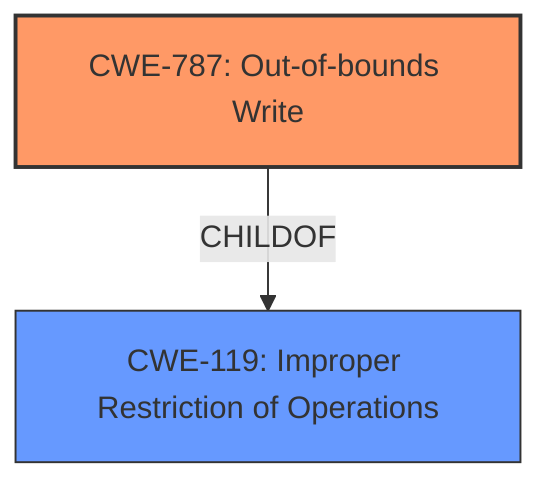

# Analysis for CVE-2020-1020

# Summary
| CWE ID | CWE Name | Confidence | CWE Abstraction Level | CWE Vulnerability Mapping Label | CWE-Vulnerability Mapping Notes |
|---|---|---|---|---|---|
| CWE-787 | Out-of-bounds Write | 0.9 | Base | Allowed | Primary CWE |

## Evidence and Confidence

*   **Confidence Score:** 0.9
*   **Evidence Strength:** HIGH

## Relationship Analysis
The primary relationship considered was the parent-child relationship between CWE-787 (Out-of-bounds Write) and CWE-119 (Improper Restriction of Operations Within the Bounds of a Memory Buffer). CWE-787 is a base-level CWE, which is preferred, and accurately reflects the vulnerability where data is written past the end of the intended buffer. While CWE-119 is a parent, it's a more general case and less specific than CWE-787.

## Vulnerability Chain
The vulnerability chain starts with the **improper handling of a specially-crafted multi-master font - Adobe Type 1 PostScript format**. This leads to an **out-of-bounds write** (CWE-787), which ultimately allows an attacker to **execute code remotely**.

## Summary of Analysis
The analysis is based on the provided vulnerability description and the associated key phrases. The key phrase explicitly states that the vulnerability is due to **improper handling of a specially-crafted multi-master font**, leading to remote code execution.

The Retriever Results also strongly suggest CWE-787 as a potential candidate, with a high score. The description of CWE-787 precisely matches the vulnerability: "The product writes data past the end, or before the beginning, of the intended buffer."

Therefore, the selection of CWE-787 is well-supported by evidence and aligns with the CWE specifications and mapping guidance. CWE-787 is at the optimal level of specificity, as it directly describes the **out-of-bounds write** condition that is the root cause of the vulnerability.

CWE-121 (Stack-based Buffer Overflow) and CWE-122 (Heap-based Buffer Overflow) were considered, but they are more specific types of buffer overflows. Since the vulnerability description doesn't specify whether the overflow occurs on the stack or the heap, CWE-787 is more appropriate. CWE-20 (Improper Input Validation) was also considered but deemed too general. The problem isn't necessarily a lack of input validation, but rather the **improper handling** of a specific data format that leads to memory corruption.

Relevant CWE Information:

# Enhanced Context (25 CWEs)
The following CWEs were identified as potentially relevant to this vulnerability:

## CWE-59: Improper Link Resolution Before File Access ('Link Following')
**Abstraction Level**: Base
**Similarity Score**: 0.82
**Source**: dense

**Description**:
The product attempts to access a file based on the filename, but it does not properly prevent that filename from identifying a link or shortcut that resolves to an unintended resource.

**Mapping Guidance**:
- Usage: Allowed
- Rationale: This CWE entry is at the Base level of abstraction, which is a preferred level of abstraction for mapping to the root causes of vulnerabilities.

## CWE-41: Improper Resolution of Path Equivalence
**Abstraction Level**: Base
**Similarity Score**: 0.80
**Source**: dense

**Description**:
The product is vulnerable to file system contents disclosure through path equivalence. Path equivalence involves the use of special characters in file and directory names. The associated manipulations are intended to generate multiple names for the same object.

**Mapping Guidance**:
- Usage: Allowed
- Rationale: This CWE entry is at the Base level of abstraction, which is a preferred level of abstraction for mapping to the root causes of vulnerabilities.

## CWE-73: External Control of File Name or Path
**Abstraction Level**: Base
**Similarity Score**: 0.79
**Source**: dense

**Description**:
The product allows user input to control or influence paths or file names that are used in filesystem operations.

**Mapping Guidance**:
- Usage: Allowed
- Rationale: This CWE entry is at the Base level of abstraction, which is a preferred level of abstraction for mapping to the root causes of vulnerabilities.

## CWE-23: Relative Path Traversal
**Abstraction Level**: Base
**Similarity Score**: 0.78
**Source**: dense

**Description**:
The product uses external input to construct a pathname that should be within a restricted directory, but it does not properly neutralize sequences such as ".." that can resolve to a location that is outside of that directory.

**Mapping Guidance**:
- Usage: Allowed
- Rationale: This CWE entry is at the Base level of abstraction, which is a preferred level of abstraction for mapping to the root causes of vulnerabilities.

## CWE-61: UNIX Symbolic Link (Symlink) Following
**Abstraction Level**: Compound
**Similarity Score**: 0.78
**Source**: dense

**Description**:
The product, when opening a file or directory, does not sufficiently account for when the file is a symbolic link that resolves to a target outside of the intended control sphere. This could allow an attacker to cause the product to operate on unauthorized files.

**Mapping Guidance**:
- Usage: Allowed
- Rationale: This is a well-known Composite of multiple weaknesses that must all occur simultaneously, although it is attack-oriented in nature.

## CWE-1289: Improper Validation of Unsafe Equivalence in Input
**Abstraction Level**: Base
**Similarity Score**: 0.78
**Source**: dense

**Description**:
The product receives an input value that is used as a resource identifier or other type of reference, but it does not validate or incorrectly validates that the input is equivalent to a potentially-unsafe value.

**Mapping Guidance**:
- Usage: Allowed
- Rationale: This CWE entry is at the Base level of abstraction, which is a preferred level of abstraction for mapping to the root causes of vulnerabilities.

## CWE-184: Incomplete List of Disallowed Inputs
**Abstraction Level**: Base
**Similarity Score**: 0.78
**Source**: dense

**Description**:
The product implements a protection mechanism that relies on a list of inputs (or properties of inputs) that are not allowed by policy or otherwise require other action to neutralize before additional processing takes place, but the list is incomplete.

**Mapping Guidance**:
- Usage: Allowed
- Rationale: This CWE entry is at the Base level of abstraction, which is a preferred level of abstraction for mapping to the root causes of vulnerabilities.

## CWE-427: Uncontrolled Search Path Element
**Abstraction Level**: Base
**Similarity Score**: 0.77
**Source**: dense

**Description**:
The product uses a fixed or controlled search path to find resources, but one or more locations in that path can be under the control of unintended actors.

**Mapping Guidance**:
- Usage: Allowed
- Rationale: This CWE entry is at the Base level of abstraction, which is a preferred level of abstraction for mapping to the root causes of vulnerabilities.

## CWE-74: Improper Neutralization of Special Elements in Output Used by a Downstream Component ('Injection')
**Abstraction Level**: Class
**Similarity Score**: 0.77
**Source**: dense

**Description**:
The product constructs all or part of a command, data structure, or record using externally-influenced input from an upstream component, but it does not neutralize or incorrectly neutralizes special elements that could modify how it is parsed or interpreted when it is sent to a downstream component.

**Mapping Guidance**:
- Usage: Discouraged
- Rationale: CWE-74 is high-level and often misused when lower-level weaknesses are more appropriate.

## CWE-125: Out-of-bounds Read
**Abstraction Level**: Base
**Similarity Score**: 0.77
**Source**: dense

**Description**:
The product reads data past the end, or before the beginning, of the intended buffer.

**Mapping Guidance**:
- Usage: Allowed
- Rationale: This CWE entry is at the Base level of abstraction, which is a preferred level of abstraction for mapping to the root causes of vulnerabilities.

## CWE-427: Uncontrolled Search Path Element
**Abstraction Level**: Base
**Similarity Score**: 7687.72
**Source**: sparse

**Description**:
The product uses a fixed or controlled search path to find resources, but one or more locations in that path can be under the control of unintended actors.

**Mapping Guidance**:
- Usage: Allowed
- Rationale: This CWE entry is at the Base level of abstraction, which is a preferred level of abstraction for mapping to the root causes of vulnerabilities.

## CWE-22: Improper Limitation of a Pathname to a Restricted Directory ('Path Traversal')
**Abstraction Level**: Base
**Similarity