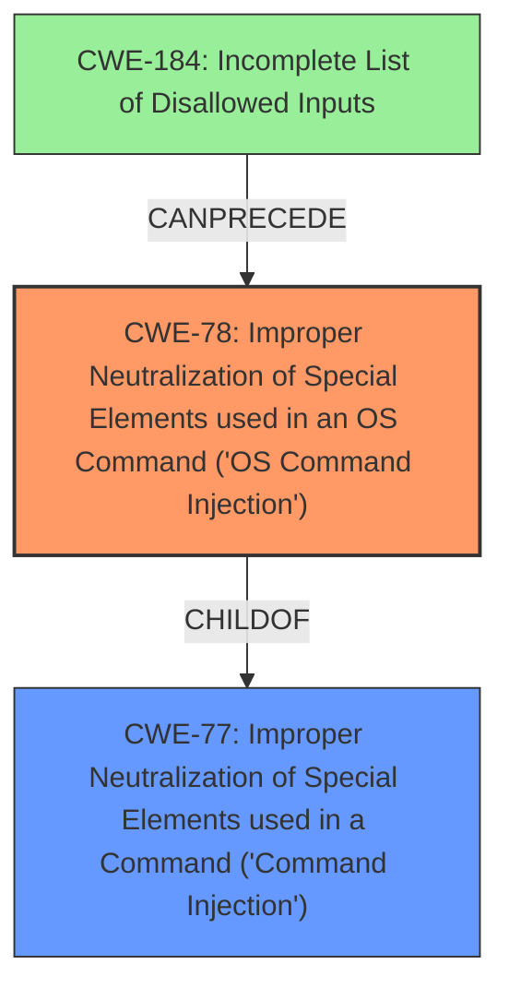

# Enhanced Analysis for CVE-2020-10221

# Summary
| CWE ID | CWE Name | Confidence | CWE Abstraction Level | CWE Vulnerability Mapping Label | CWE-Vulnerability Mapping Notes |
|---|---|---|---|---|---|
| CWE-78 | Improper Neutralization of Special Elements used in an OS Command ('OS Command Injection') | 1.0 | Base | Allowed | Primary CWE |
| CWE-77 | Improper Neutralization of Special Elements used in a Command ('Command Injection') | 0.75 | Class | Allowed-with-Review | Secondary Candidate. Considered because CWE-78 is a ChildOf this CWE. |
| CWE-184 | Incomplete List of Disallowed Inputs | 0.5 | Base | Allowed | Secondary Candidate. Could be present but not enough evidence to fully support. |

## Evidence and Confidence

*   **Confidence Score:** 0.9
*   **Evidence Strength:** HIGH

## Relationship Analysis
The primary CWE, CWE-78, is a base-level CWE that is a child of the class-level CWE-77. CWE-78 directly addresses the **improper neutralization** of special elements used in OS commands, which aligns perfectly with the vulnerability description. CWE-77 is a more general case of command injection. CWE-184, while potentially related, doesn't have strong evidence to support it, although it can precede CWE-78.



## Vulnerability Chain
The vulnerability chain starts with **improper input sanitization**, leading to **command injection**, and ultimately resulting in the ability to execute arbitrary OS commands.
  - **Root Cause:** **Improper input sanitization** of the fileName POST parameter.
  - **Weakness:** **Command injection** due to the inclusion of shell metacharacters.
  - **Impact:** Remote attackers can execute arbitrary OS commands on the server.

## Summary of Analysis
The initial assessment and final conclusion are based on the provided evidence, which strongly indicates CWE-78 as the primary weakness. The "Vulnerability Description Key Phrases" highlight the **rootcause** as **improper input sanitization** and the **weakness** as **command injection**. The "CVE Reference Links Content Summary" further supports this by stating: "Insufficient sanitization or validation of the user-supplied `$fileName` value allows for command injection."

CWE-78 is selected because it directly addresses the **improper neutralization** of special elements used in OS commands. The vulnerability description clearly states that remote attackers can execute arbitrary OS commands via shell metacharacters in the fileName POST parameter, making CWE-78 the most specific and relevant classification. CWE-77 was considered but determined to be a more general case of command injection, whereas CWE-78 explicitly refers to OS commands. CWE-184 was considered, but the provided evidence doesn't explicitly state an incomplete list of disallowed inputs, though the vulnerability is an indication this is what happened.

Relevant CWE Information:

# Enhanced Context (25 CWEs)
The following CWEs were identified as potentially relevant to this vulnerability:

## CWE-74: Improper Neutralization of Special Elements in Output Used by a Downstream Component ('Injection')
**Abstraction Level**: Class
**Similarity Score**: 0.77
**Source**: dense

**Description**:
The product constructs all or part of a command, data structure, or record using externally-influenced input from an upstream component, but it does not neutralize or incorrectly neutralizes special elements that could modify how it is parsed or interpreted when it is sent to a downstream component.

**Mapping Guidance**:
- Usage: Discouraged
- Rationale: CWE-74 is high-level and often misused when lower-level weaknesses are more appropriate.


## CWE-73: External Control of File Name or Path
**Abstraction Level**: Base
**Similarity Score**: 0.77
**Source**: dense

**Description**:
The product allows user input to control or influence paths or file names that are used in filesystem operations.

**Mapping Guidance**:
- Usage: Allowed
- Rationale: This CWE entry is at the Base level of abstraction, which is a preferred level of abstraction for mapping to the root causes of vulnerabilities.


## CWE-184: Incomplete List of Disallowed Inputs
**Abstraction Level**: Base
**Similarity Score**: 0.77
**Source**: dense

**Description**:
The product implements a protection mechanism that relies on a list of inputs (or properties of inputs) that are not allowed by policy or otherwise require other action to neutralize before additional processing takes place, but the list is incomplete.

**Mapping Guidance**:
- Usage: Allowed
- Rationale: This CWE entry is at the Base level of abstraction, which is a preferred level of abstraction for mapping to the root causes of vulnerabilities.


## CWE-41: Improper Resolution of Path Equivalence
**Abstraction Level**: Base
**Similarity Score**: 0.76
**Source**: dense

**Description**:
The product is vulnerable to file system contents disclosure through path equivalence. Path equivalence involves the use of special characters in file and directory names. The associated manipulations are intended to generate multiple names for the same object.

**Mapping Guidance**:
- Usage: Allowed
- Rationale: This CWE entry is at the Base level of abstraction, which is a preferred level of abstraction for mapping to the root causes of vulnerabilities.


## CWE-23: Relative Path Traversal
**Abstraction Level**: Base
**Similarity Score**: 0.76
**Source**: dense

**Description**:
The product uses external input to construct a pathname that should be within a restricted directory, but it does not properly neutralize sequences such as ".." that can resolve to a location that is outside of that directory.

**Mapping Guidance**:
- Usage: Allowed
- Rationale: This CWE entry is at the Base level of abstraction, which is a preferred level of abstraction for mapping to the root causes of vulnerabilities.


## CWE-138: Improper Neutralization of Special Elements
**Abstraction Level**: Class
**Similarity Score**: 0.75
**Source**: dense

**Description**:
The product receives input from an upstream component, but it does not neutralize or incorrectly neutralizes special elements that could be interpreted as control elements or syntactic markers when they are sent to a downstream component.

**Mapping Guidance**:
- Usage: Discouraged
- Rationale: This CWE entry is a level-1 Class (i.e., a child of a Pillar). It might have lower-level children that would be more appropriate


## CWE-59: Improper Link Resolution Before File Access ('Link Following')
**Abstraction Level**: Base
**Similarity Score**: 0.75
**Source**: dense

**Description**:
The product attempts to access a file based on the filename, but it does not properly prevent that filename from identifying a link or shortcut that resolves to an unintended resource.

**Mapping Guidance**:
- Usage: Allowed
- Rationale: This CWE entry is at the Base level of abstraction, which is a preferred level of abstraction for mapping to the root causes of vulnerabilities.


## CWE-36: Absolute Path Traversal
**Abstraction Level**: Base
**Similarity Score**: 0.75
**Source**: dense

**Description**:
The product uses external input to construct a pathname that should be within a restricted directory, but it does not properly neutralize absolute path sequences such as "/abs/path" that can resolve to a location that is outside of that directory.

**Mapping Guidance**:
- Usage: Allowed
- Rationale: This CWE entry is at the Base level of abstraction, which is a preferred level of abstraction for mapping to the root causes of vulnerabilities.


## CWE-1289: Improper Validation of Unsafe Equivalence in Input
**Abstraction Level**: Base
**Similarity Score**: 0.74
**Source**: dense

**Description**:
The product receives an input value that is used as a resource identifier or other type of reference, but it does not validate or incorrectly validates that the input is equivalent to a potentially-unsafe value.

**Mapping Guidance**:
- Usage: Allowed
- Rationale: This CWE entry is at the Base level of abstraction, which is a preferred level of abstraction for mapping to the root causes of vulnerabilities.


## CWE-917: Improper Neutralization of Special Elements used in an Expression Language Statement ('Expression Language Injection')
**Abstraction Level**: Base
**Similarity Score**: 0.74
**Source**: dense

**Description**:
The product constructs all or part of an expression language (EL) statement in a framework such as a Java Server Page (JSP) using externally-influenced input from an upstream component, but it does not neutralize or incorrectly neutral


## CWE Relationship Analysis

Current CWEs represent these abstraction levels: .


### Vulnerability Chain Analysis

**Chain starting from CWE-36:**
- 36 (Absolute Path Traversal) - ROOT


**Chain starting from CWE-73:**
- 73 (External Control of File Name or Path) - ROOT


### CWE Relationship Diagram

```mermaid
graph TD
    classDef primary fill:#f96,stroke:#333,stroke-width:2px
    classDef secondary fill:#69f,stroke:#333
    classDef tertiary fill:#9e9,stroke:#333
```