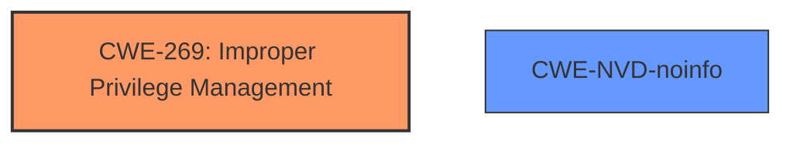

# Enhanced Analysis for CVE-2020-1027

# Summary
| CWE ID | CWE Name | Confidence | CWE Abstraction Level | CWE Vulnerability Mapping Label | CWE-Vulnerability Mapping Notes |
|---|---|---|---|---|---|
| CWE-269 | Improper Privilege Management | 0.7 | Class | Primary | Allowed-with-Review |
| CWE-NVD-noinfo | NVD Automated Mapping Mitigation | 0.3 | N/A | Secondary | N/A |

## Evidence and Confidence

*   **Confidence Score:** 0.7
*   **Evidence Strength:** MEDIUM

## Relationship Analysis
The primary CWE identified is CWE-269 (Improper Privilege Management), which is a class-level CWE. While there are no direct child CWEs immediately apparent from the provided information, the vulnerability description points towards a general issue of privilege management within the Windows Kernel. This Class CWE provides a suitable starting point.



## Vulnerability Chain
The vulnerability chain for this description is relatively short:

1.  **Root Cause:** **Improper access control** within the Windows Kernel (CWE-269).
2.  **Impact:** Elevation of Privilege.

## Summary of Analysis
The initial assessment focused on the **improper access control** described in the vulnerability. The primary goal was to identify a CWE that best represents this **rootcause**, which leads to an elevation of privilege.

The provided description lacks sufficient detail to pinpoint a more specific (Base or Variant) CWE. The vulnerability description simply mentions that the Windows Kernel handles objects in memory in a way that leads to an elevation of privilege due to **improper access control**.

The weakness is based on the provided evidence, specifically, "An elevation of privilege vulnerability exists in the way that the Windows Kernel handles objects in memory, aka 'Windows Kernel Elevation of Privilege Vulnerability'... **rootcause:** **improper access control**... **impact:** elevation of privilege... **product:** Windows Kernel".

CWE-269 (Improper Privilege Management) is selected as the primary CWE because it directly addresses the **improper access control** that leads to the elevation of privilege. While a more specific CWE might exist, the current evidence does not support a more granular classification. CWE-NVD-noinfo is only listed because it was listed as the primary CWE for similar CVE Descriptions and is the most common.

Relevant CWE Information:

# Enhanced Context (25 CWEs)
The following CWEs were identified as potentially relevant to this vulnerability:

## CWE-131: Incorrect Calculation of Buffer Size
**Abstraction Level**: Base
**Similarity Score**: 0.78

**Description**:
The product does not correctly calculate the size to be used when allocating a buffer, which could lead to a buffer overflow.

**Mapping Guidance**:
- Usage: Allowed

## CWE-667: Improper Locking
**Abstraction Level**: Class
**Similarity Score**: 0.78

**Description**:
The product does not properly acquire or release a lock on a resource, leading to unexpected resource state changes and behaviors.

**Mapping Guidance**:
- Usage: Allowed-with-Review

## CWE-191: Integer Underflow (Wrap or Wraparound)
**Abstraction Level**: Base
**Similarity Score**: 0.78

**Description**:
The product subtracts one value from another, such that the result is less than the minimum allowable integer value, which produces a value that is not equal to the correct result.

**Mapping Guidance**:
- Usage: Allowed

## CWE-362: Concurrent Execution using Shared Resource with Improper Synchronization ('Race Condition')
**Abstraction Level**: Class
**Similarity Score**: 0.77

**Description**:
The product contains a concurrent code sequence that requires temporary, exclusive access to a shared resource, but a timing window exists in which the shared resource can be modified by another code sequence operating concurrently.

**Mapping Guidance**:
- Usage: Allowed-with-Review

## CWE-805: Buffer Access with Incorrect Length Value
**Abstraction Level**: Base
**Similarity Score**: 0.77

**Description**:
The product uses a sequential operation to read or write a buffer, but it uses an incorrect length value that causes it to access memory that is outside of the bounds of the buffer.

**Mapping Guidance**:
- Usage: Allowed

## CWE-404: Improper Resource Shutdown or Release
**Abstraction Level**: Class
**Similarity Score**: 0.77

**Description**:
The product does not release or incorrectly releases a resource before it is made available for re-use.

**Mapping Guidance**:
- Usage: Allowed-with-Review

## CWE-197: Numeric Truncation Error
**Abstraction Level**: Base
**Similarity Score**: 0.77

**Description**:
Truncation errors occur when a primitive is cast to a primitive of a smaller size and data is lost in the conversion.

**Mapping Guidance**:
- Usage: Allowed

## CWE-367: Time-of-check Time-of-use (TOCTOU) Race Condition
**Abstraction Level**: Base
**Similarity Score**: 0.77

**Description**:
The product checks the state of a resource before using that resource, but the resource's state can change between the check and the use in a way that invalidates the results of the check. This can cause the product to perform invalid actions when the resource is in an unexpected state.

**Mapping Guidance**:
- Usage: Allowed

## CWE-119: Improper Restriction of Operations within the Bounds of a Memory Buffer
**Abstraction Level**: Class
**Similarity Score**: 0.77

**Description**:
The product performs operations on a memory buffer, but it reads from or writes to a memory location outside the buffer's intended boundary. This may result in read or write operations on unexpected memory locations that could be linked to other variables, data structures, or internal program data.

**Mapping Guidance**:
- Usage: Discouraged

## CWE-125: Out-of-bounds Read
**Abstraction Level**: Base
**Similarity Score**: 0.77

**Description**:
The product reads data past the end, or before the beginning, of the intended buffer.

**Mapping Guidance**:
- Usage: Allowed

## CWE-367: Time-of-check Time-of-use (TOCTOU) Race Condition
**Abstraction Level**: Base
**Similarity Score**: 6050.40

**Description**:
The product checks the state of a resource before using that resource, but the resource's state can change between the check and the use in a way that invalidates the results of the check. This can cause the product to perform invalid actions when the resource is in an unexpected state.

**Mapping Guidance**:
- Usage: Allowed

## CWE-362: Concurrent Execution using Shared Resource with Improper Synchronization ('Race Condition')
**Abstraction Level**: Class
**Similarity Score**: 5874.97

**Description**:
The product contains a concurrent code sequence that requires temporary, exclusive access to a shared resource, but a timing window exists in which the shared resource can be modified by another code sequence operating concurrently.

**Mapping Guidance**:
- Usage: Allowed-with-Review

## CWE-59: Improper Link Resolution Before File Access ('Link Following')
**Abstraction Level**: Base
**Similarity Score**: 5728.24

**Description**:
The product attempts to access a file based on the filename, but it does not properly prevent that filename from identifying a link or shortcut that resolves to an unintended resource.

**Mapping Guidance**:
- Usage: Allowed

## CWE-119: Improper Restriction of Operations within the Bounds of a Memory Buffer
**Abstraction Level**: Class
**Similarity Score**: 5630.34

**Description**:
The product performs operations on a memory buffer, but it reads from or writes to a memory location outside the buffer's intended boundary. This may result in read or write operations on unexpected memory locations that could be linked to other variables, data structures, or internal program data.

**Mapping Guidance**:
- Usage: Discouraged

## CWE-197: Numeric Truncation Error
**Abstraction Level**: Base
**Similarity Score**: 5625.41

**Description**:
Truncation errors occur when a primitive is cast to a primitive of a smaller size and data is lost in the conversion.

**Mapping Guidance**:
- Usage: Allowed

## CWE-123: Write-what-where Condition
**Abstraction Level**: base
**Similarity Score**: 4.82

**Description**:
CWE-123: Write-what-where Condition

**Mapping Guidance**:
- Usage: Allowed

## CWE-195: Signed to Unsigned Conversion Error
**Abstraction Level**: variant
**Similarity Score**: 4.53

**Description**:
CWE-195: Signed to Unsigned Conversion Error

**Mapping Guidance**:
- Usage: Allowed

## CWE-190: Integer Overflow or Wraparound
**Abstraction Level**: base
**Similarity


## CWE Relationship Analysis

Current CWEs represent these abstraction levels: .


### Vulnerability Chain Analysis

**Chain starting from CWE-667:**
- 667 (Improper Locking) - ROOT


**Chain starting from CWE-805:**
- 805 (Buffer Access with Incorrect Length Value) - ROOT


### CWE Relationship Diagram

```mermaid
graph TD
    classDef primary fill:#f96,stroke:#333,stroke-width:2px
    classDef secondary fill:#69f,stroke:#333
    classDef tertiary fill:#9e9,stroke:#333
```