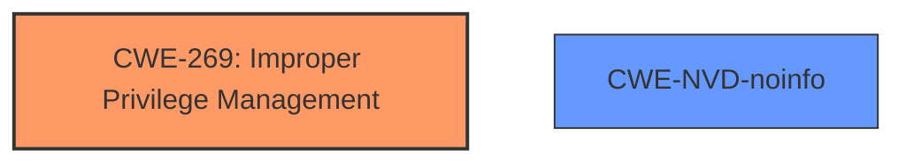

# Analysis for CVE-2020-1027

# Summary
| CWE ID | CWE Name | Confidence | CWE Abstraction Level | CWE Vulnerability Mapping Label | CWE-Vulnerability Mapping Notes |
|---|---|---|---|---|---|
| CWE-269 | Improper Privilege Management | 0.7 | Class | Primary | Allowed-with-Review |
| CWE-NVD-noinfo | NVD Automated Mapping Mitigation | 0.3 | N/A | Secondary | N/A |

## Evidence and Confidence

*   **Confidence Score:** 0.7
*   **Evidence Strength:** MEDIUM

## Relationship Analysis
The primary CWE identified is CWE-269 (Improper Privilege Management), which is a class-level CWE. While there are no direct child CWEs immediately apparent from the provided information, the vulnerability description points towards a general issue of privilege management within the Windows Kernel. This Class CWE provides a suitable starting point.

## Vulnerability Chain
The vulnerability chain for this description is relatively short:

1.  **Root Cause:** **Improper access control** within the Windows Kernel (CWE-269).
2.  **Impact:** Elevation of Privilege.

## Summary of Analysis
The initial assessment focused on the **improper access control** described in the vulnerability. The primary goal was to identify a CWE that best represents this **rootcause**, which leads to an elevation of privilege.

The provided description lacks sufficient detail to pinpoint a more specific (Base or Variant) CWE. The vulnerability description simply mentions that the Windows Kernel handles objects in memory in a way that leads to an elevation of privilege due to **improper access control**.

The weakness is based on the provided evidence, specifically, "An elevation of privilege vulnerability exists in the way that the Windows Kernel handles objects in memory, aka 'Windows Kernel Elevation of Privilege Vulnerability'... **rootcause:** **improper access control**... **impact:** elevation of privilege... **product:** Windows Kernel".

CWE-269 (Improper Privilege Management) is selected as the primary CWE because it directly addresses the **improper access control** that leads to the elevation of privilege. While a more specific CWE might exist, the current evidence does not support a more granular classification. CWE-NVD-noinfo is only listed because it was listed as the primary CWE for similar CVE Descriptions and is the most common.

Relevant CWE Information:

# Enhanced Context (25 CWEs)
The following CWEs were identified as potentially relevant to this vulnerability:

## CWE-131: Incorrect Calculation of Buffer Size
**Abstraction Level**: Base
**Similarity Score**: 0.78

**Description**:
The product does not correctly calculate the size to be used when allocating a buffer, which could lead to a buffer overflow.

**Mapping Guidance**:
- Usage: Allowed

## CWE-667: Improper Locking
**Abstraction Level**: Class
**Similarity Score**: 0.78

**Description**:
The product does not properly acquire or release a lock on a resource, leading to unexpected resource state changes and behaviors.

**Mapping Guidance**:
- Usage: Allowed-with-Review

## CWE-191: Integer Underflow (Wrap or Wraparound)
**Abstraction Level**: Base
**Similarity Score**: 0.78

**Description**:
The product subtracts one value from another, such that the result is less than the minimum allowable integer value, which produces a value that is not equal to the correct result.

**Mapping Guidance**:
- Usage: Allowed

## CWE-362: Concurrent Execution using Shared Resource with Improper Synchronization ('Race Condition')
**Abstraction Level**: Class
**Similarity Score**: 0.77

**Description**:
The product contains a concurrent code sequence that requires temporary, exclusive access to a shared resource, but a timing window exists in which the shared resource can be modified by another code sequence operating concurrently.

**Mapping Guidance**:
- Usage: Allowed-with-Review

## CWE-805: Buffer Access with Incorrect Length Value
**Abstraction Level**: Base
**Similarity Score**: 0.77

**Description**:
The product uses a sequential operation to read or write a buffer, but it uses an incorrect length value that causes it to access memory that is outside of the bounds of the buffer.

**Mapping Guidance**:
- Usage: Allowed

## CWE-404: Improper Resource Shutdown or Release
**Abstraction Level**: Class
**Similarity Score**: 0.77

**Description**:
The product does not release or incorrectly releases a resource before it is made available for re-use.

**Mapping Guidance**:
- Usage: Allowed-with-Review

## CWE-197: Numeric Truncation Error
**Abstraction Level**: Base
**Similarity Score**: 0.77

**Description**:
Truncation errors occur when a primitive is cast to a primitive of a smaller size and data is lost in the conversion.

**Mapping Guidance**:
- Usage: Allowed

## CWE-367: Time-of-check Time-of-use (TOCTOU) Race Condition
**Abstraction Level**: Base
**Similarity Score**: 0.77

**Description**:
The product checks the state of a resource before using that resource, but the resource's state can change between the check and the use in a way that invalidates the results of the check. This can cause the product to perform invalid actions when the resource is in an unexpected state.

**Mapping Guidance**:
- Usage: Allowed

## CWE-119: Improper Restriction of Operations within the Bounds of a Memory Buffer
**Abstraction Level**: Class
**Similarity Score**: 0.77

**Description**:
The product performs operations on a memory buffer, but it reads from or writes to a memory location outside the buffer's intended boundary. This may result in read or write operations on unexpected memory locations that could be linked to other variables, data structures, or internal program data.

**Mapping Guidance**:
- Usage: Discouraged

## CWE-125: Out-of-bounds Read
**Abstraction Level**: Base
**Similarity Score**: 0.77

**Description**:
The product reads data past the end, or before the beginning, of the intended buffer.

**Mapping Guidance**:
- Usage: Allowed

## CWE-367: Time-of-check Time-of-use (TOCTOU) Race Condition
**Abstraction Level**: Base
**Similarity Score**: 6050.40

**Description**:
The product checks the state of a resource before using that resource, but the resource's state can change between the check and the use in a way that invalidates the results of the check. This can cause the product to perform invalid actions when the resource is in an unexpected state.

**Mapping Guidance**:
- Usage: Allowed

## CWE-362: Concurrent Execution using Shared Resource with Improper Synchronization ('Race Condition')
**Abstraction Level**: Class
**Similarity Score**: 5874.97

**Description**:
The product contains a concurrent code sequence that requires temporary, exclusive access to a shared resource, but a timing window exists in which the shared resource can be modified by another code sequence operating concurrently.

**Mapping Guidance**:
- Usage: Allowed-with-Review

## CWE-59: Improper Link Resolution Before File Access ('Link Following')
**Abstraction Level**: Base
**Similarity Score**: 5728.24

**Description**:
The product attempts to access a file based on the filename, but it does not properly prevent that filename from identifying a link or shortcut that resolves to an unintended resource.

**Mapping Guidance**:
- Usage: Allowed

## CWE-119: Improper Restriction of Operations within the Bounds of a Memory Buffer
**Abstraction Level**: Class
**Similarity Score**: 5630.34

**Description**:
The product performs operations on a memory buffer, but it reads from or writes to a memory location outside the buffer's intended boundary. This may result in read or write operations on unexpected memory locations that could be linked to other variables, data structures, or internal program data.

**Mapping Guidance**:
- Usage: Discouraged

## CWE-197: Numeric Truncation Error
**Abstraction Level**: Base
**Similarity Score**: 5625.41

**Description**:
Truncation errors occur when a primitive is cast to a primitive of a smaller size and data is lost in the conversion.

**Mapping Guidance**:
- Usage: Allowed

## CWE-123: Write-what-where Condition
**Abstraction Level**: base
**Similarity Score**: 4.82

**Description**:
CWE-123: Write-what-where Condition

**Mapping Guidance**:
- Usage: Allowed

## CWE-195: Signed to Unsigned Conversion Error
**Abstraction Level**: variant
**Similarity Score**: 4.53

**Description**:
CWE-195: Signed to Unsigned Conversion Error

**Mapping Guidance**:
- Usage: Allowed

## CWE-190: Integer Overflow or Wraparound
**Abstraction Level**: base
**Similarity

# Enhanced Query for CVE-2020-1027

## Vulnerability Description
An elevation of privilege vulnerability exists in the way that the Windows Kernel handles objects in memory, aka 'Windows Kernel Elevation of Privilege Vulnerability'. This CVE ID is unique from CVE-2020-0913, CVE-2020-1000, CVE-2020-1003.

### Vulnerability Description Key Phrases
- **rootcause:** **improper access control**
- **impact:** elevation of privilege
- **product:** Windows Kernel

### CWE for similar CVE Descriptions
### Primary CWE Match
CWE-NVD-noinfo

#### Top CWEs
- CWE-NVD-noinfo (Count: 417)
- CWE-787 (Count: 18)
- CWE-190 (Count: 10)

## Retriever Results

### Top Combined Results

| Rank | CWE ID | Name | Abstraction | Usage  | Retrievers | Individual Scores |
|------|--------|------|-------------|-------|------------|-------------------|
| 1 | 123 | Write-what-where Condition | Base | Allowed | sparse | 0.317 |
| 2 | 787 | Out-of-bounds Write | Base | Allowed | sparse | 0.292 |
| 3 | 59 | Improper Link Resolution Before File Access ('Link Following') | Base | Allowed | sparse | 0.287 |
| 4 | 362 | Concurrent Execution using Shared Resource with Improper Synchronization ('Race Condition') | Class | Allowed-with-Review | sparse | 0.278 |
| 5 | 367 | Time-of-check Time-of-use (TOCTOU) Race Condition | Base | Allowed | sparse | 0.275 |
| 6 | 782 | Exposed IOCTL with Insufficient Access Control | Variant | Allowed | dense | 0.608 |
| 7 | 363 | Race Condition Enabling Link Following | Base | Allowed | graph | 0.003 |
| 8 | 732 | Incorrect Permission Assignment for Critical Resource | Class | Allowed-with-Review | sparse | 0.264 |
| 9 | 197 | Numeric Truncation Error | Base | Allowed | sparse | 0.262 |
| 10 | 119 | Improper Restriction of Operations within the Bounds of a Memory Buffer | Class | Discouraged | sparse | 0.262 |

# Complete CWE Specifications

## CWE-123: Write-what-where Condition
**Abstraction:** Base
**Status:** Draft

### Description
Any condition where the attacker has the ability to write an arbitrary value to an arbitrary location, often as the result of a buffer overflow.

### Extended Description
Not provided

### Alternative Terms
None

### Relationships
ChildOf -> CWE-787
ChildOf -> CWE-119
ChildOf -> CWE-119

### Mapping Guidance
**Usage:** Allowed
**Rationale:** This CWE entry is at the Base level of abstraction, which is a preferred level of abstraction for mapping to the root causes of vulnerabilities.
**Comments:** Carefully read both the name and description to ensure that this mapping is an appropriate fit. Do not try to 'force' a mapping to a lower-level Base/Variant simply to comply with this preferred level of abstraction.
**Reasons:**
- Acceptable-Use

### Observed Examples
- **CVE-2022-21668:** Chain: Python library does not limit the resources used to process images that specify a very large number of bands (CWE-1284), leading to excessive memory consumption (CWE-789) or an integer overflow (CWE-190).
- **CVE-2022-0545:** Chain: 3D renderer has an integer overflow (CWE-190) leading to write-what-where condition (CWE-123) using a crafted image.

## CWE-787: Out-of-bounds Write
**Abstraction:** Base
**Status:** Draft

### Description
The product writes data past the end, or before the beginning, of the intended buffer.

### Extended Description
Not provided

### Alternative Terms
Memory Corruption: Often used to describe the consequences of writing to memory outside the bounds of a buffer, or to memory that is otherwise invalid.

### Relationships
ChildOf -> CWE-119
ChildOf -> CWE-119
ChildOf -> CWE-119
ChildOf -> CWE-119

### Mapping Guidance
**Usage:** Allowed
**Rationale:** This CWE entry is at the Base level of abstraction, which is a preferred level of abstraction for mapping to the root causes of vulnerabilities.
**Comments:** Carefully read both the name and description to ensure that this mapping is an appropriate fit. Do not try to 'force' a mapping to a lower-level Base/Variant simply to comply with this preferred level of abstraction.
**Reasons:**
- Acceptable-Use

### Observed Examples
- **CVE-2023-1017:** The reference implementation code for a Trusted Platform Module does not implement length checks on data, allowing for an attacker to write 2 bytes past the end of a buffer.
- **CVE-2021-21220:** Chain: insufficient input validation (CWE-20) in browser allows heap corruption (CWE-787), as exploited in the wild per CISA KEV.
- **CVE-2021-28664:** GPU kernel driver allows memory corruption because a user can obtain read/write access to read-only pages, as exploited in the wild per CISA KEV.

## CWE-59: Improper Link Resolution Before File Access ('Link Following')
**Abstraction:** Base
**Status:** Draft

### Description
The product attempts to access a file based on the filename, but it does not properly prevent that filename from identifying a link or shortcut that resolves to an unintended resource.

### Extended Description
Not provided

### Alternative Terms
insecure temporary file: Some people use the phrase "insecure temporary file" when referring to a link following weakness, but other weaknesses can produce insecure temporary files without any symlink involvement at all.
Zip Slip: "Zip slip" is an attack that uses file archives (e.g., ZIP, tar, rar, etc.) that contain filenames with path traversal sequences that cause the files to be written outside of the directory under which the archive is expected to be extracted [REF-1282]. It is most commonly used for relative path traversal (CWE-23) and link following (CWE-59).

### Relationships
ChildOf -> CWE-706
ChildOf -> CWE-706

### Mapping Guidance
**Usage:** Allowed
**Rationale:** This CWE entry is at the Base level of abstraction, which is a preferred level of abstraction for mapping to the root causes of vulnerabilities.
**Comments:** Carefully read both the name and description to ensure that this mapping is an appropriate fit. Do not try to 'force' a mapping to a lower-level Base/Variant simply to comply with this preferred level of abstraction.
**Reasons:**
- Acceptable-Use

### Additional Notes
**[Theoretical]** 

Link following vulnerabilities are Multi-factor Vulnerabilities (MFV). They are the combination of multiple elements: file or directory permissions, filename predictability, race conditions, and in some cases, a design limitation in which there is no mechanism for performing atomic file creation operations.

Some potential factors are race conditions, permissions, and predictability.

### Observed Examples
- **CVE-1999-1386:** Some versions of Perl follow symbolic links when running with the -e option, which allows local users to overwrite arbitrary files via a symlink attack.
- **CVE-2000-1178:** Text editor follows symbolic links when creating a rescue copy during an abnormal exit, which allows local users to overwrite the files of other users.
- **CVE-2004-0217:** Antivirus update allows local users to create or append to arbitrary files via a symlink attack on a logfile.

## CWE-362: Concurrent Execution using Shared Resource with Improper Synchronization ('Race Condition')
**Abstraction:** Class
**Status:** Draft

### Description
The product contains a concurrent code sequence that requires temporary, exclusive access to a shared resource, but a timing window exists in which the shared resource can be modified by another code sequence operating concurrently.

### Extended Description

A race condition occurs within concurrent environments, and it is effectively a property of a code sequence. Depending on the context, a code sequence may be in the form of a function call, a small number of instructions, a series of program invocations, etc.

A race condition violates these properties, which are closely related:

  - Exclusivity - the code sequence is given exclusive access to the shared resource, i.e., no other code sequence can modify properties of the shared resource before the original sequence has completed execution.

  - Atomicity - the code sequence is behaviorally atomic, i.e., no other thread or process can concurrently execute the same sequence of instructions (or a subset) against the same resource.

A race condition exists when an "interfering code sequence" can still access the shared resource, violating exclusivity.

The interfering code sequence could be "trusted" or "untrusted." A trusted interfering code sequence occurs within the product; it cannot be modified by the attacker, and it can only be invoked indirectly. An untrusted interfering code sequence can be authored directly by the attacker, and typically it is external to the vulnerable product.

### Alternative Terms
Race Condition

### Relationships
ChildOf -> CWE-691
CanPrecede -> CWE-416
CanPrecede -> CWE-476

### Mapping Guidance
**Usage:** Allowed-with-Review
**Rationale:** This CWE entry is a Class and might have Base-level children that would be more appropriate
**Comments:** Examine children of this entry to see if there is a better fit
**Reasons:**
- Abstraction

### Additional Notes
**[Maintenance]** The relationship between race conditions and synchronization problems (CWE-662) needs to be further developed. They are not necessarily two perspectives of the same core concept, since synchronization is only one technique for avoiding race conditions, and synchronization can be used for other purposes besides race condition prevention.

**[Research Gap]** Race conditions in web applications are under-studied and probably under-reported. However, in 2008 there has been growing interest in this area.

**[Research Gap]** Much of the focus of race condition research has been in Time-of-check Time-of-use (TOCTOU) variants (CWE-367), but many race conditions are related to synchronization problems that do not necessarily require a time-of-check.

**[Research Gap]** From a classification/taxonomy perspective, the relationships between concurrency and program state need closer investigation and may be useful in organizing related issues.

### Observed Examples
- **CVE-2022-29527:** Go application for cloud management creates a world-writable sudoers file that allows local attackers to inject sudo rules and escalate privileges to root by winning a race condition.
- **CVE-2021-1782:** Chain: improper locking (CWE-667) leads to race condition (CWE-362), as exploited in the wild per CISA KEV.
- **CVE-2021-0920:** Chain: mobile platform race condition (CWE-362) leading to use-after-free (CWE-416), as exploited in the wild per CISA KEV.

## CWE-367: Time-of-check Time-of-use (TOCTOU) Race Condition
**Abstraction:** Base
**Status:** Incomplete

### Description
The product checks the state of a resource before using that resource, but the resource's state can change between the check and the use in a way that invalidates the results of the check. This can cause the product to perform invalid actions when the resource is in an unexpected state.

### Extended Description
This weakness can be security-relevant when an attacker can influence the state of the resource between check and use. This can happen with shared resources such as files, memory, or even variables in multithreaded programs.

### Alternative Terms
TOCTTOU: The TOCTTOU acronym expands to "Time Of Check To Time Of Use".
TOCCTOU: The TOCCTOU acronym is most likely a typo of TOCTTOU, but it has been used in some influential documents, so the typo is repeated fairly frequently.

### Relationships
ChildOf -> CWE-362
ChildOf -> CWE-362

### Mapping Guidance
**Usage:** Allowed
**Rationale:** This CWE entry is at the Base level of abstraction, which is a preferred level of abstraction for mapping to the root causes of vulnerabilities.
**Comments:** Carefully read both the name and description to ensure that this mapping is an appropriate fit. Do not try to 'force' a mapping to a lower-level Base/Variant simply to comply with this preferred level of abstraction.
**Reasons:**
- Acceptable-Use

### Additional Notes
**[Relationship]** TOCTOU issues do not always involve symlinks, and not every symlink issue is a TOCTOU problem.

**[Research Gap]** Non-symlink TOCTOU issues are not reported frequently, but they are likely to occur in code that attempts to be secure.

### Observed Examples
- **CVE-2015-1743:** TOCTOU in sandbox process allows installation of untrusted browser add-ons by replacing a file after it has been verified, but before it is executed
- **CVE-2003-0813:** A multi-threaded race condition allows remote attackers to cause a denial of service (crash or reboot) by causing two threads to process the same RPC request, which causes one thread to use memory after it has been freed.
- **CVE-2004-0594:** PHP flaw allows remote attackers to execute arbitrary code by aborting execution before the initialization of key data structures is complete.

## CWE-782: Exposed IOCTL with Insufficient Access Control
**Abstraction:** Variant
**Status:** Draft

### Description
The product implements an IOCTL with functionality that should be restricted, but it does not properly enforce access control for the IOCTL.

### Extended Description

When an IOCTL contains privileged functionality and is exposed unnecessarily, attackers may be able to access this functionality by invoking the IOCTL. Even if the functionality is benign, if the programmer has assumed that the IOCTL would only be accessed by a trusted process, there may be little or no validation of the incoming data, exposing weaknesses that would never be reachable if the attacker cannot call the IOCTL directly.

The implementations of IOCTLs will differ between operating system types and versions, so the methods of attack and prevention may vary widely.

### Alternative Terms
None

### Relationships
ChildOf -> CWE-749
CanPrecede -> CWE-781

### Mapping Guidance
**Usage:** Allowed
**Rationale:** This CWE entry is at the Variant level of abstraction, which is a preferred level of abstraction for mapping to the root causes of vulnerabilities.
**Comments:** Carefully read both the name and description to ensure that this mapping is an appropriate fit. Do not try to 'force' a mapping to a lower-level Base/Variant simply to comply with this preferred level of abstraction.
**Reasons:**
- Acceptable-Use

### Additional Notes
**[Relationship]** This can be primary to many other weaknesses when the programmer assumes that the IOCTL can only be accessed by trusted parties. For example, a program or driver might not validate incoming addresses in METHOD_NEITHER IOCTLs in Windows environments (CWE-781), which could allow buffer overflow and similar attacks to take place, even when the attacker never should have been able to access the IOCTL at all.

**[Applicable Platform]** 

Because IOCTL functionality is typically performing low-level actions and closely interacts with the operating system, this weakness may only appear in code that is written in low-level languages.

### Observed Examples
- **CVE-2009-2208:** Operating system does not enforce permissions on an IOCTL that can be used to modify network settings.
- **CVE-2008-3831:** Device driver does not restrict ioctl calls to its direct rendering manager.
- **CVE-2008-3525:** ioctl does not check for a required capability before processing certain requests.

## CWE-363: Race Condition Enabling Link Following
**Abstraction:** Base
**Status:** Draft

### Description
The product checks the status of a file or directory before accessing it, which produces a race condition in which the file can be replaced with a link before the access is performed, causing the product to access the wrong file.

### Extended Description
While developers might expect that there is a very narrow time window between the time of check and time of use, there is still a race condition. An attacker could cause the product to slow down (e.g. with memory consumption), causing the time window to become larger. Alternately, in some situations, the attacker could win the race by performing a large number of attacks.

### Alternative Terms
None

### Relationships
ChildOf -> CWE-367
CanPrecede -> CWE-59

### Mapping Guidance
**Usage:** Allowed
**Rationale:** This CWE entry is at the Base level of abstraction, which is a preferred level of abstraction for mapping to the root causes of vulnerabilities.
**Comments:** Carefully read both the name and description to ensure that this mapping is an appropriate fit. Do not try to 'force' a mapping to a lower-level Base/Variant simply to comply with this preferred level of abstraction.
**Reasons:**
- Acceptable-Use

### Additional Notes
**[Relationship]** This is already covered by the "Link Following" weakness (CWE-59). It is included here because so many people associate race conditions with link problems; however, not all link following issues involve race conditions.

## CWE-732: Incorrect Permission Assignment for Critical Resource
**Abstraction:** Class
**Status:** Draft

### Description
The product specifies permissions for a security-critical resource in a way that allows that resource to be read or modified by unintended actors.

### Extended Description
When a resource is given a permission setting that provides access to a wider range of actors than required, it could lead to the exposure of sensitive information, or the modification of that resource by unintended parties. This is especially dangerous when the resource is related to program configuration, execution, or sensitive user data. For example, consider a misconfigured storage account for the cloud that can be read or written by a public or anonymous user.

### Alternative Terms
None

### Relationships
ChildOf -> CWE-285
ChildOf -> CWE-668

### Mapping Guidance
**Usage:** Allowed-with-Review
**Rationale:** While the name itself indicates an assignment of permissions for resources, this is often misused for vulnerabilities in which "permissions" are not checked, which is an "authorization" weakness (CWE-285 or descendants) within CWE's model [REF-1287].
**Comments:** Closely analyze the specific mistake that is allowing the resource to be exposed, and perform a CWE mapping for that mistake.
**Reasons:**
- Frequent Misuse

### Additional Notes
**[Maintenance]** The relationships between privileges, permissions, and actors (e.g. users and groups) need further refinement within the Research view. One complication is that these concepts apply to two different pillars, related to control of resources (CWE-664) and protection mechanism failures (CWE-693).

### Observed Examples
- **CVE-2022-29527:** Go application for cloud management creates a world-writable sudoers file that allows local attackers to inject sudo rules and escalate privileges to root by winning a race condition.
- **CVE-2009-3482:** Anti-virus product sets insecure "Everyone: Full Control" permissions for files under the "Program Files" folder, allowing attackers to replace executables with Trojan horses.
- **CVE-2009-3897:** Product creates directories with 0777 permissions at installation, allowing users to gain privileges and access a socket used for authentication.

## CWE-197: Numeric Truncation Error
**Abstraction:** Base
**Status:** Incomplete

### Description
Truncation errors occur when a primitive is cast to a primitive of a smaller size and data is lost in the conversion.

### Extended Description
When a primitive is cast to a smaller primitive, the high order bits of the large value are lost in the conversion, potentially resulting in an unexpected value that is not equal to the original value. This value may be required as an index into a buffer, a loop iterator, or simply necessary state data. In any case, the value cannot be trusted and the system will be in an undefined state. While this method may be employed viably to isolate the low bits of a value, this usage is rare, and truncation usually implies that an implementation error has occurred.

### Alternative Terms
None

### Relationships
ChildOf -> CWE-681
ChildOf -> CWE-681
ChildOf -> CWE-681
CanAlsoBe -> CWE-195
CanAlsoBe -> CWE-196
CanAlsoBe -> CWE-192
CanAlsoBe -> CWE-194

### Mapping Guidance
**Usage:** Allowed
**Rationale:** This CWE entry is at the Base level of abstraction, which is a preferred level of abstraction for mapping to the root causes of vulnerabilities.
**Comments:** Carefully read both the name and description to ensure that this mapping is an appropriate fit. Do not try to 'force' a mapping to a lower-level Base/Variant simply to comply with this preferred level of abstraction.
**Reasons:**
- Acceptable-Use

### Additional Notes
**[Research Gap]** This weakness has traditionally been under-studied and under-reported, although vulnerabilities in popular software have been published in 2008 and 2009.

### Observed Examples
- **CVE-2020-17087:** Chain: integer truncation (CWE-197) causes small buffer allocation (CWE-131) leading to out-of-bounds write (CWE-787) in kernel pool, as exploited in the wild per CISA KEV.
- **CVE-2009-0231:** Integer truncation of length value leads to heap-based buffer overflow.
- **CVE-2008-3282:** Size of a particular type changes for 64-bit platforms, leading to an integer truncation in document processor causes incorrect index to be generated.

## CWE-119: Improper Restriction of Operations within the Bounds of a Memory Buffer
**Abstraction:** Class
**Status:** Stable

### Description
The product performs operations on a memory buffer, but it reads from or writes to a memory location outside the buffer's intended boundary. This may result in read or write operations on unexpected memory locations that could be linked to other variables, data structures, or internal program data.

### Extended Description
Not provided

### Alternative Terms
Buffer Overflow: This term has many different meanings to different audiences. From a CWE mapping perspective, this term should be avoided where possible. Some researchers, developers, and tools intend for it to mean "write past the end of a buffer," whereas others use the same term to mean "any read or write outside the boundaries of a buffer, whether before the beginning of the buffer or after the end of the buffer." Others could mean "any action after the end of a buffer, whether it is a read or write." Since the term is commonly used for exploitation and for vulnerabilities, it further confuses things.
buffer overrun: Some prominent vendors and researchers use the term "buffer overrun," but most people use "buffer overflow." See the alternate term for "buffer overflow" for context.
memory safety: Generally used for techniques that avoid weaknesses related to memory access, such as those identified by CWE-119 and its descendants. However, the term is not formal, and there is likely disagreement between practitioners as to which weaknesses are implicitly covered by the "memory safety" term.

### Relationships
ChildOf -> CWE-118
ChildOf -> CWE-20

### Mapping Guidance
**Usage:** Discouraged
**Rationale:** CWE-119 is commonly misused in low-information vulnerability reports when lower-level CWEs could be used instead, or when more details about the vulnerability are available.
**Comments:** Look at CWE-119's children and consider mapping to CWEs such as CWE-787: Out-of-bounds Write, CWE-125: Out-of-bounds Read, or others.
**Reasons:**
- Frequent Misuse

### Additional Notes
**[Applicable Platform]** 

It is possible in any programming languages without memory management support to attempt an operation outside of the bounds of a memory buffer, but the consequences will vary widely depending on the language, platform, and chip architecture.

### Observed Examples
- **CVE-2021-22991:** Incorrect URI normalization in application traffic product leads to buffer overflow, as exploited in the wild per CISA KEV.
- **CVE-2020-29557:** Buffer overflow in Wi-Fi router web interface, as exploited in the wild per CISA KEV.
- **CVE-2009-2550:** Classic stack-based buffer overflow in media player using a long entry in a playlist

